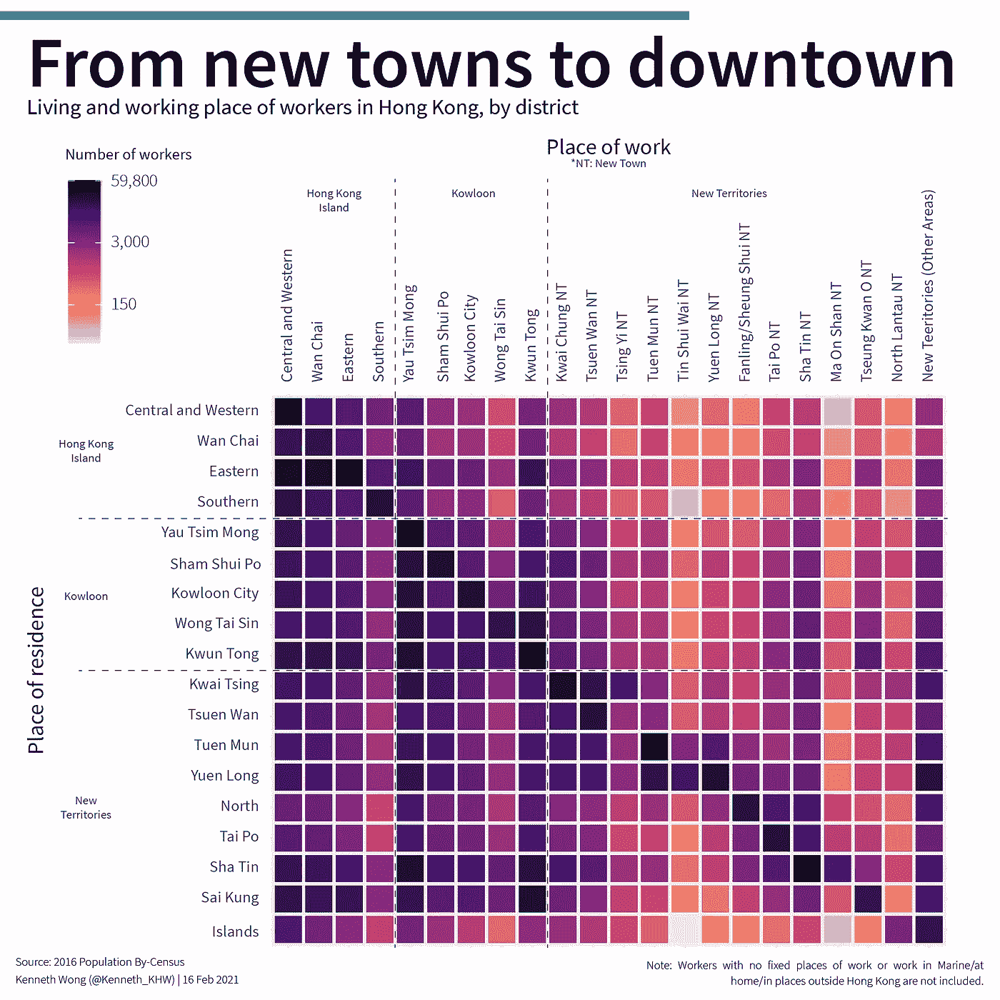
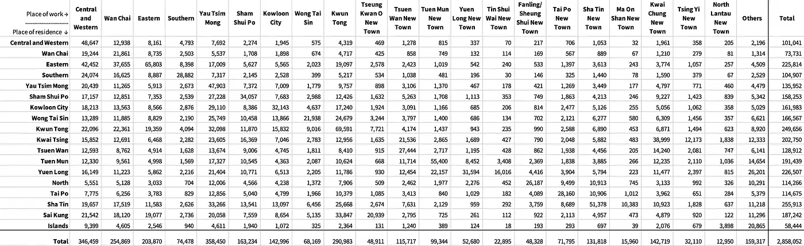
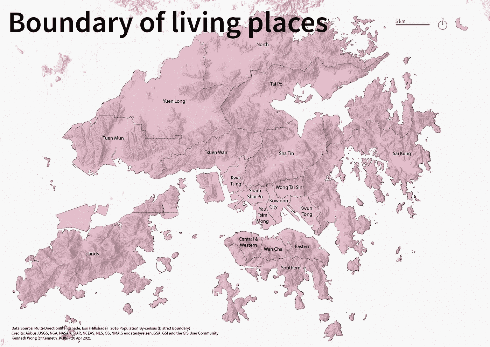
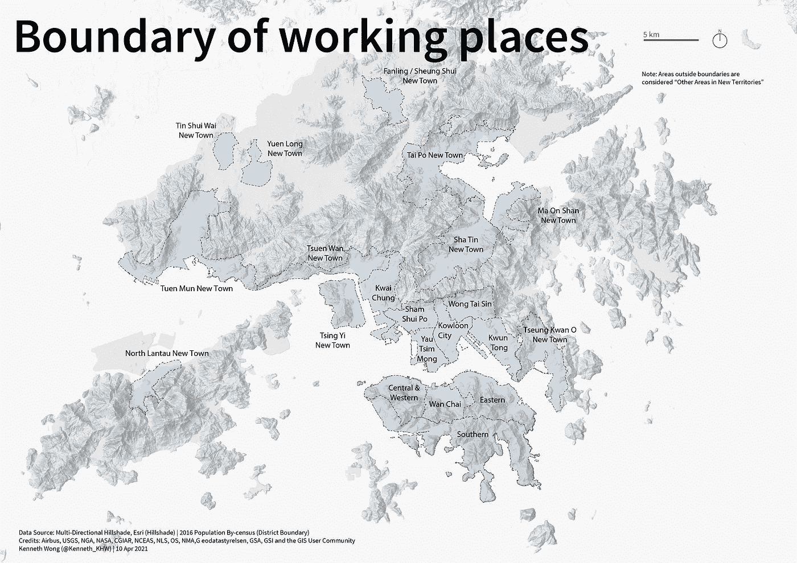
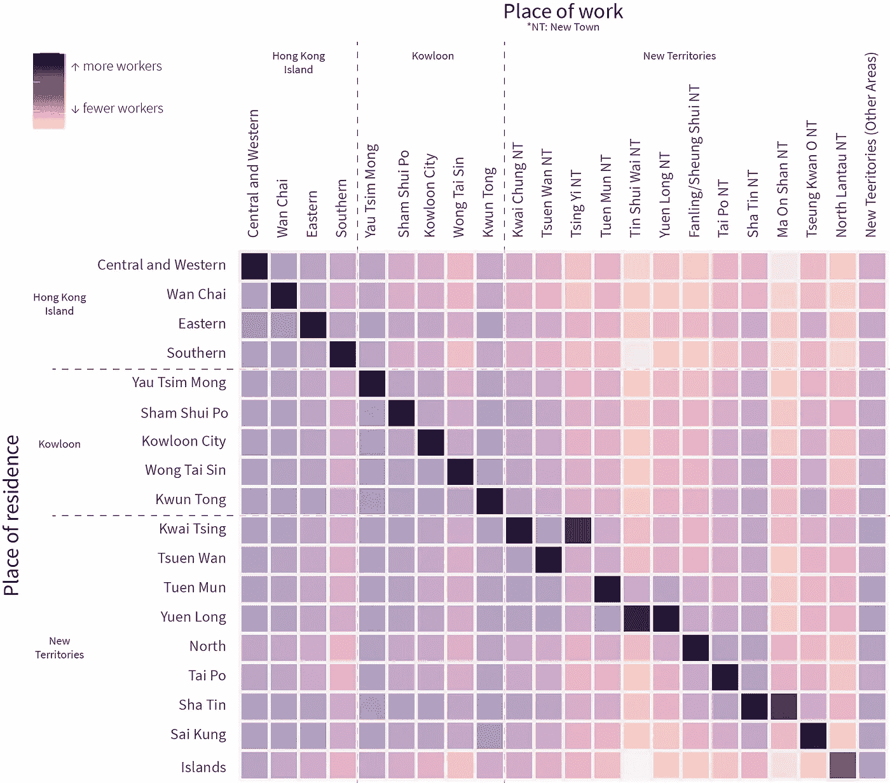
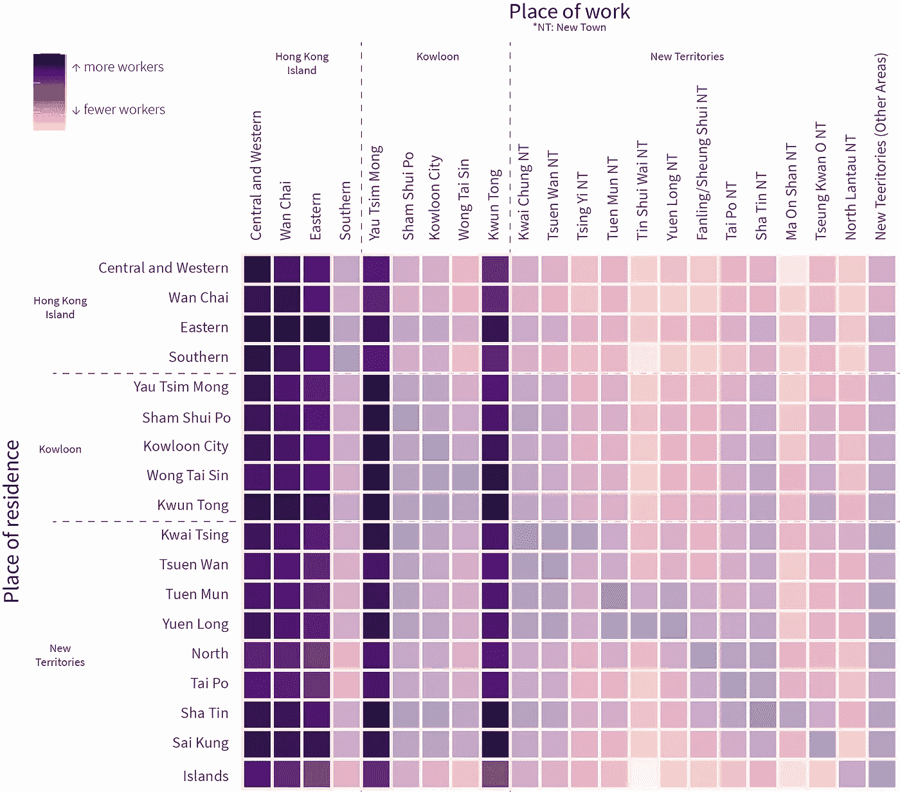
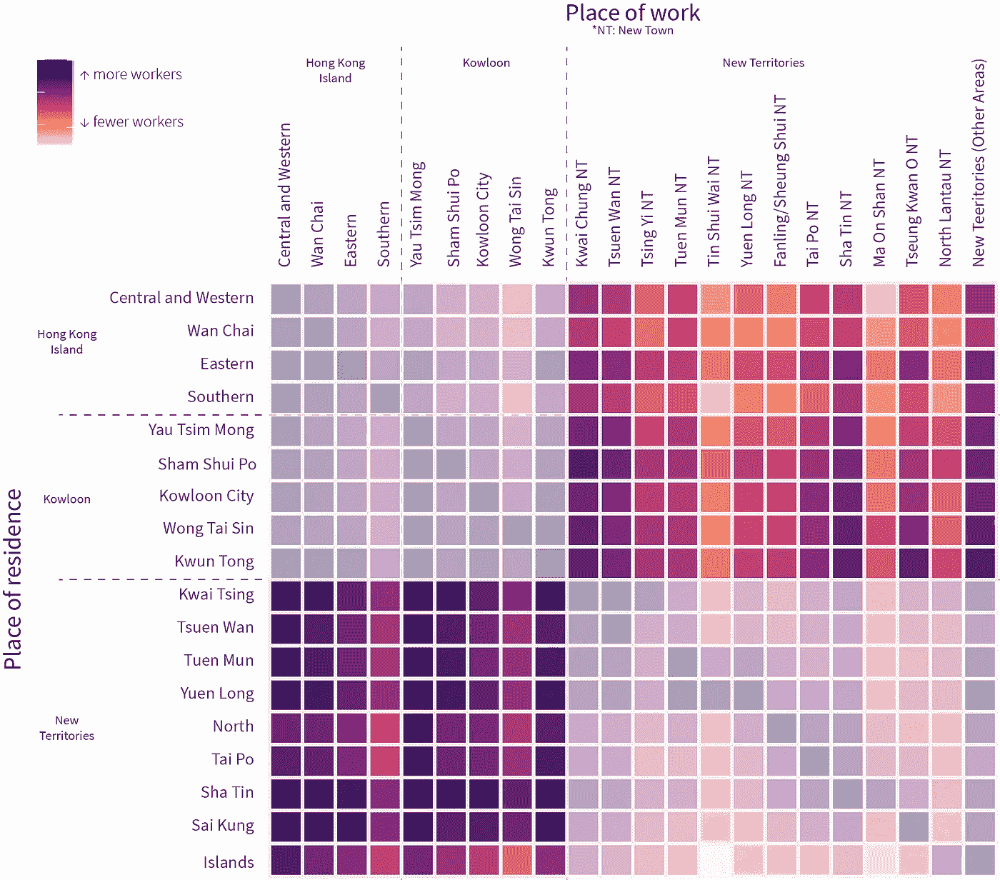
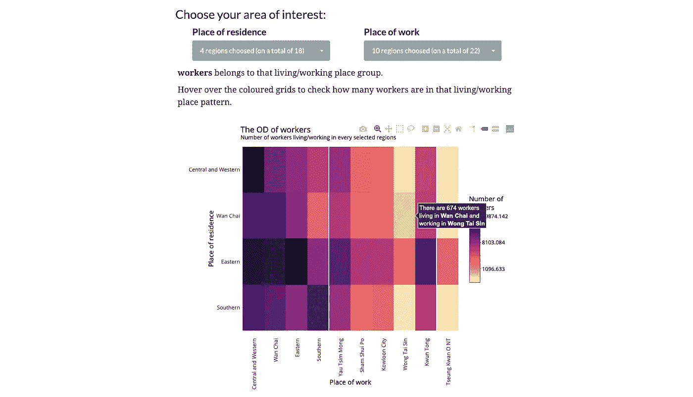
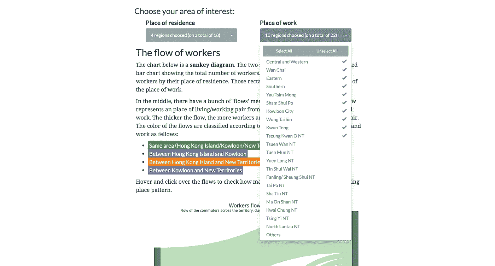

# 香港 280 万工人的通勤模式，可视化

> 原文：<https://towardsdatascience.com/commute-pattern-of-2-8-million-workers-in-hong-kong-visualised-8e430ef723d7?source=collection_archive---------33----------------------->

## 就地点而言，起点-终点矩阵告诉我们就业供应的什么趋势？

(图片由作者提供)

# TL；速度三角形定位法(dead reckoning)

香港有固定工作地点的工人超过 280 万人。想象一下，从他们的家到工作地点的整体旅行模式是什么样的？工作地点和工人的居住地点揭示了香港新市镇的**职住失衡**问题。

# 从家到工作场所

这里有一个 [O-D 矩阵](https://transportgeography.org/contents/methods/spatial-interactions-gravity-model/od-matrix-construction/)，显示了 2016 年按居住和工作地点分组的工人数量。每个单元格代表在那个*行*中生活的工人**和在那个*列*中工作**的工人数量。比方说，左上角的数字**48647**表示有 48647 名工人在中西区居住和工作。旁边的 **12，938** 表示有 12，938 名工人居住在中西区，而在湾仔工作。另一方面，下面的 **19，244** 表示有 19，244 名工人在湾仔居住，而在中西区工作。****

O-D 矩阵(作者图片)

人口普查中用于划分工人居住和工作地点的界限也如下所示。

(图片由作者提供)

(图片由作者提供)

但这张表不能不带来一些快速的见解。人们不得不手动查找并逐一比较这些数字。我们如何做得更好？

# 从表格到热图

下图称为**热图**。纵轴列出了工人居住的地区，横轴列出了按地区分类的工作地点。图中每个方格表示在该*行*中生活的工人**和在该*列*中工作**的工人数量。正方形的*颜色*越深，**越多的工人**属于那个生活/工作地点组。****

(图片由作者提供)

换句话说，这个图表和上面的 O-D 矩阵表没什么不同，除了 1。单元格现在用渐变的颜色方案和 2。数字被去掉了。

但是为什么要涂上颜色呢？因为我们对颜色比一些数字更敏感。更重要的是，*趋势*用渐变配色方案更容易看出来。可以有多种方式来解释这个图表。我总结了三个主要趋势，并列在下面。

# 趋势一:大部分工人在他们居住的同一地区工作

(图片由作者提供)

你可以看到的一个主要趋势是热图的对角线颜色最深。这意味着大部分工人在同一个地区生活和工作。住在中西区的人都在附近工作。屯门居民大多在屯门新市镇工作。这是意料之中的事——如果可能的话，工人们会在住处附近找工作，以尽量减少通勤时间。

西贡区和离岛是两个例外。在西贡，大部分居民都在观塘工作。由于将军澳区属于西贡区，我们可以预计大部分“在西贡居住，在观塘工作”的工人会居住在将军澳新市镇(而非西贡市及其他乡郊地区)。在离岛方面，由于机场被列为新界的其他地区，所有在东涌的航空公司的地面客舱均属于该网格。机场是近 80，000 人的工作场所(当然是在 COVID 之前)。

# 趋势二:工作仍然在核心城区

(图片由作者提供)

工作地点属于香港岛和九龙(图表的左边)，一般来说比属于新界的要暗得多。颜色越深意味着工人越多，我们知道大部分工作仍然位于香港岛和九龙。

# 趋势三:新界→市区流量远大于市区→新界流量

(图片由作者提供)

这在某种程度上是趋势二的“延伸”趋势。随着更多的工作位于城市核心区，工人更容易在那里找到工作。因此，相当大比例的新市镇人口在核心市区工作，使得热图的左下角(居住在新界并在香港岛或九龙工作的人口)相当暗。

另一方面，居住在核心城区的人不太可能在新城镇工作。很难想象那 30 个离群索居的人在天水围新市镇工作，却住在南区。

这就是“**职住失衡**”/**职住错配**现象，这个问题从上世纪 80 年代就存在了。新城镇最初的发展方式是让居住在新城镇的居民也在那里工作。从屯门新市镇的总纲发展蓝图来看，屯门河的东面是住宅区，西面则是工业楼宇。这个轻工业被认为是居民就业的主要来源。

然而，经济结构的变化使得就业机会集中在维多利亚港两岸。数以百万计的新城居民需要早起，从他们的家到中央商务区需要一个小时的路程。

# 有兴趣了解更多吗？

我创建了一个网页(用 [shiny](https://shiny.rstudio.com/) 开发),允许用户使用本文中使用的 O-D 矩阵数据创建特定于他们感兴趣的领域的自定义图表。该网页如下所示。

https://kenneth-12.shinyapps.io/place-of-work-od/

如果可能的话，我还打算写一篇关于网页的补充说明。

*【3 月 31 日更新:补充说明有* [***此处***](https://medium.com/@khwongk12/interactive-visualisation-of-commute-pattern-in-hong-kong-3a54b021076d)*】*

(图片由作者提供)

(图片由作者提供)

【 **1** 注意，不包括无固定工作场所或在家工作的劳动者。