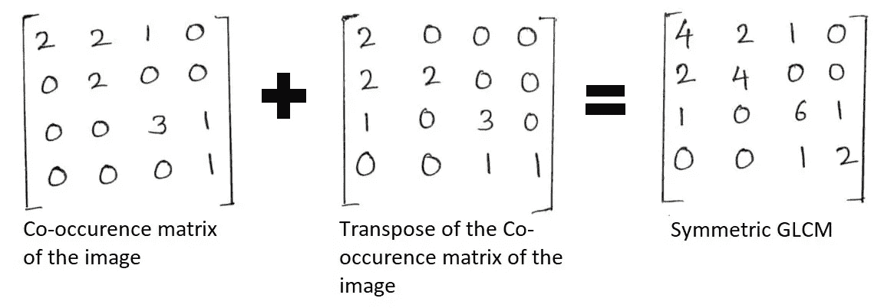
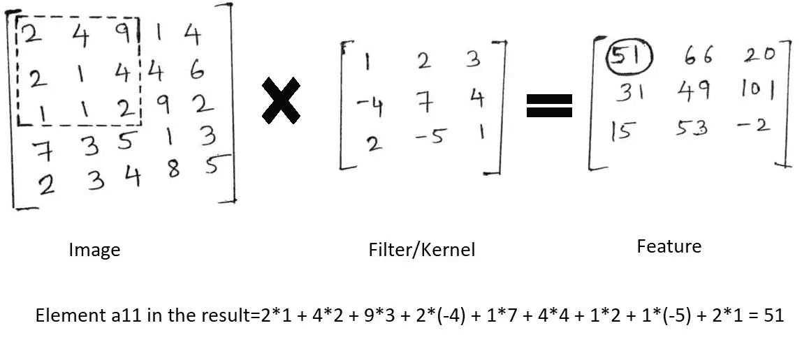

# Bins 方法和卷积神经网络在疟疾检测中的对比分析

> 原文：<https://towardsdatascience.com/comparative-analysis-of-bins-method-and-convolutional-neural-network-for-malaria-detection-535e2be51125?source=collection_archive---------22----------------------->

## 基于 CNN 和图像处理的疟原虫分步检测

> 这是我的第一个媒体博客。希望你能像我写这篇文章一样开心


照片由[егоркамелев](https://unsplash.com/@ekamelev?utm_source=medium&utm_medium=referral)在 [Unsplash](https://unsplash.com?utm_source=medium&utm_medium=referral) 上拍摄

# 目录:

1.  介绍
2.  动机
3.  确定的挑战
4.  问题定义
5.  先决条件
6.  演示
7.  关于数据集的信息
8.  系统的工作流程
9.  带有实现细节的算法视图
10.  图像使用者界面
11.  绩效评估参数
12.  结果
13.  结论
14.  未来范围
15.  参考

# 1.介绍

alaria 仍然是全球卫生系统的一个重大负担，由于缺乏设备和医疗专业知识，它是许多发展中国家的主要死亡原因。因此，专业技术被证明是解决这一问题的关键。机器学习(ML)是人工智能的一个子集，它处理并帮助在大型数据集中找到模式。医疗保健领域的机器学习最近成为头条新闻。机器学习、预测分析和健康信息学的结合为改善医疗保健流程提供了机会，这有助于改善患者的结果。机器学习方法在基于图像的分析和诊断中是成功的。机器学习可以通过算法过程提高治疗方案和医疗保健结果的准确性。

# 2.动机

我们首先要明白这个问题在现实世界中有多重要。疟疾在世界上的一些地方是一种真正的地方病，这意味着这种疾病在该地区是常见的。全球每年约有 32 亿人面临疟疾风险。世界卫生组织(世卫组织)发布了关于疟疾的重要事实，你可以在这里查看<https://www.who.int/features/factfiles/malaria/en/>*。延误治疗可能会导致几个并发症，甚至在某些情况下死亡。因此，疟疾的早期测试和检测对于拯救生命是必要的。这给了我们快速有效地诊断疟疾的动力。*

# *3.确定的挑战*

*   *对于疟疾诊断，RDT 和显微镜诊断是两种广泛使用的方法。*
*   *RDT 是一种有效的工具，可在 15 分钟内提供结果。它不需要任何训练有素的专业人员在场。然而，根据世卫组织的说法，RDT 有一些缺点，如与光学显微镜相比成本更高，并且容易受到热和湿度的损害。*
*   *显微镜诊断系统没有这些缺点，但它需要受过训练的显微镜专家在场。*

# ***4。问题定义***

*该系统的目标是通过使用 ML 和图像处理自动化疟疾检测过程来解决现有系统中的挑战和问题。*

*这里我们将应用两个众所周知的技术:
1 .Bins 算法
2。卷积神经网络*

*这些技术的结果将为我们提供一个具体的证据，证明机器学习和人工智能在疟疾检测方面的潜力。*

# *5.先决条件*

*这篇文章假设读者熟悉 Python 库、数据结构、Tkinter、图像处理、线性代数、概率、统计、随机森林算法、SVM、卷积神经网络等。*

# *6.这是一个应用程序的短片*

*来源:[https://www.youtube.com/watch?v=pE8fv9BBQ2Q](https://www.youtube.com/watch?v=pE8fv9BBQ2Q)*

*请参考我的 GitHub 库[这里](https://github.com/shruti-sureshan/Machine-Learning-Projects/tree/master/Malaria%20Parasite%20Classification%20using%20Image%20processing%20and%20Machine%20Learning)的代码。*

# *7.关于数据集的信息*

*在我们深入构建应用程序之前，让我们简单地看一下数据集。有许多数据集可用于疟疾检测。但为了这个项目的目的，我使用了由“美国国立卫生研究院”提供的数据集，其中包括 27558 个 RGB 细胞图像。png 格式，你可以从[这里](https://lhncbc.nlm.nih.gov/LHC-downloads/downloads.html#malaria-datasets)下载。*

**

*图 1:来自数据集的样本图像*

*数据集包含两个文件夹:分别带有训练和测试图像的训练文件夹和测试文件夹。此外，还有 2 个文件夹——带有疟疾感染细胞图像的寄生文件夹和带有正常细胞图像的未感染文件夹。*

**

*图 2:疟疾数据集*

*这些图像分为以下两部分:*

*   *寄生- 13779 图像*
*   *未感染- 13779 个图像*

*因为我们有一个平均分布的图像，所以我们不必处理不平衡数据的问题，它有更少的机会偏向某个特定的类。*

# *8.系统的工作流程*

**

*图 3:系统的工作流程*

*   *输入的 RGB 单元图像首先被处理以从图像中去除噪声*
*   *然后对预处理后的图像进行分割，提取感兴趣区域，得到分割后的图像*
*   *特征提取阶段的输入是分割图像，输出是特征向量*
*   *下一阶段是分类阶段，其中输入将是特征向量，输出是寄生和非寄生的分类标签。*

# *9.带有实现细节的算法视图*

## *方法 1:使用箱柜方法*

*在这种方法中，我们将使用图像处理技术和最大似然分类算法。步骤如下:*

## *步骤 1:图像预处理*

*   *在原始图像上训练模型可能会导致较差的分类性能。*
*   *预处理的主要目的是清洁图像*
*   *它确保图像中的信息易于访问。*

```
*kernel = np.ones((9,9),np.uint8)
clean = cv2.morphologyEx(image, cv2.MORPH_OPEN, kernel)*
```

**

*图 4:预处理的图像*

## *步骤 2:图像分割*

*执行分割过程以从图像中获得感兴趣区域(ROI)。以下技术用于分段:*

1.  ***Otsu 分割***

*它用于执行自动图像阈值处理。它返回一个单一的强度阈值，将像素分为两类-背景和前景。自动全局阈值算法通常具有以下步骤:*

*步骤 1:处理输入图像*

*步骤 2:获取图像直方图(像素分布)*

*步骤 3:计算阈值*

*步骤 4:将图像中饱和度大于的区域替换为白色，反之则替换为黑色。*

**

*图 5:大津的门槛*

***2。分水岭分割***

*   *它将图像分割成几个汇水区或区域。*
*   *任何灰度图像都可以解释为 3D 拓扑表面。*
*   *图像可以被分割成概念上雨水会流入同一湖泊区域。*
*   *所以我们识别图像中的各种局部最小值(像素强度低)。从局部最小值淹没景观，并防止不同最小值的水合并。*
*   *这导致将图像分割成集水盆地和分水岭线。*

**

*图 6:分水岭分割图像*

## *步骤 3:特征提取*

*这个阶段的输入将是分割的图像，输出将是特征向量。这里我们将提取以下特征:*

*   *统计特征*
*   *颜色特征*
*   *纹理特征*

***提取统计特征(均值，标准差。偏差等。)使用颜色矩:***

*均值等统计特征为我们提供了数据点的平均值，标准差提供了关于均值周围数据分布的信息，而偏度值为我们提供了分布不对称的度量。以下是提取统计特征的步骤:*

*步骤 1:读取图像文件*

*第二步:求平均值*

**

*第三步:找出标准偏差*

**

*步骤 4:找出偏斜度值*

**

*步骤 6:最后将平均值、标准偏差和偏斜度值存储在 1D 数组中，并对数据库中的每幅图像重复步骤 1-4。*

***使用面元法提取颜色特征:***

*   *在面元方法中，我们形成面元，使得图像的颜色细节将被适当地分离*
*   *使用二进制方法，我们着重于使用图像直方图来提取图像特征，并试图减少特征向量的大小。*

*以下是使用箱方法提取颜色特征的步骤:*

*步骤 1:将 RGB 细胞图像分成 3 个平面- R，G 和 B 平面。*

**

*图 7:分割的图像*

*步骤 2:获得每个平面的直方图。*

**

*图 8:3 个平面的直方图*

*步骤 3:通过计算重心(CG)将 R、G 和 B 直方图分成两部分。*

**

*第四步:处理每个像素 Pi (ri，gi，bi)。将它的 r、g 和 b 值与三个平面的相应 CG 值进行比较，并且基于它所在的相应直方图的划分，给每个像素分配一个标志(或者“0”或者“1”)。例如- Pi (1，1，0)-为像素 Pi- is 分配的标志(110-5 号箱)。这导致为每个像素(000 到 111)生成 8-Bin 地址。*

*步骤 5:箱中像素的计数:所有图像像素将根据其 r、g、b 强度被分成 8 个箱。*

**

*图 9:样品细胞结合值*

*该过程提取图像的所有颜色内容，并将每个细胞图像表示为仅 8 个分量的面元特征向量。*

***使用灰度共生矩阵提取纹理特征:***

*   *灰度共生矩阵用于提取图像的二阶统计纹理特征*
*   *它也被称为灰度级空间相关性矩阵*

*以下是使用灰度共生矩阵提取纹理特征的步骤:*

*步骤 1:计算共生矩阵*

**

*图 10:图像及其共生矩阵*

*步骤 2:一旦计算出这个共生矩阵，我们必须使这个共生矩阵对称。*

**

*图 11:计算对称 GLCM*

*步骤 3:这个对称的 GLCM 矩阵必须被归一化*

**

*图 12:归一化的 GLCM*

*共生矩阵捕获纹理的属性，如熵、相关性、对比度、方差、角二阶矩等。*

## *第四步:分类*

*这个阶段的输入将是特征向量，输出是分类标签。通过应用像随机森林算法和 SVM 这样的最大似然算法对图像进行分类。*

***支持向量机:***

**

*图 13: SVM*

*   *在该算法中，我们首先在 n 维空间中绘制出数据项，其中 n 是特征的数量。*
*   *有许多超平面将正点和负点分开，因此将正点和负点分开尽可能远的超平面将是优选的。这个超平面称为边缘最大化超平面。*
*   *如果我们平行于超平面并接触一个正的点，我们得到正的超平面，如果我们平行于超平面并接触一个负的点，我们得到负的超平面。*
*   *正超平面或负超平面经过的点称为支持向量。*
*   *正超平面和负超平面之间的距离称为边缘。*
*   *这个算法找到了一个使边界最大化的超平面。*

**

*图 14: SVM(凸包)*

*   *另一种方法是分别为正负点构建一个凸包。*
*   *找出连接这些船体的最短的线。*
*   *把这条线一分为二。*
*   *平分该直线的平面是超平面。*

***随机森林算法:***

**

*图 15:随机森林*

*   *决策树是一个嵌套的 if-else 分类器。*
*   *在每一个非叶节点，我们做决定，在每一个叶节点，我们有类标签。*
*   *对应于每一个决策，我们都有一个超平面。*
*   *决策树是一组轴平行的超平面，划分你的整个区域。*
*   *随机森林算法由许多单独的决策树组成，这些决策树作为一个组进行操作。每棵树都给出了一个类别预测。*
*   *森林中的树木数量越多，预测就越稳健，准确度就越高。*
*   *得票最多的班级就是我们模型的预测。*

## *输出*

**

*图 16:系统的输出*

*分类阶段的输出将是这样的图像，对于疟疾感染细胞图像，其分类标签为寄生，而对于正常细胞图像，其分类标签为未感染。*

## *方法 2:使用 CNN*

*   *CNN 帮助寻找图像中的模式。它是一个设计用于处理图像等数据阵列的模型。*
*   *这里，数据集中的输入图像具有不同的维度。由于 CNN 不能训练不同大小的图像，所以第一步将是调整所有图像的大小。*
*   *为此，我们将绘制直方图，计算两个维度(宽度、高度)的平均值，并调整所有图像的大小。*

**

*图 17:数据集中图像的连接图*

*   *从连接图上，我们可以看到从 50 x 60 到 200 x 200 的各种尺寸。计算两个维度的平均值，我们将图像形状设置为(130，130)。因此，我们将处理大小为 130 x 130 x 3= 50700 个数据点的图像。*
*   *我们不能一次输入所有的内容，相反，我们必须为我们的图像选择批次。*
*   *我们希望模型能够克服的另一个想法是，它应该足够健壮，能够处理与以前看到的图像完全不同的图像。当我们可以做到这一点，是通过操纵和执行对我们的图像的变换，如旋转，调整大小和缩放。*
*   *我们只有不到 30，000 张图像，现在我们可以使用随机变换并加倍数据集。因此，我们将通过 keras 使用数据增强。它变换图像，如翻转，移动，缩放等。其中(图像)发生变化，而易(目标类)保持不变。*

```
*image_gen = ImageDataGenerator(rotation_range=20, 
                               width_shift_range=0.10, 
                               height_shift_range=0.10, 
                               rescale=1/255, 
                               shear_range=0.1, 
                               zoom_range=0.1, 
                               horizontal_flip=**True**, 
                               fill_mode='nearest' 
                              )plt.imshow(image_gen.random_transform(para_img))*
```

## *构建我们的第一个基线模型*

**

*图 18:为我们的基线模型声明模型架构*

*   *顺序模型在这里适用于简单的层堆栈。*
*   *在卷积层，我们将把过滤器矩阵放在图像矩阵的顶部，并计算单元格的值。然后我们将做 1 的跨步跳跃。这将提取边缘及其位置等特征。下面是一个示例，显示了一个卷积层的操作，其内核大小为 3，跨距为 1。*

**

*图 19:卷积层*

*   *如果有时滤波器不能完全适合输入图像，我们也可以使用填充。所以我们用零(零填充)填充图片，这样它就合适了。操作如下所示:*

**

*图 20:填充*

*   *对每个字段(单元格)应用 Relu 激活函数。整流线性单元(ReLU)是一个线性函数，如果它是正的，它将输出输入，否则它将输出零。*

***ReLU(x)=max(0，x)***

*   *接下来是最大池，它选择最大元素，从而提取最显著的特征。内核大小为 2、跨距为 1 的 maxpool 层操作示例如下:*

**

*图 21:最大池化*

*这样我们就可以堆叠任意数量的卷积运算。*

**

*图 22: CNN*

*   *最后是全连接层。全连接层的输入将是最大池层的输出，并被展平，转换为 1D 数组，然后馈入全连接层。*
*   *脱落层用于减少过拟合。*
*   *损失函数评估了该模型对我们的疟疾数据集的建模效果。由于我们的问题是二进制类别分类(2 个类别-寄生和非寄生)，我们将使用二进制交叉熵作为我们的损失函数，它将每个预测概率与实际类别输出(0 或 1)进行比较。*
*   *现在，为了训练模型，我们必须选择批量大小，这里批量大小是一次 16 个图像。它首先接受一批数据集，然后对其执行反向传播，然后更新我们模型中的权重。对于指定的历元数(在我们的例子中是 20)，重复该过程。*

**

*图 23:用于预测的代码*

*   *predict_generator 函数为来自数据生成器的输入样本生成预测。它返回概率的 Numpy 数组。*
*   *然后，我们可以设置阈值，如如果概率> 0.5，则检测到寄生虫，否则未检测到。用这种方法我们可以做出预测。*

```
*my_image = image.load_img(para_cell,target_size=image_shape)  *#input* 
my_image = image.img_to_array(my_image)
my_image = np.expand_dims(my_image, axis=0)*
```

*   *对于单个图像，加载图像并将其传递给模型。*
*   *使用 img_to_array 将特定的图像对象转换为数组。*
*   *model.predict 函数将为输入样本生成输出预测。*

```
*s=model.predict(my_image)
        **if**(s==[[1.]]):
            self.label.configure(text="non parasitic")
        **else**:
            self.label.configure(text="parasitic")*
```

**

*图 24:系统的输出*

# *10.图形用户界面*

*疟疾检测系统的图形用户界面是使用 Tkinter 库创建的，为此我们首先必须安装 Tkinter 库:*

```
*sudo apt-get install python3-tk*
```

*现在导入所需的库，并开始创建窗口，我们将在其中添加我们的元素，如标签，按钮等，以获得一个良好的 GUI。*

```
*from tkinter import *
from tkinter import ttk
from tkinter import filedialog
from PIL import Image, ImageTk
import tkinter.font as font

class Root(Tk):
 def __init__(self):
 super(Root, self).__init__()
 self.title(“Python Tkinter Dialog Widget”)
 self.minsize(640, 400)
 self.labelFrame = ttk.LabelFrame(self, text = “Open File”)
 self.labelFrame.grid(column = 0, row = 1, padx = 20, pady = 20)
 self.button()
 self.button1() 

 def button(self):
 self.button = ttk.Button(self.labelFrame, text = “Browse A File”,command = self.fileDialog)
 self.button.grid(column = 1, row = 1)

 def fileDialog(self):
 self.filename = filedialog.askopenfilename(initialdir = “/PROJECT/test samples”, title = “Select A File”, filetype =
 ((“png files”,”*.png”),(“all files”,”*.*”)) )
 self.label = ttk.Label(self.labelFrame, text = “”)
 self.label.grid(column = 1, row = 2)
 self.label.configure(text = self.filename)

 img = Image.open(self.filename)
 photo = ImageTk.PhotoImage(img)self.label2 = Label(image=photo)
 self.label2.image = photo 
 self.label2.grid(column=1, row=5)

 def button1(self):
 self.button = ttk.Button(self.labelFrame, text = “Submit”, command = self.get_prediction)
 self.button.grid(column = 1, row = 20)

 def get_prediction(self):
 s=model.predict(my_image)
 if(s==[[1.]]):
 #self.label.configure(text=”Non Parasitic”)
 text = Label(self, text=”Non Parasitic”, font=(“Helvetica”, 17))
 text.place(x=50,y=200)
 else:
 #self.label.configure(text=”Parasitic”) 
 text = Label(self, text=”Parasitic”, font=(“Helvetica”, 17))
 text.place(x=70,y=200)
root = Root()
root.mainloop()*
```

**

*图 25:系统的图形用户界面*

# ***11。性能评估参数***

*使用准确度、精确度、召回率和 F1 分数等参数来评估性能。*

**

*图 26:CNN 的分类报告和混淆矩阵*

# *12.结果*

**

*表 CNN 和 Bins 方法获得的结果*

*   *在分类过程中，SVM 与箱柜方法配合得相当好。*
*   *上表还显示了具有箱的随机森林是该方法的最佳分类器，因为它达到了 96.3%的准确度，这比其他方法好得多。*
*   *而且，CNN 的准确率最低，为 94%；然而，由于其缺点，它具有相对更高的精确度。虽然 CNN 模型取得了很好的准确性，但也有一些缺点。CNN 需要更多的时间来训练模型。此外，加载模型和执行必要的操作会更加昂贵。*

# *13.结论*

*   *到目前为止，我们得到的最好的模型在未知数据上达到了 96.3%的准确率*
*   *在 CNN 方法中使用数据扩充减少了过度拟合的机会和假阴性的数量。*
*   *在 CNN 中使用退出被证明是好的，因为它帮助我们减少了模型的过度拟合。*
*   *bin 技术被证明是一种有效的技术，它处理实际的彩色图像内容并以紧凑的特征形式表示它们*
*   *随机森林的 Bins 方法比 CNN 产生更好的结果*
*   *由于特征向量是 8 分量的，Bins 方法也在很大程度上降低了复杂度。*
*   *在比较了所有方法的性能后，可以得出结论，bin 方法在特征提取中起着重要的作用*
*   *疟疾分类系统被证明比传统技术更快。该系统界面友好，易于使用。*

# *14.未来范围*

*   *作为未来工作的范围，我们可以准备一个融合特征向量，该向量将箱的特征、颜色矩和 GLCM 参数组合在一个特征数据集中，并且还可以使用递归特征消除(RFE)进行特征选择。*
*   *我也希望试验更多的机器学习算法，如 KNN，AdaBoost 等。*

# *15.参考*

*[1] Olugboja，和 Z. Wang，“使用不同的机器学习分类器进行疟原虫检测”，2017 年机器学习和控制论国际会议(ICMLC)，宁波，2017 年，第 246–250 页。*

*[2] H. B. Kekre，Kavita Sonawane，“使用基于直方图的像素计数和强度平均值的图像检索”(第 74–79 页，(IJCSIS)《国际计算机科学与信息安全杂志》，第 10 卷，第 1 期，2012 年*

*[3] K. Silamut，N.H. Phu，C. Whitty 等人，“用于检测疟疾的图像分析和机器学习”，Am J Pathol，155 (2017)，第 395-410 页*

*[4] Vinayak K. Bairagi 和 Kshipra C. Charpe，“用于疟原虫生命阶段分类的纹理特征比较”，国际生物医学成像杂志，2016 年第 1 卷，文章 ID 7214156，9 页，2016 年。*

*[5] X. Liu，T. Kawanishi，X. Wu 和 K. Kashino，“高性能 CNN 分类器和高效单词推理的场景文本识别”，2016 IEEE 声学、语音和信号处理国际会议(ICASSP)，上海，2016，第 1322–1326 页，doi:10.1109/ICA ssp . 2016 . 471891 .*

*[6] Zulpe，Nitish & Pawar，V. (2012 年)。用于脑肿瘤分类的灰度共生矩阵纹理特征。IJ 犯罪现场调查员。9.354–359*

*希望你喜欢阅读这篇博客，感谢你的阅读！*

***关注我**获取更多关于数据科学不同现实世界问题的文章！*

**你也可以在**[***LinkedIn***](http://www.linkedin.com/in/shruti-sureshan-48605517b)***上和我联系。*****