# 比较多个频率分布以从数据集中提取有价值的信息(Stat-06)

> 原文：<https://towardsdatascience.com/compare-multiple-frequency-distributions-to-extract-valuable-information-from-a-dataset-10cba801f07b?source=collection_archive---------11----------------------->

## 如何比较多个频率分布并获得重要信息


由[帕斯卡尔·米勒](https://unsplash.com/@millerthachiller?utm_source=medium&utm_medium=referral)在 [Unsplash](https://unsplash.com?utm_source=medium&utm_medium=referral) 上拍摄的照片

频率分布是一种图形或表格表示，显示给定间隔内的观察次数。*条形图、饼图和直方图*用于可视化单个变量的频率分布。如果我们需要一次比较多个频率分布表。简单的条形图、饼图等。不适用于比较多个频率表。别担心，可能有其他方法可以做到这一点。本文将涵盖完成我们工作的所有技术。你所需要的就是把这篇文章读完。

**路线图……..**

*   为什么我们需要比较频率分布？
*   分组条形图
*   核密度估计图
*   带状图
*   箱线图

*我们的旅程从这里开始*

**熟悉数据集**

在本文中，我们使用的是`[**wnba.csv**](https://dsserver-prod-resources-1.s3.amazonaws.com/283/wnba.csv?versionId=IRtAhA_HXkTG.u7ly_AYF8_iv61yieDK)`数据集。全国女子篮球协会是美国的职业篮球联盟。它目前由 12 个小组组成。在我们的数据集中，我们有 2016-2017 赛季所有比赛的统计数据。数据集有 143 行和 32 列。数据集概述如下。

**频率分布和可视化的先验知识**

为了更好地理解比较频率分布的必要性，您需要先了解频率分布及其可视化。如果你对此没有任何想法，你可以阅读我以前关于频率分布和可视化的文章。

[](/to-increase-data-analysing-power-you-must-know-frequency-distribution-afa438c3e7a4) [## 为了提高数据分析能力，你必须知道频率分布

### 在 7 分钟内找到频率分布的所有基础知识

towardsdatascience.com](/to-increase-data-analysing-power-you-must-know-frequency-distribution-afa438c3e7a4) [](/find-the-patterns-of-a-dataset-by-visualizing-frequency-distribution-c5718ab1f2c2) [## 通过可视化频率分布找到数据集的模式

### 通过可视化频率分布来深入了解数据集

towardsdatascience.com](/find-the-patterns-of-a-dataset-by-visualizing-frequency-distribution-c5718ab1f2c2) 

## 为什么我们需要比较频率分布？

为了更好地解释，我们将使用`wnba.csv`数据集，以便您可以通过真实世界的示例进行学习。

首先，我们尝试将`experience` 列表示为`Exper_ordianl` 列，变量按顺序度量。在下表中，我们试图根据以下标记惯例来描述玩家的经验水平:

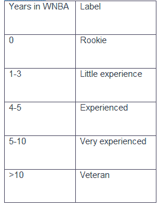

作者照片

现在，我们非常想知道`‘Pos’(Player position)`变量在`experience`水平上的分布。例如，我们希望在有经验、非常有经验和经验丰富的球员的位置之间进行比较。

我们使用了下面的代码来根据上面的标签惯例转换玩家的体验。

输出:

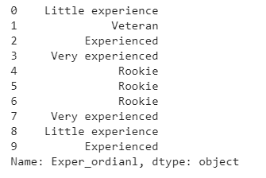

现在我们尝试根据经验水平对数据集进行分段。然后，我们为数据集的每个片段生成频率分布。最后，我们尝试对频率分布进行对比分析。

输出:

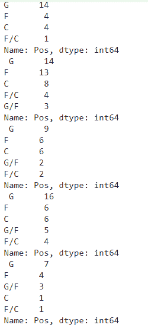

这个例子表明，比较多个变量的分布有点棘手。有时，您会在非技术人员面前展示数据。对于非技术观众来说，理解上述场景是如此困难。图形表示是向非技术观众展示我们发现的最佳方式。在本文中，我们将讨论三种图表来比较不同变量的频率。下面的图表将帮助我们完成工作—

***(一)分组条形图***

***(二)核密度图***

***(三)方框图***

## **分组条形图**

分组条形图(也称为簇状条形图、多序列条形图)扩展了条形图，绘制两个或更多分类变量的数值，而不是一个。条形图根据一个分类变量的级别位置进行分组，颜色表示每组中的二级分类级别。

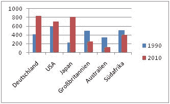

作者照片

*   **如何生成分组条形图**

来自`[seaborn](https://seaborn.pydata.org/index.html)` 模块的`[*seaborn.countplot()*](https://seaborn.pydata.org/generated/seaborn.countplot.html)` 函数，用于生成分组条形图。为了生成分组条形图，我们将使用以下参数

*(i)* `*x*` *—以字符串形式指定 x 轴上所需列的名称。*

*(ii)* `*hue*` *—以字符串形式指定要为其生成条形图的列的名称。*

*(iii)* `*data*` *—指定存储数据集的变量的名称。*

```
*import seaborn as sns* sns.countplot(x = ‘Exper_ordianl’, hue = ‘Pos’, data = wnba)
```

输出:

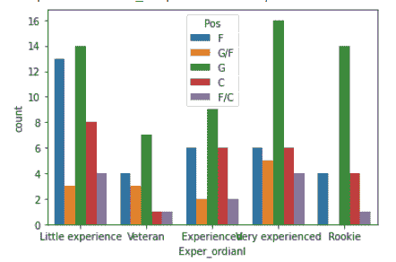

这里，我们用`Exper_ordianl` 列来表示 x 轴。这里，我们为`Pos` 列生成条形图。我们将数据存储在一个名为`wnba`的变量中。

*   **如何自定义分组条形图**

`[seaborn](https://seaborn.pydata.org/index.html)` 模块中的`[seaborn.countplot()](https://seaborn.pydata.org/generated/seaborn.countplot.html)` [](https://seaborn.pydata.org/generated/seaborn.countplot.html)函数有多个参数。通过改变这些参数，我们可以根据自己的需求定制图形。我们也可以按升序设置`x-axis` 值的顺序，并使用`hue_order` 参数更改色调顺序。

```
import seaborn as snssns.countplot(x = ‘Exper_ordianl’, hue = ‘Pos’, data = wnba,
order = [‘Rookie’, ‘Little experience’, ‘Experienced’, ‘Very experienced’, ‘Veteran’],hue_order = [‘C’, ‘F’, ‘F/C’, ‘G’, ‘G/F’])
```

输出:


作者照片

轮到你稍微思考一下，找到问题的答案。

***锻炼问题:*** 年纪大的球员打球少吗？用提到的数据集和上面的知识来回答问题。

## 核密度估计图

核密度估计(KDE)图是一种可视化数据集中观察值分布的方法，类似于直方图。KDE 使用一维或多维的连续概率密度曲线来表示数据。

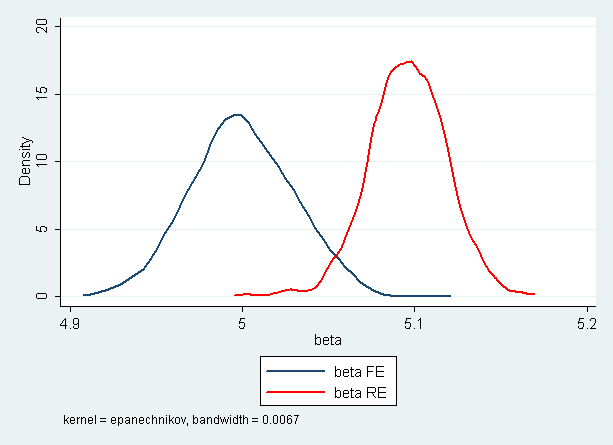

作者照片

上面的每个平滑直方图被称为核密度估计图，或简称为核密度图。与直方图不同，核密度图在 y 轴上显示密度，而不是频率。

*   **为什么使用核密度估计图？**

核密度估计图(KDE 图)主要用于比较直方图。现在我们试着理解 KDE 情节的必要性。

比较两个直方图最简单的方法是将一个直方图叠加在另一个直方图之上。我们可以通过熊猫可视化方法任务来做到这一点。

```
import matplotlib.pyplot as pltwnba[wnba.Age >= 27][‘MIN’].plot.hist(histtype = ‘step’, label = ‘Old’, legend = True)wnba[wnba.Age < 27][‘MIN’].plot.hist(histtype = ‘step’, label = ‘Young’, legend = True)
```

输出:


在上面，我们想要比较两个不同的场景。一个给 27 岁以上的球员，另一个给 27 岁以下的球员。我们把两个直方图一个接一个地画出来，这样我们就可以很容易地比较它们。我们可以很容易地比较两个直方图。如果直方图的数量多于两个。比较这些直方图容易吗？KDE 情节的必要性就是针对这种情况的。

*   **如何生成 KDE 图？**

`[Series.plot.kde()](https://seaborn.pydata.org/generated/seaborn.kdeplot.html#:~:text=A%20kernel%20density%20estimate%20(KDE,further%20in%20the%20user%20guide.)`方法用于生成 kde 图。

```
wnba[wnba.Age >= 27][‘MIN’].plot.kde(label = ‘Old’, legend = True)wnba[wnba.Age < 27][‘MIN’].plot.kde(label = ‘Young’, legend = True)
```

输出:

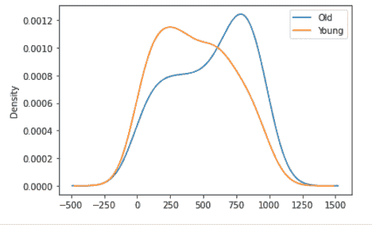

这里，我们使用 KDE 图执行相同的过程。

# 带状图

带状图是一种用于总结单变量数据集的图形数据分析技术。带状图包括:

*横轴=响应变量的值；*

*纵轴=所有值都设置为 1。*

事实上，带状图实际上是散点图。

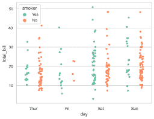

作者照片

当其中一个变量是名义变量或顺序变量时，散点图通常采用一系列窄条的形式。

*   **如何生成带状图**

`[sns.stripplot()](https://seaborn.pydata.org/generated/seaborn.stripplot.html)`功能用于生成带状图。

```
sns.stripplot(x = ‘Pos’, y = ‘Height’, data = wnba)
```

输出:

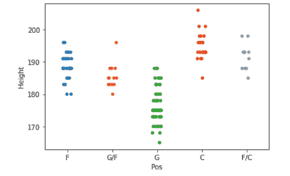

我们把`Pos` 变量放在 x 轴上，高度变量放在 y 轴上。我们可以在图表中看到，大多数矮个子球员踢守门员位置，大多数高个子球员踢中后卫位置。你也可以试试权重变量。窄条的数量与名义变量或序数变量中唯一值的数量相同。

## 箱线图

箱线图是一种基于五个数字汇总显示数据分布的标准化方法(“最小值”、“第一个四分位数”(Q1)、中值、第三个四分位数(第三季度)和“最大值”)。

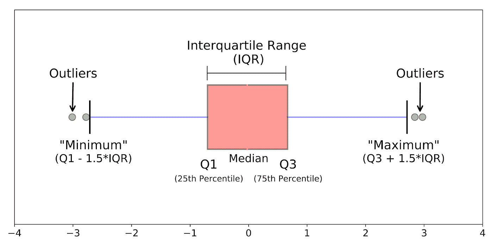

作者照片

上图显示了箱线图。箱线图是一种图表，可以很好地显示数据中的值是如何分布的。

***中位数(Q2 或第 50 百分位):*** *表示数据集的中间值。*

***第一个四分位数(Q1 或第 25 个百分位数):*** *它代表数据集的最小值和中值之间的中间值。*

***第三个四分位数(Q3 或第 75 个百分位数):*** *表示数据集最高值和中值之间的中间值。*

***四分位数范围(IQR):*** *表示第 25 和第 75 百分位之间的值*

***触须:*** *触须是延伸到最高和最低观测值的* ***方框外的两条线*** *。在上图中，左边的一条线和右边的其他线代表胡须。*

***离群值:*** *位于盒状图的触须之外的数据点。在上图中，绿点代表异常值。*

*   **如何生成盒状图**

`[sns.boxplot()](https://seaborn.pydata.org/generated/seaborn.boxplot.html)`功能用于生成箱线图。

```
sns.boxplot(x = ‘Pos’, y = ‘Height’, data = wnba)
```

输出:

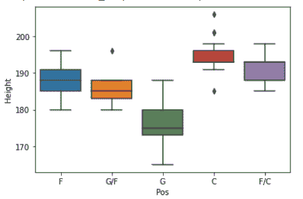

使用`sns.boxplot()`，生成一系列箱线图，检查作为球员位置函数的球员身高分布。将`Pos` 变量放在 x 轴上，重量变量放在 y 轴上。

***离群点表示—***

*   如果点大于上四分位数 1.5 倍于上四分位数和下四分位数之差(该差也称为四分位数间距)。
*   如果点数低于下四分位数 1.5 倍于上四分位数与下四分位数之差(该差也称为四分位数间距)。

我们也可以使用`whis` 参数将系数从 1.5 更改为自定义值。

```
sns.boxplot(x = ‘Pos’, y = ‘Height’, data = wnba, whis=4)
```

输出:

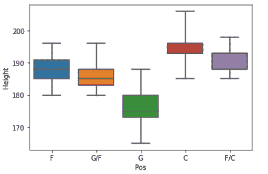

克里斯蒂娜·安妮·科斯特洛在 [Unsplash](https://unsplash.com?utm_source=medium&utm_medium=referral) 上拍摄的照片

## **结论**

在本文中，我们试图学习如何使用图表来比较频率分布。分组条形图用于比较名义变量或顺序变量的频率分布。如果变量是以区间或比率尺度测量的，我们可以使用核密度图和带状图或盒状图来更好地理解。

如果你是数据科学爱好者，请与我保持联系。我很快会带着另一篇有趣的文章回来。

## 关于数据科学统计学的完整系列文章

1.  [*少即是多；采样的‘艺术’(Stat-01)*](/less-is-more-the-art-of-sampling-dda8b59d399?source=your_stories_page-------------------------------------)
2.  [*熟悉数据科学最重要的武器~变量(Stat-02)*](/get-familiar-with-the-most-important-weapon-of-data-science-variables-48cc7cd85dc5?source=your_stories_page-------------------------------------)
3.  [*要增加数据分析能力，你必须知道频率分布(Stat-03)*](/to-increase-data-analysing-power-you-must-know-frequency-distribution-afa438c3e7a4?source=your_stories_page-------------------------------------)
4.  [*通过可视化频率分布找到数据集的模式(Stat-04)*](/find-the-patterns-of-a-dataset-by-visualizing-frequency-distribution-c5718ab1f2c2?source=your_stories_page-------------------------------------)
5.  [*比较多个频率分布，从数据集中提取有价值的信息(Stat-05)*](/compare-multiple-frequency-distributions-to-extract-valuable-information-from-a-dataset-10cba801f07b?source=your_stories_page-------------------------------------)
6.  [*通过简短的讨论消除你对均值的误解(Stat-06)*](https://medium.datadriveninvestor.com/eliminate-your-misconception-about-mean-with-a-brief-discussion-a9fed67d4b08?source=your_stories_page-------------------------------------)
7.  [*通过规范化提高您的数据科学模型效率(Stat-07)*](https://medium.datadriveninvestor.com/increase-your-data-science-model-efficiency-with-normalization-918484b4626f?source=your_stories_page-------------------------------------)
8.  [*数据科学的基本概率概念(Stat-08)*](/basic-probability-concepts-for-data-science-eb8e08c9ad92?source=your_stories_page-------------------------------------)
9.  [*从朴素贝叶斯定理到朴素贝叶斯分类器的路线图(Stat-09)*](/road-map-from-naive-bayes-theorem-to-naive-bayes-classifier-6395fc6d5d2a?source=your_stories_page-------------------------------------)
10.  [*数据科学爱好者关于假设检验需要知道的一切(Stat-10)*](https://medium.datadriveninvestor.com/all-you-need-to-know-about-hypothesis-testing-for-data-science-enthusiasts-30cfe1dce028?source=your_stories_page-------------------------------------)
11.  [*用 ANOVA (Stat-11)*](/statistical-comparison-among-multiple-groups-with-anova-d4ac27f6e59e?source=your_stories_page-------------------------------------) 进行多组间统计比较
12.  [*用卡方检验比较分类变量的相关性(Stat-12)*](/compare-dependency-of-categorical-variables-with-chi-square-test-982baff64e81?source=your_stories_page-------------------------------------)