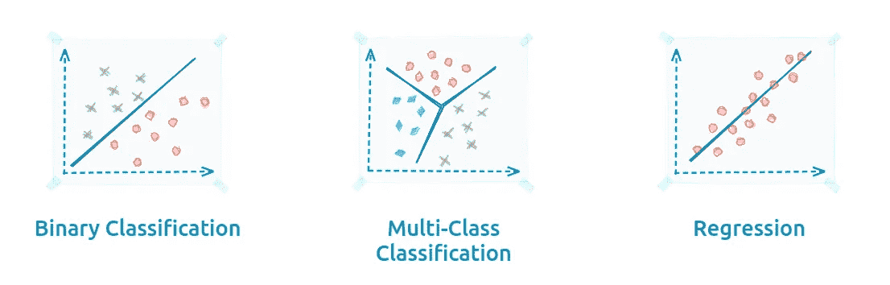
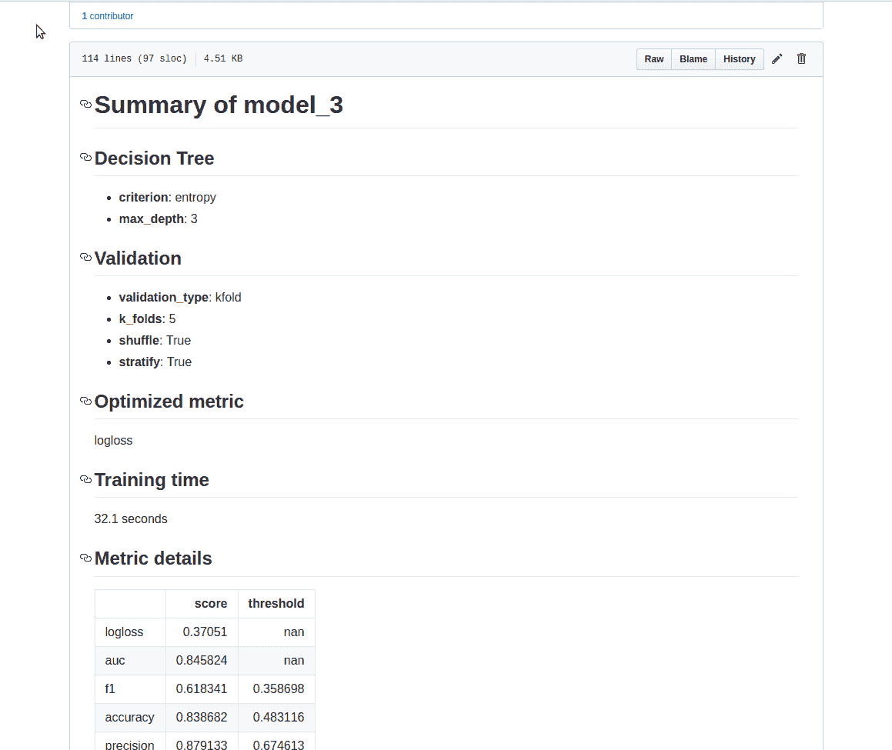
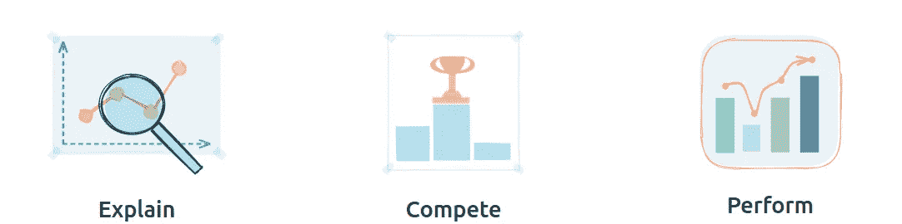
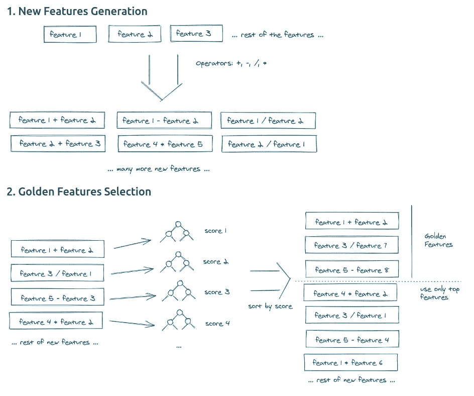
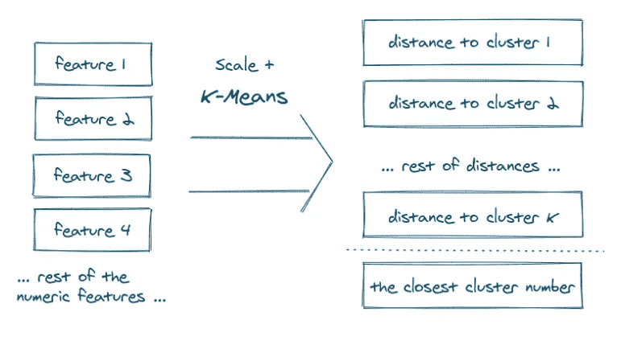
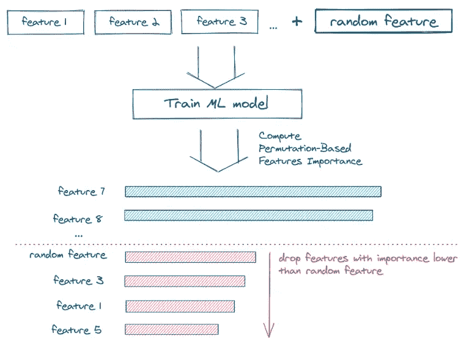
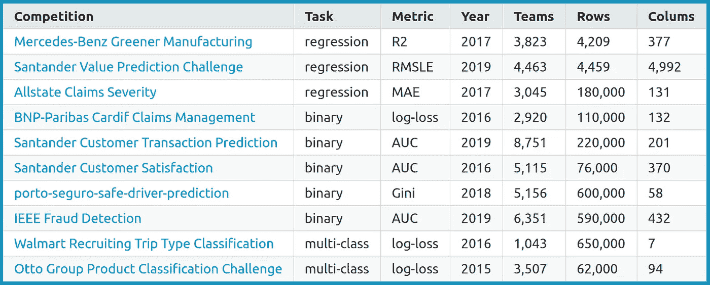
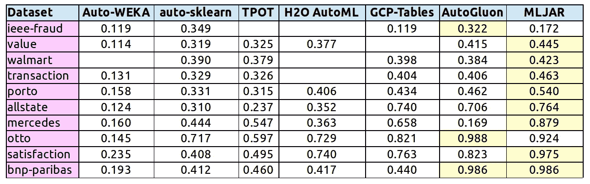
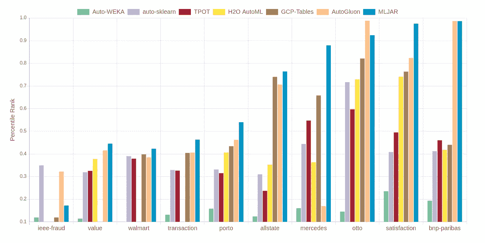

# 在 10 个表格游戏竞赛中比较流行的 AutoML 框架

> 原文：<https://towardsdatascience.com/compare-popular-automl-frameworks-on-10-tabular-kaggle-competitions-9b1420e8942d?source=collection_archive---------16----------------------->


[Jp 瓦列里](https://unsplash.com/@jpvalery?utm_source=unsplash&utm_medium=referral&utm_content=creditCopyText)在 [Unsplash](https://unsplash.com/s/photos/f1?utm_source=unsplash&utm_medium=referral&utm_content=creditCopyText) 上的照片

你是否曾经在晚上忙于应付不同的机器学习算法和软件包，切换超参数值和尝试不同的预处理方法？建立一个好的机器学习管道需要大量的试错工作。因此，这非常耗时，而且会让人精疲力尽。

自动机器学习(AutoML)框架旨在提供帮助。

# 开始

2016 年开始做 **AutoML** 系统。我是一名博士生，从事不同领域的许多 ML 项目:高能物理、医学和生物信息学。我需要优雅的软件，我可以用它来交换我的代码，进行大量的调整和验证循环。这就是我如何开始着手我称之为 MLJAR 的项目。名字来源于 ML + JAR，但这里的 JAR 有第二层意思(我当时在波兰华沙读书):

> JAR 是对华沙外来居民的非正式称呼。这个词来源于许多学生和工人在周末拜访父母时用来从父母家拿食物的罐子。

你可以在这篇文章[中阅读更多关于 JARs 的内容。它有相当负面的意义。我想我会用它来命名我的新项目。我会让项目成功，以表明对新人不好是一个错误。](http://mywarsawdream.blogspot.com/2018/01/soiki-jars.html)

# 开源 AutoML

MLJAR AutoML 引擎是开源的，其代码可从 GitHub 获得:[https://github.com/mljar/mljar-supervised](https://github.com/mljar/mljar-supervised)

MLJAR AutoML 使用表格数据集。



常见的机器学习任务:二进制、多类分类和回归。(图片由作者妻子提供)

MLJAR AutoML 最大的优点是它的透明性。这里面没有黑箱魔法。您可以查看 AutoML 培训的每个步骤的详细信息。所有关于已训练模型的信息都保存在硬盘中(自动保存功能始终开启)。每个型号都有自己的`README.md`文件。因此你可以很容易地检查细节(例如在 GitHub、VS Code 或 Jupyter Notebook 中)。下面是来自模型培训的降价`README.md`报告示例:



来自模型训练的范例报告。

# 自动模式:解释、竞争、执行

过去，AutoML 仅用于超参数优化。这是 ML 管道中可以自动化的最简单的事情。今天，AutoML 可以服务于许多目的。MLJAR AutoML 可以在三种模式下工作:

*   它很快。只需要几分钟。应该用来让你熟悉一个新的数据集。它做探索性的数据分析。它只训练几个具有默认超参数的模型(没有调优！).对于每一个模型，都有完整的解释:特性重要性、SHAP 依赖图、决策图、学习曲线等等。
*   `Compete` —高度调谐的 ML 流水线。应该用于构建高精度模型。培训可能需要很长时间，很容易超过 4 个小时(取决于数据集)。它使用先进的特征工程、集成和堆叠。
*   `Perform` —用于训练生产就绪的 ML 模型的模式。训练速度和最终准确性之间的平衡。



MLJAR AutoML 以三种模式工作:解释、竞争、执行。(图片由作者妻子提供)

训练模式的选择与参数设置一样简单:

```
# initialization of AutoML with Compete mode
# mode can be: Explain, Compete, Performautoml = AutoML(mode="Compete")
```

# 特征工程

特征工程对于机器学习流水线的性能非常重要。MLJAR AutoML 提供了先进的特征工程方法。它可以用 [K-Means](https://mljar.com/automated-machine-learning/k-means-features/) 或[黄金特征搜索](https://mljar.com/automated-machine-learning/golden-features/)生成新特征。还有一个[特征选择](https://mljar.com/automated-machine-learning/feature-selection/)程序，可以与**任何**机器学习算法一起工作。

## 黄金特征生成



用于 MLJAR AutoML 的黄金特征生成。(图片由作者提供)

## k-均值特征生成



基于 K-均值的特征生成。(图片由作者提供)

## 任何 ML 算法的特征选择



特征选择程序。(图片由作者提供)

# 比较 Kaggle 上的 AutoML 框架

让我们在最具挑战性的数据集上检查 AutoML 性能。 [Kaggle](https://kaggle.com) 平台以现实生活中的数据问题举办数据科学竞赛。我使用了 Kaggle 的 10 个表格数据集，它们代表了各种机器学习任务:

*   二元分类
*   多类分类
*   回归



比较中使用的数据集描述。

数据集的选择与文章中的相同: [N. Erickson，et al .:autoglon-Tabular:Robust and Accurate AutoML for Structured Data](https://arxiv.org/abs/2003.06505)(除了房价 Adv. Regression，因为文章中没有来自私人排行榜的结果，竞争仍在进行中)。

评估了以下框架:

*   AutoWeka
*   自动 Sklearn
*   TPOT
*   H2O
*   谷歌云自动表
*   自动增长
*   MLJAR

## 结果

这些框架在 **m5.24xlarge** EC2 机器(96CPU，384 GB RAM)上进行训练。培训时间设定为 4 小时。(GCP 表除外，它使用自己的机器类型)

下面给出的最终结果是私人排行榜中的百分比排名(由 Kaggle 内部评估)。**数值越高越好。**ka ggle 竞赛中的第一名将获得与`1.0`相同的百分位排名。竞赛中解决方案的最后一名将给予`0`值。除 MLJAR 外，AutoMLs 的结果来自 AutoGluon paper。



表格数据中 10 个 Kaggle 竞赛的百分位数排名。最佳解决方案用黄色标出。



表格数据中 10 个 Kaggle 竞赛的百分位数排名。数值越高越好。

你可以看到一些 AutoML 框架跳到了竞争的前 10%(没有任何人工帮助)！没有任何人工干预的 MLJAR AutoML 在 10 场 Kaggle 比赛中有 5 次进入前 25%。更重要的是，它有 3 次排在前 10%。

# 摘要

现在 AutoML 是一个多用途的工具。可用于:

*   **软件工程师**需要在应用程序中应用 ML，但不知道如何调整 ML 算法的细节
*   **公民数据科学家**在低代码环境中构建 ML 管道
*   **数据科学家和工程师**加快工作速度

我希望许多人能从我的 AutoML 系统中受益。我为此付出了很多努力。我对您对 MLJAR AutoML 以及整个 AutoML 的意见和反馈非常感兴趣。

你可以在 GitHub 找到 MLJAR AutoML:[https://github.com/mljar/mljar-supervised](https://github.com/mljar/mljar-supervised)

<https://github.com/mljar/mljar-supervised> 