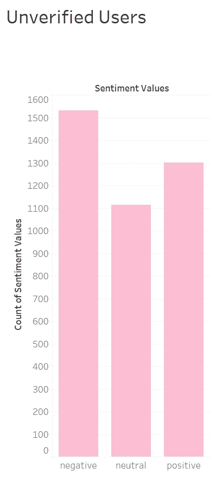
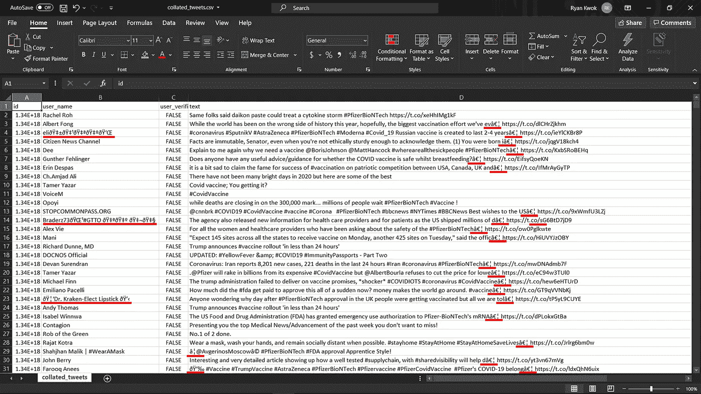

# 在 Excel 上比较 AWS understand 和 Azure ML

> 原文：<https://towardsdatascience.com/comparing-aws-comprehend-and-azure-ml-on-excel-44b0f224294c?source=collection_archive---------42----------------------->

## 不同的机器学习算法表现如何相似？


[附身摄影](https://unsplash.com/@possessedphotography?utm_source=unsplash&utm_medium=referral&utm_content=creditCopyText)在 [Unsplash](https://unsplash.com/s/photos/machine-learning?utm_source=unsplash&utm_medium=referral&utm_content=creditCopyText) 上拍照

在我的模块“开发有意义的指标”中，一位同学(Nicole)使用[Azure Machine Learning on Excel](https://www.mrexcel.com/excel-tips/excel-2020-perform-sentiment-analysis-in-excel/)对 4000 多条与辉瑞相关的[推文](https://www.kaggle.com/gpreda/pfizer-vaccine-tweets)进行情感分析，以确定大多数人对疫苗的感受。

她发现推特上的情绪分布相当均匀，“负面”比“正面”略有增加。这意味着 Twitter 用户的意见相对复杂，对辉瑞疫苗的正面和负面意见都很健康。这可以从她发布的下图中看出。



图片来自作者的同学妮可

巧合的是，我之前也使用过[AWS understand](https://aws.amazon.com/comprehend/)对一堆 Reddit 评论进行情感分析。事实上，我在这里记录了那个过程[。这实际上让我问， ***“哪个人工智能模型更准确？”作为一名计算机专业的学生，我对技术世界有一些信心，我最初的假设是，这两者将会有一些共同的趋势。换句话说，一般来说，一个人工智能的情感等级较低的推文对另一个人工智能来说也相对较低，反之亦然。***](https://kwokyto.medium.com/trying-to-use-a-30gb-database-for-sentiment-analysis-137d5f5c5fc5)

# 技术部分

我回答这个问题的第一步是使用 AWS understand 运行我自己的情感分析。对于那些没有看过我以前的帖子的人，我使用了一个现有的 AWS 教育帐户，在那里我有免费的信用来使用 AWS 提供的服务。写的第一个函数是从我以前的项目复制的，它连接到 AWS 服务器，并发送一段文本进行情感分析。然后处理并保存响应。这个功能实际上是由 AWS 文档[指导的。](https://docs.aws.amazon.com/comprehend/latest/dg/get-started-api-sentiment.html#get-started-api-sentiment-python)

```
## script for sentiment analysisdef get_sentiment(text):
    comprehend = boto3.client(service_name='comprehend', region_name='us-east-1')
    response = comprehend.detect_sentiment(Text=text, LanguageCode='en')
    response = dict(response) result = {}
    result["sentiment"] = response["Sentiment"]
    result["positive"] = response["SentimentScore"]["Positive"]
    result["negative"] = response["SentimentScore"]["Negative"]
    result["neutral"] = response["SentimentScore"]["Neutral"]
    result["mixed"] = response["SentimentScore"]["Mixed"]
    result["sentiment_score"] = (result["positive"] - result["negative"]) / 2 return result
```

其次，编写代码来处理 CSV 文件中的数据，并将结果写入另一个 CSV 文件。

```
## get sentiment resultstry:
    result = get_sentiment(body)except botocore.exceptions.ClientError as e:
    print(e)
    result = 'no-go'
    while (result != "ok" and result != 'skip'):
        print("type 'ok' or 'skip' to continue")
        result = input()
    if (result == 'skip'):
        skipped += 1
        print("error occurred with sentiment analysis, skipping row")
        continue
    result = get_sentiment(body)except:
    skipped += 1
    print("error occurred with sentiment analysis, skipping row")
    continue ## write to csvrow = ['0','1','2','3','4','5','6',result["sentiment"], result["positive"], result["negative"], result["neutral"], result["mixed"], result["sentiment_score"]]
print(row)
writer.writerow(row)
print("scanned and accessed data index", count)
```

在这个过程中，我遇到的一个巨大的绊脚石是“不干净数据”的存在。我认为 CSV 数据集是直接从 Twitter 上刮下来的。然而，这意味着存在大量无用字符，以及 AWS 和 Python 都无法正确处理的字符。从下面的截图可以看出，有很多垃圾字符影响了 Python 脚本。



突出显示导致错误的不良字符(图片来自作者)

经过一番搜索，我学会了如何从这个[链接](https://stackoverflow.com/questions/196345/how-to-check-if-a-string-in-python-is-in-ascii)中检查合法字符，并实现了一个功能来帮助在发送数据进行处理之前清理数据。


帮助清理数据的代码(图片来自作者)

最后，代码工作了，成功地分析了所有的推文。我将结果复制并粘贴到一个合并的 CSV 文件中，然后开始分析结果。

# 可视化位

总之，我制作了两张我认为有意义的图。首先，我重新制作了 Nicole 制作的图表，但现在是基于 AWS Comprehend 的结果。下面是两张并排的图表。


比较 Azure 和 AWS(图片来自作者)

这里有许多不同之处可以挑选出来。首先，AWS 产生了一种复杂的情绪，而 Azure 没有。AWS 产生的混合和中性的区别在于，中性的情绪是指评论中没有正面和负面的词语，而混合的情绪是指评论中混合了正面和负面的评论。这是一个纯粹的算法问题，因为这就是人工智能的设计方式。虽然它可能会产生一些关于算法创建得有多好的见解，但我不认为它值得考虑，因为“混合”分数相对来说是最小的。

第二，也是更明显的一点，与 Azure 相比，AWS 的中性情绪明显较高。这也是由于算法的问题。我的理论是，Excel 情绪分析仅仅是一个插件，准确性可能没有 AWS 高。AWS understand 运行在亚马逊服务器上，亚马逊服务器有能力处理和管理更大、更复杂的机器学习算法。

对比几条评论也能看出这一点。例如，从下面的图片中，有一些评论，我认为 AWS 比 Azure 的评分更准确。第 11 行的评论只是一个标签，被 Azure 标记为负面(单元格 F11)，但(我相信)被 AWS 更好地归类为中性，置信度为 99%(单元格 K11)。


样本推文及其各自的情感得分(图片来自作者)

我创建的第二个图表试图证明/反驳我之前的假设，即两个人工智能之间存在某种协议。我首先计算了情绪得分，将其与-1 到 1 的量表进行比较，其中-1 分表示负面情绪，0 分表示中性情绪，1 分表示正面情绪。然后，我在散点图上绘制了 AWS 情绪得分和 Azure 情绪得分，并希望观察到某种趋势。图表如下所示。


AWS 情绪得分与 Azure 情绪得分(图片来自作者)

正如所见，两者之间绝对没有任何趋势，这让我很惊讶，因为这完全违背了我的假设。事实上，情节的巨大分散表明两个人工智能在大多数推文中意见不一。

考虑到这一点，这可能是因为自然语言处理在技术世界中仍然是一个非常新的事物，即使是最好的情感分析机器学习算法也无法提供 95%的准确率。最终，这种行为可能是意料之中的，毕竟不是太不寻常。

# 结论

想一想这是如何有意义的，我相信这样的信息对于人工智能爱好者来说是有趣和独特的，他们可以比较各种技术并寻求改进这些技术。这个发现的第一部分是承认和意识到我们在人工智能游戏中仍然远远落后于完美。不是说这个领域很容易，但是大多数外行人会相信情感分析确实是最准确的算法之一。这个简单的数据图表表明我们还有很长的路要走。

然而，我希望这将有助于激励更多的人(和我自己)意识到人工智能有如此大的创新和改进空间。我们必须展望未来，改进这项技术，使其能够发挥最大潜力。在一个技术进步如此迅速的现代世界，我怀疑另一个像这样的图表看起来与我现在拥有的截然不同只是时间问题。