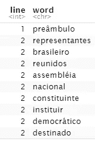
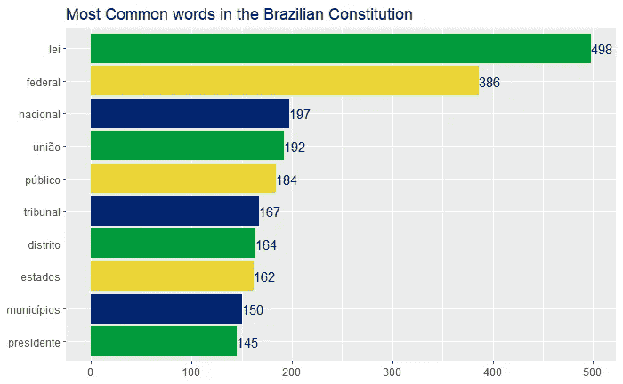
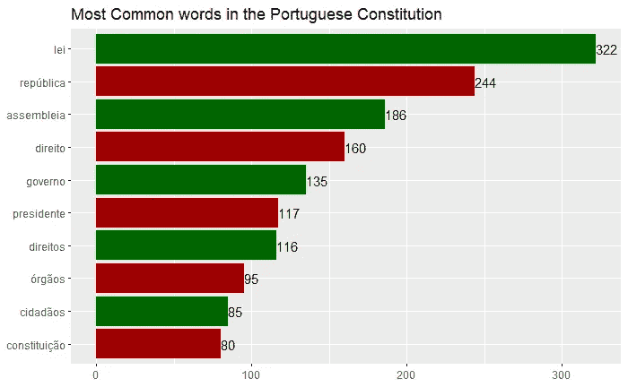
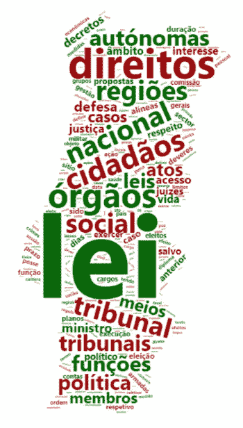
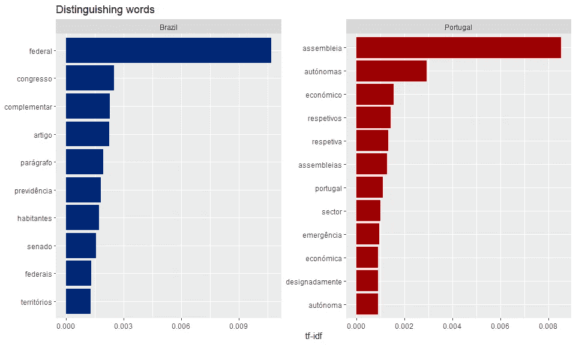

# 巴西和葡萄牙宪法的数据驱动比较

> 原文：<https://towardsdatascience.com/comparing-brazilian-and-portuguese-constitutions-with-text-mining-82213c7a95fd?source=collection_archive---------66----------------------->

## 从巴西和葡萄牙宪法的文本挖掘看它们的异同

在 [Unsplash](https://unsplash.com?utm_source=medium&utm_medium=referral) 上由 [Dmitrij Paskevic](https://unsplash.com/@zeak?utm_source=medium&utm_medium=referral) 拍照

这是对当前巴西和葡萄牙宪法的一些特征的快速且主要是视觉上的比较，旨在利用一些文本挖掘概念并查看宪法的一些相似性和差异。

您将在这里看到:

*   文本挖掘
*   最常用的词
*   单词云
*   TF-IDF

## 方法

对于这个分析，我使用了 R 中的文本挖掘概念和包，简单来说步骤如下:

*   引入宪法文本
*   去除停用词，也就是像冠词和介词这样的对文本没有太大价值的词
*   标记化，即将短语缩减为单词

之后，我们会得到一个类似这样的数据帧:

用于分析的符号化数据框架-按作者分类的图像

现在我们准备为每个文档构建一些基本的情节。

## 1988 年巴西宪法

在一个经历了多年军事独裁、领导层更迭并因最近的直接选举运动“Diretas Já”而有所改观的国家，显然需要一部不那么专制的宪法，一部至少在纸面上将权力还给人民的宪法。

这正是 1988 年巴西宪法试图实现的目标。尽管被批评为冗长和过度分析，目前的联邦宪法是在 1988 年颁布的，它无疑是该国民主历史上的一个里程碑。

删除停用词后，我们剩下:

**总字数** : 25042

**总独特字数** : 4700

**%**

巴西宪法中最常见的 10 个词是:

巴西宪法中最常见的词汇——作者图片

一些快速注释:

*   “联邦”、“国家”和“工会”代表联邦政府等级中的上层职位。
*   “estados”和“municipios”代表政府的另外两个分支，即州和市。
*   有趣的是，葡萄牙语的价值观和概念，如社会、公正、资源和人，直到第 12 位才出现。

在 worcloud2 软件包的帮助下，我们在巴西国旗的美丽色彩下构建了一个单词云，并带有巴西地图的轮廓:

巴西宪法的文字云—作者图片

正如在任何词云中一样，越大的词越常见。这种情况下的颜色是随机的。

## 1976 年葡萄牙宪法

在 1976 年的一场左派政变之后，葡萄牙人民也需要一部新宪法，而之前的那部宪法已经有 40 多年的历史了。虽然葡萄牙在政府和政治方面几乎总是更稳定，但 1976 年的文件进行了几项创新，如议会、总理、政党和选举的明确定义，以及独立的司法系统。

就文本而言，葡萄牙宪法也相当罗嗦，尽管不太像当前的巴西宪法:

**总字数** : 15111

**总绝字** : 3107

**%的独特词** : 20.56

葡萄牙现行宪法中最常见的 10 个词是:

葡萄牙宪法中最常见的词语—作者图片

注意事项:

*   可以理解的是，“雷”是最常见的词，
*   换句话说，至少与巴西宪法相比，他们更关心共同利益。“assembleia”、“direito/direitos”、“cidados”等词非常突出，位列前 10。

看看葡萄牙宪法中的常用词“云”这个词，不按比例。

葡萄牙宪法的文字云—作者图片

## TF-IDF 和独立条款

TF-IDF 是一种旨在显示一个单词在文档集合中的重要性的度量，在这种情况下，是两种结构的组合。它清楚地显示了某个文档独有的单词，或者在某个文档中比该组中的其他单词出现频率更高的单词。更多关于 TF-IDF 的信息，请点击这里。

下图显示了在一个文档中出现频率较高，而在另一个文档中出现频率较低或根本不出现的单词。左边的术语，如“联邦”、“国会”和“补充者”只在巴西宪法中使用，而“议会”、“自治”和“经济”只在葡萄牙文件中出现。

每部宪法的专有词汇—作者图片

Obs:有些词，如“económico”和“sector ”,在巴西和葡萄牙的写法不同，因此有必要进行后续研究，以使这两种葡萄牙语“正常化”。这可能很快就会成为一项独立的研究，敬请关注。

## 最后的想法

*   文本挖掘是一项分析文本的伟大技术，它使我们能够比较像国家宪法这样重要的文件。
*   巴西宪法比葡萄牙宪法更加冗长。
*   至少就大多数常用词而言，葡萄牙《宪法》更侧重于公共利益，并且有许多与葡萄牙语相对应的词，如“社会”、“权利”和“公民”。
*   "联邦"、"国会"和"补充者"等词几乎只在巴西宪法中使用，而"议会"、"自治"和"经济"只在葡萄牙宪法中使用。

这篇文章中使用的全部代码和文本，请到我的 [GitHub 页面](https://github.com/rafabelokurows/brptconstitution)查看我最近的一些作品[这里](https://rafabelokurows.medium.com/)。