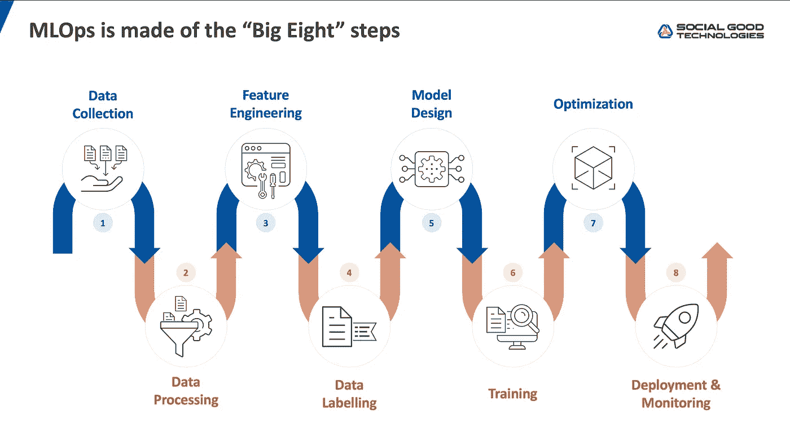
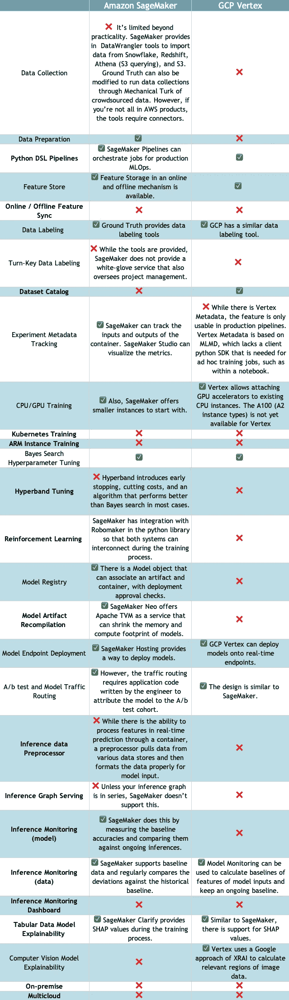

# 比较云 MLOps 平台，来自前 AWS SageMaker PM

> 原文：<https://towardsdatascience.com/comparing-cloud-mlops-platform-from-a-former-aws-sagemaker-pm-115ced28239b?source=collection_archive---------8----------------------->

## 对于 ML 平台工具，两大云今天如何比较？重要的特征是什么？

在组织中应用机器学习(ML)的公司有一系列工具放在一起作为他们的 ML 平台。当组织扩展时，每个 ML 工程师、ML 架构师和 CIO 团队都应该重新评估他们的架构，尤其是在大牌云供应商发布年度公告的时候。作为前亚马逊 SageMaker 高级产品经理，我将概述当前 GCP Vertex 与 SageMaker 的情况，以及我对不同工具的看法。

MLOps 很少是单一的整体系统。相反，它由许多较小的工具阶段组成，我称之为“MLOps 八大阶段”:数据收集、数据处理、特征工程、数据标记、模型设计、模型训练、模型优化以及模型部署和监控。

图片作者。开源基金会的“大八步”，社会公益技术。

# ML 平台方法介绍

大型云供应商已经构建了“端到端”的 ML 平台。使用 Amazon SageMaker 的数据科学家可以从他们的数据仓库中提取数据，创建算法模型代码，并部署到生产中，而无需离开工具套件。虽然云供应商是人们谈论最多的入门产品，但也有一些初创公司旨在应对来自 Dataiku、Datarobot、C3.ai 和 H20.ai 的相同挑战。

端到端的替代方案是成为“同类最佳”工具，这要求供应商专注于成为某个领域的思想领袖产品。虽然 GCP 顶点和塞尔顿都有模型服务能力，但一个熟练的 ML 工程师会发现塞尔顿的产品具有许多客户用例所需的功能，如推理图和原生 Kubernetes 部署。端到端 ML 平台通常需要 15-36 个月才能赶上功能对等，但产品将在此之前推出，以创造思想领先地位并获得产品反馈。

在这一点上，与主要的云供应商平台有大量的重叠。事实上，谷歌 I/O 2021 的许多新公告都是 SageMaker 在 re:Invent 2020 上推出的功能。谷歌的战略与其他云供应商的区别在于，他们有许多源自谷歌大脑的开源 MLOps 项目，GCP 现在以托管服务的形式提供这些项目。Vertex AI pipelines 是一个托管的 Kubeflow Pipelines 服务，Vertex 元数据 API 几乎与 MLMD 相同，Vertex 也有用于托管 tensorboard 训练工件的 API。这种构建产品的方法意味着客户具有可移植性，相同的工具在开源中可供他们在 AWS 或内部运行。

# 亚马逊 SageMaker 与 GCP Vertex 的比较

每隔几个月，我都会花时间重新评估我的 18 个月 MLOps 行业路线图。这个路线图是我认为应该覆盖 90%的企业培训和服务模型所需的关键特性。它是由我在与 ML 工程师、CIO 和其他项目经理的交谈中得到的产品功能需求的金块，以及我在工作经验中观察到的东西组合而成的。我将这些特性放在一个列表中，并描述当前的 ML 产品。

GCP Vertex 与 SageMaker 在常见要求和同类最佳特性方面的比较。

## ML 平台有两类特性。需要“牌桌赌注”和“同类最佳”功能。

同类最佳产品以粗体突出显示。新加入 ML 的团队使用 table stakes 特性就足够了，因此他们可以快速部署模型。GCP 顶点和亚马逊 SageMaker 都已经投入了足够的资金来清除这个最小的障碍。

然而，仅仅这些特征还不足以在生产中形成大规模的模型。同类最佳的特性，例如推理图，对于组织中已经有许多模型的 ML 团队来说非常重要。八大巨头的每个阶段都有自己的一套最佳特性需要考虑。

云平台仍在不断完善其同类最佳的功能，即使它们现在已经有了一个公共产品。虽然 GCP 更诚实，称 Vertex Metadata 和其他同类最佳工具为预 GA，但它们真的不能大规模使用(还不能)。我在 Twitter 上强调过[顶点元数据(实验跟踪)没有 Python SDK](https://twitter.com/alxchung/status/1407040052333580293) 。SageMaker 也有类似的不足。一个例子是在他们的特征库中，该特征库缺少实体模型来组织保存的特征。需要更深入的测试来发现仍然存在的技术债务。

需要高级特性的企业团队应该准备好构建他们自己的解决方案来解决他们的特定用例，或者编写“粘合”代码来替代(开源工具或其他供应商)。这种粘合剂是我听到投资者称之为 ML orchestration 的一个概念，它是将出现的一类新的 MLOps 工具。

# 外卖食品

进行这样的评估显示了首席信息官/工程副总裁为解决当前挑战而需要构建的东西与他们根本没有 MLOps 平台团队时可以购买的东西之间的差距。需求列表总是在增长，足够的特性列表不仅仅来自端到端的 ML 平台。对于拥有高级用户的更复杂的企业来说，这一练习清楚地表明了他们的 ML 平台在传统构建与购买中的未来。对于初创公司和较小的公司来说，拥有 MLOps 平台工程并不划算，而使用 SageMaker 或 Vertex 将符合要求。

离开 AWS 后，我创办了一个名为 Social Good Tech 的非营利性 MLOps 软件基金会，以解决工具的互操作性问题。我计划写更多关于如何通过架构 ML 平台来思考的文章。请继续关注我对 MLOps 行业的分析和市场中的争论。