# 咖啡渣与 LBP 和 K-means 聚类的比较

> 原文：<https://towardsdatascience.com/comparing-coffee-grounds-with-lbp-and-k-means-clustering-f7181dbdea67?source=collection_archive---------27----------------------->

## 咖啡数据科学

## 对旧数据的回顾

在使用 LBP+K-means 聚类来帮助理解 [Rok 和小生境 grinder](/rok-defeats-niche-zero-part-3-2fbcc18397af)之间的差异之后，我决定看看以前使用这种技术的一些数据，看看我能看到什么。[技术](/the-shape-of-coffee-fa87d3a67752)使用线性二进制地图(LBP)作为 K-means 聚类的特征，以帮助根据粒子在图像中的外观进行分组。

# 研磨机比较

之前我看了一下[几台研磨机](https://link.medium.com/6u53DnKKJjb)的几个研磨设置。对于相同的研磨机和不同的设置，差异更小并不令人惊讶。这是一种比较研磨机的奇怪方式。有一点似乎很突出，那就是 Rok 3(设定 3)似乎与大多数其他版本都不相似。我怀疑这是一个测量误差。哈里欧 3 号也一样。

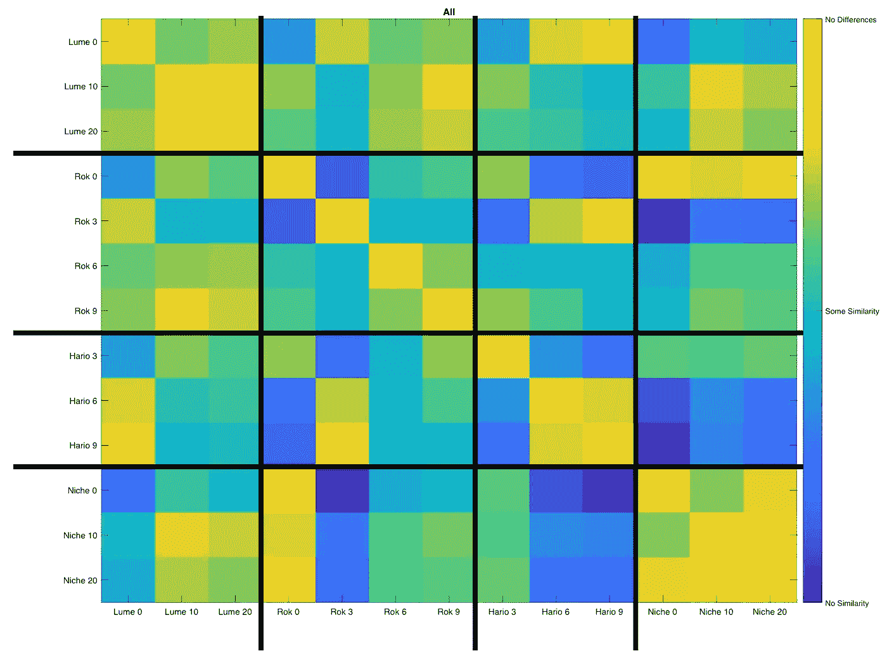

这些颗粒可以被更细的颗粒(<400um in diameter) and coarser particles (>直径 400 微米)分解。两者显示了相似的模式，但是对于 Rok 3，没有太多的差异。可能是原始数据中有太多的细颗粒聚集在一起或其他问题。

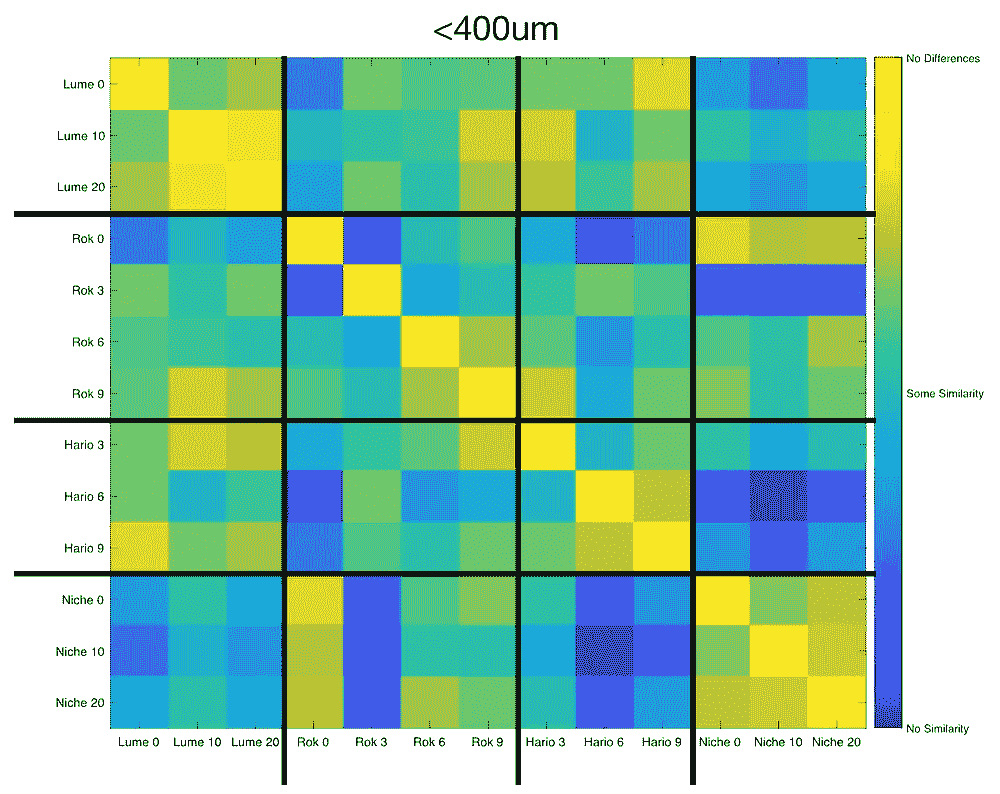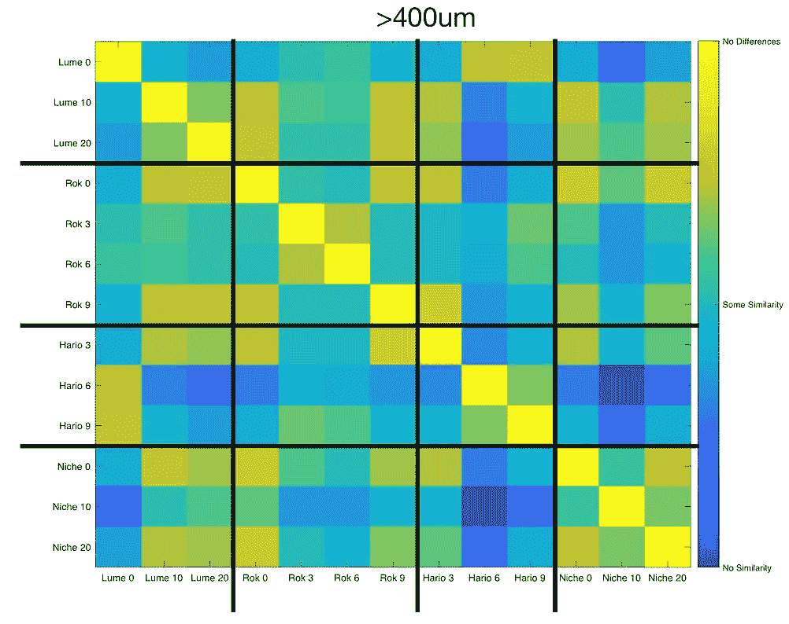

# 研磨设置

我查看了生态位上的[多个研磨设置，以帮助理解它们之间的线性关系。通常，重点是在研磨设置拨号，但由于这可以大大不同于其他变量，我想扩大搜索。](/linearity-of-a-coffee-grinder-9bed5b84b4be)

总的来说，大多数彼此接近的研磨物彼此相似，这是有道理的。

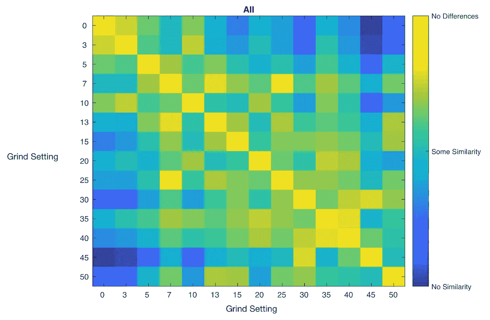

当我们按颗粒大小分解时，一些有趣的模式出现了。首先，对于 100um 的颗粒，在 S30 附近存在明显的分裂，其中 S0 至 S25 更相似，然后 S30 至 S50 最相似。

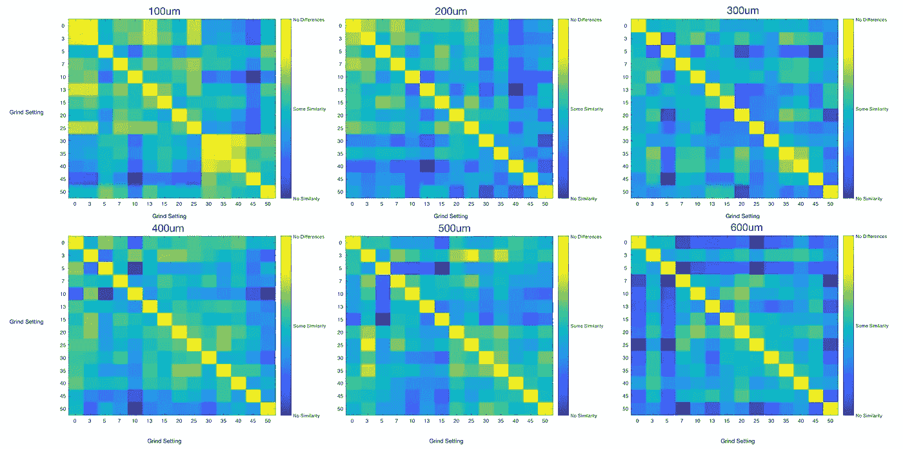

对于 500um 的颗粒，出现了另一种趋势，其中 S20 至 S50 非常相似，但彼此之间不一定相似。对于 400um，从 S0 到 S40 非常相似，但它们与 S45 和 S50 非常不同。

# 再次研磨

作为研究重新研磨咖啡豆的[效果的努力的一部分，我比较了一些较粗的研磨设置和一些较细的。其他设置看起来并不像它们应该的那样相似，但是当比较时，不清楚为什么。](https://link.medium.com/5e0bYsIIefb)

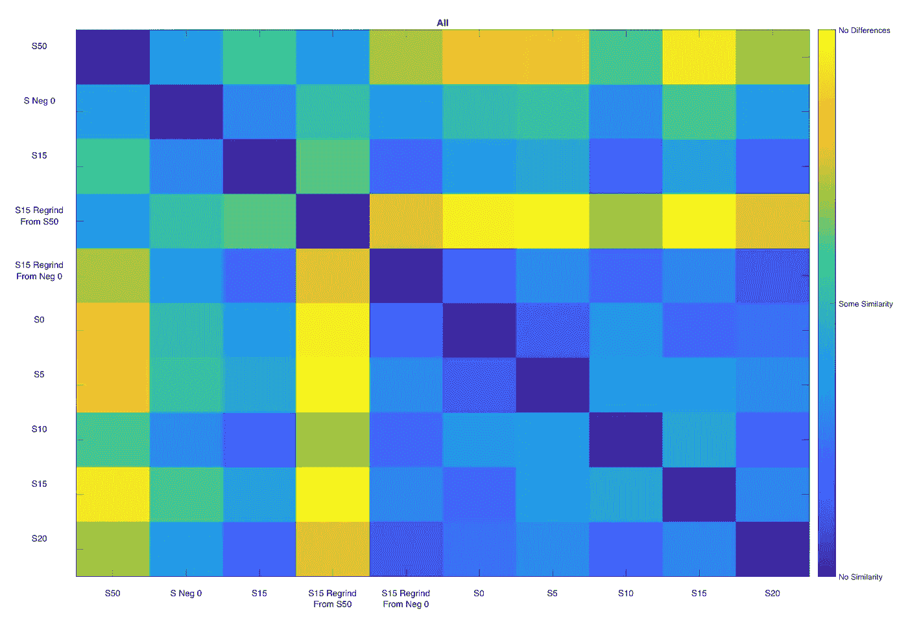

100um 是特别有趣的，因为底部的 5 个研磨设置都非常相似，甚至与再研磨非常相似，但它们都不同于较粗的研磨，如 S50。

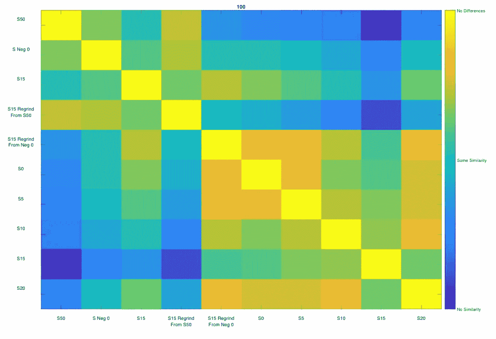

通过粒子和研磨设置的比较，重新研磨咖啡并没有使它从一开始就非常类似于只是在那个设置下研磨(在这种情况下是 S15 再研磨改变了基本的颗粒形状。

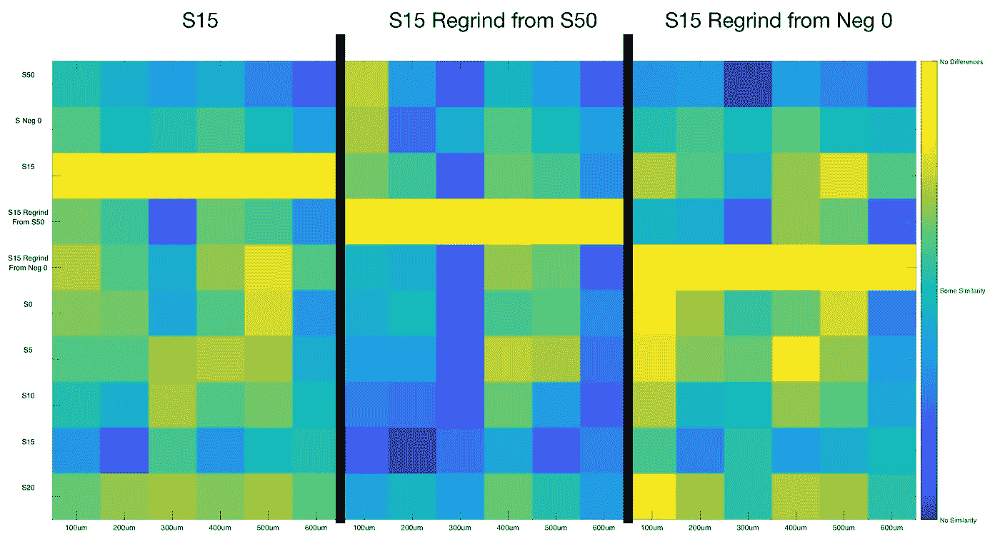

# 辛辣研磨

在研磨之前加热咖啡豆[显示出分布的变化](/spicy-coffee-grind-distributions-e4d73c6e3e1f)，但是这些结果显示出随着颗粒的变化，特别是对于 74C 对 51C 或 20C 的颗粒来说，变化要大得多。

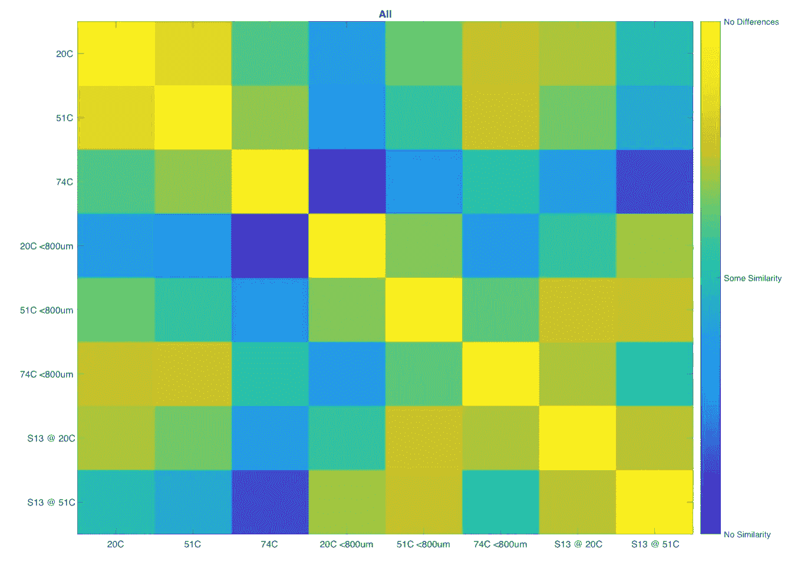

潜入更深的细粒(<400um) and coarse (400um) particles, there are some interesting differences especially for 74C. The coarse particles from the 74C are very different from the rest.

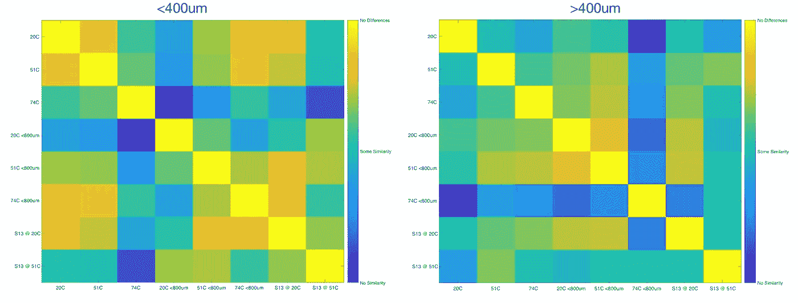

# The Source of Fines

I have [之前讨论过理论](/fines-in-coffee-grinds-searching-for-a-source-326c3eba2bb4)，细粒来自更脆的咖啡豆内部。因此，回顾这些数据，我们发现根据模式识别，来自粗磨 S50 的细粒与来自 S13 的细粒非常匹配。

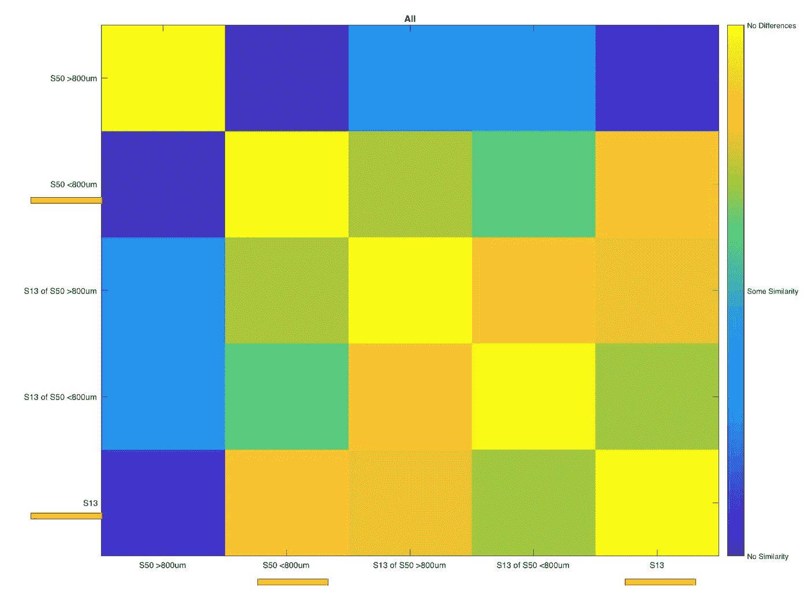

将这些数据分成更细和更粗的数据，更细的数据(<400um) from S50 are what match so well with S13.

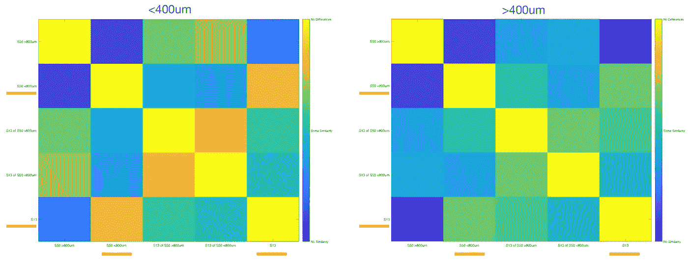

Looking closer at just the S13 and S50 <800um across multiple particle sizes shows that 100um is really where those fines get similar between the two.

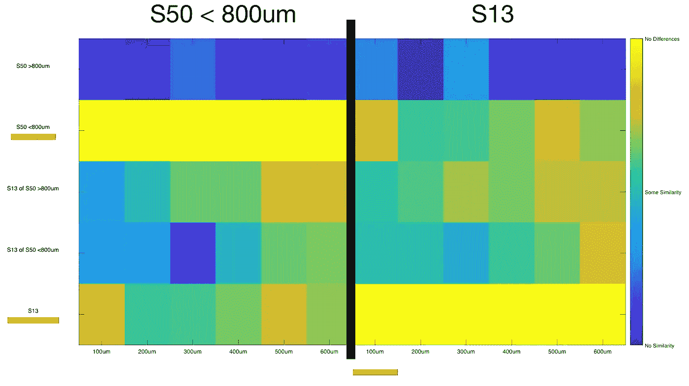

I really enjoy applying pattern recognition to coffee because I think we’re in the infancy of the application of data and imaging techniques to coffee.

LBP and K-means are the more basic types of functions, and maybe something more complex like PCA or LDA would do a better job. I hope one day, these techniques can help with dialing in beans and distinguishing with more granularity, the quality of coffee grinders.

If you like, follow me on [Twitter](https://mobile.twitter.com/espressofun?source=post_page---------------------------) 和 [YouTube](https://m.youtube.com/channel/UClgcmAtBMTmVVGANjtntXTw?source=post_page---------------------------) ，我在那里发布不同机器上的浓缩咖啡照片和浓缩咖啡相关的视频。你也可以在 [LinkedIn](https://www.linkedin.com/in/robert-mckeon-aloe-01581595?source=post_page---------------------------) 上找到我。也可以在[中](https://towardsdatascience.com/@rmckeon/follow)关注我，在[订阅](https://rmckeon.medium.com/subscribe)。

# [我的进一步阅读](https://rmckeon.medium.com/story-collection-splash-page-e15025710347):

[浓缩咖啡系列文章](https://rmckeon.medium.com/a-collection-of-espresso-articles-de8a3abf9917?postPublishedType=repub)

[工作和学校故事集](https://rmckeon.medium.com/a-collection-of-work-and-school-stories-6b7ca5a58318?source=your_stories_page-------------------------------------)

[个人故事和关注点](https://rmckeon.medium.com/personal-stories-and-concerns-51bd8b3e63e6?source=your_stories_page-------------------------------------)

[乐高故事首页](https://rmckeon.medium.com/lego-story-splash-page-b91ba4f56bc7?source=your_stories_page-------------------------------------)

[摄影飞溅页面](https://rmckeon.medium.com/photography-splash-page-fe93297abc06?source=your_stories_page-------------------------------------)

[使用图像处理测量咖啡研磨颗粒分布](https://link.medium.com/9Az9gAfWXdb)

[改进浓缩咖啡](https://rmckeon.medium.com/improving-espresso-splash-page-576c70e64d0d?source=your_stories_page-------------------------------------)

[断奏生活方式概述](https://rmckeon.medium.com/a-summary-of-the-staccato-lifestyle-dd1dc6d4b861?source=your_stories_page-------------------------------------)

[测量咖啡磨粒分布](https://rmckeon.medium.com/measuring-coffee-grind-distribution-d37a39ffc215?source=your_stories_page-------------------------------------)

[咖啡萃取](https://rmckeon.medium.com/coffee-extraction-splash-page-3e568df003ac?source=your_stories_page-------------------------------------)

[咖啡烘焙](https://rmckeon.medium.com/coffee-roasting-splash-page-780b0c3242ea?source=your_stories_page-------------------------------------)

[咖啡豆](https://rmckeon.medium.com/coffee-beans-splash-page-e52e1993274f?source=your_stories_page-------------------------------------)

[浓缩咖啡滤纸](https://rmckeon.medium.com/paper-filters-for-espresso-splash-page-f55fc553e98?source=your_stories_page-------------------------------------)

[浓缩咖啡篮及相关主题](https://rmckeon.medium.com/espresso-baskets-and-related-topics-splash-page-ff10f690a738?source=your_stories_page-------------------------------------)

[意式咖啡观点](https://rmckeon.medium.com/espresso-opinions-splash-page-5a89856d74da?source=your_stories_page-------------------------------------)

[透明 Portafilter 实验](https://rmckeon.medium.com/transparent-portafilter-experiments-splash-page-8fd3ae3a286d?source=your_stories_page-------------------------------------)

[杠杆机维修](https://rmckeon.medium.com/lever-machine-maintenance-splash-page-72c1e3102ff?source=your_stories_page-------------------------------------)

[咖啡评论和想法](https://rmckeon.medium.com/coffee-reviews-and-thoughts-splash-page-ca6840eb04f7?source=your_stories_page-------------------------------------)

[咖啡实验](https://rmckeon.medium.com/coffee-experiments-splash-page-671a77ba4d42?source=your_stories_page-------------------------------------)