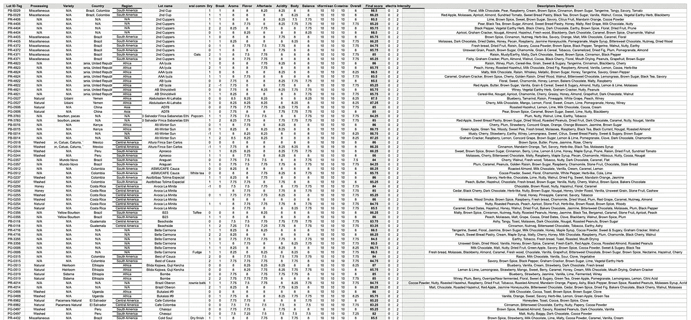
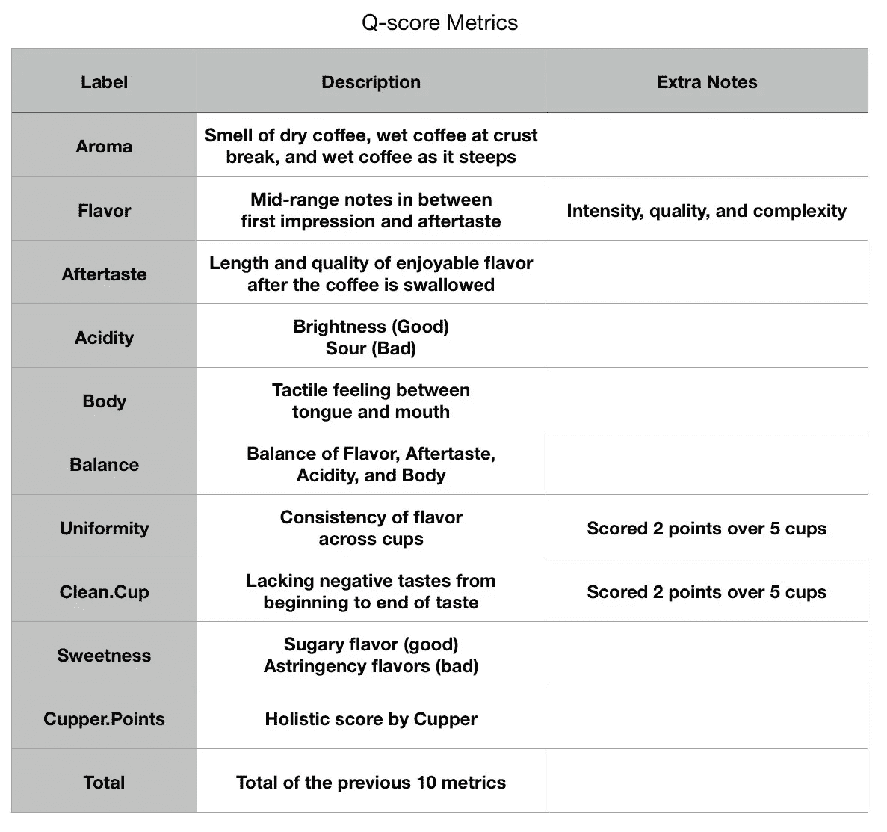
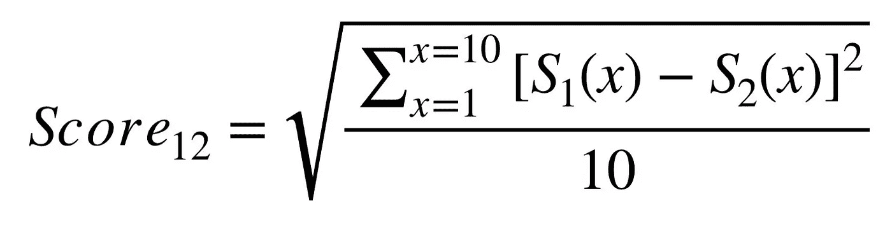
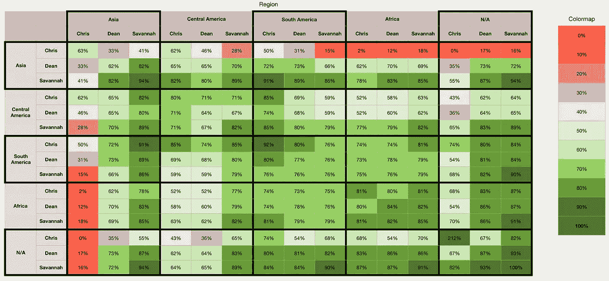
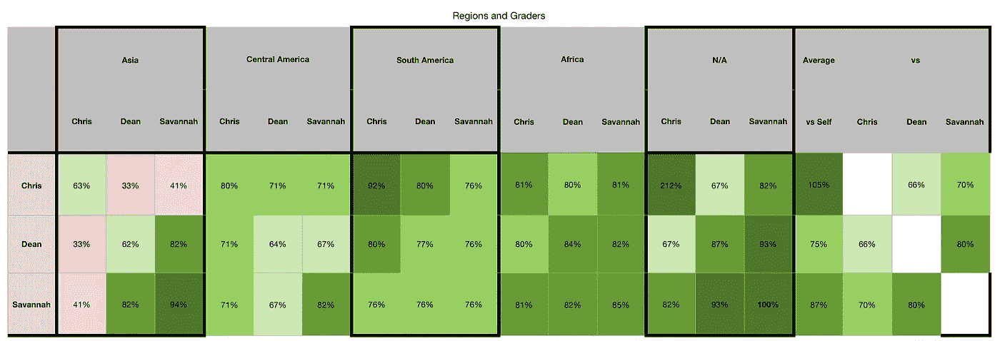
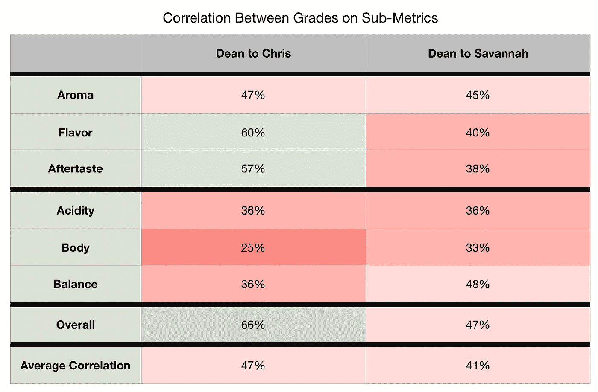
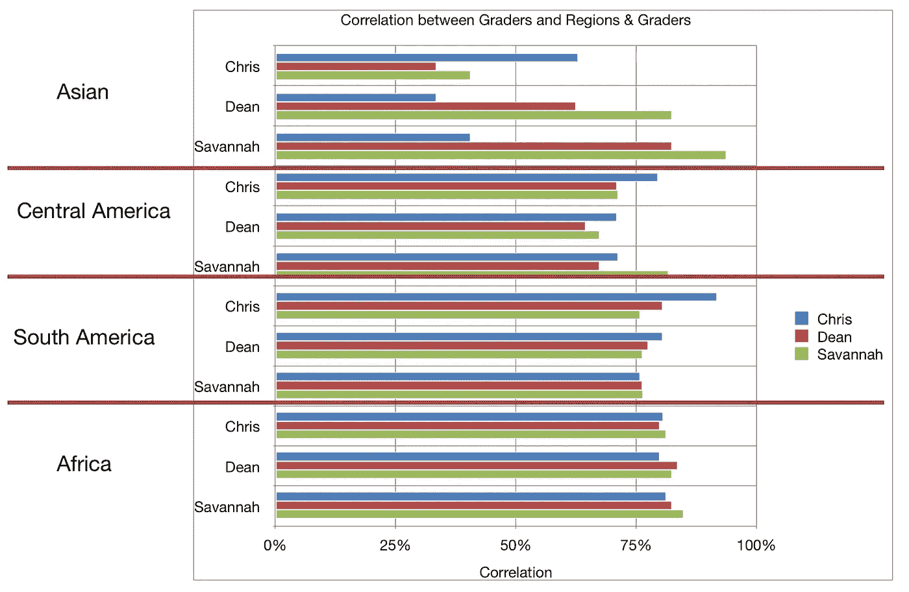
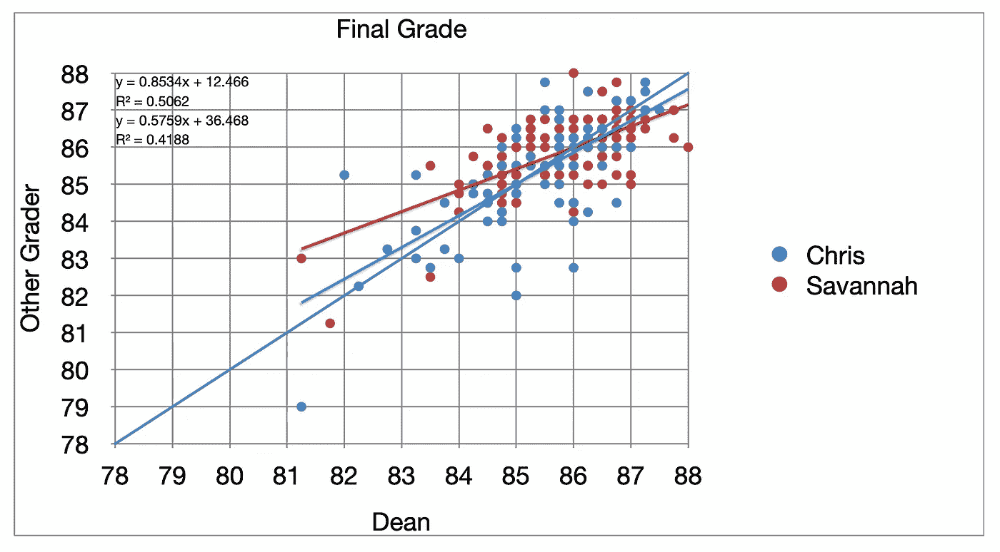
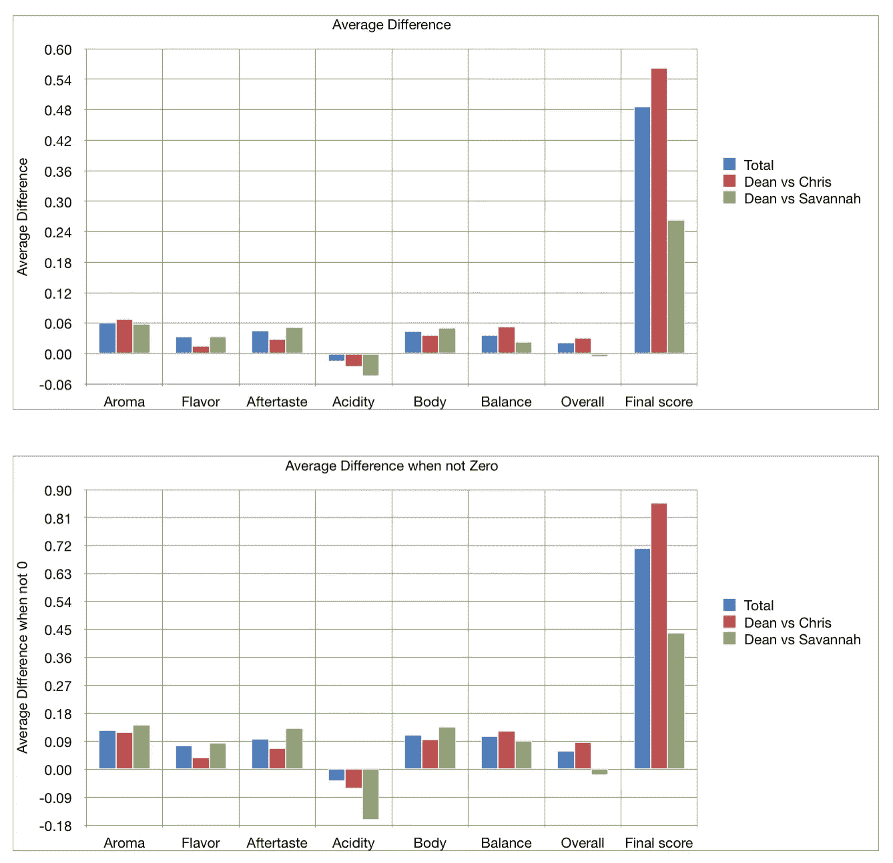
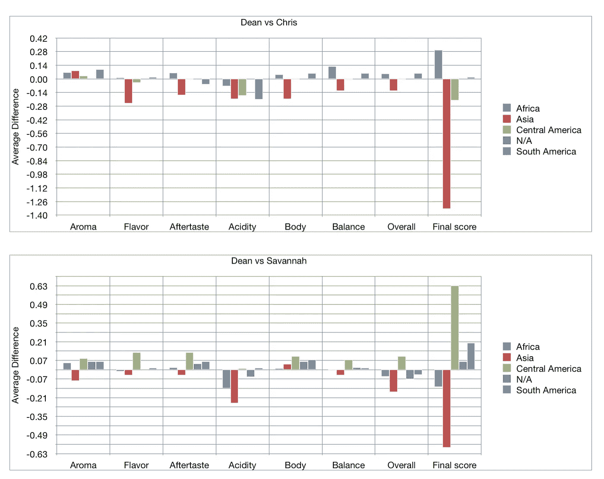

# 比较咖啡质量分级员

> 原文：<https://towardsdatascience.com/comparing-coffee-q-graders-79541b8fcf58?source=collection_archive---------46----------------------->

## 咖啡数据科学

## 希望了解如何衡量 Q 评分的客观性

几个月前，我联系了新兴城市咖啡烘焙商。他们分享了他们的 Q 分数数据，我想他们可能有更多的数据让我看。他们友好地与我分享了 200 多种咖啡的 400 多个 Q 分。最有趣的是每杯咖啡有两个等级。所以我做了一些分析，试图了解他们的分数之间的相关性。

我假设评分者在评分时不会分享太多关于他们分数的信息。在 Q 分级中，目的是让不同的分级员对不同的咖啡进行相同的分级。所以这是一个有趣的测试来了解这个结果有多真实。

# 新兴城市数据

他们使用 Cropster 来记录和存储关于烤肉和他们个人等级的信息。一半的咖啡由迪安和克里斯或者迪安和萨凡纳分级，但是只有一批咖啡由这三个人分级。有些咖啡有多个条目，但不是很多。

作者的所有图片

# q 分数

Q 分数是在咖啡杯过程中记录的 10 个因素的顶点。我从我对 [SCA 杯协议](https://sca.coffee/research/protocols-best-practices)的理解中总结了每个指标。他们定义了如何准备咖啡样品，如何品尝，以及如何评分。我相信网上有很多资源可以帮助你通过快速搜索了解如何拔火罐。

由于补丁中的缺陷豆，最终分数也可能会丢分，因为允许有多少缺陷是有标准的。

# 相似性度量

在模式识别中，特征向量用于比较两个项目，通常是两个信号或图像。计算向量之间的分数，以确定它们彼此之间有多相似或不相似。

为了计算两杯咖啡的相似性得分，使用均方根将每个子指标向量与所有其他向量进行比较:

然而，在下面的细目分类中，我将每个图表调整到 0%到 100%之间。100%不代表完全匹配，0%也不代表不匹配。它相对于每个图表中的数据，其中 100%是最大相似度(最相似)，0%是最小相似度(最不相似)。

我们可以查看各个地区的得分差异。对克里斯来说，他在亚洲咖啡上的分数和其他人的分数相关性最小。否则，他们的大部分分数彼此具有高度的相似性，这表明 Q-分级训练做得很好并且是客观的，或者这表明通过他们一起给咖啡分级，他们已经将他们的分数调整为彼此同步。

我们可以把重点放在同一个地区的咖啡和分类上。萨凡纳和迪恩除了在南美豆上有最大的共同点，但除此之外，萨凡纳与迪恩的匹配度比克里斯与迪恩或萨凡纳的匹配度更高。

# 相互关系

[相关性](https://en.wikipedia.org/wiki/Correlation_coefficient)是衡量两个变量彼此相似程度的指标。高相关性并不意味着一个变量会引起另一个变量，而是当情况发生变化时，两个变量的涨跌幅度相同。我从一开始就假设一些分级变量会有很高的相关性，因为它们是从不同的时间点来看味道的。

就相关性而言，两者略有不同。

地区和评分者之间的相关性有一些奇怪的结果。理论上，你应该与自己最相关，但在这里似乎并不总是如此。然而，我认为相关性的微小变化在统计学上是显著的。

# 原始差异

我们可以查看原始差异，并将克里斯和萨凡纳与迪安的分数进行比较，因为迪安对几乎所有的咖啡进行了评级。

查看数据的另一种方式是所有子指标的平均差异，以查看原始数字中的差异。有两种方法可以查看:平均值和仅包含差异不为零的样本的平均值。

我们可以将这些分为地区差异，这是查看分数的另一种有趣方式。

Dean vs Chris 没有不适用的数据

这两个指标最终都告诉我们，两者之间没有太大的区别。

这是一个独特的数据集，因为对于多个评分者来说，相同的品尝会议的数据集并不多。事实上，我怀疑这是有史以来最大的数据集，只是因为 coffee 中使用的数据太新了。好消息是，即使子指标之间的差异加起来在最终得分上有一些差异，但这种差异并不是很大。任何子矩阵的差异也不存在。

这给了我们两个事情中的一个很高的信心:所有这三个 Q 级评分者都受过良好的训练来客观地评分，或者他们的得分通过生活在相似的地区、喝相似的咖啡和一起评分而标准化。我希望这有助于鼓励其他分级者分享他们的数据，以帮助研究 Q 分级作为咖啡客观衡量标准的有效性。

如果你愿意，可以在 Twitter 和 YouTube 上关注我，我会在那里发布不同机器上的浓缩咖啡视频和浓缩咖啡相关的东西。你也可以在 [LinkedIn](https://www.linkedin.com/in/robert-mckeon-aloe-01581595?source=post_page---------------------------) 上找到我。也可以关注我[中](https://towardsdatascience.com/@rmckeon/follow)。

# [我的进一步阅读](https://rmckeon.medium.com/story-collection-splash-page-e15025710347):

[浓缩咖啡系列文章](https://rmckeon.medium.com/a-collection-of-espresso-articles-de8a3abf9917?postPublishedType=repub)

[工作和学校故事集](https://rmckeon.medium.com/a-collection-of-work-and-school-stories-6b7ca5a58318?source=your_stories_page-------------------------------------)

[个人故事和关注点](https://rmckeon.medium.com/personal-stories-and-concerns-51bd8b3e63e6?source=your_stories_page-------------------------------------)

[乐高故事启动页面](https://rmckeon.medium.com/lego-story-splash-page-b91ba4f56bc7?source=your_stories_page-------------------------------------)

[摄影启动页面](https://rmckeon.medium.com/photography-splash-page-fe93297abc06?source=your_stories_page-------------------------------------)

家庭烘焙咖啡的经济学

[咖啡的成本:咖啡馆 vs 家庭](https://medium.com/overthinking-life/the-cost-of-coffee-cafe-vs-home-ba13b6a75c1e?source=your_stories_page-------------------------------------)

[咖啡分级 Q 分数的有用性](/grading-the-usefulness-of-q-scores-for-coffee-grading-8ff2e8439572?source=your_stories_page-------------------------------------)

[比较 Q 级咖啡:地区、年份和加工](/comparing-q-grades-of-coffees-regions-years-and-processing-84f3c676f093?source=your_stories_page-------------------------------------)

[按地区、工艺、等级和价格分类的咖啡](/coffees-by-region-process-grade-and-price-7e17c3c44baf?source=your_stories_page-------------------------------------)

[特色咖啡:比较分级方法](/specialty-coffee-comparing-grading-methods-36777cae220f?source=your_stories_page-------------------------------------)

[咖啡数据回顾:等级和口味](/a-review-of-coffee-data-grades-and-flavors-5ccb6fc51941?source=your_stories_page-------------------------------------)

[使用模式识别比较咖啡](/comparing-coffee-using-pattern-recognition-35b92cca4502?source=your_stories_page-------------------------------------)

[如何评价 Sweet Maria 的咖啡杯度量标准，以便更好地进行比较](/analyzing-sweet-marias-coffee-cupping-metrics-3be460884bb1?source=your_stories_page-------------------------------------)

[烘焙对咖啡豆硬度的影响](/the-effects-of-roasting-on-coffee-bean-hardness-e819a2f5dd0a?source=your_stories_page-------------------------------------)

[咖啡豆脱气](/coffee-bean-degassing-d747c8a9d4c9?source=your_stories_page-------------------------------------)

[收集爱好数据集:咖啡](/collecting-a-hobby-dataset-454e07a3f48e?source=your_stories_page-------------------------------------)