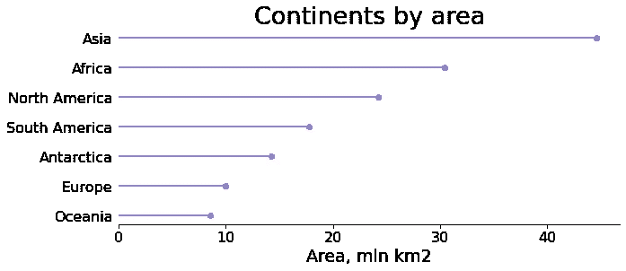
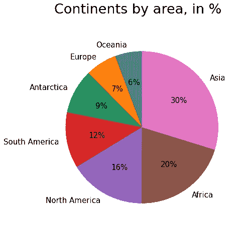
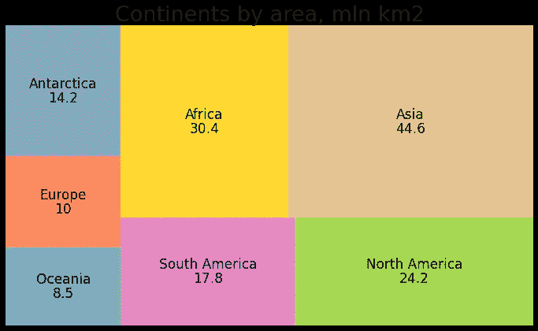
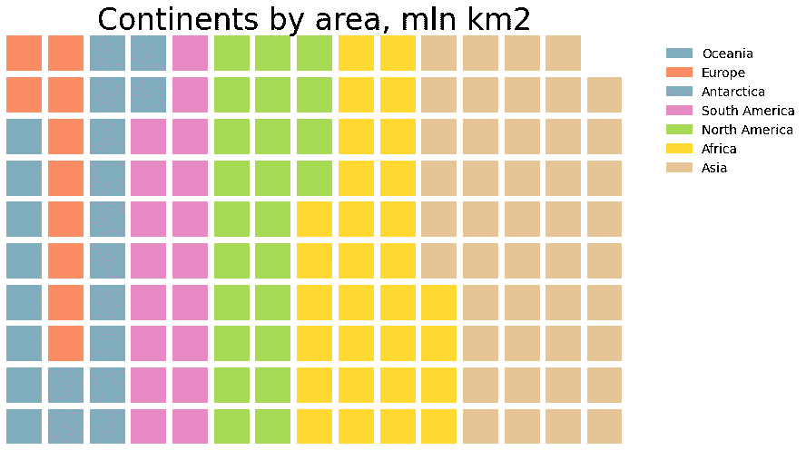
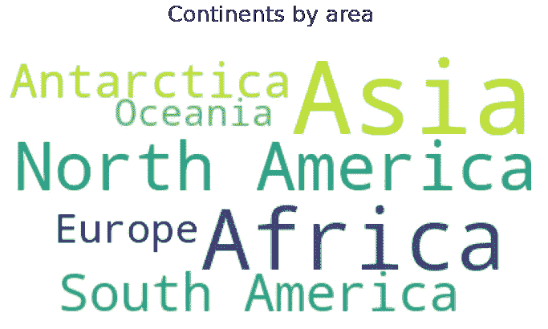

# 比较 Python 中显示分类数据的不同方式

> 原文：<https://towardsdatascience.com/comparing-different-ways-of-displaying-categorical-data-in-python-ed8fabfb6661?source=collection_archive---------9----------------------->

## 传统与不常见的方法以及何时使用它们


来自 [Unsplash](https://unsplash.com/photos/mIyZDPhuyY0)

虽然表示分类数据的最流行的方式是使用条形图，但还有一些其他的可视化类型适合于此目的。它们都有各自的优点和缺点，以及适用性的限制。

在本文中，我们将比较显示相同数据的图表:按区域划分的大陆。数据从维基百科[获得，用 mln km2 表示，以避免不必要的精确。](https://en.wikipedia.org/wiki/Continent)

```
import pandas as pd
dct = {'Oceania': 8.5, 'Europe': 10, 'Antarctica': 14.2, 'South America': 17.8, 
       'North America': 24.2, 'Africa': 30.4, 'Asia': 44.6}
continents = list(dct.keys())
populations = list(dct.values())
```

# 1.条形图

让我们从显示分类数据的最经典的方式开始:一个甚至不需要介绍的条形图。

```
import matplotlib.pyplot as plt
import seaborn as sns
plt.figure(figsize=(10,4))
plt.barh(continents, populations, color='slateblue')
plt.title('Continents by area', fontsize=27)
plt.xlabel('Area, mln km2', fontsize=19)
plt.xticks(fontsize=16)
plt.yticks(fontsize=16)
plt.tick_params(left=False)
sns.despine(left=True)
plt.show()
```


作者图片

从上面的图表中，我们可以清楚地看到各大洲在数量和质量上的等级划分。难怪:酒吧地块几乎没有任何缺点。它们是多用途的、高度可定制的、视觉上引人注目的、易于解释的、广泛受众熟悉的，并且可以用任何 dataviz 库来创建。在生成它们时，我们唯一要记住的是[遵循良好的实践](/bar-plots-best-practices-and-issues-30f1ad32c68f?sk=817f1fefe808556aa2ae266df2b981ed):数据排序、选择合适的颜色、条方向、添加注释、标签、整理等。

# 2.茎图

stem 图非常类似于条形图，甚至比后者更有优势，因为它的特点是最大化的数据-墨水比率，看起来不那么杂乱。要创建 stem 图，我们只需要 matplotlib 库。对于水平茎图(具有*水平*基线和*垂直*茎的图)，我们可以将`vlines()`与`plot()`结合使用，或者直接使用`stem()`函数。在第一种情况下，`vlines()`创建词干，`plot()`创建结束点。对于垂直茎图(具有*垂直*基线和*水平*茎的图)，我们不能再使用`stem()`功能，而是使用`hlines()`和`plot()`的组合。

让我们为我们的数据创建一个垂直茎图:

```
plt.figure(figsize=(10,4))
plt.hlines(y=continents, xmin=0, xmax=populations, color='slateblue')
plt.plot(populations, continents, 'o', color='slateblue')
plt.title('Continents by area', fontsize=27)
plt.xlabel('Area, mln km2', fontsize=19)
plt.xticks(fontsize=16)
plt.yticks(fontsize=16)
plt.xlim(0, None)
plt.tick_params(left=False)
sns.despine(left=True)
plt.show()
```



作者图片

与第一个图表相比，我们只增加了一行代码，在水平茎图的情况下，如果直接使用`stem()`函数，甚至没有必要。结果图显示了相同的信息，但看起来比传统的条形图更清晰、更优雅。当有许多类别需要可视化或者它们的值具有可比性时，这就变得特别有价值。

# 3.圆形分格统计图表

饼图或其版本圆环图(具有空核心部分的饼图)是另一种众所周知的可视化类型，广泛用于显示整体中单个组件的比例。它可以用许多 dataviz 库创建和轻松定制。尽管如此受欢迎，它也是最受批评的情节类型之一。其主要原因是:

*   饼图是基于角度而不是长度，这使得它更难被清楚地解释。
*   在有许多类别或者它们的比例相似的情况下(这是创建柱状图的理想选择)，饼图实际上对于计算出比例的顺序或者甚至找到最大/最小值是没有用的。

让我们看看饼状图在我们的例子中是否适用:

```
plt.figure(figsize=(7,7))
plt.pie(populations, labels=continents, startangle=90, autopct='%1.0f%%', 
        textprops={'fontsize': 15})
plt.text(x=-1.15, y=1.5, s='Continents by area, in %', fontsize=27)
plt.show()
```



作者图片

由于我们的数据仅由 7 个类别组成，其值最初是有序的，并且彼此之间差异很大，还因为我们添加了每个大洲占总土地的百分比，所以生成的图表看起来信息量大，易于理解，并且不会遇到上述两个问题。

饼图相对于条形图和柱状图的一个不太明显的弱点是颜色丰富。另一种方法是[用图案](/how-to-fill-plots-with-patterns-in-matplotlib-58ad41ea8cf8?sk=a45931027d9ef15eb58439ed7d949384)填充楔形，但在这两种情况下，都会导致较低的数据-油墨比率。然而，这是所有“多彩”情节的典型问题，我们很快就会看到。

另一件值得强调的事情是，这种类型的图表比前两种图表的功能更有限。事实上，它只能用于可视化整个中组件的**比例，而对于条形和茎图，条形/茎不应构成整体。例如，我们可以按人口数量制作前 10 个国家的柱状图。为这些数据创建一个饼状图，在技术上是可能的，但会有一点错误，因为*真实的*整体，在这种情况下，包括更多的元素(所有其他国家)。**

# 4.树形图

要创建一个树形图，我们必须安装并导入 *squarify* 库(`pip install squarify`)。这种类型的图类似于饼图，因为它也显示整体中单个组件的比例。它不使用楔形，而是使用一组矩形，矩形的面积与相应类别的值成比例。这很重要，实际上也是一个优势:对区域的心理比较肯定比对角度的心理比较容易得多。此外，与饼图不同，当我们有很多类别要比较时，它仍然可以很好地工作。下面是树状图和饼状图共有的弱点和限制:

*   当类别的比例相似时，效果不好。
*   它没有轴，所以我们必须依赖于矩形的视觉比较，或者在每个矩形上添加值。
*   这意味着使用大量的颜色，这可能会使结果图看起来有点势不可挡。
*   树形图的组成部分应该构成整体。

此外，还有一个纯粹的树图特有的缺点:

*   定制这种可视化的方式相当有限，并且不总是用户友好的。例如，要调整标签文本属性(如字体颜色或大小)，我们不能直接传入相应的参数，而只能通过`text_kwargs`字典。另外，在矩形之间添加间隙的`pad`参数只能取值`True`或`False`，没有任何调整间隙宽度的可能性。

让我们来看看我们各大洲的树形图:

```
import squarify
import matplotlib
plt.figure(figsize=(12,7))
squarify.plot(sizes=populations, label=continents, value=populations,
              color=[matplotlib.cm.Set2(i) for i in range(7)],
              text_kwargs={'fontsize': 17})
plt.title('Continents by area, mln km2', fontsize=27)
plt.axis('off')
plt.show()
```



作者图片

我们的树形图看起来很吸引人，也很有洞察力，我们可以清楚地从最大到最小的各大洲跟踪矩形和值。同样，这部分是由于我们只有 7 个类别、各种各样的值和初始排序。或许，我们可以考虑用百分比而不是绝对值来表示这些值。

树形图唯一必要的参数是`sizes`，所有其他参数(包括`label`)都是可选的。

# 5.华夫饼图表

要创建华夫饼图表，我们需要一个基于 matplotlib 的 *PyWaffle* 库:`pip install pywaffle`，然后导入 PyWaffle 和 matplotlib。这种类型的图类似于饼图和树形图，因为它也说明了整体中单个组件的比例，其优点是它还显示了每个组件的单位数。根据上下文，“单位”可以指 1、10、100 等。每个类别的元素(实际上，对于我们的下一个可视化，我们将使用 100 万平方公里的单位)。每个子集(类别)由一个充满方块的华夫饼干图上的一个区域表示。与树形图一样，网格上每个类别的面积与其值成正比。

当我们有一组相对较小的离散数据，并且对其组成部分的内部结构感兴趣时，华夫格图效果最好。但是，记住这种类型的图表的局限性是很重要的。与华夫格图完全相关的缺点是，每个类别中的单位数量应该相当少。其他一些限制与已经提到的可视化类型是相同的:

**带有饼图和树形图:**

*   当类别的比例相似时，效果不好。
*   它没有轴，所以我们必须依赖区域的视觉比较，或者在每个区域上添加相应的注释。
*   它有同样的问题，不可避免的丰富的颜色。
*   华夫饼图表的组成部分应该构成整体。
*   对用作输入的数据进行排序是非常明智的。

**带饼状图:**

*   当有许多类别需要比较时，华夫格图就变得低效了。

**带树形图:**

*   华夫格图的定制方式并不总是简单易懂的。

让我们看看使用华夫饼图表对我们的数据来说是否是一个好主意:

```
from pywaffle import Waffle
fig = plt.figure(FigureClass=Waffle, figsize=(12,7), values=dct, columns=15, 
                 block_arranging_style='snake',
                 legend={'bbox_to_anchor': (1.3, 1), 'fontsize':14, 'frameon': False})
plt.title('Continents by area', fontsize=33)
plt.show()
```



作者图片

上图看起来完全定制化，并以正确的方式揭示了模式。然而，我们不得不承认，在这里，华夫格图并不是正确的选择:即使我们的类别很少，并且每个类别都由相对较少的单元组成，我们也不需要关于每个子集内部结构的如此详细的信息。还有，我们的“单位”看起来有点诡异:100 万 km2！😮我们甚至不能称之为离散值。因此，我们的数据不适合这种可视化。

华夫饼图的必要参数是`FigureClass`、`values`和`columns`(或`rows`)。

华夫格图的一个特殊变体是使用图标而不是方块的[象形图图](/2-efficient-ways-of-creating-fancy-pictogram-charts-in-python-8b77d361d500?sk=f910786412d9d3d5460e07d2702a16e0)。通常，这样的图标应该是简单但对每个类别都有意义的东西，例如，显示不同领域进展的星星符号。当我们希望以更有影响力和更吸引人的方式展示见解时，象形图可以更有效地显示分类数据。华夫格图和象形图在显示统计数据、评级、进度状态等方面都特别有用。

# 6.词云

最后，显示分类数据的最奇特且几乎出乎意料的方式是创建一个单词云。为此，我们需要 *wordcloud* 库(`pip install wordcloud`)。它的传统用法是[将文本数据](https://python.plainenglish.io/the-little-prince-on-a-word-cloud-8c912b9e587e?sk=1b332b0d273c96cd2b667eca482e3f0c)可视化，每个单词的大小表示它的频率，这样我们就可以辨别文本中最重要的单词。然而，词云还有一个鲜为人知的应用:将数据的某个属性值分配给每个类别，我们可以创建一个词云，不是基于词频，而是基于该属性(在我们的例子中，是每个大洲的区域)。此外，以这种方式使用词云，我们很容易避免许多与其相关的典型已知问题。事实上，与“正常”的单词云不同:

*   不需要预先准备数据、删除停用词等。
*   没有缺乏上下文的问题。
*   由于类别的数量通常相对较少，我们可以确保抑制任何垂直单词(将 1 赋给`prefer_horizontal`参数)以提高图形的可读性。另外，在这种情况下，我们肯定不需要使用面具。

与各种文字云相关的一些其他缺点仍然存在:

*   单词云不允许对单词进行直接清晰的排序。
*   单词云缺乏定量方法:不可能将字体大小转化为感兴趣的属性的精确值。而且，在这种情况下，我们甚至不能直接在图上把值相加。
*   有一种错觉，即较长的类别名称(尤其是多词的类别名称)，或带有上升符号(如 *k* 、 *b* 、 *l* )或下降符号(如 *j* 、 *q* 、 *g* )的类别名称看起来更大，因此比具有相同或可比值但没有这些特征的类别名称更重要。
*   如果我们对我们的词云使用连续的 matplotlib 颜色图(*岩浆*、*春天*等)。)，我们应该记住，每个类别的颜色将从其中随机选择，没有任何颜色的渐变性作为类别排名的潜在附加指标。

另一个缺点是饼状图、树形图和华夫饼干图共有的:当类别的比例相似时，单词云是无效的。然而，单词云在这些类型的可视化方面有一些优势:

*   丰富的颜色是一个可以解决的问题:可以分配一个颜色函数，甚至可以让所有的单词都是同一种颜色。
*   类别不必构成整体。
*   不需要事先对数据进行排序。
*   单词云对于显示更多类别仍然有用(与饼图和华夫饼图相比)。
*   词云是高度可定制的。

让我们为我们的大陆创建一个单词云，看看它的优点和缺点:

```
from wordcloud import WordCloud
plt.figure(figsize=(12,8))
wordcloud = WordCloud(background_color='white',
prefer_horizontal=1).generate_from_frequencies(dct)
plt.text(x=120, y=-25, s='Continents by area, mln km2', fontsize=27)
plt.imshow(wordcloud)
plt.axis('off')
plt.show()
```



作者图片

我们已经准备好一个词云不特别适合心理分类排名或定量分析。此外，我们看不到多少上行或下行。然而，这里真正分散注意力的是双词类别的存在:*北美*和*南美*。因此，我们可以得出结论，最好只在只有一个单词的类别中使用这种方法。

从技术上讲，虽然在我们的例子中，`WordCloud()`的所有参数都是可选的，但是使用传入字典或序列的`generate_from_frequencies()`是必不可少的。有趣的是，许多与“正常”词云相关的参数对于基于属性的词云变得无用，例如`collocations`、`stopwords`、`min_word_length`和`max_words`。

# 结论

在本文中，我们比较了显示分类数据的各种可视化类型。每一种都有其使用范围、优点和缺点。这些类型的图表中有些是经典和流行的(条形图)，有些非常具体，看起来几乎很怪异(单词云)。

在我们的例子中，为了根据陆地面积比较各大洲，最有效的可视化类型是条形图、柱状图、饼状图和树形图。另外两种类型，华夫饼图表和单词云，结果不太适合，这并不意味着它们对任何其他数据都是如此。选择一个合适的图表总是取决于一种情况，以及我们到底想用我们的发现展示什么。一个正确的，适当定制的可视化可以帮助我们与我们的观众分享宝贵的见解。

感谢阅读！

**你会发现这些文章也很有趣:**

[](https://medium.com/geekculture/creating-a-waterfall-chart-in-python-dc7bcddecb45) [## 用 Python 创建瀑布图

### 做这件事最简单的方法

medium.com](https://medium.com/geekculture/creating-a-waterfall-chart-in-python-dc7bcddecb45) [](https://medium.com/geekculture/creating-toyplots-in-python-49de0bb27ec1) [## 在 Python 🧸中创建玩具图

### 高质量的极简交互式可视化，非常适合电子出版

medium.com](https://medium.com/geekculture/creating-toyplots-in-python-49de0bb27ec1) [](https://levelup.gitconnected.com/python-can-be-lots-of-fun-999552d69d21) [## Python 可以带来很多乐趣

### Cowsay 和 Dinosay 库，用于在 Python 中以 ASCII 艺术形式创建“会说话”的动物

levelup.gitconnected.com](https://levelup.gitconnected.com/python-can-be-lots-of-fun-999552d69d21)