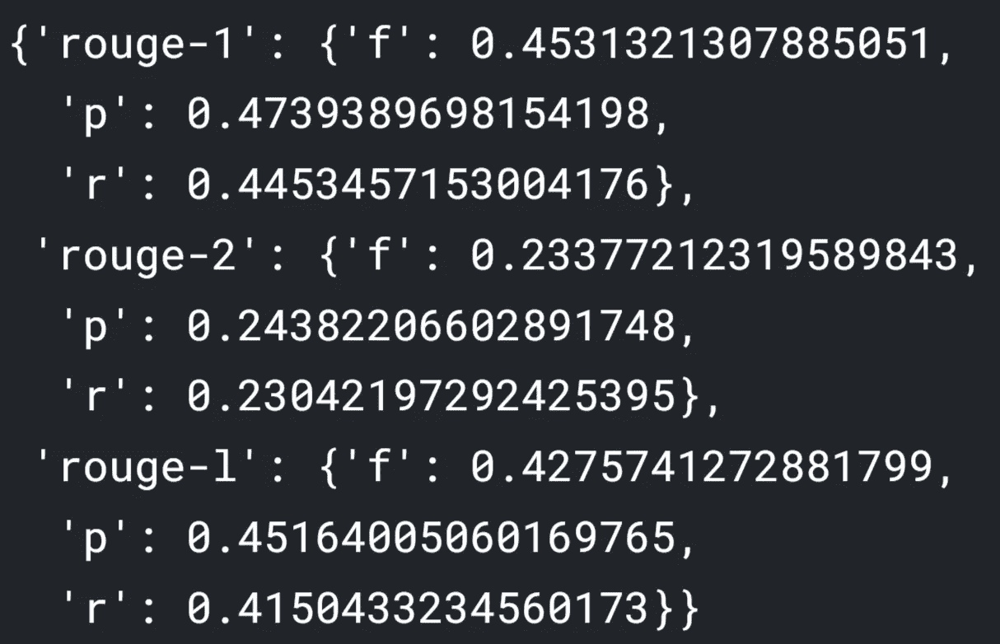

# 在低资源翻译(英语-约鲁巴语)中比较脸书的 M2M 和 mT5。

> 原文：<https://towardsdatascience.com/comparing-facebooks-m2m-to-mt5-in-low-resources-translation-english-yoruba-ef56624d2b75?source=collection_archive---------19----------------------->

Muhammadtaha Ibrahim Ma'aji 在 [Unsplash](https://unsplash.com?utm_source=medium&utm_medium=referral) 拍摄的照片

## 寻找使用稀有语言对微调翻译任务的最佳模式。

TLDR；M2M 的表现确实比 mT5 好。

# 灵感

两个月前，我开始致力于低资源语言的神经机器翻译(NMT)[津迪竞赛](https://zindi.africa/competitions/ai4d-yoruba-machine-translation-challenge)。挑战是使用一种罕见的语言对训练一个胭脂分数最高的 NMT 模型:约鲁巴语到英语。

约鲁巴语是尼日利亚南部约鲁巴族使用的一种语言。它是超过 4000 万人的母语，也是非洲最大城市拉各斯最常用的语言。由于西非的语言多样性，约鲁巴语被认为是方言的连续体，而不是一种标准语言。这对像我这样的 NLP 从业者来说是一个严重的问题。这让工作变得更加困难。

# **数据集**

更糟糕的是，几乎没有任何将英语映射到约鲁巴语的数据集。我所知道的最大的数据集是 JW300 数据集(40 万句)，它主要包含宗教文本。它肯定可以用来提高 ROUGE 评分，但如果它是训练的唯一参考，翻译将是倾斜的，只会产生圣经风格的句子。然而，在 Zindi 竞赛中，我们提供了一个非常小的数据集(10k 个句子)，我用它来从 JW300 的句子风格中去偏模型。

在我最初的解决方案中，我使用了两个数据集来提高我的分数，但是在这里，为了简洁起见，我将只使用较小的数据集(10k)。你可以在[比赛页面](https://zindi.africa/competitions/ai4d-yoruba-machine-translation-challenge)找到数据集。你需要注册才能下载。

正如已经提到的，解决这个问题的资源是稀缺的，并且基于变压器的模型在数据不足的情况下表现不好。为此，我将利用迁移学习来加快学习过程。

可用于微调的条件文本生成(CTG)多语言模型不如基于编码器的模型常见。然而，经过广泛的搜索，我只剩下两个同样有趣的候选人。

# mT5

mT5 车型[于 2020 年作为](https://arxiv.org/pdf/2010.11934.pdf) [T5](https://arxiv.org/pdf/1910.10683.pdf) 车型的多语言合法继承人推出。m 代表多语言。

mT5 和 T5 都以相似的方式训练。唯一的区别是 mT5 是在多语言数据上训练的，并且有更多的令牌嵌入(250k)。两者最初都在跨度破坏的目标上被训练:“用屏蔽记号替换输入记号的连续跨度*，并且模型被训练来重建屏蔽记号*”。

用于训练模型的数据集有 107 种语言的 6.3 万亿个标记。幸运的是，约鲁巴语是这些语言中的一种，因为它占整个数据集的 0.2%(5000 万个令牌，而我们的数据集只有 60 万个)。该模型有不同的尺寸:从 300 米参数(小)到 13B 参数(XXL)。就我们的目的而言，我们将选择较小的一个。

# M2M

M2M 也是和 mT5 (2020)同年[开源](https://about.fb.com/news/2020/10/first-multilingual-machine-translation-model/)。它们之间的主要区别是 [M2M 模型](https://arxiv.org/pdf/2010.11125.pdf)仅在翻译任务上接受训练，在两个方向上使用来自 100 种语言的句子对。这意味着，与其他翻译模型不同，M2M 不是以英语为中心的翻译模型，翻译可以从多个方向流动，从而为低资源对带来更好的性能。

M2M 接受训练的数据集包含 2200 个不同方向的 75 亿个句子对。约鲁巴语是这 100 种语言中的一种。M2M 有 418M 参数配置，最高可达 14B 参数。我们将使用 418 米的。

# **环境**

由于训练如此巨大的模型的硬件要求，我无法在本地训练它们——相反，我使用了 Kaggle 笔记本中提供的免费 P100 GPU。

首先，我们安装所需的库:

**Fairseq 库:** Fairseq 是一个面向序列模型的脸书库。这自然需要神经机器翻译、语音识别模型和条件文本生成等技术的支持。许多最先进的 NLP 模型都是使用 fairseq 生成的，因为它为许多重复性任务提供了灵活性和抽象性(此处提供了示例)。然而，尽管 fairseq 在研究中无处不在，但对于学术界以外的人来说，它仍然很难理解。对于那些想在项目中使用最先进模型的人来说，这是不幸的。

变形金刚和简单变形金刚:Huggingface transformers 是迄今为止最流行的 NLP 库。在分类、文本生成和摘要等任务上，只需要很少甚至不需要任何努力就可以微调最先进的基于 transformer 的模型。Simpletransformers 只是建立在它之上的一个小库，用来加速原型和测试。

# 正在准备数据集

这里的数据集预处理很少，源文本和目标文本都是小写的，并且删除了尾随空格。验证由数据集的 5%组成(500 个句子)。

# 培训 mT5 模型

当微调 T5 / mT5 模型时，Simpletransformers 使我们的生活简单多了，因为它们[完全支持这两种](https://simpletransformers.ai/docs/t5-model/)。我们只需要设置所需的超参数、模型名称和数据。

该库要求数据集为 Pandas dataframe 格式，有三列: *input_text* 、 *target_text* 和*前缀。前缀*是在 mT5 的训练过程中使用的列，用于指定模型应该做的任务(总结、分类…)。我们的案例不需要它，我们创建了它并将其留空。

列车损失(蓝色)与有效损失(橙色)WANDB

# 训练 M2M 模型

Fairseq 库更面向 CLI，而不是 pythonic。要微调 M2M 模型，我们需要:

*   首先下载 418M 参数模型，以及记号赋予器和词汇文件。
*   将训练和验证句子对导出到文本文件。
*   使用 fairseq/scripts/spm_encode.py 下的脚本标记句子
*   将句子二进制化，以加快数据加载和训练。
*   微调模型！

列车损失(蓝色)与有效损失(橙色)WANDB

为了公平的比较，我试图保持相似的超参数。两个模型都使用了自适应因子优化器、余弦调度器，并且被训练了十个时期。M2M 的学习率较低，因为它的面积较大。

# 估价

为了评估测试集中产生的翻译，我使用了 [ROUGE](https://www.aclweb.org/anthology/W04-1013.pdf) 度量标准(**R**ecall-**O**oriented**U**ndersetry for**G**isting**E**evaluation)。ROUGE 有两个主要的变体:ROUGE-n 用于计算 ngrams 共现的召回率，ROUGE-L 用于测量最长的公共子序列。

在这种情况下，我将使用 ROUGE-2(使用二元模型)，并将 f1 分数作为参考(我也将显示其他指标)。

为了计算 ROUGE 得分，我使用了 [ROUGE](https://pypi.org/project/rouge/) 库，它抽象出了实现:

对于解码器文本生成，我在两个模型中使用了以下超参数:

*   最大长度:100
*   长度惩罚:2.5
*   留级惩罚:1.5 分
*   光束尺寸:5

**mT5 推断:**

使用 mT5 的推断很简单:

使用胭脂库时，get_scores 返回一个包含不同胭脂分数的字典:["胭脂-1 "，"胭脂-2 "，"胭脂-L"]。正如我们之前所说的，我们将使用 ROUGE-2 来评估模型的性能，即 f1 分数(因此它更能代表模型的整体性能)。

T5 —胭脂分数

正如我们所见，T5 在 rouge-2 f1 得分上给出了 11(标准化)rouge 得分。我们将为 M2M 模型计算相同的分数。

**M2M 推断:**

用 M2M 生成翻译有点复杂。首先，我们必须重复相同的预处理步骤来训练验证文本，然后使用这个命令行“fairseq-generate”来生成表格格式的翻译。最后，我们使用 *grep* 和 *cut* 的组合从输出生成的文件中提取翻译后的文本( [grep](https://www.geeksforgeeks.org/grep-command-in-unixlinux/) ， [cut](https://www.geeksforgeeks.org/cut-command-linux-examples/) )。

请注意，为了使这个脚本能够工作，它必须运行在培训模型的同一个目录中。

M2M-胭脂分数

M2M 模型的 rouge-2 得分为 23，rouge-1 得分为 45。

# 比较

M2M 的表现明显优于 mT5 车型，其 rouge 得分(所有车型)是 mT5 的两倍多。这让我感到惊讶:当看损失演变图时，似乎 mT5 收敛得更好，损失最小，M2M 的表现会更差。显然，我错了。

请注意，在数据集非常小(10k)的情况下，这种性能对于两种模型来说都令人印象深刻。如果没有迁移学习的帮助，这样的成绩是不可能达到的。

以下是一些例句:

**约鲁巴语**:lẹ在ẹlẹ́rìí耶霍法？
**目标**:你什么时候成为耶和华见证人的一员？

M2M:你什么时候成为耶和华见证人的一员？
**mT5** :耶和华的话是什么意思？

— — — -

约鲁巴语:拉ẹ语:lè bá a sọ̀rọ̀语:不，你不能

M2M:抱歉，你不能告诉我

— — — -

**约鲁巴语**:莫 mọ̀èyíkín tóníkíofẹ́米
**目标**:在我告诉你嫁给我之前我就知道了

**M2M** :我知道在我不得不嫁给我之前
**mT5** :我知道这就是我想见你的原因

— — — -

约鲁巴语:àwọnìfẹsẹ̀wọnsẹ̀·蒂伊奥·马阿·瓦耶尼·尼·迪耶·orílẹ̀-èdè尼日尼日尼日尼日尼日尼日尼日尼日尼日尼日尼日尼日尼日尼日尼日尼日尼日尼日尼日尼日尼日尼日尼日尼日尼日尼日尼日尼日尼日尼日尼日尼日尼日尼日尼日尼日尼日尼日尼日尼日尼日尼日尼日尼日尼日尼日尼日尼日尼日尼日尼日尼日的比赛如下:

**M2M** :以下是今天将在尼日利亚 npfl 进行的比赛:
**mT5** :以下是尼日利亚足球联赛(npfl)的比赛结果:

# 结论

尽管 M2M 的表现优于 mT5，但后者更灵活，因为它接受了多种任务的训练。此外，使用 mT5 更容易，因为它可在 [huggingface hub](https://huggingface.co/google/mt5-small) 上获得。

我们取得的进步真的令人惊讶:我们如何从 10k 句子对数据集中获得像样的翻译。几年前，我们只能梦想。

这个项目在 Github 和 colab 上都有(请从[这里](https://zindi.africa/competitions/ai4d-yoruba-machine-translation-challenge)下载数据集)。发现有用就启动回购。联系我:boukil98@gmail.com

<https://github.com/maroxtn/mt5-M2M-comparison>  <https://colab.research.google.com/drive/1_1QbvXQllO1rL88shNvcOFz8H590ktax?usp=sharing> [## Fairseq 培训和评估

colab.research.google.com](https://colab.research.google.com/drive/1_1QbvXQllO1rL88shNvcOFz8H590ktax?usp=sharing) <https://colab.research.google.com/drive/1ZOhDhl1d1khVwCY5hzXwezx6ETGi2P2f?usp=sharing> 