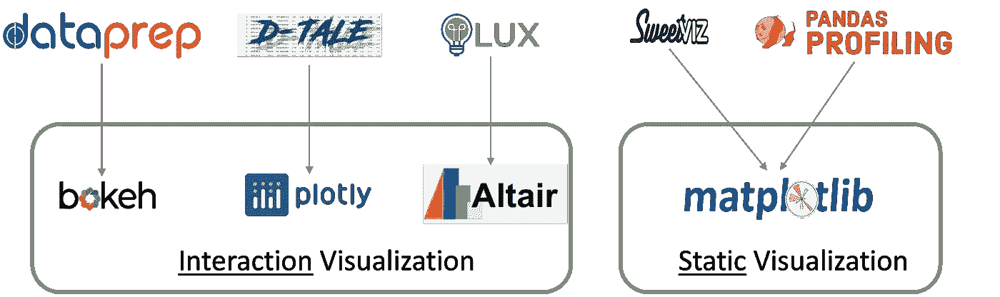
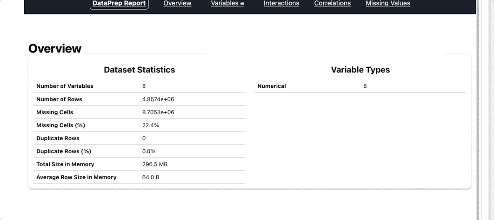
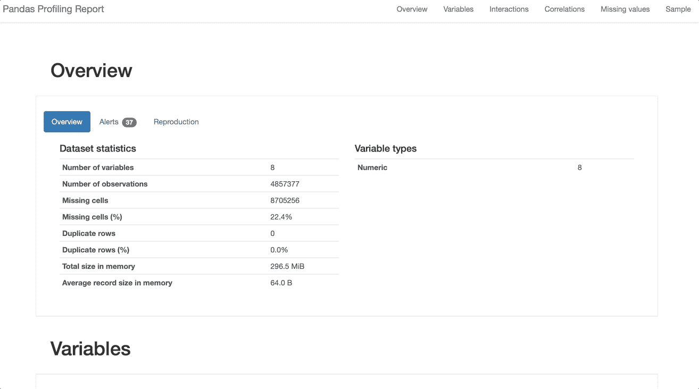
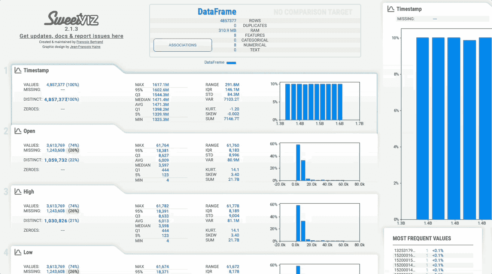
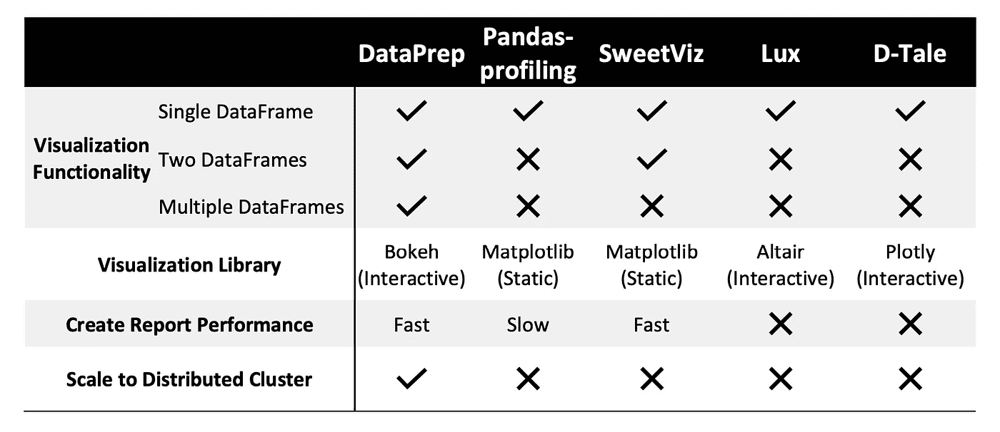

# 比较五种最流行的 EDA 工具

> 原文：<https://towardsdatascience.com/comparing-five-most-popular-eda-tools-dccdef05aa4c?source=collection_archive---------14----------------------->

## *为您的 EDA 任务做出明智的选择*


由[活动创作者](https://www.campaigncreators.com)在 [Unsplash](https://unsplash.com/?utm_source=medium&utm_medium=referral) 上拍摄的照片

探索性数据分析(EDA)是任何数据科学项目不可或缺的一部分。更简单地说，它可以被称为理解数据集所必需的“侦查工作”。这些初步调查导致发现不明显的趋势和异常，从而借助全面的可视化和详细的统计数据增强对手头数据的理解。数据科学家主要使用 EDA 来形式化各种测试假设和数据工程的后续步骤，以准备数据集供其使用。

由于 EDA 是任何数据科学项目的基础，数据科学家需要根据他们的需求为 EDA 工具做出明智的选择。Python 提供了各种 EDA 工具和库来扩充现有的数据框架。虽然这些工具共享相似的功能，但每个工具都有独特的方面，使它们以不同的方式脱颖而出。我们将回顾五款最流行的 Python EDA 工具: [**DataPrep**](https://dataprep.ai) **，**[**Pandas-profiling**](https://pandas-profiling.github.io/pandas-profiling/docs/master/rtd/)**，**[**sweet viz**](https://pypi.org/project/sweetviz/)**，**[**Lux**](https://lux-api.readthedocs.io/en/latest/)**，**和**[**D-Tale**](https://github.com/man-group/dtale)我们将重点关注这些库的独特特性和功能，以帮助数据科学家为他们的 EDA 任务选择合适的工具。**

****

**图书馆中的可视化比较(图片由作者提供)**

# ****可视化****

**GIF 由 [GIPHY](https://giphy.com) 上的 [gomoorae](https://giphy.com/gomoorae/) 制作**

**有效描绘数据集隐藏的复杂性的可解释的可视化是探索性分析最重要的方面。我们将比较和对比每种工具支持的可视化类型和质量。**

*****DataPrep*** 提供了广泛的可视化，用户可以在 DataPrep 的绘图功能中指定。一些最著名的可视化工具包括条形图、直方图、饼图、箱线图和地理图，以支持各种数字、分类和地理分布的表示。DataPrep 中的可视化使用散景，这使得它们是交互式的。DataPrep 可视化的另一个显著特性是与可视化一起显示的洞察力笔记。这些见解为分布提供了一个摘要，并消除了用户执行额外计算的需要。此外，DataPrep 允许用户轻松地格式化和定制默认可视化，以满足他们的设计需求。**

```
from dataprep.eda import plot, plot_correlation, create_report, plot_missingcreate_report(df)
```

****

**DataPrep 中的报告演练**

*****Pandas-profiling*** 生成一个清晰的报告，具有可视化效果，如直方图、饼图和条形图。它们为每个数据集属性提供了清晰的解释，但是这些基于 matplotlib 的可视化缺乏交互性。变量之间的相关性仅通过热图显示。缺失值组件提供缺失值的矩阵、计数、热图和树状图可视化。**

```
from pandas_profiling import ProfileReport
ProfileReport(df)
```

****

**熊猫档案中的报告演练**

*****SweetViz*** 为一个或两个数据集生成 HTML 报告，其中包含对特征的详细分析。它支持与 pandas-profiling 相似的可视化，但该系统主要用于可视化目标值和比较数据集。与 DataPrep 不同，SweetViz 仅提供两个数据帧之间的比较。结果以彩色编码显示在可视化效果上，为数据科学家创造清晰的对比。**

```
import sweetviz as sv
report = sv.analyze(df)
report.show_html()
```

****

**SweetViz 中的报告演练**

*****Lux*** 将自己标榜为一个 EDA 库，既简化又加速了数据探索。由于 Lux 简单的语法与 pandas 相结合，因此它可以被广泛的受众所接受。Lux 提供有限种类的可视化。数据分布用直方图显示，变量之间的相关性用散点图建模，分类变量的出现用条形图表示。Lux 可视化的一个独特方面是 Vis 和 VisList 对象，它们生成用户指定的可视化，包括条形图、直方图、散点图和折线图。**

*****D-Tale*** 提供图形界面给用户与数据框进行交互。这种设计布局对大多数初学者来说很直观，因为它的用户界面与 Microsoft Excel 很相似。该界面有下拉菜单，通过简单的点击可以选择不同的可视化效果。D-Tale 支持各种可视化，如折线图、条形图、饼图、热图、文字云、地图和 3D 散点图，以汇总更大的数据集。D-Tale 为缺失分析提供了与 pandas-profiling 相似的可视化:热图、树状图、矩阵和条形图。使 D-Tale 脱颖而出的一种独特的可视化类型是可视化有向图的网络分析器。**

# ****功能****

**了解每个 EDA 工具的独特功能将有助于数据科学家明智地缩小选择范围。我们上面讨论的每种工具都有显著的特征，根据任务规范，这些特征可能使它们成为比其他工具更好的选择。**

*****DataPrep*** 在幕后使用 Dask，并通过在分布式集群上扩展来提供更快的数据分析。这提高了系统通过加速计算处理更大数据集的能力。DataPrep 另一个突出的特性是多个数据帧之间的比较。plot_diff 函数可以采用具有两个以上数据框的列表参数，并并排绘制要素以便于比较。
DataPrep 是用户分析和比较两个以上数据帧的理想工具。总的来说，DataPrep 是处理大数据时最合适的选择，因为它具有多个数据帧的扩展功能和 Dask 实现以提高性能。**

*****Pandas-profiling***也因其处理大型数据集的能力而广受欢迎。该库支持配置以最小化为 EDA 报告生成的特征，从而仅突出显示用户所需的相关属性。Pandas-profiling 还通过其敏感特性解决了数据隐私问题，该特性只显示机密数据集中属性的聚合结果。
对于需要考虑数据隐私的小型数据集，Pandas-profiling 是一个不错的选择。Pandas-profiling 的性能不如像 DataPrep 这样基于 Pandas 实现的库。报告功能为数据集中的所有属性生成图，这增加了可视化参数和可定制性的复杂性。**

*****SweetViz*** 为用户显示 EDA 报告提供了更大的灵活性。除了在 web 浏览器中以 HTML 格式呈现报告之外，还可以使用与 Jupyter、Google Colab 和其他笔记本兼容的 IFRAME 格式。最新版本的 SweetViz 提供 Comet.ml 集成，可通过 API 自动将生成的报告记录到用户的工作区。
SweetViz 是寻求可视化目标值和比较两个数据集的用户的合适选择。与 DataPrep 不同，SweetViz 支持最多两个数据帧之间的比较。**

*****Lux*** 提供了导出静态可视化并将其集成到外部笔记本的便利。用户既可以直接下载他们的可视化，也可以将它们导出为代码。这使得编码为 vis 对象的可视化与 matplotlib、Altair 和 vega-lite 兼容，其中简单的函数可以为每个库输出相应的代码。**

*****D-Tale*** 基于其交互式 GUI 脱颖而出，这使得数据格式化比其他库更容易。用户还可以选择类似 Lux 的选项，为相应的可视化导出代码片段，这允许更大的灵活性来修改可视化。
由于使用了 plotly 库，D-Tale 是生成交互式可视化的理想选择。这使得 D-Tale 比那些用静态可视化来呈现结果的库更有优势。**

# ****结论****

****

**比较库功能(图片由作者提供)**

**对于像 EDA 这样重要的任务，使用正确的工具可能不是每个用户都会想到的。虽然所有的库都有许多共同的特性，但是这些特性中的不明显的差异区分出了赢家。根据我们对库特性的详细探索和数据实验，DataPrep 在性能和可视化方面表现突出。**

**与 SweetViz 和 pandas-profiling 不同，DaraPrep 生成的 EDA 报告具有交互式可视化功能，可为用户提供有关他们正在分析的数据集的更多见解。别忘了，DataPrep 基于 Dask 的实现以最短的报告生成时间给了它显著的优势。数据准备。由于其高度优化的基于 Dask 的计算模块[1]，EDA 比基于 Pandas 的分析工具快 10 倍。另一方面，pandas-profiling 和 Lux 可能是希望呆在 pandas 语法舒适区的用户的选择。这两个库都提供了额外的功能，只需对现有的数据帧进行简单的调用。为了进一步提高便利性，D-Tale 通过其交互式 GUI 消除了执行 EDA 任务所需的编码。每个用户可能重视 EDA 工具的不同特征，但是幸运的是，这五个 Python 库中的一个就足以提供用户所寻找的东西。**

# ****参考文献****

**[1]彭，吴伟源，布兰登洛克哈特，宋扁，景内森颜，徐，迟，Jeffrey M. Rzeszotarski，王建南: [DataPrep .EDA:以任务为中心的探索性数据分析，用于 Python 中的统计建模](https://arxiv.org/abs/2104.00841)。西格蒙德会议 2021:2271–2280**

**[2]安德烈什格。(2021 年 4 月 29 日)。*自动化 EDA 库比较*。卡格尔。检索于 2021 年 10 月 28 日，来自[https://www . ka ggle . com/andreshg/automatic-EDA-libraries-comparisson](https://www.kaggle.com/andreshg/automatic-eda-libraries-comparisson)**

**[3]t . b .(2021 年 10 月 19 日)。 *7 个很酷的 python 包，Kagglers 在不告诉你的情况下在用*。中等。检索于 2021 年 10 月 28 日，来自[https://towards data science . com/7-cool-python-packages-kagglers-is-use-without-tell-you-e 83298781 cf 4](/7-cool-python-packages-kagglers-are-using-without-telling-you-e83298781cf4.)**

**[4]洛克哈特，B. (2020 年 7 月 5 日)。*探索性数据分析:Data prep . EDA VS pandas-profiling*。中等。检索于 2021 年 10 月 28 日，来自[https://towards data science . com/explorative-data-analysis-data prep-EDA-vs-pandas-profiling-7137683 fe47f](/dataprep-clean-accelerate-your-data-cleaning-83406b4645bf)**