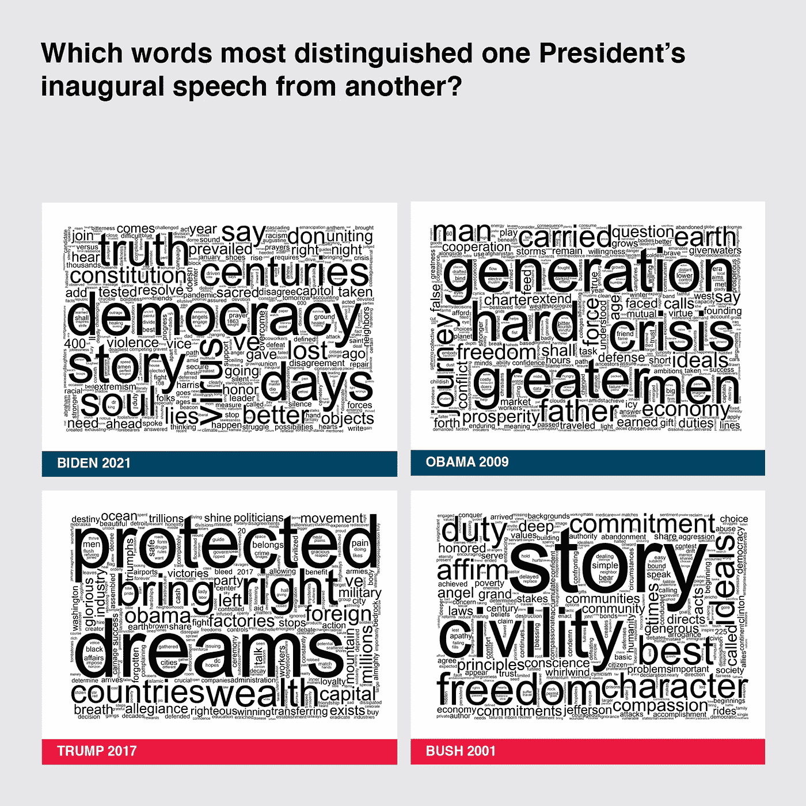
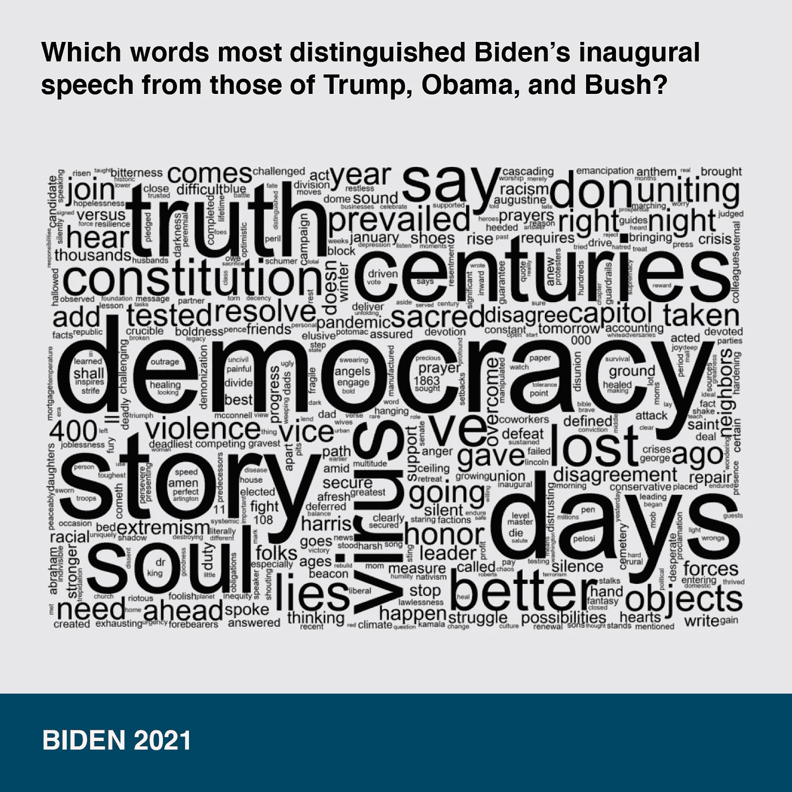
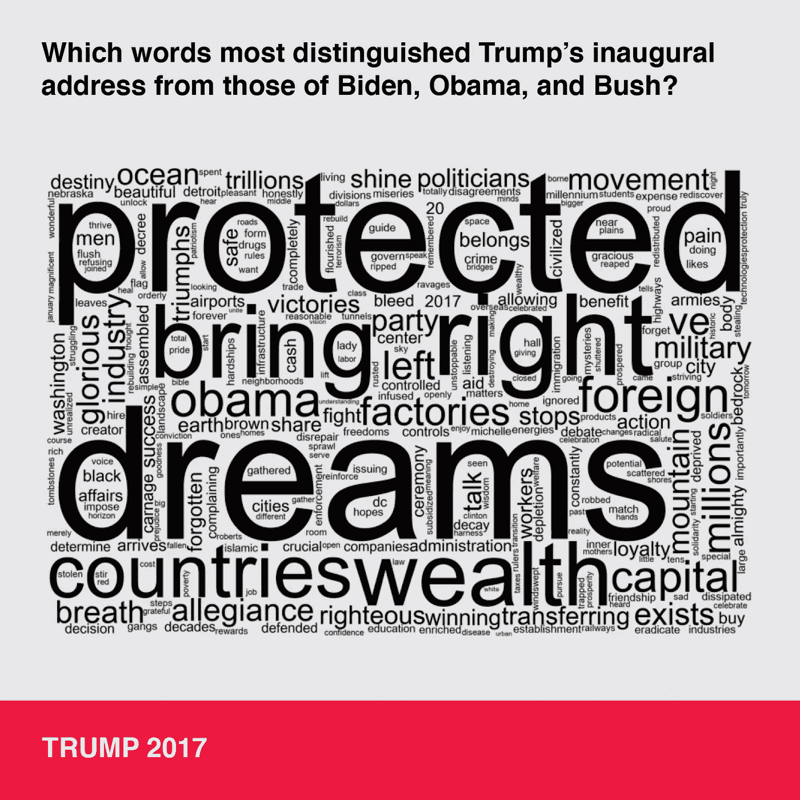
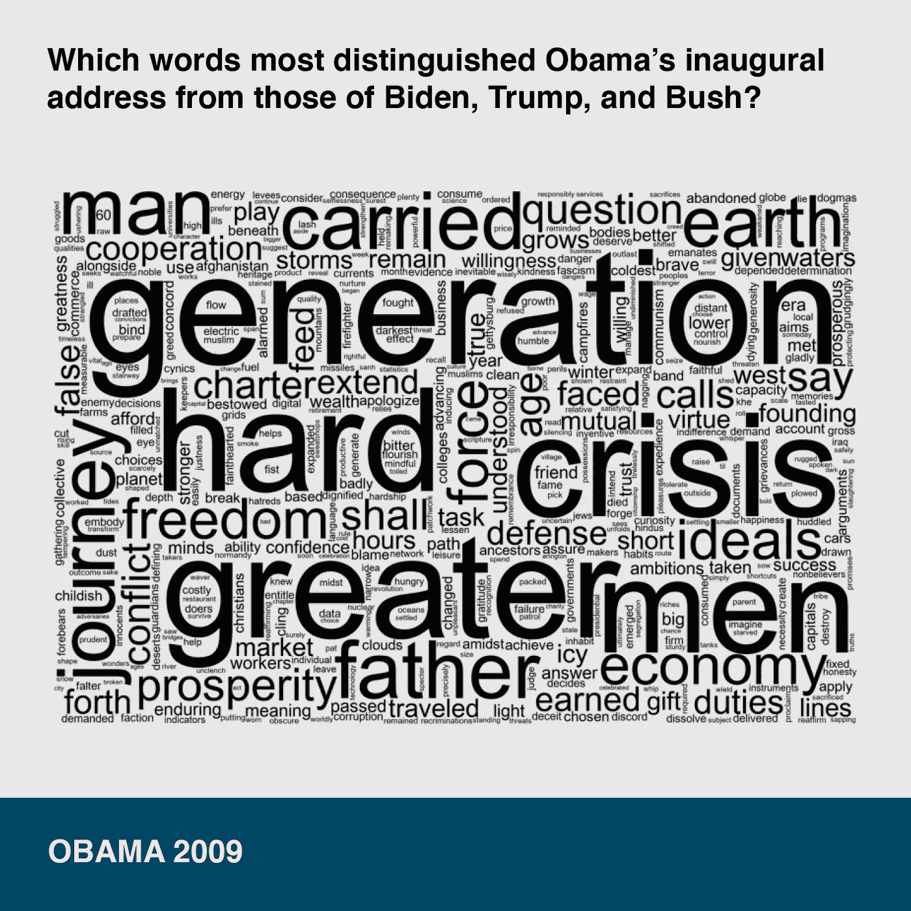
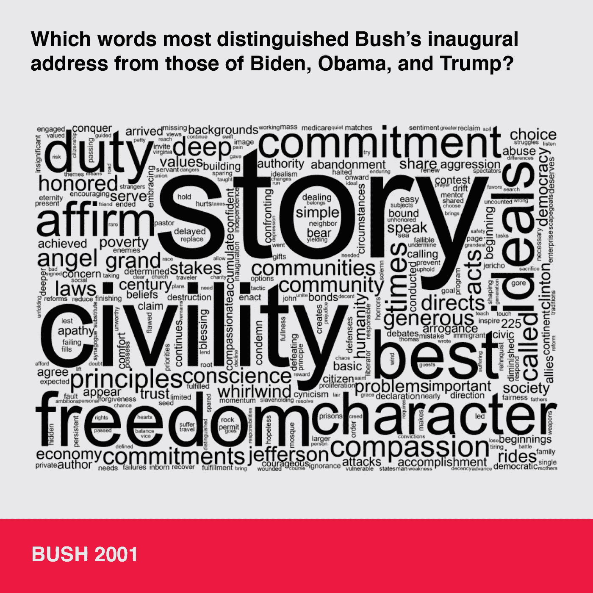

# 比较就职演说:民主之于梦想，正如拜登之于特朗普

> 原文：<https://towardsdatascience.com/comparing-inaugural-addresses-democracy-is-to-dreams-as-biden-is-to-trump-8a1aaeba5f9c?source=collection_archive---------58----------------------->

## 使用自然语言处理工具的比较内容分析。包括 Python 实现概述。


路易斯·贝拉斯克斯在 [Unsplash](https://unsplash.com?utm_source=medium&utm_medium=referral) 上的照片

# **动机**

直到拜登总统就职，我才可以松口气，花时间听奥巴马总统 700 多页的传记。引起我兴趣的一部分是他对就职演说的反思，这是一种庆祝胜利和变革希望的时刻，同时需要平衡经济危机将带来巨大痛苦这一令人清醒的事实。

我想知道我是否可以看看最近的总统就职演说，以了解总统们的具体个性，他们的支持者和政治派别，他们就职的时代，以及他们如何在演讲中平衡所有这些。我的问题是: ***是什么让最近的总统演讲与众不同？***



总统就职演说词云

拜登和奥巴马的语言侧重于席卷他们的危机，以及让他们能够克服的事情，而特朗普和布什则侧重于一些令人兴奋的概念，如梦想和故事。也许这是这些民主党人掌权的时代，但他们似乎更深入许多美国人每天面临的现实。共和党人似乎更专注于虚构的过去或想象的未来(我固有的偏见在这里闪耀…抱歉！).词云之所以伟大，是因为它们在几个层面上起作用——作为比较，当你真正一次专注于一个层面时，它们自己也能起作用。让我们开始吧！：

**拜登**



拜登总统的就职演说

深入挖掘拜登的讲话，很明显，他的目标是通过拥抱“民主”和“真理”，面对“病毒”——造成“400”k+人死亡的“病毒”，克服“谎言”，来团结人民。

**特朗普**



特朗普总统就职演说 TF-IDF Word Cloud 作者 Anupama Garla

看着特朗普的词汇云，我仍然对它对“梦想”、“受保护”、“权利”和“财富”的关注感到畏缩。有趣的一点是，他的语言似乎是分裂性的——反对的观点经常被提及，例如“奥巴马”、“左翼”、“外国”等。

奥巴马



奥巴马总统的就职演说

奥巴马将金融“危机”视为最大的挑战，但也是这一代人的机遇。我喜欢看到“地球”和“旅程”占据显著位置。我注意到的一件奇怪的事情是“men”和“man”的突出。

**布什**



布什总统的就职演说

布什专注于讲述一个“故事”，并使用通常相当积极和得体的概念，如果不是过度关注与军事使用相关的术语的话——“文明”、“自由”、“责任”、“荣誉”、“理想”、“原则”等。再次像特朗普一样，他的话似乎非常松散，指引我们走向文明的想象过去和自由给予者的未来。

# 方法学

从一个数据科学家的角度来看，我查看了每一次演讲中使用的实际词汇，并根据它们的频率和与最近其他总统相比的独特性进行了分析。我使用 TF-IDF 矢量化工具查看了每位总统的热门词汇，该工具根据每个词在每次演讲中的使用次数以及该词在所有演讲中的独特性对每个词进行加权。通过对所有演讲进行控制，我可以避免使用像“美国”这样的词，这样不会透露太多关于个人演讲的内容。然后我用 TF-IDF 向量制作了单词云。

# Python 实现

1.  导入/安装包
2.  就职演说的 TF-IDF 矢量化
3.  TF-IDF 矢量化上的词云
4.  **导入/安装包**

```
# Import pandas to use dataframesimport pandas as pd# Import TfidfVectorizer from the scikitlearn library to pre-process textfrom sklearn.feature_extraction.text import TfidfVectorizer# Import matplotlib and wordcloud to make wordcloud visualizations
import matplotlib as pltfrom wordcloud import WordCloud
```

如果你的环境中没有安装这些包，你可以在这里找到安装脚本:[熊猫](https://pandas.pydata.org/pandas-docs/stable/getting_started/install.html)， [Tfidf](https://scikit-learn.org/stable/install.html) ， [matplotlib](https://matplotlib.org/3.3.3/users/installing.html) ， [wordcloud](https://pypi.org/project/wordcloud/) 。

**2。TF-IDF 就职演说矢量化**

我将每位总统的演讲储存在一个字符串变量中，这是从 UCSB 的美国总统项目中复制来的。如果你想要更多 csv 格式的演讲，我相信它们也可以在 [kaggle 数据集](https://www.kaggle.com/adhok93/presidentialaddress)中找到。然后，我将语音字符串变量加载到一个列表中，安装 Tfidf 矢量器，转置输出以创建一个用 TFIDF 值填充的术语文档矩阵。

```
# Make a list of text from the last 4 President's inauguration speechescorpus = [document_bush_2001, document_obama_2009, document_trump_2017, document_biden_2021]# Instantiate your Tfidf Vectorizer. Here, we can play with stop words, ngrams, and min and  max df settings.vectorizer = TfidfVectorizer(stop_words='english', ngram_range = (1,1), max_df = .6, min_df = .01)# You can always add to stop words, but I find that min and max df takes care of this automatically.  Stop 
# words are common words you don't want to consider like 'the' or 'of'
# ngrams allows you to choose a range of word lengths - 1, 2, or more - I'm sticking with single words
# max-df ignores terms whose document frequency is greater than the selected threshold
# min-df ignores terms whose document frequency is less than the selected threshold# Apply TfidfVectorizer to speech texts. X is a sparse matrix which holds the location of all non-zero values.X = vectorizer.fit_transform(corpus)# Extract words aka 'feature names' from vectorizerfeature_names = vectorizer.get_feature_names()# Create a dense matrix to convert into a list, and finally a dataframedense = X.todense()
denselist = dense.tolist()
df = pd.DataFrame(denselist, columns=feature_names)# Reshape dataframe to be a term-document matrixdata = df.transpose()
data.columns = ['document_bush_2001', 'document_obama_2009', 'document_trump_2017', 'document_biden_2021'] 
```

**3。TF-IDF 矢量化上的字云**

虽然 wordcloud 函数可以基于词频对文本进行矢量化，并允许您简单地输入文本弹簧，但我更喜欢使用我自己的矢量化工具来更好地控制输出。然后，Wordcloud 允许你使用“generate _ from _ frequencies”命令从频率中创建一个 wordcloud。我调整了 wordcloud 功能的一些设置，使输出分辨率更高，白底黑字，arial 字体，并使用每次演讲的前 500 个单词。我遍历了演讲和文件名，将 png 保存到。

```
# change the value to blackdef black_color_func(word, font_size, position,orientation,random_state=None, **kwargs):
    return("hsl(0,100%, 1%)")# instantiate lists of filenames to save pngs, columns to call the wordcloud function onfilenames = ['bush_2001_.png', 'obama_2009_.png', 'trump_2017_.png', 'biden_2021_.png']
columns  = list(data)# iterate through inaugural speech vectors to plot and savefor i in range(4):
    wordcloud = WordCloud(font_path = '/Library/Fonts/Arial Unicode.ttf', background_color="white", width=3000, height=2000, max_words=500).generate_from_frequencies(data[columns[i]])

    #change the color setting
    wordcloud.recolor(color_func = black_color_func)plt.figure(figsize=[15,10])
    plt.imshow(wordcloud, interpolation="bilinear")
    plt.axis("off")plt.savefig(filenames[i])
```

我在 Adobe Indesign 中展示了最终的可视化效果，但是我听说对于非设计师来说, [canva](https://www.canva.com/q/pro/?v=2&utm_source=google_sem&utm_medium=cpc&utm_campaign=REV_US_EN_CanvaPro_Branded_Tier1_Core_EM&utm_term=REV_US_EN_CanvaPro_Branded_Tier1_Canva_EM&gclid=Cj0KCQiApY6BBhCsARIsAOI_GjYPnMsmblxvZZVslD4vzPiOuEMmjzLUYlYMIohEOtqV7NEoYuW3zEoaAoNQEALw_wcB&gclsrc=aw.ds) 是一个很好的工具。如果我要遍历管道中的不同参数，我肯定会将输出编码到一个 matplotlib 画布中，其中包含一个 2 x 2 的演讲网格。对于这个小批量，我喜欢在 InDesign 中灵活地布局 png，并获得即时的视觉反馈，而不是每次做调整时都在 python 中一遍又一遍地重新渲染——我拥有流畅地使用 InDesign 的技能。

建议进一步阅读:

[](/tf-idf-a-visual-explainer-and-python-implementation-on-presidential-inauguration-speeches-2a7671168550) [## TF-IDF:总统就职演说的可视化解释器和 Python 实现

### 曾经被要求向非技术观众解释 TF-IDF 吗？这是 TF-IDF(术语频率-反…

towardsdatascience.com](/tf-idf-a-visual-explainer-and-python-implementation-on-presidential-inauguration-speeches-2a7671168550) [](https://anupamagarla.medium.com/how-to-make-word-clouds-in-python-that-dont-suck-86518cdcb61f) [## 如何用 Python 制作不烂的词云

### 用 python 制作漂亮有意义的单词云的简要教程。

anupamagarla.medium.com](https://anupamagarla.medium.com/how-to-make-word-clouds-in-python-that-dont-suck-86518cdcb61f)