# 比较 InfluxDB、TimescaleDB 和 QuestDB 时间系列数据库

> 原文：<https://towardsdatascience.com/comparing-influxdb-timescaledb-and-questdb-timeseries-databases-c1692b9327a5?source=collection_archive---------11----------------------->

## timeseries 数据库的高级概述，用于比较特性、功能、成熟度和性能

科技日报在 [Unsplash](https://unsplash.com?utm_source=medium&utm_medium=referral) 上拍摄的

我们生活在数据库的[黄金时代](https://www.protocol.com/manuals/the-new-database/golden-age-databases-last)，因为资金正以历史性的速度流入这个行业(例如[雪花](https://www.snowflake.com/)、 [MongoDB](https://www.mongodb.com/) 、[蟑螂实验室](https://www.cockroachlabs.com/)、 [Neo4j](https://neo4j.com/) )。如果说关系型与非关系型或在线分析处理(OLAP)与在线事务处理(OLTP)之间的争论主导了过去十年，那么一种新型的数据库正日益受到欢迎。根据 [DB-Engines](https://db-engines.com/en/) ，一个收集和呈现数据库管理系统信息的计划，[时间系列数据库是自 2020 年以来增长最快的领域](https://db-engines.com/en/ranking_categories):

时间系列数据库(TSDB)是针对接收、处理和存储带时间戳的数据而优化的数据库。这些数据可能包括来自服务器和应用程序的指标、来自物联网传感器的读数、网站或应用程序上的用户交互，或者金融市场上的交易活动。时间系列工作负载通常具有以下特征:

*   每个数据点都包含一个时间戳，可用于索引、聚合和采样。该数据也可以是多维的和相关的。
*   高写入速度(摄取)是捕获高频率数据的首选。
*   数据的汇总视图(例如缩减采样或汇总视图、趋势线)可能比单个数据点提供更多的洞察力。例如，考虑到网络的不可靠性或传感器读数中的异常值，我们可以在某个时间的平均值超过阈值时设置警报，而不是在单个数据点上设置警报。
*   分析数据通常需要在一段时间内访问它(例如，给我过去一周的点击率数据)。

虽然其他数据库也可以在一定程度上处理时间序列数据，但 TSDBs 在设计时考虑了上述属性，以便更有效地按时间处理数据接收、压缩和聚合。因此，随着云计算、物联网和机器学习对时间序列数据的需求持续爆炸，架构师应该如何选择 TSDB 呢？在本文中，我们将比较几个流行的 TSDBs 以及市场上的新玩家，以帮助您做出决定。

# **InfluxDB**

InfluxDB 于 2013 年首次发布，现已超越之前的 Graphite 和 OpenTSDB，成为 TSDB 领域的市场领导者。与许多 OSS 数据库公司一样， [InfluxDB](https://www.influxdata.com/) 获得了 MIT 单节点许可，付费计划可用于 InfluxDB 云和 InfluxDB enterprise，提供集群和其他生产就绪功能。

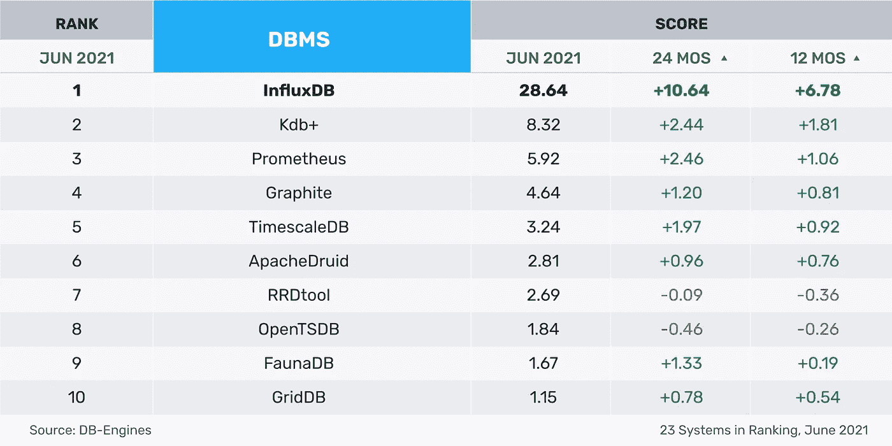

图片来源: [influxdata](https://www.influxdata.com/time-series-database/) ，( [MIT](https://github.com/influxdata/docs-v2/blob/master/LICENSE) )

在 2019 年 InfluxDB 2.x 发布之前，InfluxDB 平台由 TICK 堆栈组成:Telegraf(收集和报告指标的代理)、InfluxDB、Chronograf(从 InfluxDB 查询数据的接口)和 Kapacitor(实时流数据处理引擎)。如下图所示，InfluxDB 1.x 主要关注来自服务器和 web 应用程序的时间序列数据。在 Prometheus 进入这一领域之前，InfluxDB 拥有最大的社区和集成来收集、存储和查看应用程序指标。

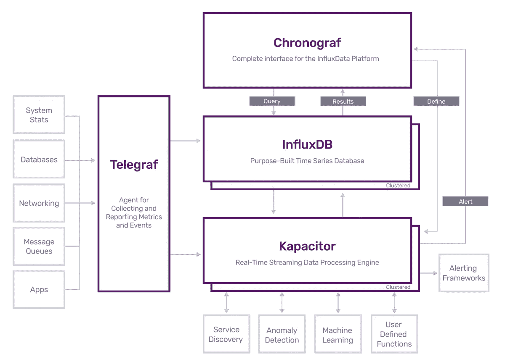

图片来源: [influxdata](https://www.influxdata.com/time-series-platform/) ，( [MIT](https://github.com/influxdata/docs-v2/blob/master/LICENSE) )

InfluxDB 2.x 极大地简化了架构，将 TICK 堆栈捆绑到单个二进制文件中，并引入了新的功能，以使用 Flux 语言收集(例如本机 Prometheus 插件)、组织(例如组织和存储桶)和可视化(例如数据浏览器)数据。

为了理解 InfluxDB 是如何工作的，我们需要掌握以下关键概念:

*   **数据模型(标签集模型)**:除了时间戳字段，每个数据元素都由各种标签(可选的、索引的元数据字段)、字段(键和值)和度量(标签、字段和时间戳的容器)组成。下面的例子是科学家安德森和马伦在克拉马斯和波特兰收集的蜜蜂和蚂蚁的普查数据。这里的*位置*和*科学家*是标签，属于蜜蜂和蚂蚁的*普查*测量的字段/值对。

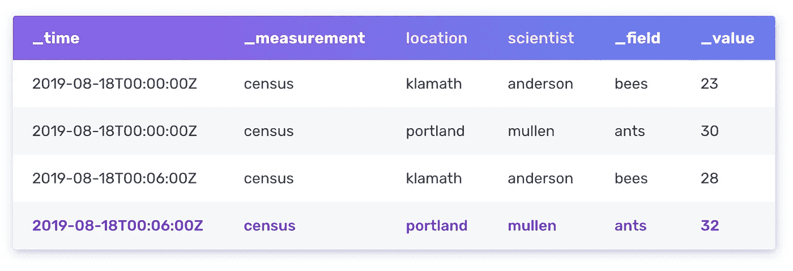

图片来源: [influxdata](https://docs.influxdata.com/influxdb/v2.0/reference/key-concepts/data-elements/) ，( [MIT](https://github.com/influxdata/docs-v2/blob/master/LICENSE) )

*   **数据模式(TSM & TSI)** :数据元素存储在时间结构合并树(TSM)和时间序列索引(TSI)文件中。TSM 可以被认为是一棵 [LSM 树，具有预写日志(WAL)和类似于表](https://docs.influxdata.com/influxdb/v1.8/concepts/storage_engine/)的只读文件，它们被排序和压缩。TSI 是 InfluxDB 内存映射的磁盘上文件的索引，以利用操作系统的[最近最少使用(LRU)内存。这有助于处理高基数的数据集(即集合中的大元素)。](https://docs.influxdata.com/influxdb/v1.8/concepts/time-series-index/)
*   **Flux 脚本语言:**由 InfluxDB 开发的一种特定领域语言，用于帮助查询数据。Flux 还有一个`sql`包来帮助查询 SQL 数据源。

最值得注意的是，InfluxDB 在接收数据之前并不强制执行模式。相反，模式是从输入数据自动创建的，从标记和字段推断。这种类似 NoSQL 的体验既是 InfluxDB 的优势，也是其劣势。对于基数相对较低、自然适合这种标记集模型的数据集(例如，大多数基础设施和应用程序指标、一些物联网数据、一些财务数据)，InfluxDB 非常容易上手，无需担心设计模式或索引。它在目标是创建物理资产的数字模型的用例中也大放异彩。例如，在物联网中，可能需要创建一个数字双胞胎来表示一组传感器，并以有组织的方式接收数据。

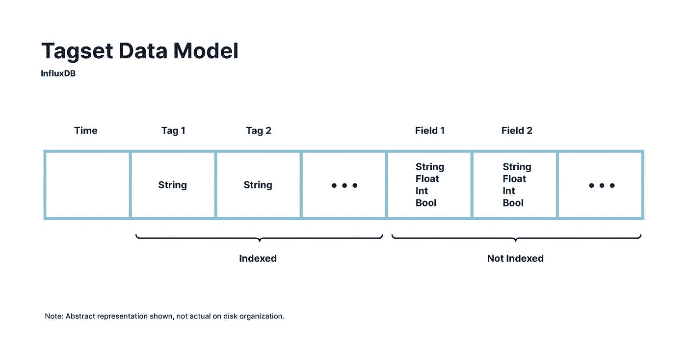

图片来源: [TimescaleDB](https://blog.timescale.com/blog/timescaledb-vs-influxdb-for-time-series-data-timescale-influx-sql-nosql-36489299877/) ，([阿帕奇](https://github.com/timescale/timescaledb/blob/master/LICENSE-APACHE))

另一方面，当数据集需要连续字段的索引(即 InfluxDB 不支持数字，因为标记必须是字符串)或数据验证时，“无模式”可能是一个缺点。此外，由于标签是索引的，如果标签经常变化(例如，元数据在初始摄取后可能会改变的用例)，依赖 InfluxDB 来推断模式可能是昂贵的。

最后，InfluxDB 决定创建自己的自定义函数式数据脚本语言(Flux ),这给控制这个生态系统带来了另一层复杂性。InfluxDB 的团队指出了从类似 SQL 的 InfluxQL 转向 Flux 的两个动机:

1.  时间序列数据符合基于流的功能处理模型，其中数据流从一个输出转换到下一个输出。SQL 支持的关系代数模型也不能处理这种操作和函数的链接。
2.  InfluxDB 希望对不属于 SQL 标准的时间序列数据(例如指数移动平均)的常见操作提供一流的支持。

Flux 语法肯定需要一些努力来适应，特别是如果您正在寻找简单的 SQL 查询或者不打算学习另一种新语言。仍然考虑到 InfluxDB 已经组装的大型社区和[集成，Flux 的一些优势开始体现出来，尤其是当与内置仪表板结合时。](https://www.influxdata.com/products/integrations/)

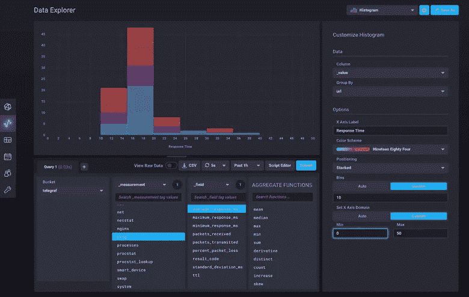

图片来源: [influxdata](https://www.influxdata.com/dashboards/) ，( [MIT](https://github.com/influxdata/docs-v2/blob/master/LICENSE) )

总的来说，如果时间序列数据非常符合标记集模型，InfluxDB 是一个很好的选择。主要用例似乎是面向基础设施/应用程序监控，但作为该领域的市场领导者，InfluxDB 还可以与流行的数据源无缝集成。

*   优点**:无模式摄取、巨大的社区、与流行工具的集成**
*   ****缺点**:数据集具有高基数、定制查询/处理语言**

# **时标 b**

**InfluxDB 选择从头构建一个新的数据库和定制语言，而另一端是 [TimescaleDB](https://www.timescale.com/) 。TimescaleDB 构建在 PostgreSQL 之上，并添加了一个名为 [hypertables](https://docs.timescale.com/timescaledb/latest/overview/core-concepts/hypertables-and-chunks/) 的中间层，该中间层将数据分块到多个底层表中，同时将其抽象为一个大型表，以便与数据进行交互。**

**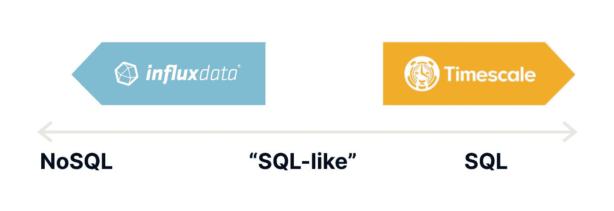**

**图片来源:[时间刻度](https://blog.timescale.com/blog/timescaledb-vs-influxdb-for-time-series-data-timescale-influx-sql-nosql-36489299877/)，([阿帕奇](https://github.com/timescale/timescaledb/blob/master/LICENSE-APACHE))**

**PostgreSQL 兼容性是 TimescaleDB 最大的卖点。TimescaleDB 完全支持所有 SQL 特性(例如连接、二级和部分索引)以及流行的扩展，如 [PostGIS](https://postgis.net/) 。更重要的是，TimescaleDB 继承了运行 SQL 查询的开发人员以及大规模运行 PostgreSQL 的数据库和系统管理员数十年的知识。由于 TimescaleDB 可以被视为 PostgreSQL 的扩展，除了 TimescaleDB 自己的托管产品外，云托管选项(例如用于 PostgreSQL 的[Azure Database](https://azure.microsoft.com/en-us/updates/timescaledb-for-azure-database-for-postgresql-to-power-iot-and-time-series-workloads/)、 [Aiven](https://help.aiven.io/en/articles/1752157-getting-started-with-timescaledb-in-aiven-for-postgresql) )也很容易获得，更不用说虚拟机或容器上的无数自我管理选项了。**

**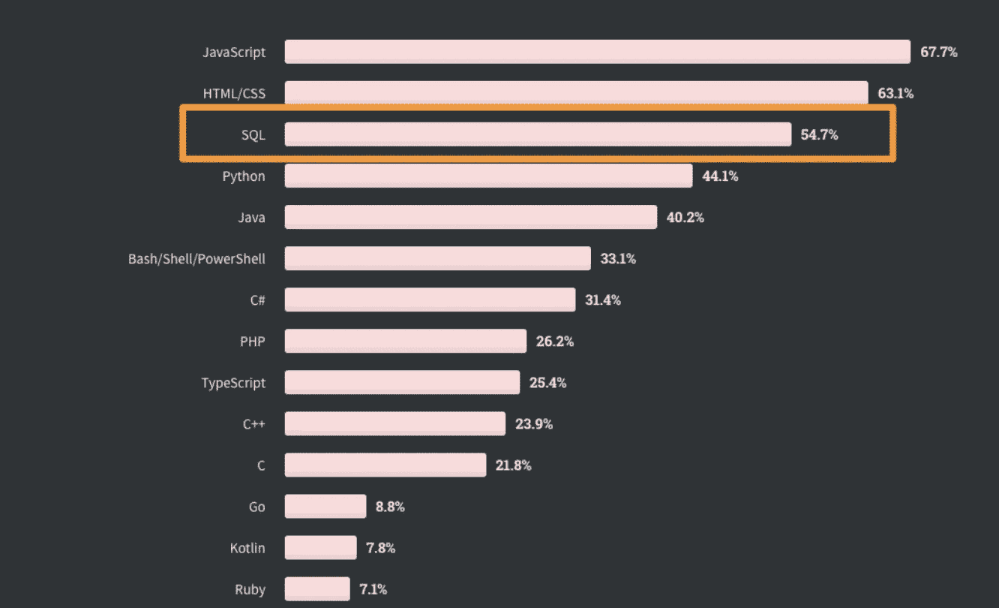**

**图片鸣谢: [2020 栈溢出开发者调查](https://insights.stackoverflow.com/survey/2020#most-popular-technologies)，( [ODbL](https://insights.stackoverflow.com/survey/2020#most-popular-technologies) )**

**由于 TimescaleDB 最初是一个物联网平台，他们最初实际上使用 InfluxDB 来存储他们的传感器数据，因此它的功能对于物联网时间序列数据来说是一个好兆头，这些数据通常是突发性的，由于网络不可靠而经常出现故障，并且具有高基数的特点:**

*   ****超表:** TimescaleDB [基于时间列以及其他“空间”值](https://docs.timescale.com/timescaledb/latest/overview/core-concepts/hypertables-and-chunks/#partitioning-in-hypertables-with-chunks)如设备 uid、位置标识符或股票代码，将其超表划分成块。这些区块可以配置为在内存中保存最新的数据，按照时间列(而不是摄取时间)对数据进行异步压缩和重新排序，并跨节点进行事务性复制或迁移。**
*   ****连续聚合:** TimescaleDB 还支持[连续聚合数据](https://docs.timescale.com/timescaledb/latest/overview/core-concepts/continuous-aggregates/)以快速计算关键指标，如每小时平均值、最小值和最大值。物联网数据通常在聚合时更有用(例如，给我下午 3 点到 4 点之间的平均温度，而不是下午 3 点的确切温度)，因此不需要在每个聚合查询中扫描大量数据，这有助于创建高性能的仪表盘或分析。**
*   ****数据保留:**在传统的关系数据库中，大规模删除是一项开销很大的操作。然而，由于 TimescaleDB 以块的形式存储数据，因此它[提供了一个](https://docs.timescale.com/timescaledb/latest/overview/core-concepts/data-retention/#data-retention) `[drop_chunks](https://docs.timescale.com/timescaledb/latest/overview/core-concepts/data-retention/#data-retention)` [功能来快速丢弃旧数据，而没有相同的开销](https://docs.timescale.com/timescaledb/latest/overview/core-concepts/data-retention/#data-retention)。由于旧数据的相关性会随着时间的推移而降低，因此可以将 TimescaleDB 与长期存储(例如 OLAP 或 blob 存储)结合使用，以移动旧数据，从而节省磁盘空间并保持较新数据的高性能。**

**至于性能，TimescaleDB 有一个全面的帖子，详细介绍了使用[时间序列基准测试套件(TSBS)](https://github.com/timescale/tsbs) 比较 TimescaleDB 版本 1.7.1 和 InfluxDB 1.8.0(两个 OSS 版本)的插入和读取延迟指标。这两个数据库现在都有 2.x 版本，所以这种分析可能有点过时，但结果显示，随着数据基数的增长，TimescaleDB 的性能会更好(大约 3.5 倍的性能)。**

**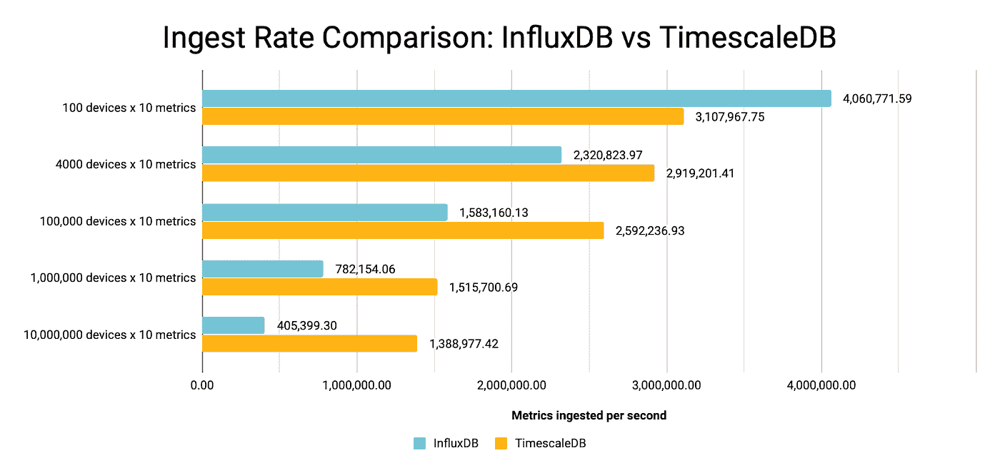**

**图片来源: [TimescaleDB](https://blog.timescale.com/blog/timescaledb-vs-influxdb-for-time-series-data-timescale-influx-sql-nosql-36489299877/) ，([阿帕奇](https://github.com/timescale/timescaledb/blob/master/LICENSE-APACHE)**

**TimescaleDB 团队指出 InfluxDB 的基于日志结构合并树的系统(TSI)与 TimescaleDB 的 B 树索引方法的根本原因。然而，这里的要点并不一定是 TimescaleDB 在性能方面优于 InfluxDB。性能基准是固执己见的，并受到数据模型、硬件和配置的严重影响。相反，该结果表明，TimescaleDB 可能更适合数据基数较高的物联网用例(例如，给我 1000 万台设备中设备 X 的平均功耗)。**

**要深入比较这两个数据库，请查看:**

**<https://blog.timescale.com/blog/timescaledb-vs-influxdb-for-time-series-data-timescale-influx-sql-nosql-36489299877/>  

总的来说，TimescaleDB 非常适合那些寻求大幅提升性能而不需要进行大量重构来迁移现有 SQL 数据库的团队。尽管 TimescaleDB 仍然相对较新(2017 年首次发布)，但基于 PostgreSQL 构建的决定使其采用数量达到了前 5 名。有趣的是，我以前的物联网初创公司也使用 TimescaleDB 作为中间数据存储，来快速提取跨越几个月的聚合指标，并将旧数据移动到长期存储中。由于我们已经在 Kubernetes 集群上运行 PostgreSQL，安装 TimescaleDB 和迁移我们的工作负载是一项简单的任务。

*   **优点**:兼容 PostgreSQL，可随数据基数很好地扩展，提供各种部署模型
*   **缺点**:固定模式(在接收之前增加了一点复杂性和数据转换工作)

# QuestDB

对于那些希望利用 InfluxDB line 协议的灵活性和 PostgreSQL 的熟悉性的人来说，一个较新的 timeseries 数据库可以同时满足这两个要求，而不会牺牲性能。QuestDB (YC S20)是一个用 Java 和 C++编写的开源 TSDB，尽管它在不到一年前推出，但它现在已经跻身前 15 名。在底层， [QuestDB 利用内存映射文件](https://news.ycombinator.com/item?id=23975807)在数据提交到磁盘之前支持快速读写。

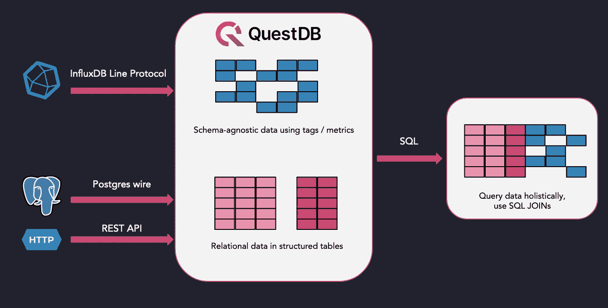

图片鸣谢: [QuestDB](https://questdb.io/blog/2019/12/19/lineprot/) ，([阿帕奇](https://github.com/questdb/questdb.io/blob/master/LICENSE.txt))

通过用 Java 和 C++从头开始构建数据库，QuestDB 团队专注于三件事:

*   **性能:**解决接收瓶颈，尤其是高基数数据集。它还支持快速数据检索，方法是始终按顺序存储时间分区的数据(通过在内存中混排)，并且只分析请求的列/分区，而不是整个表。最后，QuestDB 应用 SIMD 指令来并行化操作。
*   **兼容性:** QuestDB 支持 InfluxDB 线路协议、PostgreSQL 线路、REST API、CSV 上传摄取数据。习惯于其他 TSDBs 的用户可以轻松地移植到他们现有的应用程序上，而无需进行大量的重写。
*   **通过 SQL 查询:**尽管支持多种摄取机制，但 QuestDB 使用 SQL 作为查询语言，因此不需要学习像 Flux 这样的特定领域语言。

在性能方面，QuestDB 最近发布了一篇博客文章，展示了实现每秒 140 万行写入速度的基准测试结果。QuestDB 团队在 AWS 上的`m5.8xlarge`实例上使用了多达 14 个作品的`cpu-only`用例使用了 TSBS 基准测试(*注意:140 万的数字来自于使用 AMD Ryzen5 处理器*)。

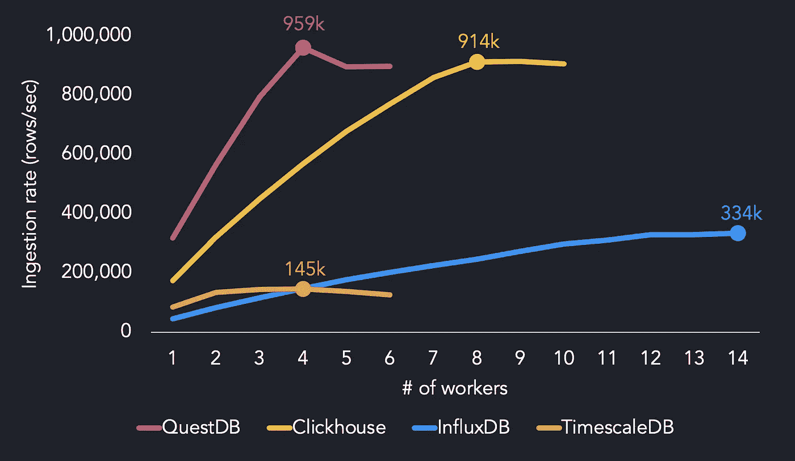

图片来源: [QuestDB](https://questdb.io/blog/2021/05/10/questdb-release-6-0-tsbs-benchmark/#comparing-ingestion-with-clickhouse-influxdb-and-timescaledb) ，( [Apache](https://github.com/questdb/questdb.io/blob/master/LICENSE.txt) )

对于具有高基数(> 1000 万)的数据集，QuestDB 也优于其他 TSDBs，在采用英特尔至强处理器的 m 5.8 XL 大型实例上使用 4 个线程，峰值接收吞吐量为 904 千行/秒，在 1000 万台设备上维持约 64 万行/秒。当相同的基准在 AMD 锐龙 3970X 上运行时，QuestDB 显示每秒超过一百万行的摄取吞吐量。

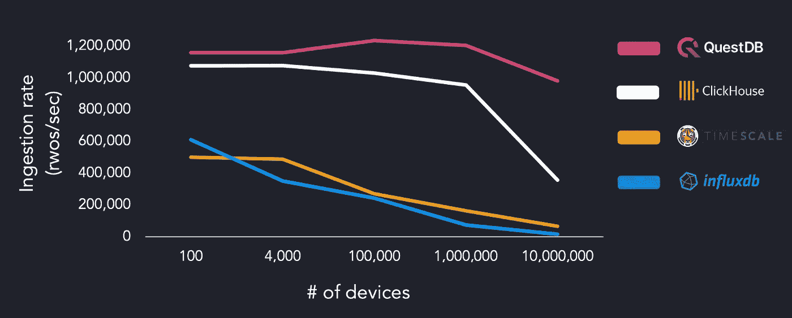

图片鸣谢: [QuestDB](https://questdb.io/blog/2021/06/16/high-cardinality-time-series-data-performance) ，([阿帕奇](https://github.com/questdb/questdb.io/blob/master/LICENSE.txt))

同样，基于数据模型和数据库调优，性能基准可能是主观的，但它仍然为 QuestDB 描绘了一个引人注目的比较点。看看使用`devops`或`iot`模式的结果会是多么有趣，因为 InfluxDB 和 TimescaleDB 都支持 TSBS 的开箱即用用例。

QuestDB 的另一个有趣的组件是对 InfluxDB 内联协议和 PostgreSQL 接收线的支持。对于现有的 InfluxDB 用户，您可以简单地[配置 Telegraf 指向 QuestDB 的地址和端口](https://questdb.io/docs/third-party-tools/telegraf/#writing-to-questdb-over-tcp)。同样，对于 PostgreSQL 用户，使用现有的客户端库或 JDBC 将数据写入 QuestDB。无论采用何种摄取方法，都可以使用标准 SQL 查询数据，值得注意的例外情况列在 [API 参考页面](https://questdb.io/docs/reference/api/postgres/#compatibility)上。

作为该领域的新成员，QuestDB 最明显的缺点是缺乏对基础设施功能的支持(如复制、自动备份/恢复)。它已经与一些最流行的工具(如 PostgreSQL、Grafana、Kafka、Telegraf、Tableau)集成，但要达到上述其他 TSDBs 的水平还需要一些时间。

尽管如此，QuestDB 是一个很有前途的项目，可以平衡 InfluxDB 和 TimescaleDB 的优点:

*   **优点**:快速摄取(特别是对于高基数数据集)，支持 InfluxDB 协议和 PostgreSQL 连接，通过标准 SQL 查询
*   **缺点**:较小的社区，可用的集成，生产就绪

# 结论

随着对时间序列数据需求的持续增长，专门处理这些数据的 TSDBs 将被大量采用，同时也会面临激烈的竞争。除了本文介绍的三个开源 TSDBs，还有来自 AWS ( [AWS Timestream](https://aws.amazon.com/timestream/) )和 Azure([Azure Series Insights](https://azure.microsoft.com/en-us/services/time-series-insights/))的公共云产品。

与所有数据库一样，选择“完美的”TSDB 主要取决于您的业务需求、数据模型和用例。如果您的数据符合具有丰富集成生态系统的标签集模型，那么 InfluxDB 可以很好地工作。TimescaleDB 非常适合现有的 PostgreSQL 用户。最后，如果性能是主要关注点，QuestDB 是一个很有前途的项目，正在快速发展。**