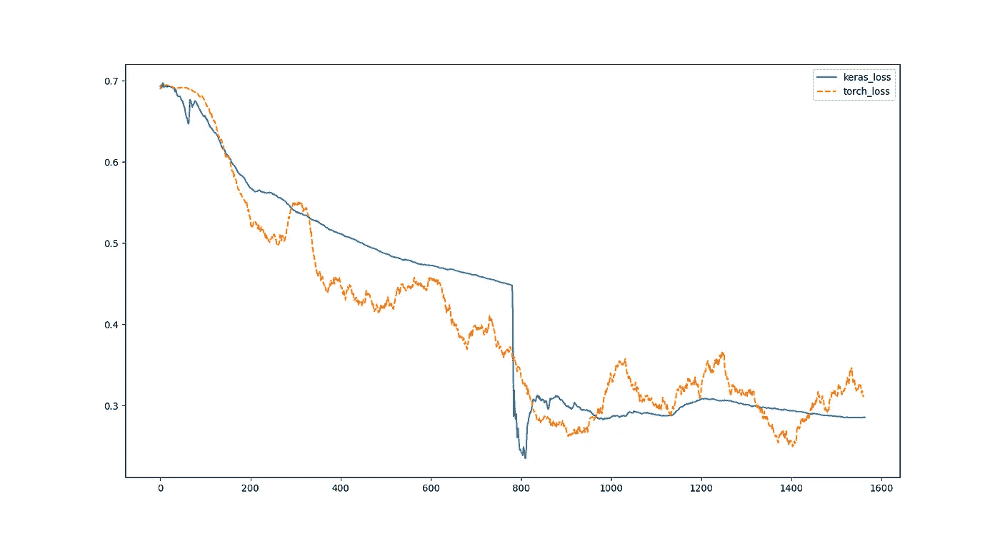
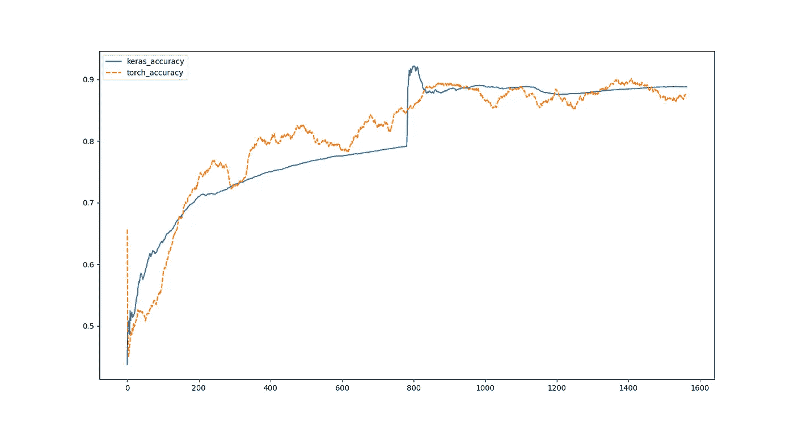

# Keras 和 PyTorch 在情感分类上的比较

> 原文：<https://towardsdatascience.com/comparing-keras-and-pytorch-on-sentiment-classification-20041734d131?source=collection_archive---------25----------------------->

## IMDB 电影评论的实用比较


照片由 [**卡罗琳娜·格拉博斯卡**](https://www.pexels.com/@karolina-grabowska?utm_content=attributionCopyText&utm_medium=referral&utm_source=pexels) 发自 [**佩克斯**](https://www.pexels.com/photo/coffee-in-different-cups-on-small-table-4195598/?utm_content=attributionCopyText&utm_medium=referral&utm_source=pexels)

在第一部分概述了 Keras 和 PyTorch 语法之后，这是我们比较 Keras 和 PyTorch 的第二部分！这一部分更实用，因为我们将实现一个神经网络来按情感对电影评论进行分类，并比较分类结果。

</comparing-keras-and-pytorch-syntaxes-54b164268466>  

正如我们在第一部分中看到的，Keras 和 PyTorch 在设计上是不同的

*   Keras 的目标是快速原型制作。它旨在编写更少的代码，让开发人员专注于其他任务，如数据准备、处理、清理等
*   PyTorch 的目标是模块化和多功能性。对计算流程的细粒度控制

然而，这两个框架的目的是一样的，那就是训练深度神经网络。“罗塞塔石碑”风格教程的资源在网上的数量非常有限，尤其是演示实际例子的资源，所以我希望这有助于揭开两个框架之间的区别和相似之处。现在让我们开始吧！

# IMDB 电影评论数据集

我们将使用 IMDB 数据集，这是机器学习中一个受欢迎的玩具数据集，由来自 IMDB 网站的电影评论组成，由正面或负面情绪注释。

Keras 和 PyTorch 都有助手函数来下载和加载 IMDB 数据集。因此，我们将使用这段代码在 Keras 中导入 IMDB 数据集，而不是像我们在[第一部分](/comparing-keras-and-pytorch-syntaxes-54b164268466)中看到的那样使用数据加载器。

这将创建一个文件夹`data/`，并在其中下载数据集。它将数据分成训练集和验证集两部分。输出给出了序列的数量。

```
25000 Training sequences
25000 Validation sequences
```

使用 [torchtext，PyTorch 也可以以同样的方式下载和加载 IMDB 数据集](https://pytorch.org/text/_modules/torchtext/datasets/imdb.html)。但是为了确保我们提供给 Keras 的数据和我们提供给 PyTorch 的数据是相同的，我将简单地修改从 Keras 下载到 PyTorch 的数据，这样我们就可以确保两个实现之间的一致性，特别是在数据清理和文本标记化方面。

此外，我们将填补电影评论有相同长度的序列。这对于批量训练很重要，因为不可能并行计算可变长度序列的误差梯度。

我们将评论的长度固定为 200 个单词，将词汇表固定为 20k 个不同的单词。数据集已经被清理和标记，所以我们可以直接把它输入神经网络！在继续之前，出于好奇，我们可以看一下数据集中的一些例子。我们需要使用`imdb.get_word_index`获取单词词汇表，这将让我们把数据集中的整数解码成简单的英语。

使用上面的代码，我们可以检查数据集中的序列“1，13，165，219，14，20，33，6，750，…”对应于

```
<START> i actually saw this movie at a theater as soon as i handed the cashier my money she said two words i had never heard at a theater before or since no <UNK> as soon as i heard those words i should have just <UNK> bye bye to my cash and gone home but no foolishly i went in and watched the movie this movie didn't make anyone in the theater laugh not even once not even <UNK> mostly we sat there in stunned silence every ten minutes or so someone would yell this movie sucks the audience would applaud enthusiastically then sit there in stunned bored silence for another ten minutes <PAD> <PAD> <PAD> [...]
```

我们可以打印与此评论相关的情绪，即`y_train[50]`，0 表示“负面”。看起来没错。

但是等等！我们需要修改 PyTorch 的数据。这段代码将完成这项工作。

`TensorDataset`类将把我们的数据转换成 torch tensors，切片成批，然后洗牌。然后使用一个`DataLoader`实例，我们将能够迭代这些批次。

很好！数据准备好了，让我们定义我们的分类器。

# 分类器模型

我们的分类器是一个在嵌入层之上的双向两层 LSTM，后面是一个给出一个输出值的密集层。这个输出值给出了一个评论是正面的概率。越接近零，评论被预测为越负面，越接近一，评论被预测为越正面。为了获得这样的概率，我们使用 sigmoid 函数，该函数获取神经网络的最终输出，并将该值压缩在 0 和 1 之间。

我们将定义以下两个超参数，以确保两个实现匹配。

```
embedding_dim = 128
hidden_dim = 64
```

让我们从 Keras 中的实现开始([归功于官方的 Keras 文档](https://keras.io/examples/nlp/bidirectional_lstm_imdb/))

现在，让我们在 PyTorch 中实现同样的功能。坚持住，因为有一些技术上的微妙之处需要注意。我想先向您展示什么是幼稚的实现

如果你读了[第一部分，](/comparing-keras-and-pytorch-syntaxes-54b164268466)这段代码就不会有什么惊喜了。在 PyTorch 中，我们简单地详述了一些计算，而 Keras 在我们堆叠层时推断出它们。

现在坏消息是这个实现与 Keras 的实现并不完全相同。而且主要区别是初始化！要让两个框架在初始化上达成一致，需要做大量的工作。例如，您可以看到 Keras 的`Embedding`层[使用均匀分布](https://keras.io/api/layers/core_layers/embedding/)初始化其权重，而 PyTorch 使用的是正态分布[。让我们开门见山，使用下面的方法使 PyTorch 初始化适应 Keras。](https://pytorch.org/docs/stable/generated/torch.nn.Embedding.html)

这是取自 [torchMoji 的一个很好的片段，它是 HuggingFace](https://medium.com/huggingface/understanding-emotions-from-keras-to-pytorch-3ccb61d5a983) 对 DeepMoji 的 PyTorch 实现。我们现在在 PyTorch 中有了更新的 BiLSTM 类。

嗯……正如你所看到的，即使对于非常基础的架构，转移代码也不是一件容易的工作。甚至细节对于实现类似的结果也很重要，但是请耐心等待，因为这是我能得到的最接近 Keras 实现的结果。

一个快速的完整性检查是验证两个实现的参数数量是否匹配。`model.summary()`在 Keras 中输出以下内容。

```
Model: "sequential" _________________________________________________________________ Layer (type) Output Shape Param # ================================================================= embedding (Embedding) (None, None, 128) 2560000 _________________________________________________________________ bidirectional (Bidirectional (None, None, 128) 98816 _________________________________________________________________ bidirectional_1 (Bidirection (None, 128) 98816 _________________________________________________________________ dense (Dense) (None, 1) 129 ================================================================= Total params: 2,757,761 Trainable params: 2,757,761 Non-trainable params: 0 _________________________________________________________________
```

用 PyTorch 打印带有`print(model)`的模型表明我们有相同的架构。

```
BiLSTM(
  (encoder): Embedding(20000, 128)
  (lstm): LSTM(128, 64, num_layers=2, bidirectional=True)
  (linear): Linear(in_features=128, out_features=1, bias=True)
  (activation): Sigmoid()
)
```

但是这并没有告诉我们参数的数量。这一行给出了我们想要的([感谢费德里科·巴尔达萨尔](https://discuss.pytorch.org/t/how-do-i-check-the-number-of-parameters-of-a-model/4325/8)

```
sum(p.numel() for p in model.parameters() if p.requires_grad)
```

这给出了 2758785 个参数。哦！参数个数不一样！？在深入研究这个问题后，我发现 PyTorch 有第二个偏差张量[，这是因为它在实现 LSTM](https://discuss.pytorch.org/t/why-lstm-has-two-bias-parameters/45025) 时与 CuDNN 兼容。你可以有效地检查计数差是否等于`2,758,785 - 2,757,761 = 1024`，也就是`2 * 4 * 2 * 64 = 1024`。其中，我们将一个 LSTM 单元的偏置向量的大小 64 乘以 2，因为我们有一个前向和一个后向 LSTM，再次乘以 2，因为我们使用了两个层，而 4 是 LSTM 定义中的门的数量。即使有这样的基础架构，也会出现微妙而重要的差异。

现在让我们来看看实现是如何执行的。

# 培养

我们将使用以下参数进行培训。

```
batch_size=32
epochs = 2
```

在喀拉斯，这个一行程序将完成这项工作

```
model.fit(x=x_train, y=y_train,
          batch_size=batch_size, epochs=epochs,
          validation_data=(x_val, y_val))
```

现在使用 PyTorch，记住 Keras 在幕后做的每一件事都必须显式编写。首先是初始化日志、损失标准、模型、设备和优化器。

接下来是训练循环。我使用我推荐的`[tqdm](/training-models-with-a-progress-a-bar-2b664de3e13e)` [库来打印一个漂亮的进度条，和 Keras](/training-models-with-a-progress-a-bar-2b664de3e13e) 一样。

注意`model.train()`和`model.eval()`方法的使用，它们将`model.training`设置为`True`或`False`。它决定是否在正向过程中保持梯度，这将用于在反向过程中优化网络。

我用`torch.nn.utils.clip_grad_norm_(model.parameters(), 5)`将权重渐变剪辑为 5。我不确定 Keras 是如何处理渐变裁剪的，但是实现这种技术来避免渐变爆炸的问题通常是很好的实践。

最后一点是关于维度的排序。正如我在[第一部分](/comparing-keras-and-pytorch-syntaxes-54b164268466)中所解释的，Keras 默认期望批处理维在第一位，而 PyTorch 期望它在第二位。因此，通过`samples.transpose(0, 1)`，我们有效地置换了第一个和第二个维度，以适应 PyTorch 数据模型。

现在，同样地，Keras，当我们到达一个时代的终点，我们想要评估这个模型。

# 结果

在下面的表中，我报告了每个训练时期的结果，是批次数的平均值。


训练集上的历元结果。


验证集上的纪元结果。

下图显示了训练期间批次的损失和二进制精度。



批量训练损失



批量训练准确度

我们可以注意到 Keras 实现的准确性和损失的突然增加。如果我们优化学习速度，这可能会减少。

# 临终遗言

即使非常小心，使用相同的架构、数据处理和训练也很难获得完全相同的结果，因为每个框架都有自己的内部机制、设计和特定的技巧来保证数值稳定性。尽管如此，我们得到的结果是接近的。

有一些雄心勃勃的项目，如 [ONNX](https://onnx.ai/) 创建深度学习框架之间的标准，以实际解决我们在本文中看到的差异。

我希望你喜欢 Keras 和 PyTorch 的比较，我想看看你的想法和反馈！祝你在机器学习的旅途中一切顺利！

*原载于 2021 年 3 月 20 日*[*https://adamoudad . github . io*](https://adamoudad.github.io/posts/keras_torch_comparison/sentiment_classification/)*。*