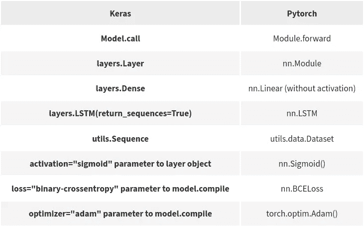

# 比较 Keras 和 PyTorch 语法

> 原文：<https://towardsdatascience.com/comparing-keras-and-pytorch-syntaxes-54b164268466?source=collection_archive---------28----------------------->

## [入门](https://towardsdatascience.com/tagged/getting-started)

## 数据加载、模型定义和张量操作


图片由 [**cottonbro**](https://www.pexels.com/@cottonbro?utm_content=attributionCopyText&utm_medium=referral&utm_source=pexels) 来自 [**Pexels**](https://www.pexels.com/photo/photo-of-person-s-hands-using-laptop-4065617/?utm_content=attributionCopyText&utm_medium=referral&utm_source=pexels)

[Keras](https://keras.io/) 和 [PyTorch](http://pytorch.org/) 是构建深度学习程序的流行框架。前者，Keras，更准确地说是 Tensorflow 的抽象层，提供快速原型化模型的能力。
py torch 上面也开发了类似的抽象层，比如 [PyTorch Ignite](https://pytorch.org/ignite/) 或者 [PyTorch lightning](https://github.com/PyTorchLightning/pytorch-lightning) 。它们还没有 Keras 成熟，但是值得一试！

我发现很少有资源或文章比较 Keras 和 PyTorch 中的代码，我将在本文中展示这样的例子，以帮助理解框架之间在语法和命名方面的主要差异。

本文是系列文章的第一篇。在下一篇文章中，我将通过一个实例来比较框架，这个实例就是情感分类。

</comparing-keras-and-pytorch-on-sentiment-classification-20041734d131>  

# 准备数据

第一个比较是关于如何装载和准备数据。在两个框架中，加载数据的方式非常相似，在 Keras 中使用`utils.Sequence`类，在 PyTorch 中使用`utils.dataset`。在喀拉斯，你会看到这样的东西

这是 PyTorch 中的相同代码。

# 定义和构建模型

在 Keras 中，我们可以同时定义和构建模型。在下面的例子中，我们使用【https://keras.io/api/models/sequential/】()来构建一个具有嵌入层和单个神经元输出的 LSTM 网络。

这是 PyTorch 同样的建筑。

`__init__`函数实例化网络的不同模块，而实际计算由`forward`函数决定。实际上，我们仍然需要像 Keras 例子中那样“编译”模型。然而，正如您将在如何训练模型中看到的，我们在 PyTorch 中分别定义了度量、模型和优化器，并在训练循环中需要时调用它们。所以我们只需要定义与上面相同的度量标准和相同的优化器。

在大多数情况下，Keras 中的默认参数将与 PyTorch 中的默认参数相匹配，Adam 优化器和 BCE(二进制交叉熵)损失就是这种情况。

总而言之，我们有了这两种语法的对照表。



Keras 和 PyTorch 语法对照表

# 操纵张量

两种框架在操作张量的语法上都有自己的特点。这里我们将对比 PyTorch 和 Tensorflow。

## 张量的形状

Pytorch 有`.shape`和`.size`，都相当于访问张量的形状。

```
import torch
t = torch.zeros((4, 3))
print(t.shape, t.size())         # Both equal to (4, 3)
t.shape[1], t.size(1)     # Both equal to 3
```

张量流只有`.shape`

```
t = tf.zeros((4, 3))
print(t.shape)            # .size is not available
print(t.shape[1])
```

## 维度的顺序

Keras 通常将尺寸排序为`(batch_size, seq_len, input_dim)`，而 Pytorch 更喜欢将它们默认排序为`(seq_len, batch_size, input_dim)`。在 PyTorch 中，像 LSTM、GRU 这样的循环网络有一个开关参数`batch_first`，如果设置为`True`，它将期望输入为`(seq_len, batch_size, input_dim)`的形状。然而，像变压器模块没有这样的参数。在这种情况下，必须调整输入。为此，您可以使用`.transpose`方法在 Pytorch 中切换尺寸。

```
data = torch.Tensor(tensor_with_batch_first)
data.transpose(0, 1)            # Switch first and second dimensions
```

从并行计算的角度来看，PyTorch 选择的顺序更加自然。例如，循环层将在序列的每一步并行应用于所有批次，因此我们将迭代第一个`seq_len`维度。就模型架构而言，Keras 首选的顺序更自然，因为我们宁愿考虑将一个输入序列输入到模型中，然后简单地为一个批处理复制操作。

## 初始化向量

PyTorch 的语法与 numpy 非常相似。

```
# Matrix of size (2, 4, 1) filled with 1
torch.ones(2, 4, 1)# Identity matrix of size (3,3)
torch.eye(3)
```

好消息！以上所有方法在 Tensorflow 中都存在，并且工作方式相同。
此外，我们还有`torch.full`，它相当于`numpy.fill`，用一个值填充一个张量。Tensorflow 有`tf.fill`。

```
# Fill a (2, 4) matrix with 3.14 value
torch.full((2, 4), fill_value=3.14)
tf.fill((2, 4), value=3.14)
```

以下是如何对随机数矩阵进行采样。

```
# Sample from N(0, 1) a matrix of size (2, 3)
torch.randn(2, 3)
tf.random.normal(shape=[2, 3])# Sample uniformely a (2, 5) matrix of integers within [10, 20[
torch.randint(low=10, high=20, size=(2, 5))
tf.random.uniform(shape=[2, 5], minval=10, maxval=20, type=tf.int64)
```

随机数生成器的再现性种子可以用

```
torch.random.manual_seed(0)
tf.random.set_seed(0)
```

# 结论

虽然 Keras 和 Pytorch 具有非常相似的数据加载逻辑，但它们的语法在其他方面有很大不同。PyTorch 有 pythonic 式的语法，而 Keras 是为编写简短的程序而设计的，不需要花太多时间解释构建块。还有更多的比较点，但我希望这篇文章能对这两个框架提供一些见解。为了完整起见，我分享了一些我找到的关于 Keras 和 PyTorch 的比较资料。

*   Keras 和 PyTorch 与 ConvNet 架构的比较和速度基准:[https://deepsense.ai/keras-or-pytorch/](https://deepsense.ai/keras-or-pytorch/)
*   一个多 GPU 框架对比:[https://medium . com/@ iliakarmanov/multi-GPU-Rosetta-stone-d4fa 96162986](https://medium.com/@iliakarmanov/multi-gpu-rosetta-stone-d4fa96162986)
*   深度学习框架之间的一个罗塞塔石碑库:【https://github.com/ilkarman/DeepLearningFrameworks/ 
*   Keras 和 PyTorch 在图像分类上的比较:[https://deep sense . ai/Keras-vs-py torch-AVP-transfer-learning/](https://deepsense.ai/keras-vs-pytorch-avp-transfer-learning/)

你完成了第一部分！下面的第二部分比较了 Keras 和 PyTorch 的情感分类。

</comparing-keras-and-pytorch-on-sentiment-classification-20041734d131>  

*原载于 2021 年 3 月 2 日*[*https://adamoudad . github . io*](https://adamoudad.github.io/posts/keras_torch_comparison/syntax/)*。*