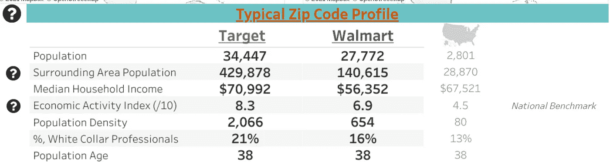
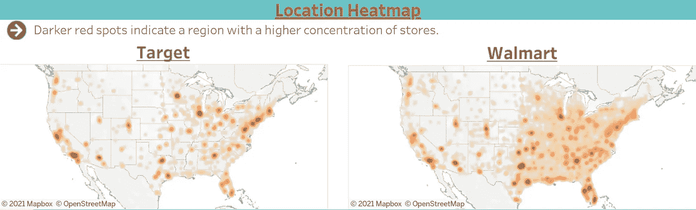
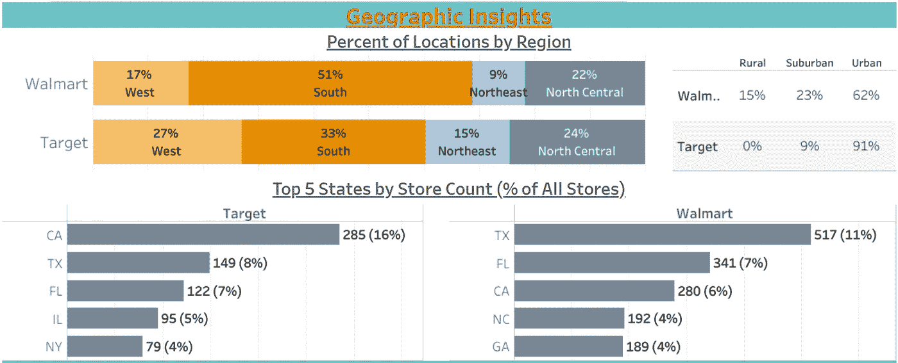
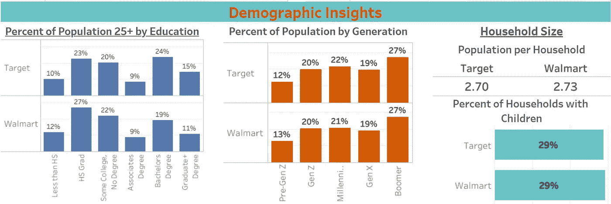

# 比较定位策略:沃尔玛与塔吉特

> 原文：<https://towardsdatascience.com/comparing-location-strategies-walmart-vs-target-d2bb00c9c7b3?source=collection_archive---------16----------------------->

## 数据支持你对这些商店的看法吗？

丹尼尔·奥登内尔在 [Unsplash](https://unsplash.com?utm_source=medium&utm_medium=referral) 上拍摄的照片

你有没有见过一个你熟悉的品牌，然后对自己说……'*哇，这似乎是他们的一个完美地点*'？冒着过分简化和陈述显而易见的风险，公司定位在他们认为他们的目标客户会在的地方。当我们从总体上看位置时，我们可以了解一家公司的目标客户是谁，它对他们的位置策略&目标人群有什么建议，以及它与竞争品牌相比如何。

只需几行代码(嗯，可能比几行多一点)和一些漂亮的可视化，我们就可以对一家公司的定位策略有一个基本的了解，甚至更有趣的是，他们下一步可能会去哪里。

在这个系列的第一部分，我们将介绍两个你可能很熟悉的大盒子零售商——沃尔玛和塔吉特。关于他们的客户群，这些数据说明了什么？这和你认为你对他们的了解相比如何？

*有兴趣直接比较这些品牌和其他品牌吗？* [*查看此可视化*](http://jordanbean.com/compare-brands) *以获得更多见解和数据。*

# 底线，提前

作者图片

数据显示，典型的沃尔玛位于人口众多、收入低于平均水平、经济活动中等的邮政编码区。典型的目标位于人口非常多的邮政编码区-甚至周边地区人口更多-此外还有高于平均水平的收入、高经济活动和高人口密度。

塔吉特百货周边地区的高人口密度(距离邮政编码中心约 10 英里)和高人口密度(每平方英里土地上的人口)表明，它主要位于靠近城市的地区，而沃尔玛位于人口众多但距离市中心较远的城镇。

比较这两个品牌，沃尔玛更有可能位于远离平均收入和人口密度较低的大都市地区的人口中心，而塔吉特更有可能开设在周围人口较多、经济活动较活跃的大都市中心及其周围(周围有餐馆、健身房等)。).

# 地理洞察力

图片由作者提供；按品牌划分的商店位置热图。

将这两个品牌商店的地理集中程度形象化，可以看出它们在选址策略上的惊人差异，强调了上述数据中的差异。第一次看地图时，你看到了什么？

请注意 Target(左侧的地图)在海岸和美国中部城市中心及其周围的密集度(商店数量)非常高。只要看看地图，你就能看到城市——洛杉机、芝加哥、纽约、费城、DC、波斯顿等等。—是其战略的中心，周围有光环效应，以捕捉更高收入的郊区。之后，他们在剩下的州中寻找可能代表人口中心的目标位置，例如大学城、州首府或人口较少的州的其他大都市区。

图片由作者提供；同上，以便于查看

另一方面，沃尔玛有效地将中国一分为二，几乎覆盖了中国东半部的所有地区，并在中国西半部实施了更加以城市为导向的战略。请注意沃尔玛的覆盖范围比目标海岸多了多少。实际上，整个地图覆盖了从国家的中心到大西洋！这验证了早期关于其在具有高直接区域人口但较低周边人口的区域中的覆盖的见解。

作者图片

从地理上看，超过一半的沃尔玛商店位于南方各州，相比之下，塔吉特的商店只有三分之一。Target 在西部的比例更高，最明显的是在加州。沃尔玛还有大约 15%的门店位于我们认为的农村地区，而塔吉特超过 90%的门店位于我们认为的城市地区。

# 人口统计洞察

作者图片

有趣的是，我们发现客户的人口统计学特征几乎没有差异。Target 拥有学士以上学位的成年人口比例略高(约 40%对约 30%)，但在其他方面，我们看到，按年龄和家庭规模划分，数据非常相似。

这表明这两个品牌之间的主要分界点是他们选择开店的地点，而不一定是他们的目标客户的人口统计特征。他们销售的商品的市场几乎是全球性的，塔吉特百货选择采取更高端的方式销售产品，这就要求他们选择与顾客一致的区域。

# 这一切意味着什么

总体而言，这些数据似乎强化了这些公司的品牌和营销。沃尔玛通常以价格竞争而闻名，同时目前正在扩大其在线业务，而塔吉特则以高端大卖场零售商而闻名。因此，我们认为塔吉特百货位于主要大都市区及其周边收入高于平均水平的地区，而沃尔玛倾向于位于收入低于平均水平的市中心以外的人口稠密地区。

位置策略是一个迷人的话题——至少对我来说是这样，如果你已经走了这么远，希望你也是这样。可以认为只有大公司才有资源和人才来制定战略，但各种规模的公司在寻求扩张时都可以从数据中受益。你不需要最花哨的模型来受益——更简单、更直接总比什么都没有好，有时甚至比花哨的模型更好。

除了剖析公司，正如我们上面看到的，我们还可以扩展这些见解，以找到符合某些特征的新领域。假设你是一家零售商，目标客户是东北部城市地区的高收入千禧一代购物者。这不会告诉您要定位的确切地址，但数据可以将我们的搜索范围从整个东北部缩小到仅符合该特征的区域，从而使企业主可以花更多宝贵的时间在目标区域搜索最佳的十字路口、街道或位置，而不是花更多时间在更多位置猜测哪个可能是最好的。

[链接到可视化工具](http://www.jordanbean.com/compare-brands)亲自探索数据和其他品牌！

*对连接或了解更多位置分析感兴趣吗？* [*在 LinkedIn*](http://www.linkedin.com/in/jordanbean) *上联系我，或者在 jordan@jordanbean.com 给我发邮件。*