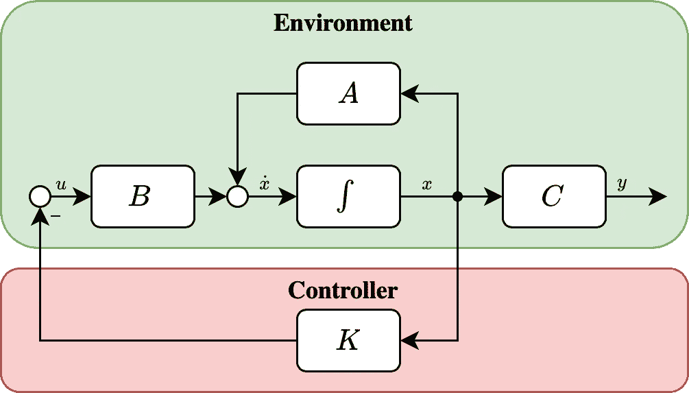
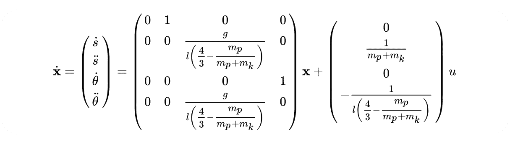

# 开放式健身房的最优控制

> 原文：<https://towardsdatascience.com/comparing-optimal-control-and-reinforcement-learning-using-the-cart-pole-swing-up-openai-gym-772636bc48f4?source=collection_archive---------14----------------------->

## 思想和理论

## 最优控制与强化学习的比较

经典控制比人们想象的更类似于强化学习。然而，它们之间的关键区别是，在控制中，我们假设**知道**潜在的系统动力学，而在强化中，我们**不知道**。|(图片由作者提供)

自主系统的想法令我兴奋，将*强化* *学习*应用于一切事物以实现自主似乎很有诱惑力。但这并不总是那么容易，使用*最优* *控制*有时可能是更好的解决方案。虽然我确实看到了*结合*最优控制和机器学习来提高物理系统性能的巨大潜力(例如[学习模型预测控制](https://arxiv.org/abs/1609.01387) [1])，但我不想在这个话题上谈论太多细节，也许在即将到来的帖子中。在这篇文章中，我想展示的是在最优控制和强化学习的高层次上的*相似性*(和*差异*)使用一个简单的玩具例子，这个例子在控制工程和强化学习社区都很有名——来自[OpenAI Gym](https://gym.openai.com) 的[**Cart-Pole**](https://gym.openai.com/envs/CartPole-v1/)**。我不会为推车杆重新实现强化学习算法——没有必要重新发明轮子— ,因此我鼓励你阅读[这篇由](https://medium.com/@tuzzer/cart-pole-balancing-with-q-learning-b54c6068d947)[陈伟璇](https://medium.com/u/2470a1c1d8b6?source=post_page-----772636bc48f4--------------------------------)撰写的关于将 Q-Learning 应用于推车杆任务的帖子或者[这篇关于 arXiv.org](https://arxiv.org/abs/2006.04938)的精彩教程。**

**我将从简单介绍手推车杆子开始，然后更详细地介绍解决该任务的最优控制方法及其使用 Python 的实现，最后进行简短的讨论。所以我们走吧！**

# **手推车杆子**

****

**车杆的动力学。|(图片由作者提供)**

**推车杆由一根与水平移动的推车相连的杆组成。为了解决这个问题，必须通过对小车施加力来平衡杆子。该系统是 ***非线性*** ，因为杆的旋转将三角函数引入力平衡方程。此外，当极点处于直立位置时，系统的平衡是*不稳定，因为小的扰动会导致极点向下摆动。***

***大车拉杆的状态是大车的距离 *s* ，大车的速度 *ṡ* ，拉杆的角度 *θ* 和拉杆的角速度 *θ̇* 。参数为 *mₚ* 为杆的质量， *mₖ* 为小车的质量， *Jₚ* 为转动惯量。在 OpenAI Gym 的 Cart-Pole 环境中[实现时，描述系统动态的方程可以在这里](https://github.com/openai/gym/blob/master/gym/envs/classic_control/cartpole.py)[看到](https://coneural.org/florian/papers/05_cart_pole.pdf)。***

***既然我们已经定义了我们的系统和它的动力学，让我们试着用最优控制来控制它！***

# ***推车杆的最优控制***

****在这一节中，我将提供由* [*布莱恩·道格拉斯*](https://www.youtube.com/user/ControlLectures) *与*[*MATLAB*](https://www.youtube.com/user/MATLAB)*合作制作的视频链接，因为他精彩地解释了控制的基本原理！****

******

***具有状态反馈控制器的系统的状态空间表示***

***为了控制小车，我们将设计一个*线性二次调节器* ( [LQR](https://www.youtube.com/watch?v=E_RDCFOlJx4&ab_channel=MATLAB) )，它将产生一个最佳控制增益 **K** 。我们将*反馈*环境的状态 **x** 并且 **K** 将确定我们输入到系统中的**u 力 *F* ，我们希望这样施加到推车上以平衡杆子。*****

****然而正如 LQR 所说，我们实际上需要一个*的线性系统模型，但是当我们分析我们的系统时，我们发现它是 ***非线性*** *。*幸运的是，control 有一个名为 ***线性化*** 的工具，它对应于围绕所需工作点的一阶泰勒展开([这里有一个视频介绍线性化的基本原理](https://www.youtube.com/watch?v=5gEattuH3tI&ab_channel=MATLAB))。如果我们在我们系统的上平衡附近执行线性化，其中我们的状态 **x** 是 **x** = ( *s，ṡ，θ，θ̇)* ᵀ *= (0，0，0，0)* ᵀ 我们得到一个线性系统，它可以用[状态空间](https://www.youtube.com/watch?v=hpeKrMG-WP0&ab_channel=MATLAB)表示写成:*****

********

****现在我们有了状态空间表示，我们可以开始设计 LQR 了。在高层次上，LQR 试图通过最小化下面的成本函数来找到最优控制矩阵 K****

********

****其中 **Q** 和 **R** 是权重矩阵，必须由我们定义。 **Q** 陈述*进口性能*如何，以及 **R** 使用我们的控制如何昂贵。因此， **Q** 和 **R** 定义了，我们实际上所认为的 ***最优*** 。解这个积分初看起来很难，但是通过部分积分是可以做到的。由于成本函数是二次的，我们知道存在一个唯一的最小值，这可以通过代入*=-**Kx**(见图中)并将导数设置为零来找到。我们得到的是代数黎卡提方程:*****

**********

*****在求解出 **P** 之后我们可以计算出我们的控制器 **K** 为**k**= inv(**r**)**b*ᵀ*p**。这是我们需要的所有数学知识，所以，让我们进入有趣的部分，应用程序，看看我们如何使用 Python 和 [OpenAi Gym](https://gym.openai.com/) 实现它。*****

****首先，让我们定义系统的线性化动态:****

****其次，让我们计算最佳控制器:****

****最后，让我们定义一个函数，我们可以调用它来实际计算运行时的输入力 F:****

****现在我们可以设置模拟了！****

****作为一个技术细节，在最初的[推车杆](https://github.com/openai/gym/blob/master/gym/envs/classic_control/cartpole.py)中，力被固定为 10N，但是大小可以针对每个时间步长进行调整(见第 15 行),并且变量*动作*仅定义方向。****

# ****结果****

********

****状态演化为 **R** =1， **Q** =5⋅eye(4).****

****如果我们现在运行模拟，我们可以在时间步长上绘制我们的状态。当达到 199 个时间步而没有摔倒时，就认为车杆任务解决了。然而，由于我们*设计了*控制器，并且不需要*学习*它，199 个时间步骤总是可以实现。所以让我们来看看前 400 个时间步骤！从图表中我们可以观察到的主要是两件事:****

1.  ******我们的系统振荡**。我们可以看看闭环系统的极点，看到我们有复杂的共轭极点。但是我不想在系统的分析中涉及太多的细节。事实上，我们甚至可以通过使用[极点配置](https://www.youtube.com/watch?v=FXSpHy8LvmY&t=353s&ab_channel=MATLAB)自行选择极点，以获得*非振荡*系统。但是，如果我们这样做，我们就不能保证最优地解决任务！****
2.  ******所有状态收敛到 0。这就是我们希望通过控制器实现的目标。所有的状态收敛到零意味着，系统正朝着上平衡点收敛，在这个平衡点附近我们将其线性化。因此，状态反馈控制器**稳定**不稳定的**上平衡点。—所以这很酷！********

********

****我们还可以评估 **R** 的选择如何影响施加到系统上的力。我们的*驱动变量*(力 *F* )的用法是*对于小的重量矩阵 **R** ，因此 *F* 的大小增加。随着我们增加**R**F 的数量减少，因为我们增加了*“使用 F 的成本”*。这是意料之中的，因为 **R** 是为此目的而定义的，但它仍然很好，所以看，这背后的数学，实际上是可行的！*****

# ****讨论****

****我们已经解决了来自 [OpenAI Gym](https://gym.openai.com) 的 Cart-Pole 任务，它最初是使用最优控制来验证强化学习算法的。来自[陈伟璇](https://medium.com/u/2470a1c1d8b6?source=post_page-----772636bc48f4--------------------------------)的[帖子](https://medium.com/@tuzzer/cart-pole-balancing-with-q-learning-b54c6068d947)中的 Q-Learning 能够在 136 次迭代中解决这个任务。我们只需要一次迭代。事实上，我们需要**零次迭代**！假设我们的系统动力学模型是正确的，我们能够在数学上保证稳定性，从而保证解决任务，而不需要实际运行迭代。并且我们最优地控制系统*，因为我们使用了 LQR，它最小化了上述的成本函数。那么如果我们需要零次迭代，并且保证最优地解决任务，为什么我们还需要强化学习呢？为什么我们不总是使用最优控制呢？*****

**********

*****使用控制理论符号的强化学习的抽象观点。r 对应于代理人收到的报酬。|(图片由作者提供)*****

1.  *******有时候，我们不能！**对于控制方法，我们需要了解系统动态。有时，由于系统过于复杂，无法对其建模。那么，就不可能使用控制算法。对于强化学习，我们不需要任何关于我们系统的先验知识。强化学习算法可以*学习*动态模型(基于模型的强化学习)或者尝试在没有这种模型的情况下解决任务(无模型强化学习，例如 Q 学习)。*****
2.  ******有时候，太贵了！**工程贵。那么，如果我们可以通过应用或创建算法来减少控制系统所需的工程，从而降低成本，又会怎么样呢？此外，在模拟中*尝试*(迭代)是非常便宜的，我们可以*尝试*很多次来收集数据并创建强大的代理。虽然我们可以尝试模拟，例如游戏，并创建基于知识的控制，这将是非常时间效率低下。然而，一旦我们转向物理系统，事情就大不相同了。快速运行车杆实验 1000 次将会花费很长时间，并且在某一点上物理系统将会失败。所以在那个时期，建立力平衡方程可能更容易。****
3.  ******有时候，我们不愿意！**自主系统很迷人！看看[皮尔科[1]在没有任何先验知识的情况下，仅用 7 个步道](https://www.youtube.com/watch?v=XiigTGKZfks&t=5s&ab_channel=PilcoLearner)就学会了摆动和平衡一根杆子！如果这还不能让你兴奋，那就没什么能让你兴奋了！****

****好的，但是你什么时候应该使用什么？有很多问题，都得在这里回答。如果任务是某种模拟，例如赢得一场比赛，答案可能应该是强化学习(看看[alpha go](https://www.youtube.com/watch?v=WXuK6gekU1Y&ab_channel=DeepMind)【3】或[alpha fold](https://www.youtube.com/watch?v=gg7WjuFs8F4&ab_channel=DeepMind)【4】)。但是如果我们看看机器人这样的物理系统，就会出现更多的问题。关于所需的*时间*和*磨损*的迭代*有多贵？模特有多贵？系统安全至关重要吗？我们需要数学保证吗？…所以归根结底就是这样。但是结合了控制理论和机器学习的强大组合也正在出现，并且更多正在到来！*****

# ****关键要点****

****这篇文章的第一个要点应该是认识到最优状态反馈控制和强化学习在设置方式上非常相似。在这两种情况下，我们测量或接收关于环境状态的信息。然后，我们使用这个关于状态的信息，通过*动作*与环境*交互* (在我们的例子中，这个动作是施加力*F*)*影响*环境的行为(在我们的例子中，稳定不稳定的上平衡点)。这两种方法都试图使用某种优化措施来做到这一点。对 LQR 来说，它是最小化成本函数，对 Q-Learning 来说，它是最大化回报。这篇文章的第二个要点应该是，最优控制和强化学习之间的主要区别是我们对系统的先验知识——我们知道动力学还是不知道？****

> ****无论是从控制的角度还是从强化学习的角度来看，这篇文章的某些部分都过于简单，但我试图描绘出“大画面”。如果您发现任何错误或有任何问题，请随时评论/提问！
> **感谢阅读！******

# ****参考****

****[1] U. Rosolia 和 f .博雷利，[迭代任务的学习模型预测控制。一个数据驱动的控制框架](https://arxiv.org/abs/1609.01387) (2016)，CoRR****

****[2] M. P. Deisenroth 和 C. E. Rasmussen， [PILCO:基于模型和数据高效的政策搜索方法](http://mlg.eng.cam.ac.uk/pub/pdf/DeiRas11.pdf) (2011)，第 28 届机器学习国际会议论文集****

****[3] D. Silver 等人，[用深度神经网络和树搜索掌握围棋博弈](https://www.nature.com/articles/nature16961) (2016)，自然****

****[4] A. W. Senior 等人，[利用深度学习的潜力改进蛋白质结构预测](https://www.nature.com/articles/s41586-019-1923-7) (2020)，《自然》****