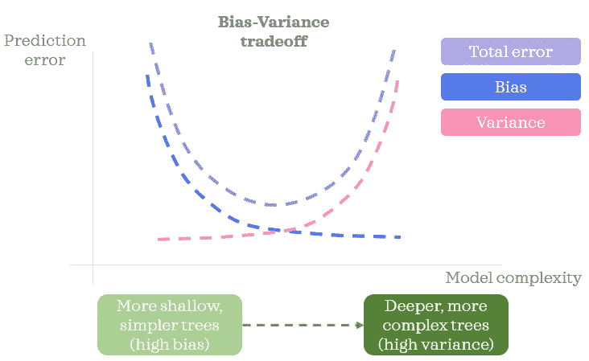

# 比较随机森林和梯度增强

> 原文：<https://towardsdatascience.com/comparing-random-forest-and-gradient-boosting-d7236b429c15?source=collection_archive---------11----------------------->

## 数据科学基础

## 对它们的相似之处和不同之处的简短总结

玛丽塔·卡维拉什维利在 [Unsplash](https://unsplash.com?utm_source=medium&utm_medium=referral) 上拍摄的照片

随机森林和梯度推进机被认为是结构化数据的一些最强大的算法，特别是对于中小型表格数据。如果您正在学习或实践数据科学，很可能您已经听说过它们，甚至使用过它们。如果你想刷掉和/或加深你对这些算法的理解，这篇文章试图提供一个关于它们的相似性和差异性的简明摘要。

# 📍 1.类似

让我们先来总结一下关键的相似之处。

## 📗 1.1.模型类型

两种算法都是基于*树的集成*算法。让我们进一步分析一下:
◼️*‘基于树’:*都使用决策树作为他们的构建模块
◼*‘集合’:*聚集*多个*决策树来构建一个更健壮的模型

两者都可以像决策树一样用于分类和回归。

## 📗 1.2.特征尺度

这些基于树的算法通常不需要特征缩放。这是因为决策树对特征的尺度不敏感。出于同样的原因，离群值通常不是这些算法的问题。然而，离群值可能仍然需要一些关注，因为它们有时可能代表潜在的数据质量问题。

## 📗 1.3.多重共线性

当两个或多个要素高度相关时，会出现多重共线性。这个问题会导致线性模型的结果(如系数)不可靠，因为它们对数据做了某些假设。幸运的是，决策树不对数据做任何假设。这意味着基于树的算法对多重共线性是鲁棒的。但是，如果您的要素高度相关，您可能会受益于删除一些相关的要素，因为它们可能不会提供新的信息。

# 📍 2.差异

在我们深入总结主要差异之前，让我们快速回顾一下。根据我们如何训练和规范决策树，树的范围可以从*浅简单欠拟合树(高偏差)*到*深复杂过拟合树(高方差)*。换句话说，预测误差主要是由于偏差还是方差，取决于树的复杂性。在接下来的章节中，记住这个概念将会很有帮助。

作者图片

对于第 2 节的剩余部分，我们将从三个不同的角度来看这两种算法的差异:
*A .数据:*将训练数据馈入集合中的树
*B .训练:*整个训练过程
*C .预测:*整个预测过程

先说随机森林。

## 📒2.1.A .随机森林数据

每棵树的训练数据由于以下原因而不同:
◼️️首先，随机记录(行)被采样*，替换*每棵树。这种替换取样过程也称为*自举*，抽取的样本称为*自举样本。*引导样本*通常*具有与原始训练数据相同的记录数，这意味着它可以多次包含相同的记录。有一个相关术语需要注意:*开箱样品*。它是指不包括在决策树的引导样本中的记录。这类似于验证或测试数据，因为这些记录不用于训练树。
◼️️其次，还有*特征随机性*(栏目)。不是使用所有可用的特征，而是在训练时在每个节点选择特征子集，或者在训练之前为每个训练数据选择特征子集。

由于这种随机性，决策树变得不那么相关，彼此更加独立。

## 📒2.1.B .随机森林培训

当涉及到训练模型时，森林中的决策树可以并行*训练*，因为树之间没有依赖关系。根据数据大小和计算能力等因素，这有时会导致*更快的*训练时间。

通常*更深更复杂的树*(高方差低偏差模型)被推荐用于随机森林。这是因为多个去相关的过度拟合的树作为一个整体会导致结果森林中的较低方差。这意味着你应该开始你的训练过程，让你的树长得又大又复杂，并尽量减少规则。如果你看到`sklearn`的文档(v0.24.2)，你会看到最大深度默认设置为`None`。

在随机森林中，拥有更多的树通常会给你更健壮的结果。然而，在某个时候添加越来越多的树的好处将不再超过它所需要的额外计算。

## 📒2.1.C .随机森林预测

随机森林*聚集*来自每棵树的预测，并使用*典型*预测作为最终预测。选择最常见的预测类别用于分类，而平均预测用于回归。每棵树对最终预测的贡献是相等的。

顺便说一下，***b****ootstrapp****ing****和***agg****regation*统称为 *bagging* ，一种集合方法。*

*现在让我们继续梯度推进机。*

## *📘2.2.A .梯度推进机器数据*

*一般来说，训练数据按原样使用*而不需要为梯度增强机重新采样*。但是*因变量对于每棵树*都会改变 *。**

*另一方面，在*随机梯度推进机中，随机记录被采样*而不替换*每棵树。*该取样过程允许保留*出袋样品*的剩余记录，该记录可用于培训期间的评估。随机梯度推进机还考虑了每个节点或每个训练数据的特征子集，以提高模型的性能。*

## *📘2.2.B .梯度推进机器培训*

*梯度增强机器使用一种称为增强的集成方法。在 boosting 中，决策树被顺序训练，以便作为一个组逐渐提高预测能力。这里有一个训练流程的例子:
1。从一个模型开始(这可能是一个非常简单的单节点树)
2。使用第一个模型进行预测，看看当前误差有多差
3。以当前误差为因变量训练下一棵树(本次训练过程中之前的树保持不变)
4。使用到目前为止建立的所有树进行预测，看看新的当前误差有多差
5。对其余的树重复 3 & 4*

*从这个流程中，你可能注意到了两件事:
◼因变量因每棵树而异
◼后面的决策树依赖于前面的树。*

*这是考虑训练过程的另一种方式:当构建模型时，我们希望能够使用特征提供的信息来解释目标变量的方差。如果第一个模型解释了 60%的方差，那么还有 40%的方差需要解释。如果第二个模型解释了第一个模型遗漏的剩余 40%方差中的额外 5%,那么这两个模型合起来可以解释 65%的方差。它们各自扮演着不同的角色，相辅相成。随着构建更多的树，树的集体预测能力提高，并且树一起可以解释目标的更多变化。*

*这种顺序训练过程有时会导致训练时间变慢，但它还取决于其他因素，如数据大小和计算能力。*

*与随机森林不同，增加树的数量太多会导致梯度增强机器中的过度拟合问题，因为新的树可能会试图预测训练数据中的复杂模式。如果你发现你的梯度推进机器安装过多，一个可能的解决办法是减少树木的数量。*

*梯度助推器有一个重要术语:*学习率*。这也被称为*α，收缩*或*步长*。学习率范围在 0 到 1 之间。如果学习率越接近 0，你的训练过程就越小心越慢。然而，较小的学习率有助于建立一个更通用的模型。与使用较高的学习率相比，当用较小的学习率生长许多树时，该模型也不容易过度拟合。*

*最后，boosting 方法旨在组合简单模型(高偏差)。所以保持你的树*浅*和*简单*是有好处的。*

## *📘2.2.B .梯度推进机器-预测*

*梯度推进机器将来自所有树的所有预测相加，以获得回归和分类的最终预测。*

*最后，需要强调的是，这篇文章中总结的内容是通用的。当在实践中使用这些算法时，最好理解这些通用概念对于您正在使用的算法的实现意味着什么。以随机森林的`sklearn`实现为例，有一个参数叫`bootstrap`。默认情况下，它被设置为`True`，以便引导样本用于决策树。但是，如果您将此超参数更改为`False`，那么您将不再使用引导样本。*

**

*照片由 [J-Photos](https://unsplash.com/@jd_photo?utm_source=medium&utm_medium=referral) 在 [Unsplash](https://unsplash.com?utm_source=medium&utm_medium=referral) 上拍摄*

**您想要访问更多这样的内容吗？媒体会员可以无限制地访问媒体上的任何文章。如果您使用* [*我的推荐链接*](https://zluvsand.medium.com/membership)*成为会员，您的一部分会费将直接用于支持我。**

*感谢您阅读我的文章。如果你感兴趣，这里有我其他一些帖子的链接:
◼️️ [决策树是如何构建的？](/how-are-decision-trees-built-a8e5af57ce8?source=your_stories_page-------------------------------------)
◼️️ [管道、ColumnTransformer 和 FeatureUnion 说明](/pipeline-columntransformer-and-featureunion-explained-f5491f815f?source=your_stories_page-------------------------------------)
◼️️ [FeatureUnion、ColumnTransformer &管道用于预处理文本数据](/featureunion-columntransformer-pipeline-for-preprocessing-text-data-9dcb233dbcb6)*

*再见🏃 💨*

# *📁参考*

*◼[trever hastie](https://www.youtube.com/watch?v=wPqtzj5VZus)◼[bootstrap 聚合 bagging by uda city](https://www.youtube.com/watch?v=2Mg8QD0F1dQ)t14】◼[梯度推进:Terence Parr 和 Jeremy Howard 常见问题解答](https://explained.ai/gradient-boosting/faq.html)*