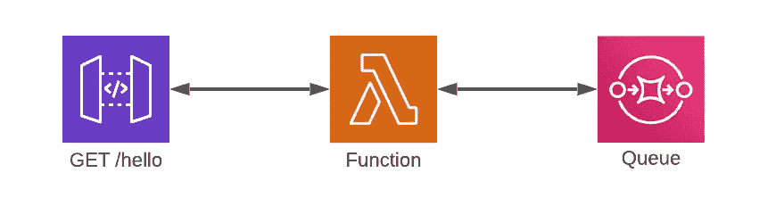
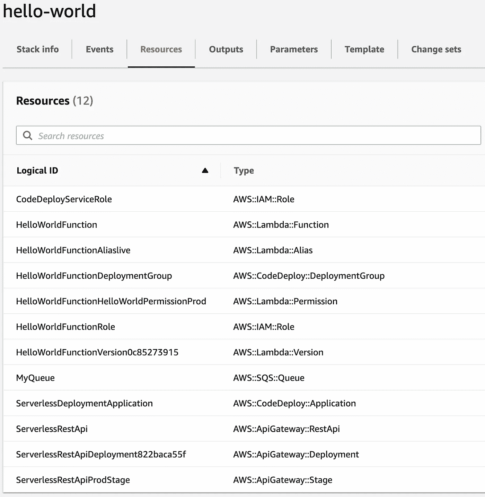
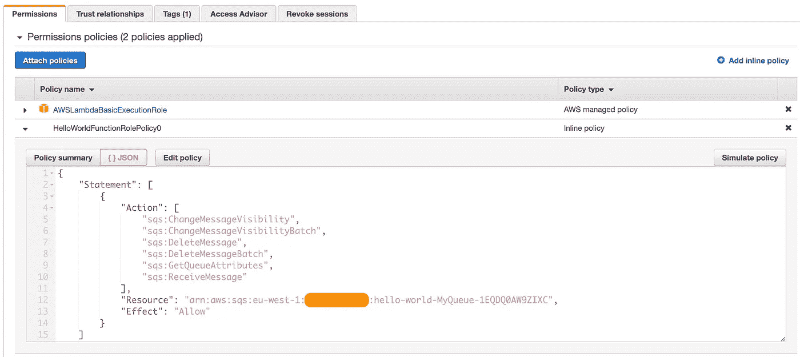
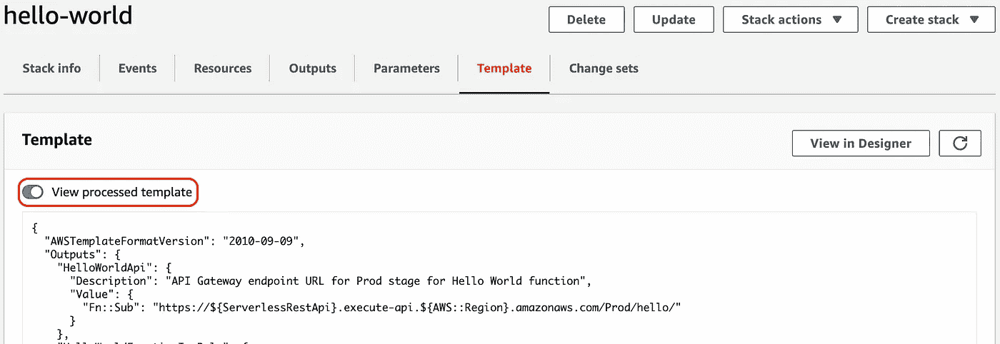

# 使用 SAM 调配基础架构

> 原文：<https://towardsdatascience.com/comparing-sam-to-cloudformation-e5f48b271625?source=collection_archive---------25----------------------->

## 更轻松地将 AWS 无服务器基础设施定义为代码

将基础设施写成代码，有大量的工具可供我们使用，以快速的周转时间提升服务。在[亚马逊网络服务(AWS)](https://aws.amazon.com/) 的情况下，我们有[AWS cloud formation](https://aws.amazon.com/cloudformation/)——最初的 AWS 产品，[于 2011 年 2 月推出](https://aws.amazon.com/about-aws/whats-new/2011/02/25/introducing-aws-cloudformation/)——最近由 [AWS 无服务器应用模型](https://docs.aws.amazon.com/serverless-application-model/) (SAM)补充，这是五年后在 2016 年 11 月宣布的[。](https://aws.amazon.com/about-aws/whats-new/2016/11/introducing-the-aws-serverless-application-model/)

我们可能会问，SAM 如何补充云形成？不管有没有 SAM，我们都可以提供无服务器基础设施作为 AWS 的代码，那么 SAM 提供了什么价值使它成为对工程师有吸引力的框架呢？

无服务器应用程序的构建块。来源:[弗兰克·麦肯纳转自 Unsplash](https://unsplash.com/photos/tjX_sniNzgQ)

# SAM 如何补充 CloudFormation？

虽然 CloudFormation 支持绝大多数服务，但 SAM 特定于无服务器领域，为资源提供更高级别的构造，如 [AWS Lambda](https://aws.amazon.com/lambda/) 函数、 [Amazon DynamoDB](https://aws.amazon.com/dynamodb/) NoSQL 表和 [AWS 步骤函数](https://aws.amazon.com/step-functions/)状态机。专注于 Lambda 函数，CloudFormation 支持一个 [AWS::Lambda::Function](https://docs.aws.amazon.com/AWSCloudFormation/latest/UserGuide/aws-resource-lambda-function.html) 构造，SAM 使用自己的[AWS::server less::Function](https://docs.aws.amazon.com/serverless-application-model/latest/developerguide/sam-resource-function.html)产品构建该构造。

深入这些构造的细节，我们观察到它们之间支持的属性的差异。后者提供了额外的字段，如`AutoPublishAlias`、`DeploymentPreference`和`EventInvokeConfig`。无服务器构造的 SAM 文档还在其每个属性下引用了*AWS cloud formation compatibility*，在适用的情况下将这些内容映射到 Lambda 对应内容。

除了 Lambda 函数，SAM 的无服务器函数还可以创建 [IAM 策略文档](https://docs.aws.amazon.com/IAM/latest/UserGuide/access_policies.html)、 [Lambda 别名](https://docs.aws.amazon.com/lambda/latest/dg/configuration-aliases.html)和 [AWS CodeDeploy 部署组](https://docs.aws.amazon.com/codedeploy/latest/userguide/deployment-groups.html)。使用普通的 CloudFormation，将需要更多的构造来提供这些资源，这就给我们留下了实现相同结果的额外工作。

让我们通过例子来展示这一点，首先从 SAM 开始，然后我们可以用 vanilla CloudFormation 复制它。我们将该函数集成到一个[Amazon API Gateway](https://aws.amazon.com/api-gateway/)GET`/hello`端点中，并授予该函数轮询一个 [AWS 简单队列服务(SQS)](https://aws.amazon.com/sqs/) 队列的权限。

作者图片

# 使用 SAM 进行资源调配

安装 SAM CLI ，我们可以为无服务器功能导入 Hello world 模板。这包括打包到目录`hello_world`中的代码，运行 [Python 3.9](https://www.python.org/downloads/release/python-390/]) ，以及在`Events`属性中隐式定义的 API 网关资源。这个网关包括一个 GET `/hello`端点。

为了全面比较 SAM 和 CloudFormation，让我们在`Events`属性后添加额外的配置。具体来说，

*   一个 [IAM 角色策略文档](https://docs.aws.amazon.com/IAM/latest/UserGuide/access_policies.html)供[亚马逊 EC2](https://aws.amazon.com/ec2) 或 Lambda 承担，
*   自动生成的称为`live`的[λ别名](https://docs.aws.amazon.com/lambda/latest/dg/configuration-aliases.html)，
*   [金丝雀部署](https://docs.aws.amazon.com/serverless-application-model/latest/developerguide/automating-updates-to-serverless-apps.html)先部署 10%，五分钟后部署 90%，
*   授予 SQS 队列轮询权限的 IAM 策略，
*   [提供 10 次执行的并发性](https://docs.aws.amazon.com/lambda/latest/dg/configuration-concurrency.html)，以及
*   正在部署的 [Lambda 版本](https://docs.aws.amazon.com/lambda/latest/dg/configuration-versions.html)的描述。

有很多东西需要思考——充分利用 SAM 的产品进行公平的比较。注意，我们还将创建该函数被授予轮询权限的 SQS 队列，但是我们不会在这里显式地集成这两个队列。让我们假设这种情况发生在 Lambda 的 Python 代码中，我们不会把它作为比较的一部分。

在撰写本文时，SAM CLI 愉快地部署了这个模板。在 CloudFormation 控制台上查看调配的`hello-world`堆栈，创建了 12 个资源——从无服务器功能本身，到 IAM 角色，到 REST API 资源——所有这些都源自这个简短的代码片段。

作者图片

# 云形成的供应

转到香草云形成，我们不再有萨姆的复杂构造的奢侈品。现在，我们必须自己定义所有 12 种资源。

从哪里开始？让我们首先为 Lambda 函数创建 IAM 角色:除了策略文档允许 EC2 和 Lambda 承担角色之外，还授予轮询队列`MyQueue`的权限——与 SAM 提供的现成内容`SQSPollerPolicy`完全匹配。查看 SAM 之前授予的 IAM 权限，我们可以看到下面的详细信息，我们希望使用 CloudFormation 复制这些信息。

作者图片

我们需要显式定义一个 [AWS::IAM::Role](https://docs.aws.amazon.com/AWSCloudFormation/latest/UserGuide/aws-resource-iam-role.html) 资源来复制它。`AssumeRolePolicyDocument`与我们用 SAM 定义的完全相似——因为 SAM 代表我们直接映射这个属性——而附加的策略被证明更麻烦。从上面我们看到的，我们有两个要配置:除了匹配`SQSPollerPolicy`的定制策略文档之外，还有用于标准 Lambda 权限的 AWS 托管策略`AWSLambdaBasicExecutionRole`。

我们已经写了 29 行代码，只差 SAM 模型对我们的要求。到目前为止，我们只有权限！让我们继续创建堆栈之王 Lambda 函数本身。看起来与 SAM 的功能大致相似，我们可以定义后者提供给我们的功能的子集，包括代码源(在`Code`而不是`CodeUri`)、Python 3.9 运行时和 x86 架构。我们还可以显式引用创建的 IAM 角色。

使用 SAM，我们能够在 Lambda 函数上配置版本控制，并将别名`live`应用到最近部署的迭代中。使用 plain CloudFormation，我们必须自己定义一些资源来实现这一点:特别是 [AWS::Lambda::Version](https://docs.aws.amazon.com/AWSCloudFormation/latest/UserGuide/aws-resource-lambda-version.html) 和 [AWS::Lambda::Alias](https://docs.aws.amazon.com/AWSCloudFormation/latest/UserGuide/aws-resource-lambda-alias.html) 。我们将匹配我们之前对该版本的描述，同时在我们的别名上设置相同的配置并发性。

为了对每个版本执行分阶段部署，我们需要建立一个 [CodeDeploy 部署组](https://docs.aws.amazon.com/codedeploy/latest/userguide/deployment-groups.html)，这需要一个 [CodeDeploy 应用程序](https://docs.aws.amazon.com/codedeploy/latest/userguide/applications.html)和一个 IAM 角色，该角色授予与 Lambda 交互的足够权限。与默认配置的 SAM 设置完全一样，该组将协调蓝绿色部署。

最后，但同样重要的是，我们希望用 endpoint GET `/hello`复制 REST API。虽然有多种方法可以实现这一点，让我们假设我们有开放的 API 规范`spec.yml`，让我们也指定我们想要的艺名`Prod`，复制山姆之前为我们创建的东西。

SQS 的队列看起来和以前一模一样——因为 SAM 在这一部分没有发挥任何作用——让我们的 Lambda 替代方案结束了。不包括队列，这总共需要 85 行不带空格的代码。与使用 SAM 的 34 行代码相比，vanilla CloudFormation 需要更多的 YAML 代码来理解和维护。

# 值得收养山姆吗？

从表面上看，阅读这一判决，我们很容易为“是”而欢呼。为什么不呢？这是一个很好的框架。除了简化 JSON 或 YAML 模板， [SAM 是一个开源项目](https://github.com/aws/serverless-application-model)，而 CloudFormation 只公开分享其[覆盖路线图](https://github.com/aws-cloudformation/cloudformation-coverage-roadmap)。如果 SAM 有任何功能或缺陷，为什么不创建一个问题并为项目做出贡献呢？

请记住，SAM 是专为无服务器设计的。它只支持配置的子集，比如单属性主键 DynamoDB 表。对于特定的需求，它是一个很好的包装器，但是对于任何更复杂的东西，CloudFormation 都是你的朋友。

为了简化开发过程，SAM 还在其更高层次的构造中隐藏了一些 CloudFormation 模板逻辑。如果 SAM 转换出现任何问题，这可能会被证明是有问题的。在这种情况下，我们可以通过 CloudFormation 控制台调试转换后的模板:按名称搜索堆栈，转到“模板”，然后启用“查看已处理的模板”。禁用此选项将显示用于比较的源 SAM 模板。

作者图片

虽然 SAM 可以满足您对无服务器的需求，但还有其他更高级别的框架以代码形式提供基础架构，支持更广泛的 AWS 服务，具有不同程度的功能覆盖范围:仅举几个例子来说， [AWS 云开发工具包(CDK)](https://aws.amazon.com/cdk) 和 [Terraform](https://aws.amazon.com/blogs/apn/terraform-beyond-the-basics-with-aws) 。如果您对本文中提到的任何框架有经验——不管是积极的还是消极的——欢迎您的来信。