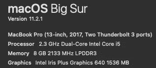
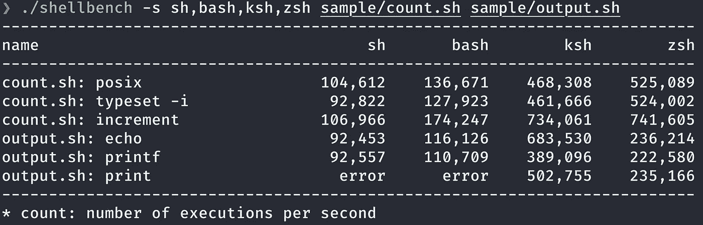
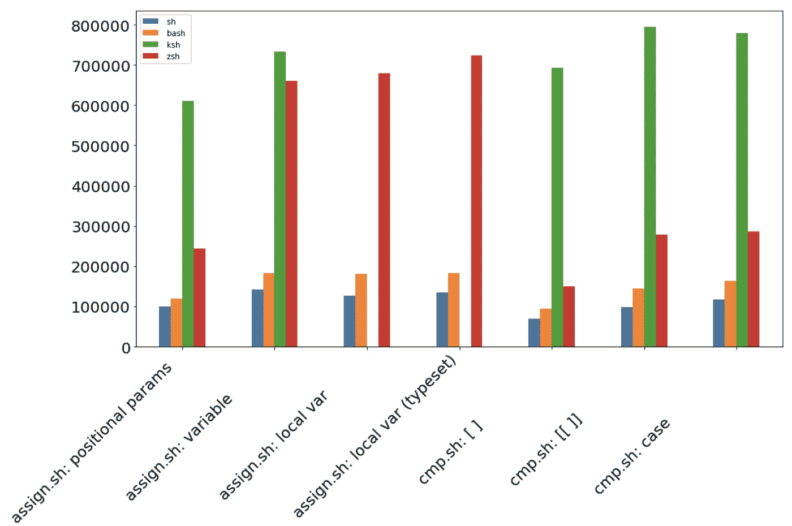
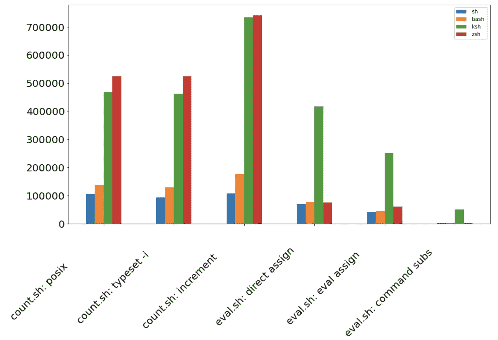
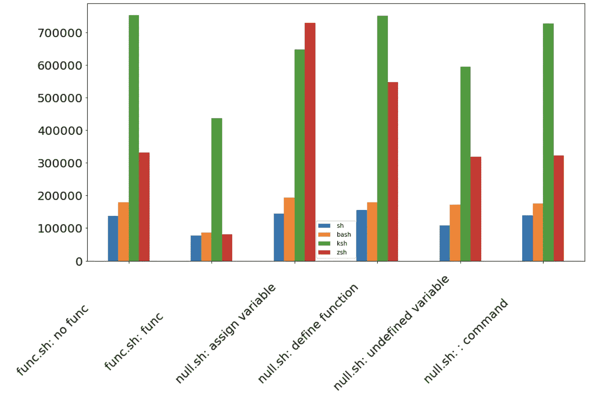
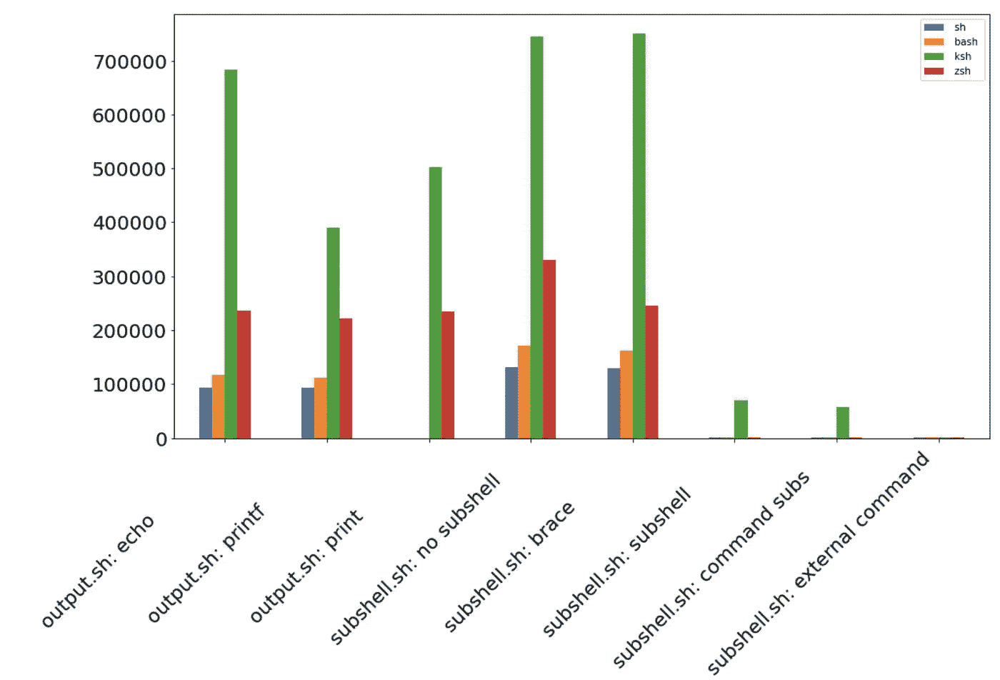
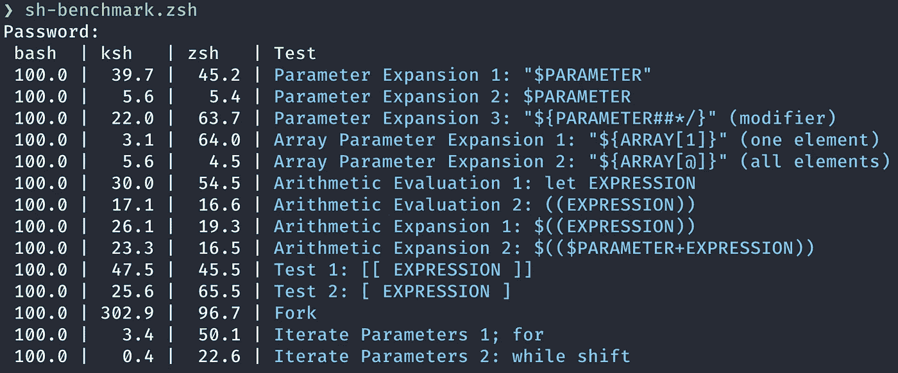
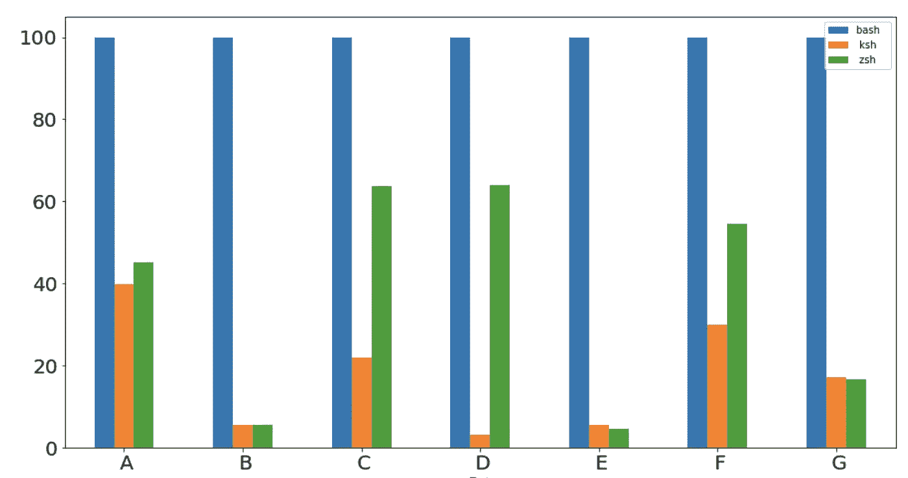
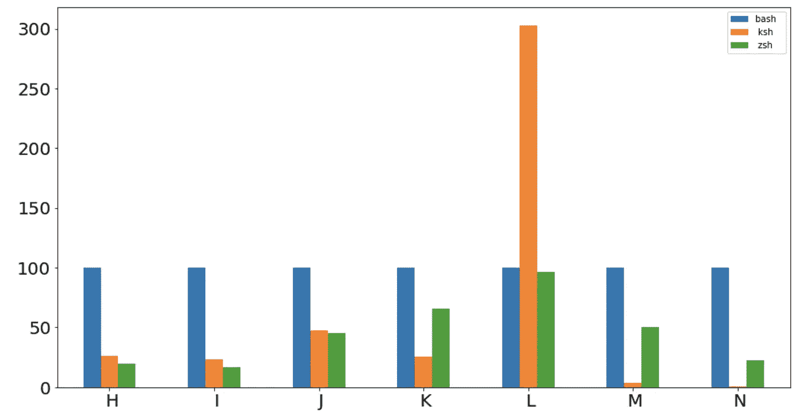

# 比较上海、巴什、KSH 和 ZSH 的速度

> 原文：<https://towardsdatascience.com/comparing-sh-bash-ksh-and-zsh-speed-82a72bbc20ed?source=collection_archive---------17----------------------->

## 获胜者去…击鼓…


保罗·坎德罗在 [Unsplash](https://unsplash.com?utm_source=medium&utm_medium=referral) 拍摄的照片

# 介绍

我经常听说 Bash 很慢。所以我花了一个周末来检查它有多慢。我用了两种方法。第一个是 [ShellBench](https://github.com/shellspec/shellbench) 。ShellSpec 为 POSIX shell 比较创建了一个基准实用程序。第二个是由@satoh_fumiyasu 创作的 sh-benchmark 脚本。

继续读下去，看看我发现了什么。

# 我的环境

我用的是 MacBook Pro。



我的 MacBook Pro 规格。图片作者。

这些是我的`sh`、`bash`、`ksh`和`zsh`版本:

```
❯ sh --version
GNU bash, version 3.2.57(1)-release (x86_64-apple-darwin20)
Copyright (C) 2007 Free Software Foundation, Inc.❯ bash --version
GNU bash, version 5.1.4(1)-release (x86_64-apple-darwin20.2.0)
Copyright (C) 2020 Free Software Foundation, Inc.
License GPLv3+: GNU GPL version 3 or later <[http://gnu.org/licenses/gpl.html](http://gnu.org/licenses/gpl.html)>This is free software; you are free to change and redistribute it.
There is NO WARRANTY, to the extent permitted by law.❯ ksh --version
  version         sh (AT&T Research) 93u+ 2012-08-01❯ zsh --version
zsh 5.8 (x86_64-apple-darwin20.0)
```

# 脱壳工作台

您可以使用 ShellBench 对任何 shells、`sh`、`bash`、`ksh`、`mksh`、`posh`、`zsh`等进行测试。它返回每秒执行的次数。它提供了八个[样本基准测试](https://github.com/shellspec/shellbench/tree/master/sample)。

ShellBench 统计样本代码执行的次数。“分配样本测试”测试以不同的方式分配变量，“计数样本测试”测试不同的计数方式，等等。

ShellBench 样本测试详细信息

我使用了`sh`、`bash`、`ksh`和`zsh`的所有样本测试。



Shellbench 的测试示例。图片作者。

这是我的一个结果的表格。

# 结果

测试返回每秒执行的次数，这意味着下图中的图形越高，结果越好。

**分配和 cmp**

`sh`:蓝色、`bash`:黄色、`ksh`:绿色、`zsh`:红色。



“分配和 cmp”测试结果之一。图片由 Authro 提供。

**计数和评估**



“计数和评估”测试结果之一。图片作者。

**func 和 null**



“功能和无效”测试结果之一。图片作者。

**输出和子外壳**



“输出和子外壳”测试结果之一。图片作者。

`ksh`和`zsh`似乎比`bash`快七倍。`ksh`在 17 项测试中表现优异，`zsh`在 6 项测试中表现优异。

# sh 基准

sh-benchmark 测试参数扩展、数组参数扩展、算术求值、测试和迭代参数。

sh 基准测试的详细信息。图片作者。



我的一个成果。图片作者。

该脚本返回与 bash 结果相关的结果。所有数字都是百分比。所以数字越小意味着越快。

`bash`:蓝色、`ksh`:黄色、`zsh`:绿色



a-G 测试结果。



氢-氮试验结果。

`zsh`是六次测试中最快的，`ksh`是七次测试中最快的。

有趣的是`zsh`对于 Fork 测试来说非常慢。

# 我是如何测试的(如果你感兴趣的话)

如果你想自己测试，你可以按照这个。

**脱壳工作台**

您可以克隆 [Shellbench](https://github.com/shellspec/shellbench) ，使`shellbench`文件可执行，并运行脚本:

```
$ ./shellbench -s sh,bash,ksh,zsh sample/count.sh sample/output.sh
```

**sh-基准**

将 [sh-benchmark.zsh](https://gist.github.com/shinokada/f63535a0f3db76d819210ffa9cb14fc5) 和 [sh-benchmark-scripts](https://gist.github.com/shinokada/753c9b42c172c11f4d52eea22e45bbf3) 复制到同一个目录下。使 sh-benchmark.zsh 成为可执行文件，并在您的终端上运行它:

```
$ sh-benchmark.zsh
```

# 结论

根据我的测试，`ksh`是冠军，`zsh`是亚军。根据测试结果，两种外壳都比`bash`快 2-30 倍。

如果你像 [Google Shell 风格指南](https://google.github.io/styleguide/shellguide.html#s1.2-when-to-use-shell)建议的那样使用`bash`少于 100 行，那么我认为你不会注意到其中的区别。虽然这当然取决于任务。

**通过** [**成为**](https://blog.codewithshin.com/membership) **会员，可以完全访问媒体上的每一个故事。**


[https://blog.codewithshin.com/subscribe](https://blog.codewithshin.com/subscribe)

# 参考

*   [https://fumiyas . github . io/2013/12/01/benchmark . sh-advent-calendar . html](https://fumiyas.github.io/2013/12/01/benchmark.sh-advent-calendar.html)
*   [https://github.com/shellspec/shellbench](https://github.com/shellspec/shellbench)

[](https://medium.com/better-programming/the-ultimate-programmers-guide-to-bash-scripting-2d11d4e6e978) [## Bash 脚本编程的终极程序员指南

### 深入探究 Bash 脚本，帮助您自动化任务

medium.com](https://medium.com/better-programming/the-ultimate-programmers-guide-to-bash-scripting-2d11d4e6e978) [](https://medium.com/better-programming/27-simple-bash-scripting-tips-for-beginners-d6764c977546) [## 初学者的 27 个简单 Bash 脚本技巧

### 不要害怕 Bash 脚本。看完这些提示会更容易

medium.com](https://medium.com/better-programming/27-simple-bash-scripting-tips-for-beginners-d6764c977546) [](https://medium.com/better-programming/13-fantastic-learning-tools-and-resources-for-bash-scripting-51a6de98015c) [## 13 个精彩的 Bash 脚本学习工具和资源

### 您将每天使用的替代 Bash 脚本工具

medium.com](https://medium.com/better-programming/13-fantastic-learning-tools-and-resources-for-bash-scripting-51a6de98015c)