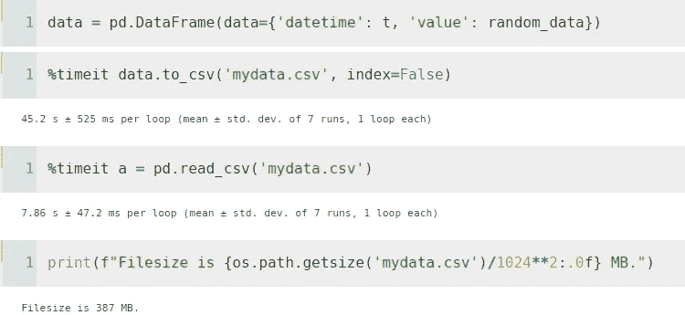
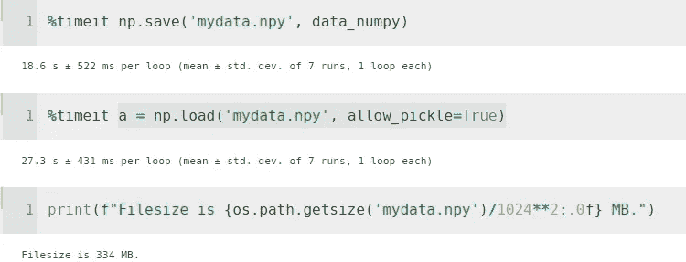
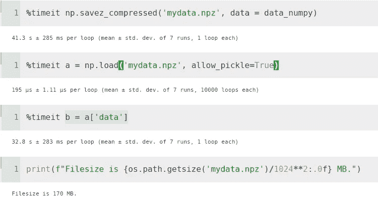
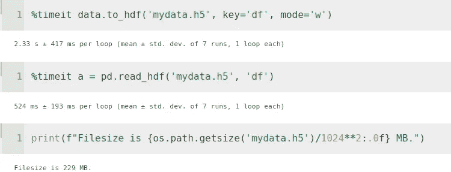
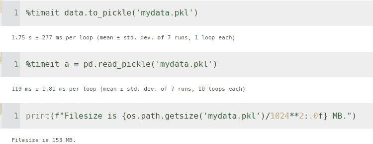
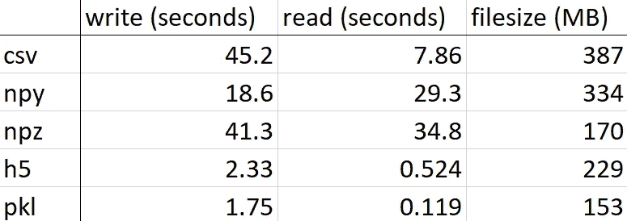

# 比较 to_csv()、np.save()、to_hdf()和 to_pickle()函数的速度和文件大小

> 原文：<https://towardsdatascience.com/comparing-the-speed-and-filesize-of-to-csv-np-save-to-hdf-to-pickle-functions-6c53a6a3fc82?source=collection_archive---------15----------------------->

## 在日常 I/O 操作中，读取时间加速 66 倍，写入时间加速 25 倍，文件大小加速 0.39 倍。

由[红色齐柏林飞艇](https://unsplash.com/@redzeppelin)在 [Unsplash](https://unsplash.com/photos/pfiRyJvpyrE) 拍摄的照片

使用 Pandas 和 NumPy 读写文件是数据科学家和工程师的日常任务。

让我们比较一下这些库提供的最常见的写/读表格数据的函数。

在这些 I/O 操作中，我们可以让我们的代码快得多**节省时间，让我们的老板和我们自己都高兴。**

我们还可以通过选择适当的保存功能来节省大量的磁盘空间。

首先，让我们创建一个 10，000，000 行 2 列的数据框架。

# to_csv() / pd.read_csv()

保存熊猫数据帧最常见的方法。

# np.save() / np.load()到。神经肽 y

我们可以将 DataFrame 转换为 NumPy 数组，然后使用 np.save()将其保存为. npy 文件。

np.save()比 to_csv()
快× 2.43 倍，np.load()比 pd.read_csv()
慢× 3.47 倍。npy 文件的大小为× 0.86。csv 文件

当我们读取它时，它将是一个 NumPy 数组，如果我们想把它用作熊猫数据帧，我们需要转换它。

从 np.load()到 DataFrame 的转换需要+2.06 秒

# np.savez_compressed() / np.load()到。npz

np.save()的压缩版本。

阅读时。npz 文件需要 195 μs，但是为了访问其中的 NumPy 数组，我们必须使用`a['data']`，这需要 32.8 s。

np.savez_compressed()比 to_csv()
快× 1.1 倍，np.load()比 pd.read_csv()
快× 1.37 倍。npy 文件的大小为× 0.44。csv 文件

当我们读取它时，它将是一个 NumPy 数组，如果我们想把它用作熊猫数据帧，我们需要转换它。正如我们之前看到的，这又需要 2.06 秒。

# to_hdf() / pd.read_hdf()

使用 HDFStore 将包含的数据写入 HDF5 文件。

to_hdf()比 to_csv()
快× 19.4 倍 pd.read_hdf()比 pd.read_csv()
快× 15 倍. h5 文件是× 0.59 的大小。csv 文件

# to_pickle() / pd.read_pickle()

将对象序列化到文件

to_pickle()比 to_csv()
快× 25.8 倍，pd.read_pickle()比 pd.read_csv()
快× 66 倍。pkl 文件的大小为× 0.39。csv 文件

# 摘要

当我们只对在 Python 程序中使用文件感兴趣时，我们可以有效地使用 pickles，因为它们在读写操作和磁盘空间方面都要快得多。

## 不确定接下来要读什么？这里有两个选择:

 [## 时间序列分析与理论、图表和代码第 1 部分

### 什么是时间序列，预测任务的步骤是什么？如何绘制趋势和季节性？如何…

towardsdatascience.com](/time-series-analysis-with-theory-plots-and-code-part-1-dd3ea417d8c4)  [## 对我观看的电影进行主题建模

### 将 IMDb 与维基百科电影数据合并，使用 LDA 构建、评估和可视化主题。

medium.com](https://medium.com/analytics-vidhya/topic-modeling-on-my-watched-movies-1d17491803b4) 

## 保持联络

关注我的 [Medium](https://medium.com/@dimitris.effrosynidis) 了解更多类似内容。
让我们在 [LinkedIn](https://www.linkedin.com/in/dimitrios-effrosynidis/) 上连线。
检查我的 [GitHub](https://github.com/Deffro) 。