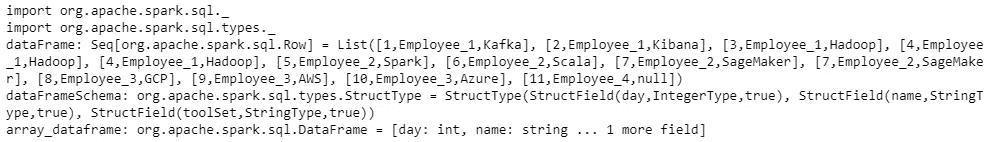
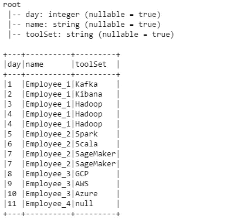
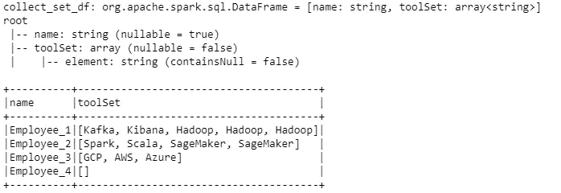
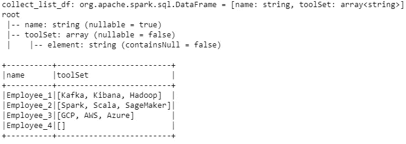
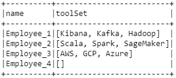

# Spark 和 Scala 中 collect_list()和 collect_set()函数的比较

> 原文：<https://towardsdatascience.com/comparison-of-the-collect-list-and-collect-set-functions-in-spark-with-scala-10b3ba1b74b6?source=collection_archive---------4----------------------->

## 利用 Scala 实现大数据

## Scala 编程中 collect_list()和 collect_set()的区别


[信号源](https://pixabay.com/photos/apple-fruit-selection-especially-1632919/)

可以在不同的编程语言上用不同的版本创建数组格式的变量。Spark 上的 Scala 语言有两个不同的数组创建函数。这些被称为`collect_list()`和`collect_set()`函数，主要应用于生成的数据帧上的数组类型的列，通常在窗口操作之后。

在本文中，这两个函数之间的差异将通过相应的实例来解释。主要目的是比较和强调以下两个函数之间的差异，因为它们可能会在误导的情况下使用。

作为编程语言，Scala 被选择用于 Spark 3.1.1。您可以通过使用 PySpark 语言来实践类似的方法。

出于测试目的，可以生成如下示例结构类型化数据帧。在代码片段中，通过添加相应的内容来创建表的行。在创建行之后，我们可以将这些列添加到我们的数据模式中，方法是使用匹配的数据类型对它们进行格式化，比如对*日*列使用 *IntegerType* ，对*名*列使用 *StringType* 。

```
import org.apache.spark.sql._
import org.apache.spark.sql.types._val dataFrame = Seq(
    Row(1,"Employee_1", "Kafka"), 
    Row(2,"Employee_1", "Kibana"), 
    Row(3,"Employee_1", "Hadoop"), 
    Row(4,"Employee_1", "Hadoop"),  
    Row(4,"Employee_1", "Hadoop"),
    Row(5,"Employee_2", "Spark"), 
    Row(6,"Employee_2", "Scala"),  
    Row(7,"Employee_2", "SageMaker"), 
    Row(7,"Employee_2", "SageMaker"),
    Row(8,"Employee_3", "GCP"), 
    Row(9,"Employee_3", "AWS"),
    Row(10,"Employee_3", "Azure"),
    Row(11,"Employee_4", null)
  )
val dataFrameSchema = new StructType().add("day", IntegerType).add("name", StringType).add("toolSet", StringType)val array_dataframe = spark.createDataFrame(spark.sparkContext.parallelize(dataFrame),dataFrameSchema)
```



产出 1，归作者所有

在 dataframe 创建阶段之后，我们可以打印数据及其内容的模式。

```
array_dataframe.printSchema()
array_dataframe.show(false)
```



产出 2，归作者所有

我们创建了包含三列的数据框架，分别是*日*，员工的*名*，以及他们的*工具集*。

我们的下一步将通过使用`collect_list()`和`collect_set()`函数为这些员工的相应工具集创建数组。

# collect_list()

第一个数组创建函数叫做`collect_list()`。它既可以用来对值进行分组，也可以借助窗口操作对它们进行聚合。

在下面的脚本中，有一个名为*名称*和*工具集*的列。当深入观察时，员工 1 有三个工具，有两个副本，员工 2 有三个工具，有一个副本。对于这个具体的例子，我们可以按雇员分组，并将所有的*工具集*收集到一个数组中。可以通过首先对员工进行分组并在*工具集*上进行聚合来实现。

collect list 的关键亮点是函数**通过保持项目的顺序将所有重复的值**保存在数组中。

```
val collect_list_df = array_dataframe.groupBy("name").agg(**collect_list**("toolSet").as("toolSet"))collect_list_df.printSchema()
collect_list_df.show(false)
```



产出 3，归作者所有

当我们希望通过保持项目*(日期、时间戳、id 等)的顺序来消除不同的值时。)*，在应用 **collect_list** 函数之前，我们可以先使用 **array_distinct()** 函数。在下面的例子中，我们可以清楚地看到元素的初始顺序被保留了。例如，Employee_1，我们看到 Kafka、Kibana、Hadoop 项目的初始顺序在应用了`collect_list()`操作后保持为 Kafka、Kibana、Hadoop，没有丢失序列。

```
val collect_list_df = array_dataframe.groupBy("name").agg(**array_distinct**(**collect_list**("toolSet")).as("toolSet"))collect_list_df.printSchema()
collect_list_df.show(false)
```



产出 4，归作者所有

# collect_set()

第二个数组创建函数叫做`collect_set()`。它既可以用来对值进行分组，也可以借助窗口操作对它们进行聚合。

在下面的脚本中，有一个名为 *name* 和 *toolSet* 的列。当深入观察时，员工 1 有三个工具，有两个副本，员工 2 有三个工具，有一个副本。对于这个特定的例子，我们可以按雇员分组，并将所有的*工具集*收集到一个数组中。可以通过首先对员工进行分组并在*工具集*上进行聚合来实现。

收集列表的关键亮点是函数**消除了数组中的重复值**。然而，它**并不能保证数组中项目的顺序**。通过查看 Employee_1，我们看到在应用了`collect_set()`操作之后，Kafka、Kibana、Hadoop 的项目的初始顺序被更改为 Kibana、Kafka、Hadoop。

```
val collect_set_df = array_dataframe.groupBy("name").agg(**collect_set**("toolSet").as("toolSet"))collect_set_df.show(false)
```



产出 5，归作者所有

# 结论

在 Spark 中，我们可以使用`collect_list()`和`collect_set()`函数来生成具有不同视角的数组。

`collect_list()`操作不负责统一数组列表。它按照元素的现有顺序填充所有元素，并且不删除任何重复的元素。

另一方面，`collect_set()`操作确实消除了重复；但是，它不能保存数组中项目的现有顺序。

为了统一数组中的元素，我们可以在 **collect_list()** 函数之前轻松使用 **array_distinct()** 内置函数来消除重复值，而不会丢失数组中元素的顺序。

非常感谢您的提问和评论！

# 参考

1.  [Spark 3 中 ScalaDoc 的收集集合和收集列表操作](https://spark.apache.org/docs/latest/api/scala/org/apache/spark/sql/functions$.html#collect_list(columnName:String):org.apache.spark.sql.Column)
2.  [Spark 内置功能](https://spark.apache.org/docs/latest/api/sql/index.html)
3.  [来自 Collect_List 的数据块示例](https://databricks-prod-cloudfront.cloud.databricks.com/public/4027ec902e239c93eaaa8714f173bcfc/1023043053387187/4464261896877850/2840265927289860/latest.html)