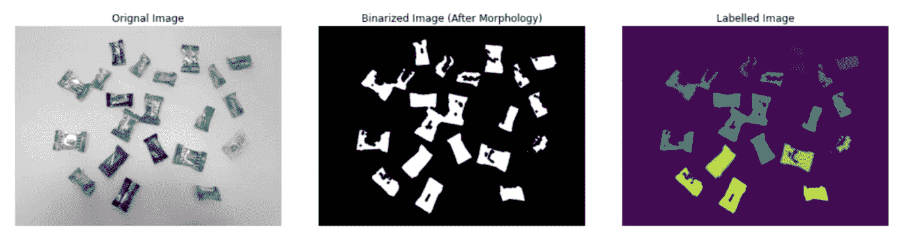

# 用图像处理补充机器学习算法

> 原文：<https://towardsdatascience.com/complementing-machine-learning-algorithms-with-image-processing-938b1b926014?source=collection_archive---------38----------------------->

## Python 中常用图像处理算法的简短介绍


锡德·维尔马在 [Unsplash](https://unsplash.com?utm_source=medium&utm_medium=referral) 上拍摄的照片

P ics，或者它没有发生。拍摄日常瞬间已经成为今天的默认。去年， [Keypoint Intelligence](https://keypointintelligence.com/) 预测人类将生成 14.363 亿张图片。图像组织解决方案提供商 Mylio 甚至预测这一数字将在 2022 年达到 1.6 万亿。哇哦。照片真多啊！

作为一名数据科学家，学习处理和提取这些图像中的信息至关重要，特别是在对象检测、图像分割和自动驾驶汽车等计算机视觉任务中。Python 中的几个图像处理库，如 [scikit-image](https://scikit-image.org/) 、 [OpenCV](https://opencv.org/) 和 [Pillow/ PIL](https://pillow.readthedocs.io/en/stable/reference/Image.html) 让我们可以准确地做到这一点。

## **图像处理如何融入整个机器学习管道？**


带有图像处理的示例机器学习工作流(仅用于说明目的)。作者照片

我们通常使用我们首选的图像处理库来读取和清理数字图像，并提取机器学习算法可以使用的有用特征。

在上面的示例管道中，我们从源图像中切割出每一片叶子。我们应用了图像增强(即白平衡、阈值/形态学和直方图均衡化)。之后，我们还测量了每片叶子的几何特征，如凸面积、周长、长轴和短轴长度以及偏心率，这形成了我们的特征表。最后，我们使用这些特征作为分类算法的输入，并产生可接受的 F-1 分数。我们可以将最后两步镜像到流行的[虹膜数据集](https://en.wikipedia.org/wiki/Iris_flower_data_set)，但是这次我们自己生成了测量值。这不是很好吗？

## **Python 中的数字图像 NumPy 数组**

我们可以将数字图像表示为三维函数 F(x，y，z ),其中 x，y 和 z 表示空间坐标。相比之下，F 指的是图像在该特定点的强度(通常从 0 到 255)。在 Python(以及线性代数)中，我们可以将这个函数表示为一个三维的 NumPy 数组(一个张量)。z 轴可以被解释为图像通道(例如，RGB 用于红色、绿色和蓝色)。

有几种颜色模型可用于图像；Mathworks 在这里很好地讨论了不同的色彩空间[。我们的图像处理库允许我们用一行代码从一个颜色空间转换到另一个颜色空间。](https://www.mathworks.com/help/images/understanding-color-spaces-and-color-space-conversion.html)

```
from skimage.color import rgb2hsv, rgb2gray
from skimage.data import coffeeim = coffee()      # shape : (400, 600, 3); range from 0 to 255
hsv = rgb2hsv(im)  # shape : (400, 600, 3); range from 0 to 255
gry = rgb2gray(im) # shape : (400, 600, 1); range from 0 to 255
bin = gry > 0.5    # shape : (400, 600, 1); composed of 0 AND 1 only
```


在单独的颜色通道中渲染的咖啡。第一行显示 RGB 原始图像及其灰度和二值化副本。第二行和第三行分别显示了在 RGB 和 HSV 空间中渲染的图像。图片来自 scikit-图片由作者处理。

## 常见的图像处理算法

*   **图像增强。**在神经网络应用中，我们对图像进行翻转、旋转、上采样、下采样和剪切，以扩充现有数据集。有时，我们希望校正图像的对比度和白平衡，以突出所需的对象或区域。在下面的例子中，我们使用一个线性函数来增强暗图像，让我们看到在原始图像中看不到的东西。

```
def apply_histogram_correction(im, target_dist,             
                               target_bins=range(256):
    """Apply a histogram correction to an image `im` using a target distribution `target_dist`. The correction is applied at every pixel intensity bin `target_bins`.""" freq, bins = cumulative_distribution(im)
    corrected = np.interp(freq, target_dist, target_bins)

    return img_as_ubyte(corrected[im].astype(int))
```


使用线性分布的直方图均衡化。在作者生成的每个颜色通道中执行直方图均衡化。

*   **形态滤波。**在[形态滤波](https://en.wikipedia.org/wiki/Mathematical_morphology)中，我们使用一个**结构化元素或内核**来抑制或增强像素邻域中的感兴趣区域。一些常见的形态学操作包括腐蚀、膨胀、打开、闭合、骨架化和移除小孔。

```
from skimage.morphology import (erosion, dilation, opening, closing, 
                                skeletonize, remove_small_holes)
from skimage.morphology import disk
from skimage.date import shepp_logan_phanto
from skimage.util import img_as_ubyteim = img_as_ubyte(shepp_logan_phantom())    # Original Image
im_open = im.copy()
im_open[10:30, 200:210] = 0selem = disk(6)                             # Structuring element# Morphological Transformations
eroded = erosion(im, selem)
dilated = dilation(im, selem)
opened = opening(im, selem)
closed = closing(im_open, selem)
skeleton = skeletonize(im==0)
no_holes = remove_small_holes(im, area_threshold=64)
```


scikit-image 中提供了不同的形态学操作。骨架化和移除小孔不需要结构元素，但是它们需要阈值规范。

*   <https://en.wikipedia.org/wiki/Blob_detection>****斑点检测。**在图像处理中，斑点被定义为图像中的**亮暗**或**暗亮**区域。检测到的斑点通常发信号通知图像中的对象或对象的部分，这有助于对象识别和/或对象跟踪。三种最常见的斑点检测算法是高斯拉普拉斯算法、高斯差分算法和 Hessian 行列式算法。所有这些都是基于函数对位置的导数。**

```
from skimage.data import hubble_deep_field
from skimage.feature import blob_dog, blob_log, blob_doh
from skimage.color import rgb2gray
import mathim = hubble_deep_field()[:500, :500]
im_gry = rgb2gray(im)# Laplacian of Gaussian
blobs_log = blob_log(im_gry, max_sigma=30, num_sigma=10, threshold=.1)
blob_log[:, 2] = blobs_log[:, 2] * math.sqrt(2)# Difference of Gaussian
blobs_dog = blob_dog(im_gry, max_sigma=30, num_sigma=10, threshold=.1)
blob_dog[:, 2] = blobs_dog[:, 2] * math.sqrt(2)# Determinant of Hessian
blobs_doh = blob_doh(im_gry, max_sigma=30, threshold=0.01)
```

****

**scikit-image 中可用的不同斑点检测算法的结果。摘自 scikit-image 文档[示例](https://scikit-image.org/docs/dev/auto_examples/features_detection/plot_blob.html#sphx-glr-auto-examples-features-detection-plot-blob-py)。**

*   ****特征提取。**特征提取利用了图像中的连通分量。在上面的叶子分类例子中，我们分离了每片叶子。我们计算了每片叶子的面积、周长和偏心率等。我们使用这些测量值作为我们机器学习算法的输入。使用 scikit-image 中的“regionprops”模块可以快速提取特征。**

```
from skimage.measure import label, regionprops
from skimage.color import rgba2gray
from skimage.io import imreadim = rgba2gray('candies.png')   
im_bw = im < 0.5
im_clean = morphological_ops(im_bw)
im_label = label(im_clean)props = regionprops(im_label)
props[0].area ### Output: 4453     Refers to the Area of the image with label==0
```

****

**特征提取的图像标记过程:转换为灰度>二值化>标记图像。每一个斑点都是由作者生成的图像阵列中的一组相连的像素或元素。**

*   ****图像分割。**在图像分割中，我们希望通过几个阈值操作隔离一些图像。例如，使用>或<操作符对灰度图像进行二值化，以生成布尔掩模。在某些情况下，我们可以使用 HSV 或 RGB 等其他颜色空间来生成阈值，以隔离感兴趣的对象。在下面的例子中，我们生成了一个遮罩来隔离水果篮中的所有葡萄。**

```
from scipy.ndimage import median_filter
from skimage.color import rgb2hsv
from skimage.io import imreadfruits = imread('fruits.jpg)
fruits_hsv = rgb2hsv(fruits)hmask = fruits_hsv[:, :, 0] > 0.7   # Hue Filter
hmask1 = fruits_hsv[:, :, 0] < 0.9  # Hue Filter
smask = fruits_hsv[:, :, 2] > 0.3   # Saturation Filter
mask = median_filter(smask*hmask*hmask1, size=25)
```

****

**图像分割。使用 HSV 颜色空间中的阈值来隔离所有的葡萄。由作者生成的图像。**

## ****包装完毕****

**本文讨论了我们如何将图像处理纳入机器学习管道，并展示了该领域常用的不同图像处理算法。在下一组文章中，我们将更深入地研究我在这里分享的每一种常见算法，并讨论它们背后的概念。**