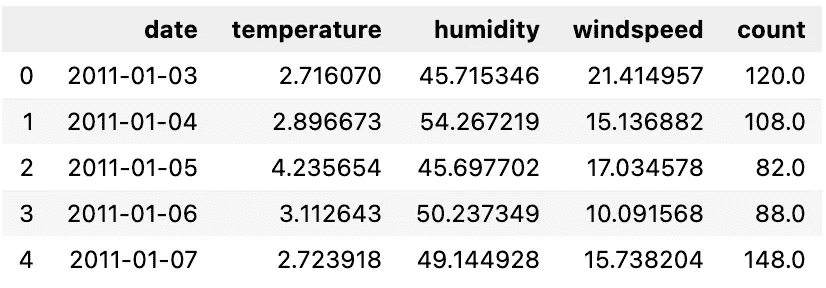
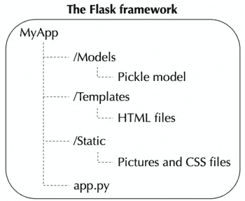
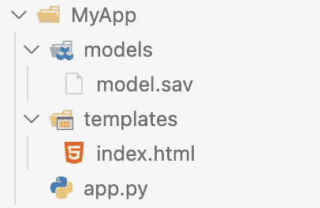
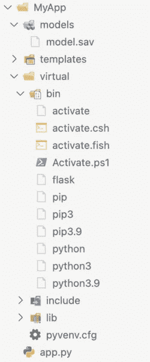
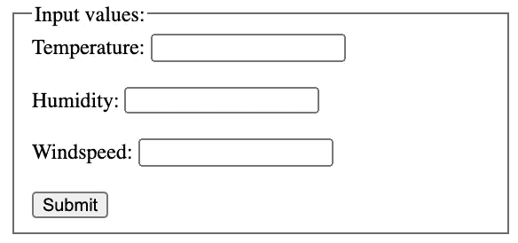
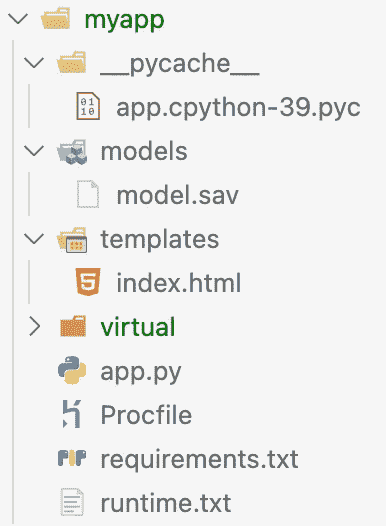
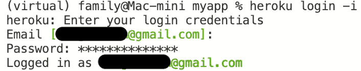
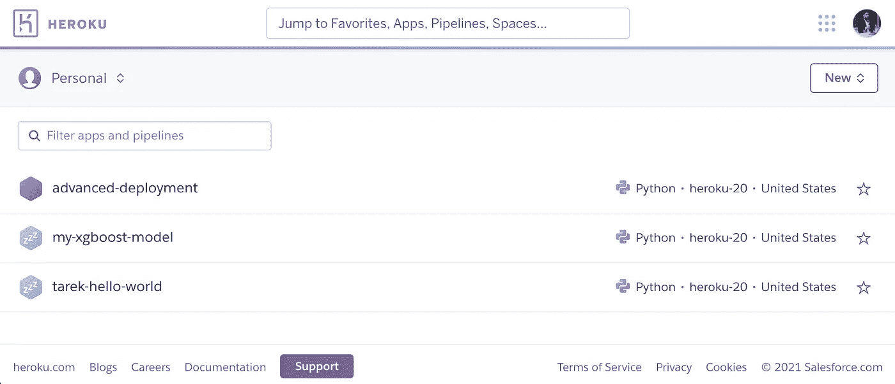

# 使用 Flask 和 Heroku 部署模型的完整指南

> 原文：<https://towardsdatascience.com/complete-guide-on-model-deployment-with-flask-and-heroku-98c87554a6b9?source=collection_archive---------11----------------------->

## 一个完整的一步一步的方法来建立一个机器学习模型，并使它对网络上的其他人可用。


照片由来自[佩克斯](https://www.pexels.com/photo/yellow-arrow-led-signage-394377/?utm_content=attributionCopyText&utm_medium=referral&utm_source=pexels)的[伊萨克·佩雷拉](https://www.pexels.com/@isaquepereira?utm_content=attributionCopyText&utm_medium=referral&utm_source=pexels)拍摄

当我部署我的第一个机器学习模型时，我感到喜悦的泪水顺着脸颊流下，当我望向窗外时，我看到了远处的彩虹。我认为这是我将在这个世界上做大事的标志。

至少我是这么想象的。实际上，我花了两天时间处理 Heroku 可能抛给我的各种错误。当我最终部署好我的模型后，我立刻关上电脑，喝下我的预健身饮料，然后去了健身房。

本文旨在向您展示在使用模型部署时如何正确操作，同时向您展示在此过程中需要注意的事项。最终产品可以在这里看到，而同一型号的更高级部署可以在这里看到(你可能需要一些耐心来访问 web 应用程序，因为 Heroku 会在一段时间不活动后让应用程序“休眠”——应用程序会在几秒钟的延迟响应后“醒来”)。

文章分为三个部分:

1.  构建机器学习模型
2.  设置 Flask web 应用程序
3.  在 Heroku 的部署

# 构建机器学习模型

我们旅程的第一步是训练一个机器学习(ML)模型，但是鉴于我的主要重点是部署，我不会在文章的这一部分投入太多精力。

我将基于自行车共享计划的数据构建一个 XGBoost 模型。该模型将根据三个特征预测某一天出租的自行车数量；*温度*、*湿度、*和*风速*。



作者图片

此阶段的重点是方法而不是模型性能，因此模型是 XGBoost、RF、LG 还是任何其他模型都不重要。

下面的代码是您训练和保存模型所需的全部内容。随着我们的进展，在哪里存储保存的模型将变得更加明显。

构建和保存我们的 XGBoost 模型

在这个阶段，你应该创建一个空的目录，我称之为“MyApp ”,并在其中存储你的模型。我将使用 Visual Studio 代码(VSCode)来演示这个过程，但是您也可以使用其他方法。


作者图片

# 设置 Flask web 应用程序

与用户只阅读页面内容的静态网站相反，我们希望用户与我们的网页互动。具有功能和交互元素的网站被称为 web 应用程序。

在我们的例子中，用户将看到三个输入字段，通过提交一些数据，我们希望给用户一个预测。在此之前，我们需要理解浏览器通过发送请求与其他网页进行交互。典型的浏览器将发送遵循所谓的 HTTP 协议的 GET 请求以访问页面，并发送 POST 请求以通过网页发送数据。你将有希望沿着这条路走下去(双关语)！

作为 python 程序员，我们通常必须编写大量代码来处理用户请求。一个家伙(名叫阿明·罗纳彻)没有编写重复的代码来处理请求，而是把它放在了一个库中，作为一个笑话，并把它命名为 flask。

Flask 是一个 web 服务器框架，因为它要求我们的代码以某种方式组织。首先在“MyApp”目录中添加两个名为“Models”和“Templates”的文件夹。我们暂时不会使用“静态”文件夹，但是可以随意添加任何可选的 CSS 代码。您应该在与文件夹相同的根级别上创建一个 python 文件，并使用与 me 'app.py '相同的命名约定。然后，创建一个名为 index 的 HTML 文件，并将其放在 templates 目录中。不用担心 app.py 和 index.html 文件是空的；现阶段重点关注框架。



作者图片

您的目录应该类似于下图。请注意，我将我们的 ML 模型放在了模型的文件夹中。



作者图片

在一步步浏览这些文件之前，我需要你创建一个虚拟环境。

## 虚拟环境

鉴于 flask 只是一个第三方库，我们可以使用 pip (pip install flask)轻松安装 Flask 并运行我们的 web 应用程序，但当 web 应用程序依赖于特定版本的 python 和其他第三方库时，就会出现问题。想象一下，您的 web 应用程序运行良好，但是突然之间，第三方库的更新出现了，并且更改了某些函数的名称。这将使你的程序停止运行。为了解决这个问题，我们可以使用一个所谓的虚拟环境( *virtualenv* )。

将虚拟环境想象成一个文件夹，它不知道计算机上安装的其他库。只能访问安装在该文件夹中的库。

为了创建一个虚拟环境，我们需要你在当前的 Python 安装上安装 *virtualenv* 。换句话说，打开终端(或命令)行并键入:

```
pip install virtualenv
```

要检查您的系统中是否安装了它，请键入以下命令:

```
virtualenv --version
```

也可以用 *pyvenv* 代替 *virtualenv* ，但是你必须找到另一个向导。

一旦安装了 virtualenv，您就可以创建一个虚拟环境。虚拟环境文件应该在“MyApp”目录中生成。你可以使用命令行界面更改当前目录(使用 *ls* 和 *cd* )，或者右键单击你的“MyApp”文件夹，选择“在文件夹中新建终端”(如果你没有这个选项，不用担心，花 10.000 美元或目前的任何价格购买一台 Mac)。

键入以下命令，**根据您使用的是 Windows 还是 Mac，仅使用其中一个命令:**

```
python3 -m venv virtual (Mac)
py -3 -m venv virtual (Windows)
```

通过这样做，您只需使用 Python 和 venv 库创建一个名为“virtual”的文件夹，其中包含所有必需的虚拟环境文件。

我们现在必须通过键入以下命令来激活虚拟环境:

```
. virtual/bin/activate (Mac)
virtual\Scripts\activate (Windows)
```

你总是可以通过简单地输入`deactivate`来做相反的事情。如果一切顺利，您应该会在命令行界面中看到类似这样的内容:

```
(virtual) <user name> myapp %
```

您可以通过打开并查看“bin”文件夹(或 Windows 上的“Scripts ”)来浏览新的“虚拟”文件夹。您应该在预安装的文件夹中看到 pip 和 python。任何新安装的库都可以在“bin”文件夹中找到。

现在我们终于可以下载 flask 库了:

```
pip install Flask
```

你应该可以很容易地在 Mac 的`virtual/bin/`或者 windows 的`virtual\Scripts\` 中找到 flask:



作者图片

你应该在这个阶段找到最近的镜子，重复这句话:只要我下定决心，我可以做任何事情。

GIF by Giphy

## App.py

让我们打开“app.py”文件，开始插入一些代码。app 文件是将在 Heroku 上运行的 web 应用程序的核心。它将监听特定端口上的用户请求，并根据请求的类型使用特定的函数进行响应。

该应用程序可以分为三个部分。第一步包括导入库和初始化 flask 应用程序。我们使用`Flask(__name__)`来告诉 flask 我们的应用程序位于哪里。Flask 将定位与我们的应用程序位置相关的模板和静态文件。

```
**from** flask **import** Flask, render_template, request
**import** pickle
**import** pandas as pd# Initialise the Flask app
app = Flask(__name__)
```

现在，我们使用 pickle 从/models 目录导入保存的模型，并将其保存为“model”:

```
# Use pickle to load in the pre-trained model
filename = "models/model.sav"
**model** = pickle.load(open(filename, "rb"))
```

我们的 web 应用程序只有一个页面，称为主页或默认页面。“/”路由是主 URL。默认情况下，这应该指向 index.html 文件，即主页。

我们想在用户访问主页时触发一个特定的功能。为此，我创建了一个名为 *main* 的函数，它将根据请求是 GET 还是 POST 来响应用户请求。

*   当目的是阅读或访问我们的主页时，用户发送 GET 请求。在这种情况下，我只想显示我们接下来将创建的 index.html 文件的内容。为此，我使用了 *render_template* 函数，其目的是在模板目录中查找一个文件并显示其内容。
*   当信息被发送回 web 服务器时，用户发送 POST 请求。我们将允许用户输入特定的温度、湿度和风速。我将使用 *request.form.get* 函数从 index.html 文件中检索这些信息。我已经给了输入字段一个特定的名称，所以函数知道在哪里查找。然后，我使用 pandas 获取数据并从中创建一个数据帧，然后将数据馈送到我们的 ML 模型，并将结果存储在一个预测变量中，然后将其发送回 index.html 文件以显示结果。

注意，默认的 app.route 被配置为接收 GET 请求，所以我添加了方法=["GET "，" POST"]来处理 POST 请求。

```
# Set up the main route
@app.route('/', methods=["GET", "POST"])
def **main**():
    if request.method == "POST":
       # Extract the input from the form
       temperature = request.form.get("temperature")
       humidity = request.form.get("humidity")
       windspeed = request.form.get("windspeed") # Create DataFrame based on input
       input_variables = pd.DataFrame([[temperature, humidity, windspeed]],
     columns=['temperature', 'humidity', 'windspeed'], dtype=float, index=['input']) # Get the model's prediction
       # Given that the prediction is stored in an array we simply  
         extract by indexing
       prediction = model.predict(input_variables)[0] # We now pass on the input from the from and the prediction 
         to the index page
       return **render_template**("index.html", original_input {'Temperature':temperature, 'Humidity':humidity, 'Windspeed':windspeed}, result=prediction) # If the request method is GET
     return **render_template**("index.html")
```

完整的代码如下所示:

app.py 文件

## /模板

现在，我们将创建默认页面，用户将通过。让我们将 index.html 代码分成三个部分，正如我在前面的演练中所做的那样。尽管如此，如果你从未读过或写过 HTML 代码，我还是会推荐你看一段简单的 HTML 教程视频。

我的索引文件的第一部分只是由自愿的 CSS 代码组成。或者，我可以将它放在一个名为' styles.css '的样式表中，并存储在静态目录中。我在更高级的部署中这样做( [GitHub](https://github.com/sg-tarek/HTML-CSS-and-JavaScript/tree/main/Model%20Deployment) )。

```
<**head**>
   <!-- CSS code -->
   <**style**>
     form {
          margin: auto;
          width: 35%;
          } .result {
          margin: auto;
          width: 35%;
          border: 1px solid #ccc;
             }
    </**style**> <**title**>Bike Usage Model</title>
</**head**>
```

第二部分由一个带有三个输入字段的表单组成。注意“required”属性，它保证用户的输入。当我使用 *request.form.get* 函数获取数据时，name 属性被用作 app.py 文件中的引用。

```
<!-- Use the action attribute to call the 'main' function -->
<**form** action="{{ url_for('main') }}" method="POST">
<**fieldset**>
     <legend>Input values:</legend>
     Temperature:
     <input name="temperature" type="number" required>
     <br>
     <br> Humidity:
     <input name="humidity" type="number" required>
     <br>
     <br> Windspeed:
     <input name="windspeed" type="number" required>
     <br>
     <br>
     <input type="submit">
</**fieldset**>
</**form**>
```

上面的表单，使用给定的 CSS，为我们提供了以下输入字段和提交按钮:



作者图片

您可能已经注意到了上面的{{ }}括号。每当看到这些，你应该马上想到:那哥们儿在用 Jinja。Flask 支持模板语言 Jinja，它使用和{{}}语法来包含占位符块或其他代码块。在这种情况下，我编写了“{{ url_for('main') }}”来触发 app.py 文件中的' main '函数。

接下来，我使用 if 条件和 for 循环来显示预测。仅当条件为真时，才会显示或创建该块。请记住，我们将用户输入存储在 app.py 文件中的字典‘original _ input’中。因此，我遍历字典来打印用户输入，最后但同样重要的是，我显示预测。

```
<!-- Our 'result' is false until a prediction has been made -->

     <!-- Loop through dictionary and print key:value pair -->
     
         <b>{{ variable }}:</b> {{ original_input[variable] }}
     
     <br> <!-- Print prediction -->
     <br> Predicted number of bikes in use:
     <p style="font-size:50px">{{ result }}</p>

```

完整的代码如下所示:

index.html 档案

让我们通过运行 flask web 应用程序来庆祝您到目前为止所做的工作。您需要在您的虚拟环境中安装所有的库(使用 pip 或 conda 来安装 pandas、xgboost、scikit-learn 和 pickle-mixin)。事后类型:

```
flask run
```

这将在本地地址上运行您的应用程序，如 [http://127.0.0.1:5000/](http://127.0.0.1:5000/) 。通过访问这个网址，你应该会遇到 index.html 的文件。你可以通过输入 *ctrl+c* 来停止服务器。请注意，该命令触发了“__pycache__”文件的创建。是我们 app.py 的编译版。

# 在 Heroku 的部署

为了让其他人也能使用这个应用程序，我们还需要几个小步骤。让我们先在 [GIT](https://github.com/) 和 [Heroku](http://www.heroku.com) 为你注册一个免费账户。为了与这两者交互，我们需要安装 [GIT](https://git-scm.com/downloads) 和 Heroku 命令行接口，称为 [Heroku-CLI](https://toolbelt.heroku.com/) 。如果您使用的是 VSCode，那么我建议安装 Heroku 和 Heroku-CLI 扩展。

## 格尼科恩

虽然 flask 很棒，但它主要用于本地开发。它不是为处理普通 web 服务器收到的请求而设计的。为了处理更多的请求，我们需要安装 gunicorn python 库。

```
pip install gunicorn
```

## Procfile

安装了 gunicorn 之后，我们现在需要告诉 Heroku 使用它。我们通过创建一个没有文件扩展名的名为 procfile 的文件(例如，Procfile.txt 无效)来实现这一点。).该文件将指定启动时要执行的命令。

在空的 Procfile 文件中输入这一行:

```
web: gunicorn app:app
```

*   第一个“app”代表运行您的应用程序的 python 文件的名称或它所在的模块的名称(例如，如果您有一个名为 run.py 的应用程序，那么它应该是 run:app)。
*   第二个“app”代表您的应用名称(即 app = Flask(__name__))。

## Requirements.txt

Heroku 需要知道安装哪些库来运行您的应用程序。我们可以通过运行以下命令来自动化这一过程:

```
pip freeze > requirements.txt
```

这将生成一个名为 requirements.txt 的 txt 文件，其中包含您的应用程序中使用的库。虽然很棒，但它没有包括所有必需的包。下面的列表显示了我的需求文件的内容(注意我已经包含了 scikit-learn，因为`XGBClassifier`对象直接与 scikit-learn API 交互):

```
click==8.0.1
Flask==2.0.1
gunicorn==20.1.0
itsdangerous==2.0.1
Jinja2==3.0.1
MarkupSafe==2.0.1
Werkzeug==2.0.1
pandas
xgboost
scikit-learn
pickle-mixin
```

我没有添加我所有库的特定版本，但是你可以随意这样做。

## Runtime.txt

虽然不是必需的，但是如果您希望指定特定的 python 版本，可以添加一个 runtime.txt 文件。您可以通过输入以下命令来检查您正在运行的 python 版本:

```
python -V
```

我的 runtime.txt 文件包含以下内容:

```
python-3.9.6
```

这是部署前的最后一个阶段，MyApp 目录看起来应该如下所示:



## 登录 Heroku

如果一切顺利，您应该开始通过命令行与您的 Heroku 帐户进行交互。在项目文件夹中打开命令行，然后键入:

```
heroku login
```

使用创建 Heroku 帐户时使用的电子邮件地址和密码。该命令将打开一个浏览器窗口，但是如果您更喜欢呆在命令行中，只需键入:

```
heroku login -i
```

成功登录的示例:



作者图片

##########################################

如果您在错误的环境中，登录可能不会成功。在这种情况下，以下命令可能有用: *conda deactivate*

##########################################

## 告诉 git 你是谁

在使用 git 命令将我们的文件发送到 Heroku 之前，您需要告诉 git 您是谁。这很重要，因为每次 Git 提交都会用到这些信息。

为此，请在命令行中键入以下内容:

```
git config --global user.name "John Doe"
```

按 enter 键，然后键入:

```
git config --global user.email johndoe@example.com
```

请确保在保留双引号的行中适当替换您的电子邮件地址和您的姓名。如果您传递了— global 选项，则只需要这样做一次。

## **为你的网络应用创建一个 git 库**

通过键入以下命令创建本地 git 存储库:

```
git init
```

通过键入以下内容，将所有本地文件添加到在线存储库中:

```
git add .
```

确保在*后加上*的点。圆点表示您正在将整个目录添加到存储库中。

提交您的文件:

```
git commit -m "First commit"
```

## **在 Heroku 上创建一个空应用**

接下来的步骤包括在 Heroku 上创建一个空应用程序，并将我们的本地文件发送到该应用程序。我们将使用 git 发送文件。

创建一个空 Heroku 应用程序:

```
heroku create <app-name-you-choose>
```

应用程序创建完成后，您可以进入您的 Heroku 帐户获得概述:



作者图片

最后的步骤包括获取我们所有的文件，将它们推送到 Heroku，然后激活应用程序:

```
git push heroku master
```

激活应用程序，并设置 dynos 的数量(任何超过一个将花费):

```
heroku ps:scale web=1
```

## **访问应用程序并查看性能**

如果一切顺利，您应该可以通过以下网址访问您的应用程序:

```
<app-name-you-choose>.herokuapp.com
```

您只需通过上面的 URL 或键入以下内容即可打开它:

```
heroku open
```

可能需要一段时间才能发挥作用，所以要有耐心。如果一切顺利，你应该有一个应用程序运行在网络上。你应该为自己感到骄傲。

如果你觉得舒服或者想看部署的不同变化，我可以推荐访问我的高级[部署](https://advanced-deployment.herokuapp.com/)。这些文件可以在我的 [git](https://github.com/sg-tarek/HTML-CSS-and-JavaScript/tree/main/Model%20Deployment) 上获得。

## 很高兴知道

下面的命令很好地处理了我在这个过程中看到的所有错误:

*   使用它在本地服务器上打开 Heroku。记得安装所有需要的库。
*   应该是不言自明的。
*   `heroku run 'ls -al'`您的 dyno 副本，让它列出目录内容。当您添加更多文件，并需要检查它们是否已添加到 Heroku 上时，这很有用。
*   `heroku logs --tail`使用这个 Heroku 命令，一旦你的应用启动并运行，你就可以访问它的性能信息。
*   `heroku restart`应该是不言自明的。
*   `heroku apps:rename <newname>`重命名你的应用程序。

我希望你像我喜欢写这篇文章一样喜欢它。如果你理解我的代码有任何困难，请留下评论。数据科学社区给了我很多，所以我总是乐于回馈。

请随时在 Linkedin 上与我联系，并在 Medium 上关注我以接收更多文章。