# 计算机视觉数据增强完全指南

> 原文：<https://towardsdatascience.com/complete-guide-to-data-augmentation-for-computer-vision-1abe4063ad07?source=collection_archive---------14----------------------->

## 关于图像增强，你需要知道的所有理论。适合初学者和专家。

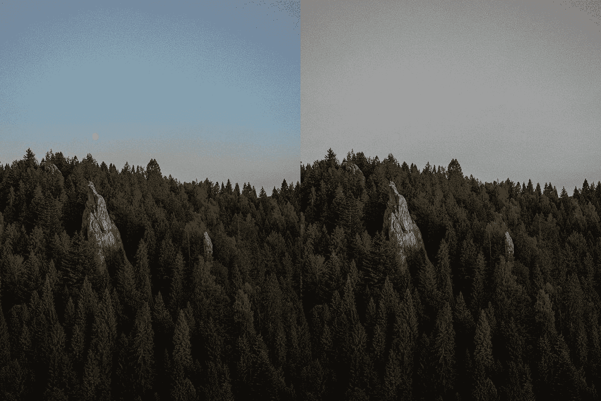

作者图片

数据扩充是深度计算机视觉中最重要的课题之一。当你训练你的神经网络时，你应该像…一直那样做数据增强。否则，您将无法有效地使用数据集，并且您的模型将无法发挥应有的作用。

在本教程中，我总结了所有关于图像增强的开源知识，并添加了我从几个商业计算机视觉项目中获得的经验。希望，你会觉得有用！

**内容**
—什么是数据增强
—如何增强图像
—论文怎么说
—如何为你的任务选择增强
—py torch 和 TensorFlow 中的图像增强
—下一步

# 什么是数据增强

数据扩充是一种用于人为增加数据集大小的技术。从数据集中提取一个样本，以某种方式对其进行修改，将其添加到原始数据集中——现在，您的数据集增加了一个样本。

您可以对数据集中的所有样本执行此操作，并以不同的方式多次修改每个样本，以获得 10、100、1000 倍大的数据集。您甚至可以创建一个无限大小的数据集，因此您的模型在训练过程中永远不会“看到”相同的样本。

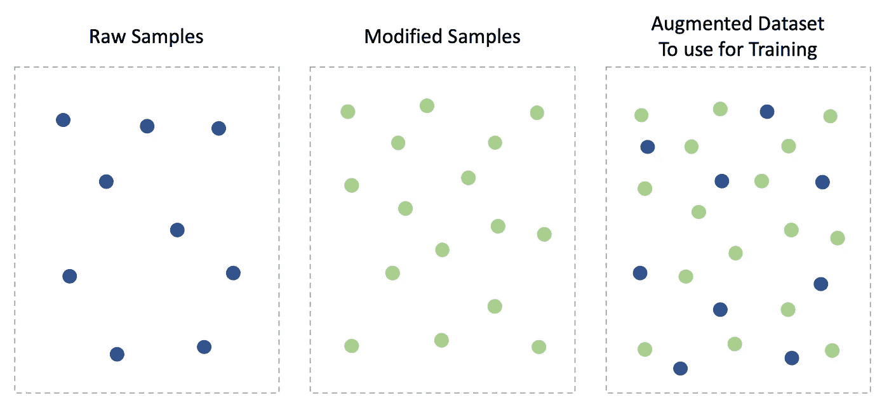

*图片 1。数据增强技术的可视化。作者图片*

更多的数据=更好的模型。数据扩充有助于克服“数据不足”问题，防止过度拟合，并使模型在以前未见过的样本上表现更好。并且不需要额外的工作-收集数据或标记数据，这有时可能是昂贵的或不可行的。

数据增强应用于许多领域——自然语言处理、时间序列分析、音频处理……然而，今天我们将重点讨论用于计算机视觉的数据增强——图像增强。

# 如何增强图像

假设，你想训练一只“猫对狗？”分类器。你已经收集了 500 张猫的图片和 500 张狗的图片。然而，1000 张图像可能不足以创建高性能的模型，因此您需要使用数据扩充，您听说过这可能会有所帮助。主要问题:如何修改图像来增加数据集？

这里有很多选择。下面是最流行的图像增强列表。

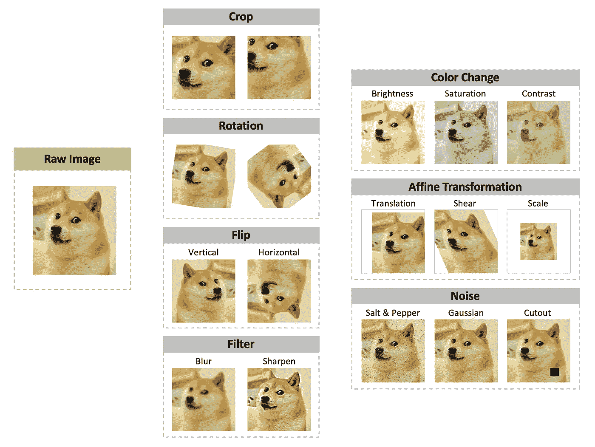

*图片 2。最受欢迎的图像增强*。作者图片

*   裁剪—拍摄一部分图像。
*   旋转—围绕中心(或其他点)旋转图像。
*   翻转—围绕水平线或垂直线镜像图像。
*   最流行的滤镜是模糊和锐化。模糊会使边缘和细节变得平滑，而锐化会突出它们。
*   仿射变换-任何保持平行线的变换。
*   添加噪声-例如使随机像素变黑和变白(椒盐噪声)，添加高斯噪声，甚至从图像中移除整个区域(剪切)。
*   颜色变化会使图像变暗或变亮、灰度或极度饱和、对比度变低或变高。

对于那些对摄影感兴趣的人来说，这些图像修改听起来可能非常熟悉。的确如此。如果你愿意，你可以把图像增强技术想象成雇佣成千上万的照片编辑来处理具有独特风格的图像。

像 Photoshop 和 Lightroom 这样的应用程序也可能会给你一些线索，比如在模型训练期间你可以利用哪些其他的数据增强。

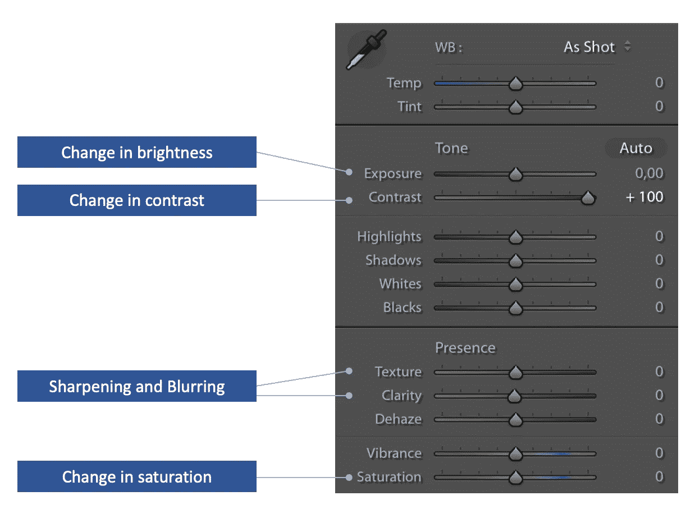

*图片 3。Adobe Lightroom Classic 中的基本面板提供了一个线索，说明还有哪些颜色变化可以用作数据扩充。作者图片*

**想象力是唯一的限制。**首先，图 2 中的列表并不是一个完整的增强列表。有这么多的方法来改变一个形象，所以我不相信，一个完整的清单甚至存在。所以，如果你觉得这些还不够，可以在网上寻找更多的增强类型。

其次，对于数据集中的每个图像，您可以:

*   应用单一增强或序列；
*   更改增强的应用顺序；
*   随机化增强参数，如旋转角度或亮度范围；
*   随机化要应用的特定增强的概率。

作为一名数据科学家，选择使用何种增强(以及以何种顺序)是您的任务。

**空白边框怎么办？**有时，增强后可能会出现空白边框。默认情况下，增强库用白色、黑色或灰色填充空白像素。您可以保持原样，或者更进一步:

*   将颜色更改为其他颜色，例如蓝色。
*   复制像素—复制靠近边框的像素以填充空白区域。
*   反射(reflect )-靠近边界的镜像零件。
*   环绕—从图像的另一侧复制像素。

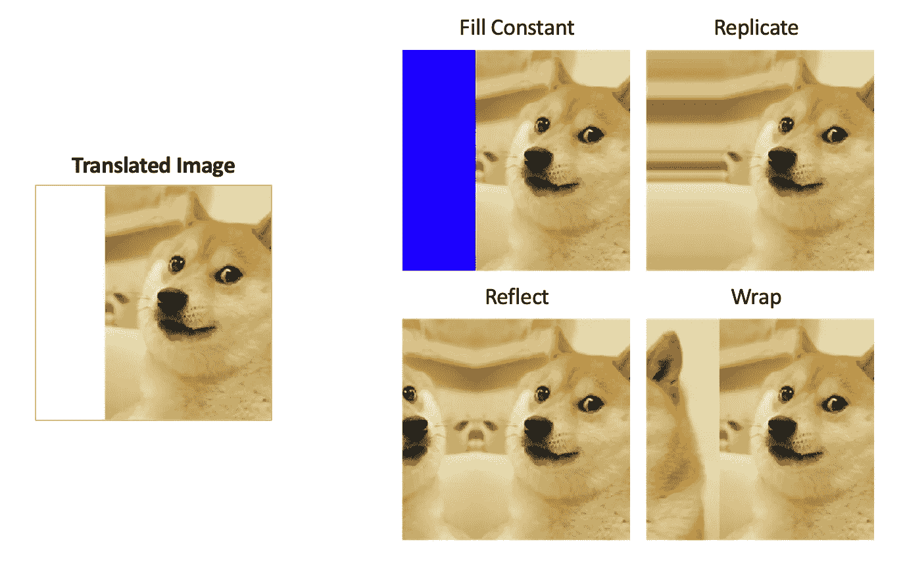

*图片 4。关于如何处理空白边框的想法。作者图片*

**注意数据集标签**。有时，根据您使用的数据集，一些数据扩充可能不仅会更改图像，还会更改其标签。

在训练“猫对狗？”分类器，图像 2 中没有一个增强会从一只狗创造出一只猫。例如，当裁剪图像时，狗的一部分仍然是狗。但是，如果您正在解决对象检测任务，如“在图像中找到一只狗”，裁剪将更改原始图像的位置标签(边界框)。

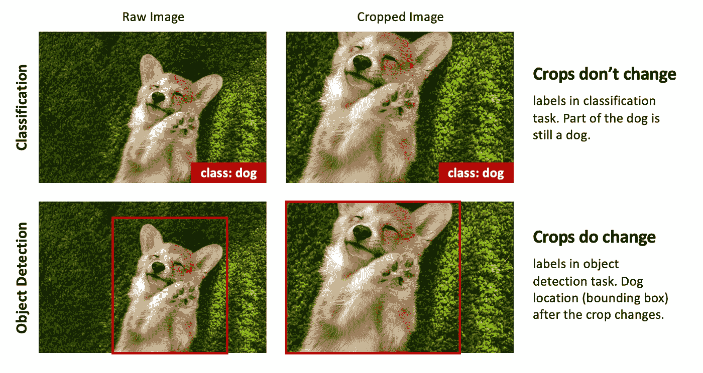

*图片 5。根据任务的不同，相同的增强可能会对图像标签产生不同的影响。作者图片*

脏标注会在模型中引入噪声并降低其性能，因此在考虑使用特定的数据增强时，一定要问自己:“这种增强会改变图像标注吗？”

如果答案是“是”，下一步该怎么做就看你自己了:

*   您可以避免使用增强功能；
*   或者分别修改标签以匹配增强的图像。

# 报纸怎么说

在这一部分，我将展示几个例子，图像增强是如何在研究项目中使用的，以及它带来的好处。

LeNet-5。 Yann LeCun 和共同作者发表了一篇论文[1]，描述了最早的神经网络之一，并使用了…数据增强。那是 1998 年，当时他们称之为“数据扭曲”。他们得出结论，与不使用数据扩充相比，在扩充数据集上训练时，测试集误差略有下降。

> “…我们通过随机扭曲原始训练图像来人为生成更多训练示例…扭曲是以下平面仿射变换的组合:水平和垂直平移、缩放、挤压(同时水平压缩和垂直伸长，或相反)以及水平剪切…”[1]

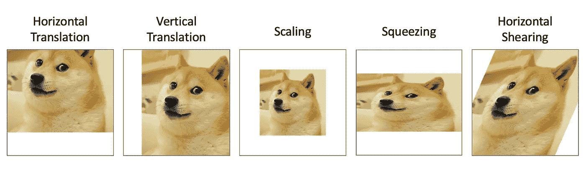

*图片 6。用于训练 LeNet-5 的图像增强。作者图片*

**ImageNet。**在训练 ImageNet [2]时，使用了大量的数据扩充。ImageNet 是一个庞大的神经网络，有 6000 万个参数，所以需要大量的数据来训练它。作者提到，如果没有数据扩充，模型会过度拟合。

> “……数据增强的第一种形式包括生成图像平移和水平反射。我们通过从 256×256 图像中提取随机的 224×224 小块(以及它们的水平反射)并在这些提取的小块上训练我们的网络来做到这一点。如果没有这种方案，我们的网络将遭受严重的过度拟合，这将迫使我们使用更小的网络…数据增强的第二种形式包括改变训练图像中 RGB 通道的强度…”[2]

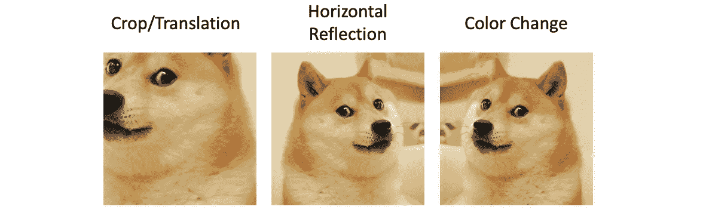

*图 7。用于训练 ImageNet 的数据增强。作者图片*

**优信网。**论文[3]展示了在数据有限的情况下，数据增强如何帮助解决医疗任务。在其中一个实验中，作者仅使用 30 幅大小为 512×512 像素的图像成功训练了一个分割模型。印象深刻吧？

> “…对于显微图像，我们主要需要平移和旋转不变性，以及对变形和灰度值变化的鲁棒性。特别是训练样本的随机弹性变形似乎是用非常少的注释图像训练分割网络的关键概念……”[3]

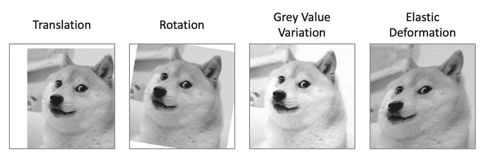

*图片 8。用于在医疗数据*
*(医疗数据通常是灰度的)上训练 U-Net 的数据增强。作者图片*

# 如何为你的任务选择增强

这里有三个词:领域专业知识、业务需求和常识——这是创建一个好的数据扩充管道所需要的。

**领域专长。**根据您的项目领域，有些数据扩充是有意义的，而有些则没有意义。

例如，在处理卫星图像时，裁剪、旋转、反射和缩放是一个不错的选择。因为它们不会给建筑物等物体带来变形。

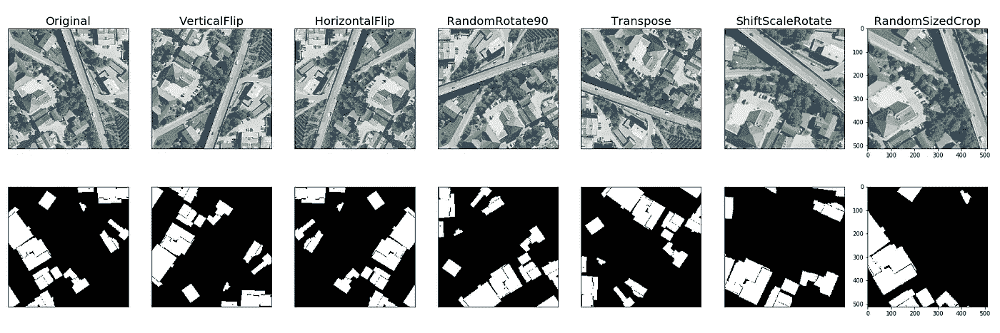

*图片 9。卫星图像数据增强的例子。图片来源:[4]*

另一方面，当处理医学图像时，更好的选择是颜色变换、网格变形和弹性变换[4]。

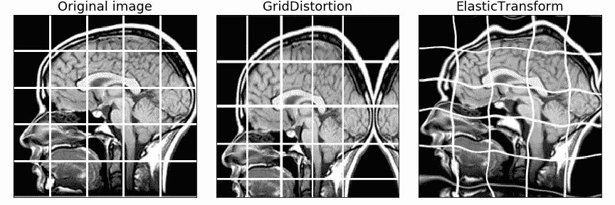

*形象 10。医学图像数据扩充的例子。图片来源:[4]*

**业务需要。例如，你负责为一辆无人驾驶汽车开发一个计算机视觉系统。您应该在数据扩充管道中使用水平翻转吗？**

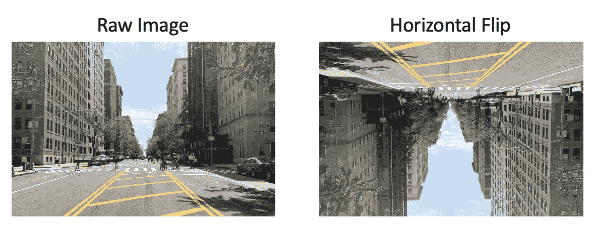

*图片 11。在为自动驾驶汽车开发*
*计算机视觉系统时，你会使用水平翻转吗？作者图片*

嗯，看情况。因此，更好的问题是:你的计算机视觉系统是否有望看到颠倒的图像，并有望能够分割它们？

汽车发生事故，摄像头颠倒了会怎么样？计算机视觉系统会停止做分割并关闭吗？还是会因为某种原因继续工作分割物体？

没有正确的答案，这些问题你应该和产品经理讨论。

**常识。**有太多增强这种东西。在图像变得无法识别之前，你应该停止修改。如果人类不能理解图像中的内容，你怎么能期望模型能理解呢？

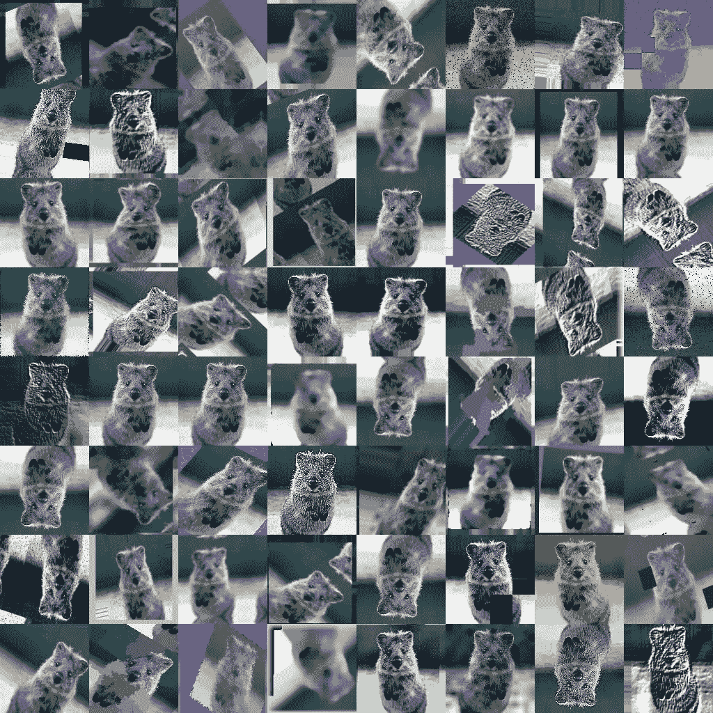

*图片 12。这些例子中大约有一半被过分夸大了。图片来源:[5]*

**提示。**如果你仍然不确定，使用特定的数据增强是不是一个好主意，那就去做研究吧。使用不同的数据扩充管道训练几个模型，并在相同的验证集上比较模型准确性。

# PyTorch 和 TensorFlow 中的图像增强

我们不会在这里详细讨论，也许，以后我会写一个单独的帖子。让我们只讨论几个重要的要点。

*   深度学习的增强通常是在线完成的。这意味着，增强图像不会存储在硬盘上，只有原始数据集存在。当加载一批原始数据时，它会被动态扩充，用于训练，然后从操作内存中释放。
*   以下是如何在 Pytorch 中进行图像增强:[文档](https://pytorch.org/vision/stable/transforms.html)
*   下面是如何在 TensorFlow 中进行图像增强:[文档](https://www.tensorflow.org/tutorials/images/data_augmentation)
*   PyTorch 和 TensorFlow 默认实现只增加图像，而不增加标签。如果你需要对图片和标签都进行增强，你应该自己编写增强功能，或者使用第三方库，比如[albuminations](https://albumentations.ai/)。

# 下一步是什么

我相信这就是你需要知道的关于图像增强的所有理论。随着时间的推移和实践，您将获得更多的经验，并且可以很容易地判断出对于特定的任务，什么样的数据增强会表现得更好。所以，练习，练习，再练习！

附言:如果你对 PyTorch / TensorFlow 中的图像增强教程和白蛋白感兴趣，请告诉我！

**参考文献**

[1]“基于梯度的学习应用于文档识别”。Yann LeCun，Leon Bottou，Yoshua Bengio 和 Patrick Haner。[论文](http://vision.stanford.edu/cs598_spring07/papers/Lecun98.pdf)

[2]“使用深度卷积神经网络的 ImageNet 分类”。亚历克斯·克里热夫斯基，伊利亚·苏茨基弗，杰弗里·e·辛顿。[论文](https://papers.nips.cc/paper/2012/file/c399862d3b9d6b76c8436e924a68c45b-Paper.pdf)

[3]“U-Net:用于生物医学图像分割的卷积网络”。奥拉夫·龙内贝格、菲利普·费舍尔和托马斯·布罗克斯。[论文](https://arxiv.org/pdf/1505.04597.pdf)

[4]“相册:快速灵活的图像增强”。Alexander Buslaev，Alex Parinov，Eugene Khvedchenya，Vladimir I. Iglovikov，亚历山大·巴甫洛夫 A. Kalinin。[论文](https://arxiv.org/pdf/1809.06839.pdf)

[5] imgaug，用于图像增强的 Python 库。 [Github](https://github.com/aleju/imgaug)