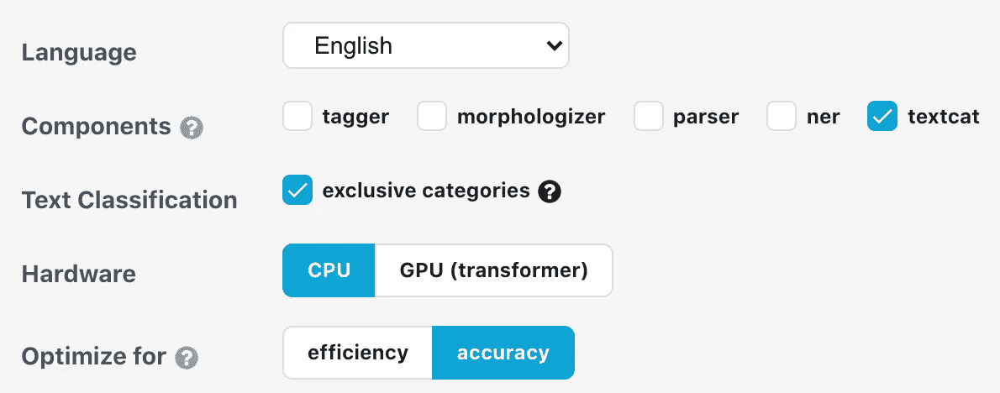

# 使用 SpaCy 对 Tweets 进行分类的完整指南

> 原文：<https://towardsdatascience.com/complete-guide-to-perform-classification-of-tweets-with-spacy-e550ee92ca79?source=collection_archive---------5----------------------->

> 什么是 NLP？我们如何执行 NLP？刚从 SpaCy 套餐开始？这是一个关于执行 NLP 及其相关概念的完整指南。


格伦·卡丽在 [Unsplash](https://unsplash.com/photos/sq0CbO7WOYI) 拍摄的照片

> 新冠肺炎已经影响了许多人的生活，因为他们失去了心爱的人，失去了工作，远离了这个世界。然而，在数字时代，人们并没有停止与世界分享他们的想法、评论或感受——他们通过社交媒体的力量做到了这一点。

在本文中，我们将介绍 NLP 项目的主要概念，包括数据选择、探索性数据分析、NLP 预处理、NLP 模型(统计/神经语言模型)和度量标准选择。感兴趣的数据集是 Kaggle 上的新冠肺炎 tweet 数据集，而所有 NLP 相关的任务都是使用 SpaCy 执行的。

# 设置

在本文中，我使用了[冠状病毒推文 NLP](https://www.kaggle.com/datatattle/covid-19-nlp-text-classification) 来创建一个模型，通过观察推文的内容来对推文的情绪进行分类。我使用 [spaCy](https://spacy.io/) 展示工作代码，然后通过使用简单朴素贝叶斯、逻辑回归、支持向量机的模型对神经网络(如 BERT)进行评估。

我使用的环境是基于 Deepnote 笔记本的 venv 虚拟机上的 Python 3.7。涉及的软件包有:

*   [***spaCy***](https://spacy.io/)*:*一个快速的、生产级的 NLP 库。
*   [**matplotlib . py plot**](https://matplotlib.org/stable/api/_as_gen/matplotlib.pyplot.html):Python 中数据可视化的常用包
*   [**scikit-learn**](https://scikit-learn.org/) :一个简单有用的数据分析和机器学习的包。
*   [**pandas**](https://pandas.pydata.org/):Python 上一个通用、灵活、易用的数据分析和操作工具。

这些包是整个分析的预处理、训练和可视化的基础。

# 数据

我用的数据是 Kaggle 上的 [**冠状病毒 Tweets NLP**](https://www.kaggle.com/datatattle/covid-19-nlp-text-classification) 数据集。这些数据是通过 Twitter 收集的，并经过手动标记，在训练数据中产生了 41，157 个样本，在验证数据中产生了 3，798 个样本。它由以下 4 列组成:

1.  ***位置*** :发布推文的位置
2.  *推文:推文发布的时间*
3.  ****原推文*** :推文正文*
4.  ****标签*** :人为标注的情绪，从极度消极到极度积极不等。*

*还有两个额外的栏目， ***用户名*** 和 ***昵称*** ，出于隐私的考虑，这两个栏目都被删除了。*

## *探索性数据分析*

*在训练模型之前，我对数据做了一些探索性数据分析(EDA)，主要是通过 [Pandas Profiling](https://github.com/pandas-profiling/pandas-profiling) ，这是一个强大的包，为任何数据集的 EDA 创建了一个用户友好的界面(见下文)。基于该报告，我还进行了一些手动 EDA 可视化，以呈现对数据的更具体的分析。*

*用于执行熊猫概况分析的代码*

**

*Pandas Profiling 生成的训练集缺少数据(图片由作者提供)*

*   ***缺失数据(NAs)***

*左边的图显示了数据集中缺失的数据。我们观察到缺失数据只出现在 ***位置*** 列。*

**

*Pandas Profiling 生成的测试集中缺少数据(图片由作者提供)*

*我们还看到，位置列中缺失数据的百分比在训练集和测试集之间是相似的，都在 30%左右。*

*在进一步检查位置列后，我们发现数据在位置名称和经度和纬度数据的标注上存在不一致，这使得数据在缺少数据的情况下更不可用。*

*   ***类别平衡***

*为了进一步研究数据，我使用 Pandas Profiling 查看了不同列的分布。 **OriginalTweet** 列是完全唯一的。而 **TweetAt** 列有一个明显按日期划分的分布，这虽然不太可能，但可能会混淆**情绪**和**原始 Tweet** 列之间的情绪分类。因此，我决定在预处理部分重新分割数据。*

****

*Pandas 分析生成的训练集(左)和测试集(右)的 OriginalTweet 列的值分布(图片由作者提供)*

****

*来自训练集(左)和测试集(右)的 TweetAt 列的条形图(图片由作者提供)*

*另一方面，**情绪**栏显示了不太平衡的类别，其中*积极*的数据最多，*极度消极*的数据最少。然而，对于测试集来说，情况并非如此，其负面的*比正面的*多，如下所示。因此，我在这方面投入了更多，以确定这是否是分析的另一个混杂因素。*

****

*熊猫概况生成的训练集(左)和测试集(右)的情感类别的平衡(图片由作者提供)*

**

*测试和训练数据集中情感类别平衡的饼图(图片由作者提供)*

*为了更容易比较，我为他们每个人制作了饼状图，发现百分比的差异并不显著，正如熊猫概况报告最初显示的那样，所有类别的变化都在 3%以内。然而，由于 **TweetAt** 列的时间依赖性，我不得不重组整个数据集。*

**对于数据的更多探索性分析，请通过在本地 Jupyter 笔记本上实现* [*代码*](https://github.com/enjuichang/covid_sentiment/blob/main/notebooks/1.0-Explore_Data.ipynb) *来查看使用 Pandas Profiling 生成的报告。**

## ***预处理***

*了解原始数据后，我将训练和测试数据结合起来，取一半的数据进行两次拆分，每次拆分 20%的原始数据，创建三个数据集*(由于训练模型时的计算限制，采样 50%的数据)*:*

*   ***训练集**:所有数据的 80%，用于训练。*
*   ***测试集**:所有数据的 16%，用于测试训练。*
*   ***验证集**:所有数据的 4%，用于在看不见的数据上测试模型。*

*这是通过以下代码完成的:*

*组合数据的训练集、测试集和验证集分割的代码*

*下一步是完成一系列自然语言处理(NLP)程序，以便将推文“清洗”成 ***令牌*** ，这些令牌可以被不同的模型*消化。*我们可以用“ ***做菜*** ”来比喻这个过程。*

**

*传统模型的符号化图像(作者提供的图像)*

*最初的推文是原料，比如胡萝卜。要烘焙胡萝卜蛋糕，我们首先需要*清洗胡萝卜，去除不想要的污垢*。在 NLP 中，我们需要首先*移除不想要的字符*，比如 URL、表情符号、标签等等。这取决于手头的任务。例如，如果你想找到标签和文本之间的联系，标签就很重要。*

*在我的情况下，我不想要任何这些，所以我通过以下方法删除所有这些:*

*   *从 [***字符串***](https://docs.python.org/3/library/string.html) 库中删除标点符号*
*   *删除停用词(功能词，如 to、in 等。)使用 ***空间****
*   *使用正则表达式删除 URL(从 [***re***](https://docs.python.org/3/library/re.html) 包)*

*接下来，如果胡萝卜上有一些霉菌或不想要的部分，很自然地*切掉那一小部分或再次清洗*。这类似于预处理的 ***拼写纠正*** 部分，这里我们使用*模糊匹配*将一些拼写错误调整回原来的形式。具体来说， *Levenshtein 距离*(即*编辑距离*)用于计算书写单词与其可能的纠正形式之间的差异数。我使用[拼写检查](https://github.com/R1j1t/contextualSpellCheck/blob/master/examples/en_example.py)包来完成这个任务，因为它可以直接添加到空间管道中，编辑距离可以手动设置。*

*在那之后，我们就不需要胡萝卜皮了，尽管它确实有一些价值和好处。这类似于 ***词汇化*** 过程，其中我们移除行中有意义的语义部分，以将单词简化为它们的核心形式。例如，单词“*运行*”有一个双 *n* 和*ing*后缀。当在现实中使用它时，我们只需要词干" *run "。*然而，当你在做*词性*标注(POS)时想要识别*时体*(或*时态*)时，这个后缀 *-ing* 就变得很充实，因为它告诉我们这个句子处于*进行体*时态。*

*最后，我们把胡萝卜切成大块，以便稍后烹饪。这就是 ***标记化*** 的过程，在这里我们把单词和它们的词干分开，以便以后用不同的模型操纵。在这种情况下，我们使用 spaCy 中的 *nlp* 函数，它通过识别单词之间的空格来自动完成标记化过程。我们也可以称整个预处理为标记化过程，因为我们最终输入句子并输出每个句子的核心标记。*

*预处理管道的代码*

*现在，我们已经将句子标记化了，但是标签仍然是字符串格式。由于标签由“非常负面”、“负面”、“中性”、“正面”和“非常正面”组成，我们可以从 1 到 5 标记每个类别*

# *模特们*

*在准备好所有标记化的句子之后，我们现在可以使用预处理的数据来训练模型。我选择的机型可以分为两类。第一个是统计语言模型，包括朴素贝叶斯、逻辑回归和支持向量机(SVM)，第二个是神经语言模型，包括 CNN 和 BERT 模型。*

## *统计语言模型*

*统计语言模型使用概率方法来确定语料库的下一个单词或标签。常见的概率模型在将数据输入预测器之前，使用特定顺序的 *N-grams* 和无序的*词袋*模型(BoW)来转换数据。例如，我们正在执行本文中的分类任务；因此，在输入下面的概率模型之前，通过 ***scikit-learn*** 的***count vectorize***在语料库上执行*词袋*模型，本质上是所有标记的频率表。*

*通过 scikit-learn 生成单词袋模型的代码。*

*为了执行上一节中提到的任何数据的预处理、词袋矢量化以及来自多个模型的分类，我使用了 ***scikit-learn 的***[***Pipeline***](https://scikit-learn.org/stable/modules/generated/sklearn.pipeline.Pipeline.html)模块，该模块将数据的清理、矢量化和分类分组到一个管道中，这允许更简单的数据处理步骤，用于算法与其他数据和模型的转移学习。*

*任何数据集和模型的整个 NLP 过程的代码。*

*   ***朴素贝叶斯***

*朴素贝叶斯(NB)是一种常见的文档分类模型。朴素贝叶斯的主要概念是*使用贝叶斯定理来估计每个标签上所有不同单词的联合概率*。*

*换句话说，想象你有两种品牌的薯片，每种都有其独特的形状、颜色和味道。通过识别每个单独芯片的形状、颜色和味道的共同趋势，我们可以简单地通过其特征来猜测未知芯片的品牌。这里，我们可以通过以下方式将这一概念与朴素贝叶斯的形式概念联系起来:*

*   *芯片的*品牌*为*标签**
*   *单个*芯片*的*特征*是每个*令牌*的*频率**
*   **贝叶斯定理*可以对应每个品牌的*共同趋势**

*在现实中，我们简单地使用 ***scikit-learn 的多项式函数*** 将数据转换成词袋模型后进行朴素贝叶斯:*

*朴素贝叶斯分类器的代码*

*关于朴素贝叶斯的更完整的解释，请阅读古斯塔沃·查韦斯的这篇文章。*

*   ***逻辑回归***

*尽管在二元分类问题中最常见，但对于多类问题，多项式逻辑回归是朴素贝叶斯的替代方法。逻辑回归的主要概念是使用观察特征的*线性组合来估计特定值和相应的标签*。*

*回到筹码的例子，对于每个品牌，我们给每个筹码的形状、颜色和大小赋值，并将它们加起来达到某个值。如果该值高于某个阈值，我们会将该芯片视为一个品牌，如果该值低于某个阈值，那么它将是另一个品牌。这是二元逻辑回归的一般逻辑，其中*观察特征的线性组合*指的是芯片特征的不同赋值的相加。*

*这里，我们使用 use ***scikit-learn 的 LogisticRegression*** 函数在将数据转换为词袋模型后进行多项式逻辑回归:*

*逻辑回归分类器代码*

*如果您希望了解更多信息，请参考[这个关于多项逻辑回归的](https://www.wikiwand.com/en/Multinomial_logistic_regression#/Application_in_natural_language_processing) wiki 页面。*

*   ***支持向量机(SVM)***

*支持向量机(SVM)也是一种常见的分类模型。SVM 的优势在于它生成了一个*超平面决策边界*，这意味着非线性特征也可以用于分类。*

*以薯片为例，我们可以想象我们把两个品牌的薯片扔在桌子上。然后，我们根据一个轴上的颜色和另一个轴上的大小对每个芯片进行排序。我们将能够知道此时哪个芯片属于哪个品牌。然而，芯片有时是混合的，因此，我们不能画一条直线来区分两种品牌的芯片。现在，我们找到了一种方法将这些芯片投射到桌子上的三维投影中，其中每个芯片也由芯片的辣度分开。通过这样做，我们可以在 3D 投影中放入一张纸，完美地区分这两个品牌。最后，我们将纸投影到桌子上，一条弯弯曲曲的线完美地将两个品牌分开。*

*虽然复杂得多，但这是使用 *SVM 算法*(*3D 投影变换*)来寻找*非线性决策边界*(*pape*r)的简单解释。*

*与之前类似，我们使用 use ***scikit-learn 的 SVC*** 函数在将数据转换为词袋模型后进行 SVM:*

*SVM 分类器代码*

**更多信息请观看 StatQuest 的* [*这个 YouTube 系列*](https://www.youtube.com/watch?v=efR1C6CvhmE) *。**

## *神经语言模型*

*神经语言模型利用了神经网络的当前进展，其比过去的统计模型更好地概括了模型。虽然每个神经网络使用相当不同的结构来优化分类，但在 NLP 中， ***单词嵌入*** 被认为是突破性的技术，在过去几年中实现了实质性的增长。*

*单词嵌入是单词的矢量化表示，标记在数学上更加相似的单词。这可以是自己训练的*one-hot encoded*token，也可以是来自大型科技公司或学术机构的预训练嵌入，比如 Google 的 Word2Vec 和 BERT embeddings，或者斯坦福的 GloVe。*

**

*变形金刚架构讲解(图片由 [Lena Voita](https://lena-voita.github.io/nlp_course/seq2seq_and_attention.html) 提供)。*

*除了单词嵌入之外，模型的架构可以影响模型的准确性，即使使用相同的数据。NLP 目前最先进的架构之一是 ***变形金刚*** 。转换器架构从序列中获取输入，并输出序列。在这两者之间，序列将首先通过编码器堆栈，然后通过解码器堆栈，这两个堆栈都配备有注意机制(例如，自注意)。虽然这听起来很专业，但我们可以把编码器-解码器想象成莫尔斯电码，在通过解码器翻译回英语之前，我们将英语文本编码成长信号和短信号。*

*另一方面，注意力使得模型能够关注输入中与该单词密切相关的其他单词。把它想象成视觉注意力——我们的眼睛基于之前看到的东西聚焦在图片的特定部分。比如看下图。当我们看她的太阳镜时，由于距离很近，我们自然会关注她的噪音。你可能认为两部分之间的距离是最重要的，但是如果你看她的头发的右边，我们也会注意到左边，因为它们都是“她的头发”的一部分，即使她的脸在中间。尽管这不是一个精确的类比，但是《变形金刚》中的注意力以类似的方式工作*

**

*照片由[布鲁诺亚当](https://unsplash.com/@bruno_adam)从 [Unsplash](https://unsplash.com/photos/9n-WKWQZrno)*

*以下面的句子为例，当我们将注意力集中在单词“ball”上时，它与形容词“blue”和动词“holding”的关联将比主语“boy”更强，因为“ball”更可能是“hold ”,而不管它是由“boy”、“girl”还是任何其他人持有。*

**

*图片作者 [Ketan Doshi](/transformers-explained-visually-part-1-overview-of-functionality-95a6dd460452)*

*注意力将这种上下文驱动的信息以数学方式形式化，并在计算结果时考虑这种关联，这通常比统计单词袋模型更好，因为“上下文”信息无法存储。*

**更多信息请查看* [*本系列*](/transformers-explained-visually-not-just-how-but-why-they-work-so-well-d840bd61a9d3) *作者为科坦多希或者* [*本文章*](https://lena-voita.github.io/nlp_course/seq2seq_and_attention.html) *作者为莱娜沃伊塔。**

*SpaCy 的 textcat 合奏*

*对于我的第一个实现，我选择了 spaCy 的内部 textcat ensemble 模型，它使用 transformer 体系结构将 Tok2Vec 模型与线性单词袋模型结合起来。要在 spaCy 上执行此操作，我们需要首先了解 spaCy 如何训练模型。*

*   ***配置系统***

*这是由于可以为神经网络中的每一层输入的设置和超参数的复杂性。spaCy 中的配置系统允许开发者以一种干净的方式存储和写入这些参数，并且如果参数是全局的，则最小化冗余工作。我们没有为神经网络的每个单独层创建一个长类，而是在一个可以通过命令行操作调用的`.cfg`文件中列出我们需要的东西。我们可以使用 SpaCy 在其[文档](https://spacy.io/usage/training#quickstart)中的 quickstart 函数快速创建其中一个。*

**

*图片来自 spaCy 的[文档](https://spacy.io/usage/training#quickstart)*

*我所做的具体选择记录在上图中。这将输出一个名为`base_config.cfg`的`.cfg`文件，该文件将用于使用下面的命令行提示符填充实际的`config.cfg`。*

*初始化配置文件的代码*

*在训练模型之前，我们还需要以不同的方式处理数据，因为现在的输入不是一个单词袋模型，而是原始文本。这是通过三个步骤完成的:*

**

*神经模型的符号化图像(图片由作者提供)。*

*第一步是删除不想要的文本，比如从原始文本中删除 URL。在这种情况下，删除停用词和标点符号是没有必要的，因为 spaCy 的 transformer 模型会自动连接到标记器。此外，词汇化是不必要的，因为前缀和后缀包含有价值的单词上下文，这有助于在确定关联时的注意力。*

*第二步是对类别进行一次热编码，将类别转换成与文本的实际标签相对应的[0，1]的字典。例如，一个“积极的”标签将是`{"Extremely Positive": 0, "Positive": 1, …,"Extremely Negative": 0}`。*

*用于预处理原始文本和标签的代码*

*第三步是将这些数据的输出转换成名为`.spacy`的二进制文件，以便在 spaCy 中执行训练过程。*

*用于将数据转换成两个二进制的代码。空间文件*

*最后，我们可以使用命令行提示符来训练这些文件，在命令行提示符中，我们还可以指定训练数据输入、测试数据输入和模型输出。*

*模型训练代码*

***变压器的双向编码器表示(BERT)***

*使用相同的配置系统，我在名为`en_core_web_trf`的基于 RoBERTa 的管道上使用预训练的 BERT 模型重新训练数据。我唯一改变是使用`en_core_web_trf`而不是`en_core_web_sm`加载 spaCy 的管道和文档，后者是小型的标准英语管道。*

*罗伯塔是脸书在 2019 年出版的伯特的优化版本。它改进了 BERT 体系结构，该体系结构被认为是 NLP 文本分类任务的最新模型之一。BERT 背后的主要思想是使用转换器的**编码器部分，并进行**屏蔽语言建模**、**、**，这意味着移除句子中的标记并预测它们，以及**下一句预测**，这是基于之前和之后的句子预测下一句。***

*我们可以将屏蔽语言建模视为填补句子的空白，其中模型被训练为填补这些句子的正确单词，类似于下面的示例。在预训练的 BERT 模型中，15%的数据被屏蔽。*

```
*FILL-IN THE GAP: The boy is __ a blue ball.*
```

*另一方面，下一个句子预测是大规模版本的屏蔽语言建模，其中模型屏蔽完整的句子，并使用前后的句子来预测内容。编码器中每一层的权重在经过大规模数据训练后被冻结，以存储单词和句子之间的上下文。*

*这种预训练的 BERT 模型对于迁移学习是有用的，因为编码器的每一层的权重是预先确定的。通过这样做，我们可以添加一个附加层来基于预训练权重(通常由句子的上下文信息组成)的输出来训练分类任务。*

*回到烹饪的例子，我们可以想象厨师之前已经完成了调味，烹饪和收集所有必要的原料。现在，我们只需将食物装盘，并用顾客想要的特色装饰菜肴。在这个例子中，电镀之前发生的一切都是由构建预训练模型的研究人员执行的。我们只需要针对我们的特定任务(客户)对菜品进行微调。*

**关于 BERT 模型的更多信息，请查看本文*</bert-explained-state-of-the-art-language-model-for-nlp-f8b21a9b6270>**。***

**除了我们需要用 RoBERTa 管道创建`.spacy`文件之外，训练过程遵循与先前模型相同的过程。**

**用于将数据转换成两个二进制的代码。空间文件**

**然后，我们使用与之前模型相同的方法进行训练**

**模型训练代码**

# **结果呢**

**我使用的主要指标是 F1 分数。该指标结合了召回率和精确度，使用以下公式:**

****

**来自[维基百科](https://www.wikiwand.com/en/F-score)的 F1 分数方程式。**

**为了理解 F1 分数意味着什么，我们需要理解什么是精确度和召回率。**

****

**精确的图像和召回来自[维基百科](https://www.wikiwand.com/en/Precision_and_recall)**

*   *****精度*** :所有预测的正值中，实际为正值的有多少？当我们只看正面案例时，此指标显示了模型的准确性。**
*   *****回忆*** :所有实际为正的值中，有多少预测为正？此指标显示了模型在检测实际正值方面的表现。**

**对于任何给定的模型，通常的目标是最大化精度和召回率，然而，在精度和召回率指标之间经常有一个折衷。为了对模型准确性的两个方面有一个总体的了解，F1 分数是作为两个指标之间的调和平均值来计算的。这是因为简单地平均这两个值会降低每个单独值的重要性。**

## **模型结果**

**每个模型的结果如下所示:**

*   ****统计语言模型结果****

****朴素贝叶斯模型****

**朴素贝叶斯模型的结果**

****逻辑回归模型****

**逻辑回归模型的结果**

****SVM 模式****

**SVM 模型的结果**

**从这三个模型中，我们看到逻辑回归和 SVM 的精度都在 0.55 左右，而朴素贝叶斯模型的精度最差，在 0.45 左右。**

*   ****神经语言模型结果****

****斯帕西的标准型号****

**spaCy 的 textcat 集合模型的结果**

**spaCy 的 textcat 集合模型收敛到 0.63 的精度。**

**伯特**

**预训练模型的结果**

**微调的预训练 BERT 模型收敛于 0.61 的精度。**

****对比****

**从这些结果中，我们看到神经网络提高了 F1 精度结果。然而，与统计模型(每个模型约 2.5 小时)相比，模型的训练时间在 CPU 机器上花费了很长时间(10 个时期 12 小时)，即使使用预训练的 BERT(10 个时期 6 小时)。这是因为尽管神经模型通常比传统模型具有更好的准确性，但是神经模型的训练需要很大的计算能力。因此，如果没有足够的 CPU 或 GPU 或大型数据集，神经模型的训练可能需要几天时间。因此，在运行特定任务之前，需要考虑计算时间和准确性之间的权衡。**

## **个人推文示例**

**为了检验神经语言模型对个别推文的预测，我测试了验证集中的一个例子。以下是两种神经语言模型的一个 tweet 示例。**

**这是标准的空间模型:**

**它在预测文本和原始文本中都显示了否定的分类，其为否定(截断)的概率为 0.80。**

**对于预训练的 BERT 模型，结果显示其为负的概率为 0.94。**

**虽然这些结果听起来令人鼓舞，但模型的准确性仍然受到数据的限制。因此，由于该数据集的人为标注过程，可能存在人为错误，并在训练期间通过模型传播。这将主要出现在当前数据集之外的推文预测期间，这是不可避免的，但可以通过将模型引入其他数据来缓解。这对于降低模型的数据依赖性和提高一般用途的稳健性是更可取的。**

# **摘要**

**在本文中，我们使用 spaCy 和新冠肺炎 tweet 数据集完成了构建文本分类模型的端到端过程。我们经历了探索性数据分析的过程，并对数据进行了相应的预处理。然后我们训练统计模型和神经模型，观察它们的优缺点。最后，我们根据每个模型的 F1 准确度指标对模型进行了评估。**

**此外，我们发现神经网络通常比统计模型具有更好的性能；但是，如果没有安装 GPU，神经网络的训练时间会明显更长。希望这篇文章能帮助你理解什么是 NLP 文本分类，以及如何使用 spaCy 生成一个模型！**

# **参考文献**

## **代码参考**

*   **[Github 回购](https://github.com/enjuichang/covid_sentiment)**
*   **[Deepnote Python 笔记本](https://github.com/enjuichang/covid_sentiment/blob/main/notebooks/0.0-All_Code.ipynb)**
*   **[教程:使用 spaCy 在 Python 中进行文本分类](http://deepnote.com/project/covidsentiment-NpgAMudPQEeCjuIymtGmEA/%2Fnotebooks%2F1.0-Explore_Preprocess.ipynb/#00009-eb04d059-db49-4b48-91a1-85a5f5a5262f)**

## **数据来源于 Kaggle**

*   **A.米格兰尼，[冠状病毒推特 NLP](https://www.kaggle.com/datatattle/covid-19-nlp-text-classification) (2020)，Kaggle**

## **文章和视频**

*   **斯坦福自然语言处理，[标记化](https://nlp.stanford.edu/IR-book/html/htmledition/tokenization-1.html) (2008)，剑桥大学出版社**
*   **J.Brownlee，[统计语言建模和神经语言模型](https://machinelearningmastery.com/statistical-language-modeling-and-neural-language-models/) (2019)，关于机器学习掌握中自然语言处理的深度学习**
*   **J.Brownlee，[什么是文本的单词嵌入？](https://machinelearningmastery.com/what-are-word-embeddings/) (2017)，关于机器学习掌握中自然语言处理的深度学习**
*   **K.Doshi，[变形金刚解说系列](/transformers-explained-visually-part-1-overview-of-functionality-95a6dd460452) (2020)，走向数据科学**
*   **D.Subramanian，[使用 spaCy 3.0 Transformers](/building-sentiment-classifier-using-spacy-3-0-transformers-c744bfc767b) (2021)构建情感分类器，迈向数据科学**
*   **SpaCy， [SpaCy 3.1 文档](https://spacy.io/usage) (2021)**