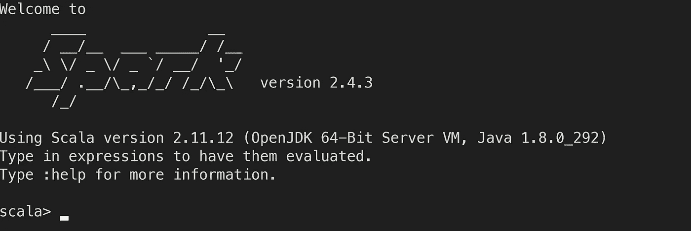
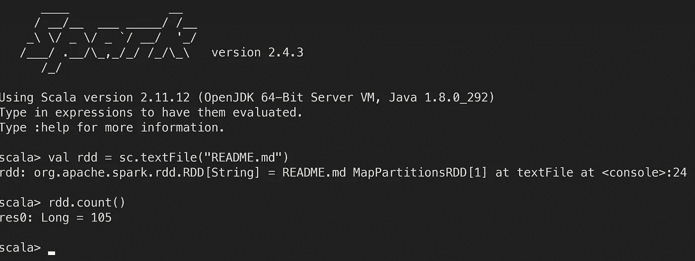
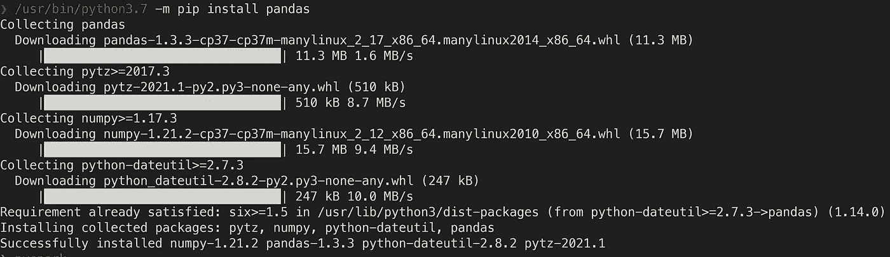
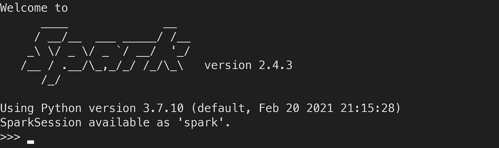
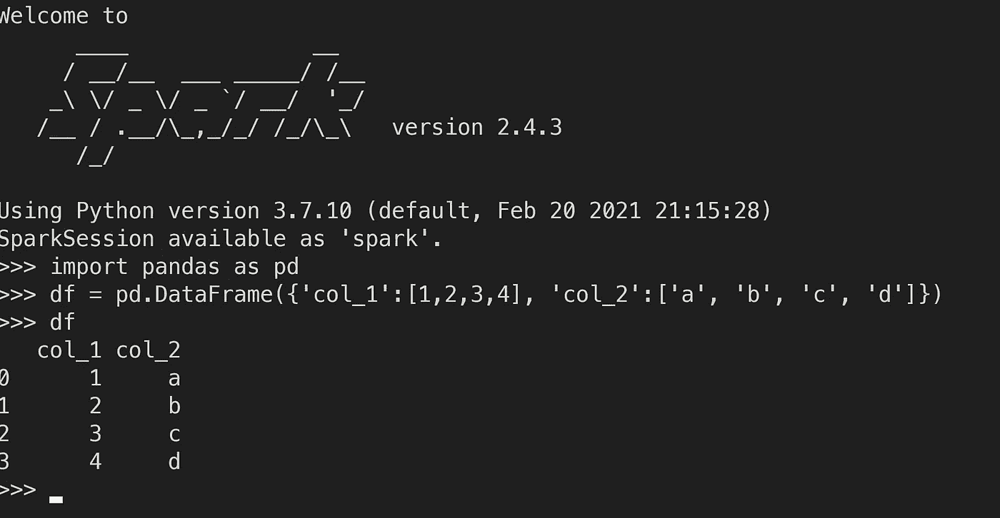
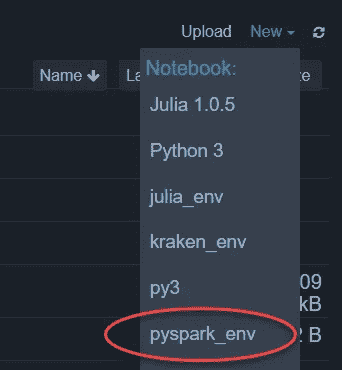
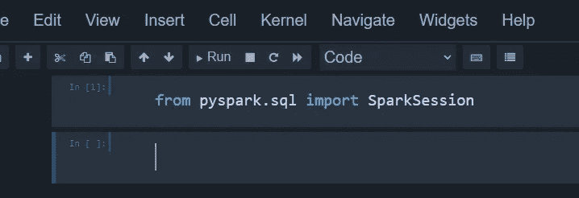
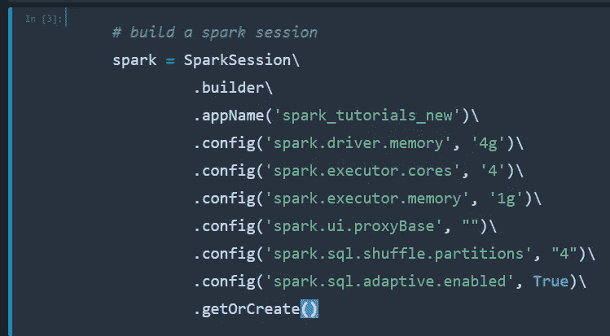
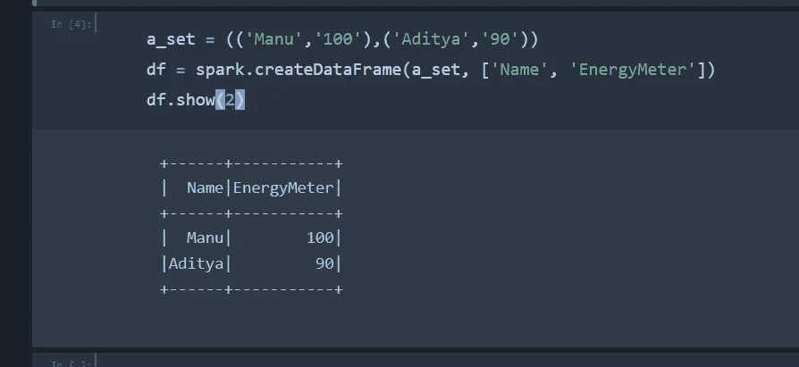
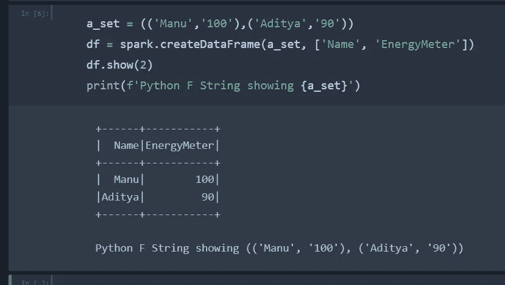

# 数据科学 Spark 和 PySpark 设置完整指南

> 原文：<https://towardsdatascience.com/complete-guide-to-spark-and-pyspark-setup-for-data-science-374ecd8d1eea?source=collection_archive---------9----------------------->

## 完成关于如何为数据科学设置 **Spark 的 A-Z，包括通过 **PySpark** 将 **Spark** 与 **Scala** 和 **Python** 一起使用，以及与 **Jupyter 笔记本** s 集成**

照片由 [Rakicevic Nenad](https://www.pexels.com/@rakicevic-nenad-233369?utm_content=attributionCopyText&utm_medium=referral&utm_source=pexels) 从 [Pexels](https://www.pexels.com/photo/man-with-fireworks-769525/?utm_content=attributionCopyText&utm_medium=referral&utm_source=pexels) 拍摄

## 介绍

Apache **Spark** 是一个用于大数据处理的统一分析引擎，内置了用于流、SQL、机器学习和图形处理的模块。它正迅速成为数据科学家调查大数据的事实上的工具。

与大多数数据科学家类似，Python 一直是我的首选编程语言，从通过 Scrapy 和 Selenium 等网络抓取工具收集数据，到与熊猫的数据争论，以及使用 Pytorch 和 Tensorflow 等 Python 中所有优秀的库进行机器学习/深度学习。

然而，数据每天都在迅速变得越来越大，预计这种增长在未来几年将会加速，特别是随着社交媒体和互联网在全球范围内的使用不断扩大。

当处理大文件并试图对这些文件进行操作时，Python 开始遇到困难。我知道有一些可行的解决方案，比如 Dask，它是 Python 的并行计算库，但是在使用 Spark 之后，我觉得它是最好的解决方案，原因如下:

1.  **速度** — Spark 具有 Catalyst Optimizer 等特性，它使用过滤和索引等技术来确保 SQL 类型查询等任务以最高效的顺序执行。
2.  **社区支持** — Spark 在全球拥有庞大的追随者，并且发展迅速，不断增加更多的工具和功能。
3.  **MLflow** — Spark 与 MLflow 集成，MLflow 是一款出色的开源 MLOps 工具，用于管理从初始调查和模型参数记录到在生产中存储和部署模型的机器学习生命周期。
4.  我真的很喜欢 Databricks，它是一个在云上使用 Python 和 Spark 的平台。他们的笔记本电脑环境非常适合团队协作，从 MLOps 的角度来看，他们的托管 MLflow 添加确实有助于更快、更高效地将数据科学模型投入生产。

我希望您现在急于加入 Spark，将这个优秀的大数据工具添加到您的武器库中。下面我列出了先决条件，然后一步一步地介绍如何安装 Spark 和 PySpark。

# Spark 的最佳语言:Scala Vs Python

照片由[像素](https://www.pexels.com/photo/competition-dispute-goats-37323/?utm_content=attributionCopyText&utm_medium=referral&utm_source=pexels)的[像素](https://www.pexels.com/@pixabay?utm_content=attributionCopyText&utm_medium=referral&utm_source=pexels)拍摄

Spark 使用 Scala 作为默认编程语言。然而，使用 PySpark，我们也可以通过 Python 使用 Spark。使用 Spark 和 Scala 的主要好处是性能效率，特别是在流方面，Spark/Scala 比 Python 发达得多。然而，与你很可能已经非常熟悉的 Python 相比，你必须考虑学习一门新语言(比如 Scala)的时间成本。

我认为 Python 是一种很好的基础语言，可以通过包和库(如 PySpark)来添加功能，我个人采用的方法是将 Python 作为我的主要语言，并通过 PySpark(在这种情况下)或 PyJulia(在 Julia 语言的情况下)导入额外的功能。我知道这导致了一些效率的损失，但我觉得我可以在 python 脚本中包含我的整个数据科学项目这一事实在尝试在复杂的管道中生产我的模型时有很大的帮助，在复杂的管道中增加多种语言之间的额外复杂性可能是一件令人头痛的事情。

不过，我在下面展示了两种方法，从 Spark/Scala 安装开始，到 PySpark 结束，这样您就可以选择在涉及 Spark 的数据科学项目中更喜欢哪种方法。

# 两种方法的先决条件

我假设您使用的是 Linux 发行版，无论是在专用的 Linux 机器上还是通过 WSL 或 VirtualBox，只要您使用的是 Linux 环境，这都无关紧要。此外，您应该已经安装了 Jupyter，并在您的本地机器上进行编码等工作。

# Scala 设置的火花

## 关于兼容版本的重要说明

scala、spark、hadoop 和 sbt 的版本兼容至关重要。每一个的最新版本不一定能一起工作。我目前的设置使用下面的版本，它们都可以很好地配合使用。

`spark=2.4.4`
`scala=2.13.1`
`hadoop=2.7`
`sbt=1.3.5`

# 步骤 1:安装 Java

如果你在你的终端中输入`which java`,这会告诉你你的 Java 安装存储在哪里，如果你已经安装了的话。如果你没有安装它，它不会返回任何东西。

> 如果你想检查你正在使用的某个东西的版本，比如 Python 等，这个" **which"** 命令通常是很好的选择。

值得注意的是，Java 是一个有些独特的安装，如果您键入`which java`并且它已经安装好了，您应该会得到如下所示的内容:

`/usr/bin/java`

然而，这是一个指向`/etc/alternatives/java`的符号链接，如下所示。

> 符号链接总是有一个箭头指向它们所象征的位置，如下图所示。

作者图片

这个`/etc/alternatives/java`是另一个符号链接，它反过来指向`/usr/lib/jvm/java-8-openjdk-amd64/jre/bin/java`，这是用于运行 Java 的实际文件。这种结构对于 Java 的运行方式是必要的，但是当试图强制将某个版本作为默认版本时要小心。

我们需要 Java 版本 8 来正确地与 Spark 一起工作，因此如果你已经有了错误的版本，比如版本 11，那么卸载并重新安装，在你的终端中运行下面的代码行。
`sudo apt-get remove openjdk*`
`sudo apt-get install openjdk-8-jdk`
`sudo apt-get install openjdk-8-jre`

接下来安装 java 只需运行下面一行:
`sudo apt-get install openjdk-8-jdk`

您现在可以通过运行
`update-java-alternatives --list`来检查您的 Linux 系统上当前所有的 Java 版本

要将您想要的 java 版本设置为默认版本，在本例中是版本 8，然后运行下面需要 root 权限的命令:
`sudo update-java-alternatives --set /path/to/java/version8`

最后加上下面一行。bashrc/。zshrc 视情况而定。
`export JAVA_HOME=/usr/lib/jvm/java-8-openjdk-amd64`

现在，您应该已经在系统上成功安装了 Java 8，我们现在可以开始安装 Spark 了。

# 火花

从下面的链接下载 Spark 安装文件。[https://spark.apache.org/downloads.html](https://spark.apache.org/downloads.html)

然后通过运行
提取:`tar xvf spark-1.3.1-bin-hadoop2.6.tgz`

接下来将这个文件移动到`/usr/local/spark`
`mv spark-1.3.1-bin-hadoop2.6 /usr/local/spark`

最后加上下面几行。巴沙尔或者。zshrc 取决于您运行的是什么 shell。这只是意味着当你启动未来的终端时，它会自动将下面的火花路径添加到路径变量中，以便可以使用。
`export PATH=$PATH:/usr/local/spark/bin`
`export SPARK_HOME=/usr/local/spark`

请记住，如果不使用下面的命令，当前的终端将不会更新。因此，您可以运行这个命令，当前的 shell 将更新或打开一个新的终端，它将自动使用新的设置。

`source ~/.zshrc`

# Hadoop

从下面的链接下载二进制文件:[https://hadoop.apache.org/releases.html](https://spark.apache.org/downloads.html)

解压文件

`tar xzvf hadoop-3.2.1.tar.gz`

将提取的文件移动到您想要存储 Hadoop 安装的位置。我建议创建一个名为 hadoop 的通用文件夹，并将下载的文件移动到其中，而不是名为 hadoop_version_xx 的文件夹，因为这意味着一旦我们设置了 PATH 等，以后如果我们更改为新版本的 hadoop，通用 Hadoop 文件夹的路径将保持不变。(这通常是安装这样的库的好方法，你可以在将来更新版本号，但不需要更新路径变量等)
`mv hadoop-3.2.1/* ~/FILE_PATH_EXAMPLE/spark_scala/software/hadoop/`

在 bash 文件中添加 Hadoop 和 Java 路径。bashrc/。zshrc 以类似于我们在路径中添加 Spark 的方式，在。bashrc/。zshrc 文件。

`export HADOOP_HOME=~/FILE_PATH_TO_HADOOP/hadoop`
`export HADOOP_CLASSPATH=$HADOOP_CLASSPATH:~/FILE_PATH_TO_HADOOP/hadoop/share/hadoop/common/lib`
`export HADOOP_CONF_DIR=~/FILE_PATH_TO_HADOOP/hadoop/etc/hadoop`
`export HADOOP_MAPRED_HOME=~/FILE_PATH_TO_HADOOP/hadoop`
`export HADOOP_COMMON_HOME=~/FILE_PATH_TO_HADOOP/hadoop`
`export HADOOP_HDFS_HOME=~/FILE_PATH_TO_HADOOP/hadoop`
`export YARN_HOME=~/FILE_PATH_TO_HADOOP/hadoop`
`export PATH=$PATH:~/FILE_PATH_TO_HADOOP/hadoop/bin`

# 斯卡拉

要安装 scala，只需使用 **wget** 获取它，然后使用 **dpkg** 包管理器解包，如下所示。

`sudo wget www.scala-lang.org/files/archive/scala-2.13.1.deb`
`sudo dpkg -i scala-2.13.1.deb`

> 注意，当我尝试使用 apt 包管理器时，我在使用 scala 时看不到终端中的命令，所以我使用 dpkg 包管理器，如下所示

如果你已经通过 apt 安装了，并且在终端中启动 scala 后出现了同样的命令不可见的错误，那么为了解决这个问题，请完全删除 scala，并使用 dpkg 安装它(不要使用 apt):
`sudo apt-get remove scala-library scala`
`sudo wget www.scala-lang.org/files/archive/scala-2.13.1.deb`
`sudo dpkg -i scala-2.13.1.deb`

# SBT

只需运行下面的命令来安装简单的构建工具【SBT】
`sudo apt-get update`
`sudo apt-get install sbt`

如果使用上述命令从回购中获取 SBT 有困难，那么只需从网站[https://www.scala-sbt.org/download.html](https://www.scala-sbt.org/download.html)手动下载，并按如下方式提取:

`tar xvf sbt-1.3.5.tgz`

`mv sbt /usr/share/sbt`

最后添加下面一行。bashrc/。zshrc 视情况:
`Export PATH=$PATH:/usr/local/sbt/bin`

# 检查安装

首先确保。bashrc/。zshrc 通过运行下面的命令来使用我们最新的更新。(或者，您可以简单地退出当前终端，打开一个新的终端，它将自动使用最新的终端。bashrc/。zshrc 文件。)

`Command source ~/.bashrc`

# 检查 Java 的安装

您可以通过运行`java -version`进行检查，这应该会返回以下结果:
`openjdk version "1.8.0_212"`

# 检查 Hadoop 的安装

你可以通过运行`hadoop version`来检查(注意这次`-`版本前没有)。这将返回您正在使用的 hadoop 版本，如下所示:
`hadoop 2.7.3`

# 检查火花的安装

1.  cd 到 apache-spark 的安装目录，然后使用`ls`命令列出所有文件/目录。
2.  寻找一个我们可以使用的文本文件，比如 README.md 或 CHANGES.txt
3.  在终端中输入 spark-shell，spark 应该会在 scala 提示符下启动，如下所示:

作者图片

作为测试命令，输入下面一行，用您选择的任何文本文件替换 README.md。

`val rdd = sc.textFile("README.md")`

接下来输入`rdd.count()`，它将返回文件中的行数，如下所示。

作者图片

恭喜你现在可以在 Scala 中使用 Spark-Shell 了！我们现在将继续安装 PySpark，这将使我们能够在 Python 环境中使用 Spark，如 Jupyter 笔记本上的 Python 内核等。

照片由 [Nina Uhlíková](https://www.pexels.com/@ninauhlikova?utm_content=attributionCopyText&utm_medium=referral&utm_source=pexels) 从 [Pexels](https://www.pexels.com/photo/person-standing-on-hand-rails-with-arms-wide-open-facing-the-mountains-and-clouds-725255/?utm_content=attributionCopyText&utm_medium=referral&utm_source=pexels) 拍摄

# Python 设置的 spark(PySpark)

> 注意 PySpark 目前与 Python 3.8 不兼容，因此为了确保它能够正常工作，我们安装了 Python 3.7，并使用该版本的 Python 创建了一个虚拟环境，我们将在其中运行 PySpark。

要在 Linux 系统上安装 Python 3.7 作为 Python 的附加版本，只需运行:

`sudo apt update`
`sudo apt install software-properties-common`
`sudo add-apt-repository ppa:deadsnakes/ppa`

> 请注意，要在系统上将软件包安装到这个特定版本的 python 中，请确保将 python 版本指定为 pip 命令的一部分，例如`/usr/bin/python3.7 -m pip install pandas`

作者图片

接下来创建一个名为 pyspark_env 的新虚拟环境，并让它使用这个新安装的 Python3.7 版本:

`mkvirtualenv -p /usr/bin/python3.7 pyspark_env`

> *(请注意，我使用****virtualenvwrapper****来创建我的 python 虚拟环境，并强烈推荐它作为保持您的虚拟环境良好维护的好方法。更多详情请看此链接*[*https://virtualenvwrapper.readthedocs.io/en/latest/*](https://virtualenvwrapper.readthedocs.io/en/latest/)*)*

在创建新的虚拟环境时，它应该会自动激活它，你应该会在你的提示符下看到它的名字，如下所示。

作者图片

如果它没有自动激活，那么只需使用下面的命令来激活环境(这是另一个方便的命令，是我前面提到的 virtualenv 包装库的一部分)。

`workon pyspark_env`

现在，在新的虚拟环境中，我们可以通过以下命令简单地安装 PySpark:

`pip install pyspark`

最后添加下面一行。bashrc/。zshrc 视情况而定:

`export PYTHONPATH=$SPARK_HOME/python:$PYTHONPATH`

现在，如果你简单地在你的终端中输入 pyspark，你应该启动 spark，就像我们之前在 Scala 中做的那样，只是这次你不会得到 Scala 的提示，而是可以像平常一样使用 Python，并且拥有 PySpark 功能。

作者图片

例如，如果您已经将 pandas 安装到我们之前安装的 Python3.7 中，您可以导入 pandas 并创建数据帧，如下所示:

作者图片

# PySpark 和 Jupyter

最后一步是在 Jupyter 中启用 PySpark。为此，首先要确保 pyspark_env 环境处于活动状态。然后安装 ipykernel，如果你还没有像下面这样安装它。(需要注意的是，我们不需要指定 pip3 等，因为我们在活动环境 pyspark_env 中，它会自动将包安装到该环境使用的 python 版本中。

`ipip install ipykernel`

接下来，通过以下方式将虚拟环境添加到 Jupyter:

`ipython -m ipykernel install --user --name=pyspark_env`

如果您现在启动 Jupyter，您应该会看到 pyspark_env 列在右边的内核中，如下所示:

作者图片

在新笔记本中，作为一个简单的测试，尝试制作一个 PySpark 数据框架。首先从 pyspark.sql 导入 SparkSession，如下所示:

作者图片

接下来构建一个标准的 Spark 会话，如下所示:

作者图片

最后，创建一个简单的 PySpark 数据框架，以确保其正常工作:

作者图片

您也可以在这些单元格中编写标准的 python 代码，下面的示例将 Python F 字符串添加到我们创建 PySpark 数据帧的同一个单元格中。

作者图片

成功！！您现在可以在同一个 Jupyter 笔记本中编写 python 和 PySpark 代码了！

来自 [Pexels](https://www.pexels.com/photo/woman-raising-her-hands-up-while-sitting-on-floor-with-macbook-pro-on-lap-3813341/?utm_content=attributionCopyText&utm_medium=referral&utm_source=pexels) 的 [Andrea Piacquadio](https://www.pexels.com/@olly?utm_content=attributionCopyText&utm_medium=referral&utm_source=pexels) 的照片

# 摘要

总之，我已经给出了如何安装 **Spark** 和 **Scala** 的详细说明，使你能够在你的终端上使用 spark-shell。我还演示了如何使用定制的 python3.7 虚拟环境安装 **PySpark** ，以确保没有兼容性问题，这使您能够使用 PySpark 命令在您的终端中打开一个 **PySpark 会话。最后，我展示了如何将 **PySpark 功能添加到您的 jupyter 笔记本**中，您现在可以在相同的单元中编写 python 和 PySpark 代码，并根据需要使用这两种语言。**

我希望您喜欢阅读我的指南，并且您已经准备好在未来的数据科学项目中探索 **Spark** 和 **PySpark** 。

照片由 [Pixabay](https://www.pexels.com/@pixabay?utm_content=attributionCopyText&utm_medium=referral&utm_source=pexels) 从[像素](https://www.pexels.com/photo/dark-light-long-exposure-men-48801/?utm_content=attributionCopyText&utm_medium=referral&utm_source=pexels)拍摄