# 理解 Node2Vec 算法的完整指南

> 原文：<https://towardsdatascience.com/complete-guide-to-understanding-node2vec-algorithm-4e9a35e5d147?source=collection_archive---------2----------------------->

## 理解 node2vec 算法及其超参数的深入指南

机器学习已经成为我们日常生活中的一个重要工具。几乎没有一天你不使用任何一种以这样或那样的方式使用机器学习的应用程序。如果您有一些训练机器学习模型的经验，您可能会习惯于以表的形式存储底层训练数据。然而，我们生活在一个世界比以往任何时候都更加相互联系的时代。不仅世界是相连的，我们收集的数据也越来越相关。以表格形式存储数据的缺点是可能会忽略应用程序中可能相关且可预测的关系。这就是图形存储的用武之地。根据设计，在构建图表时，您需要考虑数据点之间可能的联系。

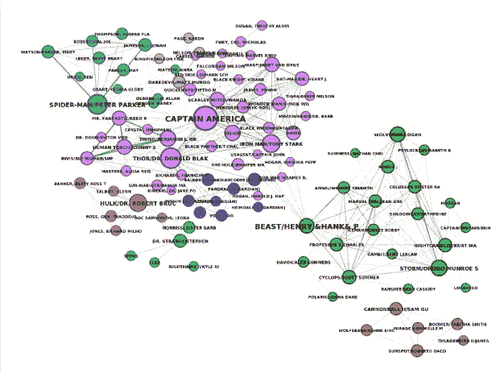

漫威字符网络的可视化。图片由作者提供。

图由节点及其关系组成。这种简单但非常有效的数据存储方式允许您对几乎任何真实场景进行建模。网络是互联网、交通、社交平台等的核心。图表可以表示蛋白质相互作用、化学键、道路网络、社会网络和许多其他东西。这和机器学习有什么关系？近年来，人们对提取网络结构并将其应用于机器学习领域进行了大量的研究。例如，来自 DeepMind、谷歌大脑、麻省理工学院和爱丁堡大学的研究人员在他们的[研究论文](https://arxiv.org/abs/1806.01261)中认为，图形网络可以支持两种关键能力，这是人工智能实现类似人类能力的首要任务:

*   关系推理:解释不同实体之间的关系，如图像像素、单词、蛋白质或其他
*   组合归纳:从已知的构建模块中构建新的推论、预测和行为。

机器学习模型的典型输入是表示每个数据点的向量。将关系和网络结构转化为一组向量的过程称为**节点嵌入**。节点嵌入算法旨在将每个节点编码到嵌入空间中，同时保留网络结构信息。对实体关系进行编码允许您捕获每个数据点的上下文，而不仅仅关注其属性。而且我们都知道语境才是王道！

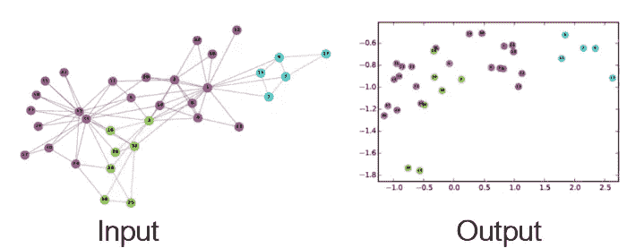

图形嵌入——网络上的表征学习，snap.stanford.edu/proj/embeddings-www

您可能已经在更经典的 ML 设置中处理过图形。任何图像都可以表示为网格图。

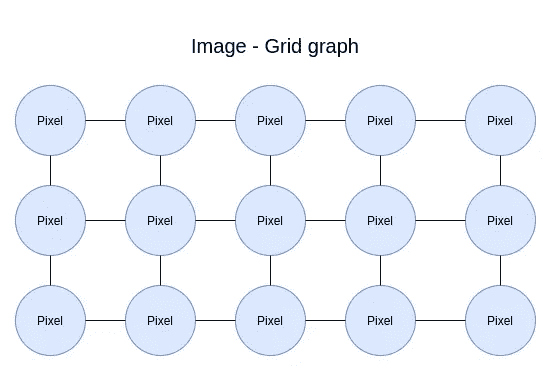

任何图像都可以表示为网格图。图片由作者提供。

在图像处理和分类中，经常使用卷积神经网络。但是卷积到底是什么呢？我喜欢 Prasad Samarakoon 博士的这句话:

> 卷积可以被认为是“观察一个函数的周围环境以更好/更准确地预测其结果”。

本质上，卷积检查像素之间的关系，以捕捉图像更深层次的上下文含义。同样，您可以将任何文本表示为图形。

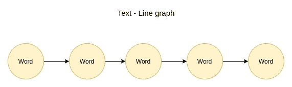

任何文本都可以表示为线图。图片由作者提供。

如果你曾经处理过单词嵌入，你知道你可以通过检查它的环境来捕捉单词的意思和功能。节点嵌入算法试图概括单词和图像嵌入在任何图结构上做什么。现实世界的网络没有预定义的结构，可以有各种形状和大小。然后，节点嵌入算法的输出可以用作下游机器学习模型的输入。比如 [node2vec](https://arxiv.org/pdf/1607.00653.pdf) 就是一个节点嵌入算法。在这篇博文中，我将尝试介绍 node2vec 算法是如何实现的。

## Word2vec 跳格模型

node2vec 算法很大程度上受 word2vec 跳格模型的启发。因此，要正确理解 node2vec，首先必须了解 word2vec 算法是如何工作的。Word2Vec 是一个浅层的两层神经网络，用于重建单词的语言上下文。word2vec 模型的目标是在给定文本语料库的情况下产生单词表示(向量)。单词表示被放置在嵌入空间中，使得在文本语料库中共享共同上下文的单词在嵌入空间中彼此靠近。在 word2vec 的上下文中使用了两种主要的模型。

*   连续词袋
*   跳格模型

Node2vec 受 skip-gram 模型的启发，所以我们将跳过 CBOW 实现的解释。跳格模型预测给定单词的上下文。上下文被定义为输入术语的相邻单词。

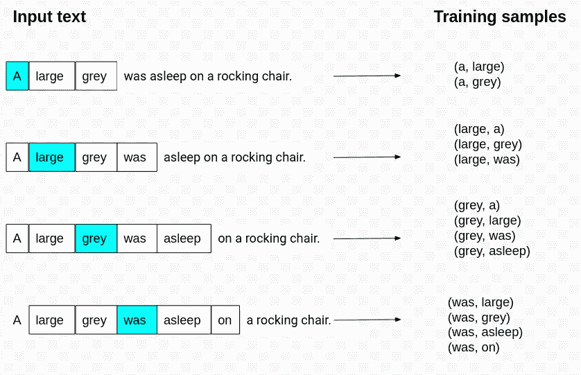

上下文窗口。图片由作者提供。

用蓝色突出显示的单词是输入术语。在这个例子中，上下文**窗口大小**是五。窗口大小被定义为以输入单词为中心的上下文窗口中单词之间的最大距离。实际上，标准似乎是使用与输入单词的窗口大小的一半相邻的上下文单词。正如您在图中的第一个示例中看到的，我们仅使用以下两个词作为上下文，尽管上下文大小为五。

*跳格模型。图片来自*[https://lilian Weng . github . io/lil-log/2017/10/15/learning-word-embedding . html](https://lilianweng.github.io/lil-log/2017/10/15/learning-word-embedding.html)。经作者许可后发布。

在此图中，展示了 skip-gram 神经网络的体系结构。在训练这个神经网络时，输入是表示输入单词的独热编码向量，输出也是表示上下文单词的独热编码向量。还记得上一张图中我们是如何构建单词的输入和上下文对的吗？Word2vec 使用了一个技巧，我们对神经网络的输出向量不感兴趣，而是目标是学习隐藏层的权重。隐藏层的权重实际上就是我们要学习的单词嵌入。隐藏层中神经元的数量将决定**嵌入维度**或代表词汇表中每个单词的向量的大小。

注意，神经网络不考虑上下文单词的偏移，因此它不区分与输入直接相邻的上下文单词和那些在上下文窗口中更远的上下文单词，或者即使上下文单词在输入项之前或之后。因此，窗口大小参数对单词嵌入的结果有很大的影响。例如，Levy & Goldberg 的一项研究[基于依存关系的单词嵌入发现，更大的上下文窗口大小倾向于捕捉更多的主题/领域信息。相反，较小的窗口倾向于捕捉关于单词本身的更多信息，例如，还有哪些单词在功能上相似。](https://levyomer.files.wordpress.com/2014/04/dependency-based-word-embeddings-acl-2014.pdf)

## 负采样和子采样

word2vec skip-gram 模型的作者后来发布了一个[单词和短语及其组合性的分布式表示](https://storage.googleapis.com/pub-tools-public-publication-data/pdf/44876.pdf)，它对原始模型进行了两项优化。第一个优化是常用词的**子采样**。在任何文本语料库中，最常见的术语很可能是所谓的停用词，如“the”、“at”、“In”。虽然 skip-gram 模型受益于像“德国”和“柏林”这样的单词的共现，但是“德国”和“the”的频繁共现的好处要小得多，因为几乎每个单词都伴随着“the”术语。作者实现了二次采样技术来解决这个问题。对于训练语料库中的每个单词，我们都有可能忽略该单词在文本中的特定实例。从句子中删除该单词的概率与该单词的频率有关。该研究论文表明，在训练期间对频繁单词进行二次采样可以显著提高速度，并改善不太频繁的单词的表示。

第二个优化是引入了**负采样**。训练神经网络包括获取训练样本并调整所有神经元权重，以更精确地预测该训练样本。通俗地说，每个训练样本都会调整神经网络中的所有权重。[一项名为 Test Your Vocab 的研究](http://testyourvocab.com/blog/2013-05-10-Summary-of-results)显示，大多数以英语为母语的成年人的词汇量在 20，000 到 35，000 个单词之间，你可以拥有数百万甚至数十亿个输入语境训练对。为每个输入上下文训练对更新几千个权重是非常昂贵的。负采样通过让每个训练样本只修改权重的一小部分而不是全部来解决这个性能问题。对于负采样,“负”单词是我们希望神经网络输出 0 的单词，这意味着它不在我们输入项的上下文中。我们仍然会更新“正面”上下文单词的权重。实验表明，范围在 5-20 的负样本数对于小的训练数据集是有用的。对于较大的数据集，反面例子的数量可以少至 2-5 个。例如，我们只更新五个负权重和一个正权重，而不是更新每个训练样本的所有神经元权重。这将对模型训练时间产生重大影响。该论文表明，使用提升到 3/4rd 幂的**一元分布**选择负样本明显优于其他选择。在一元分布中，更频繁的词更有可能被选为负样本。

我发现了这个关于学习 Word2Vec 的极好的[考虑，它深入研究了 Word2Vec 超参数优化。你已经发现了上下文窗口大小、嵌入维数和负样本的含义，但是作者也观察了神经网络**学习速率**对嵌入结果的影响。](https://link.springer.com/article/10.1007/s11227-021-03743-2)

## Node2vec

Node2vec 算法使用负采样跳过图(SGNS)。但是我们如何创建一个文本语料库作为 SGNS 的输入呢？Node2vec 使用随机游走从给定的网络中生成一个“句子”语料库。

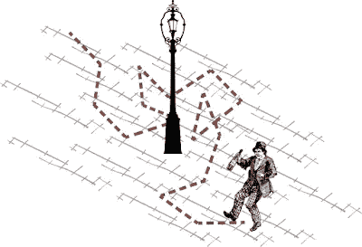

图片来源:[https://prakhartechviz . blogspot . com/2019/09/random-walk-term-weighting-for-text . html](https://prakhartechviz.blogspot.com/2019/09/random-walk-term-weighting-for-text.html)

随机行走可以被解释为一个喝醉的人穿过图表。当然，你永远无法确定一个喝醉的人的下一步，但有一点是肯定的。一个喝醉的人只能跳到一个相邻的节点上。

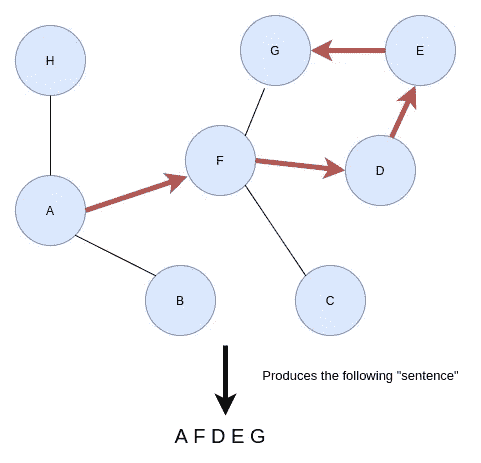

根据随机漫步来造句。图片由作者提供。

想象一下，如果你从节点 a 开始遍历图，你随机选择一个相邻的节点并跳到它上面。然后重复这个过程，直到预定的**行走长度**。行走长度参数定义了“句子”的长度。对于图中的每个节点，node2vec 算法生成一系列随机遍历，将特定节点作为起始节点。您可以使用每节点的**步数参数定义从特定节点开始的随机步数。总而言之，node2vec 算法使用随机行走从图中的每个节点开始生成许多句子。步长参数控制句子的长度。一旦使用随机行走生成句子，该算法将它们输入到 SGNS 模型中，并检索隐藏层权重作为节点嵌入。这就是 node2vec 算法的全部要点。**

但是，node2vec 算法实现了二阶有偏随机游走。一阶随机漫步中的一步仅取决于其当前状态。

## 一阶随机漫步

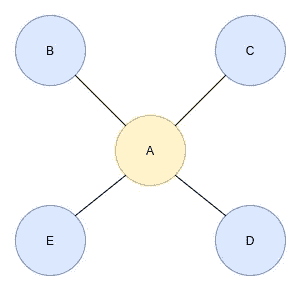

一阶随机漫步。图片由作者提供。

假设您不知何故到达了节点 a。因为一阶随机漫步只查看其当前状态，所以算法不知道它在前面的步骤中是哪个节点。因此，返回到前一个节点或任何其他节点的概率是相等的。概率的计算背后并没有什么高深的数学概念。节点 A 有四个邻居，所以遍历到其中任何一个的几率是 25% (1/4)。

假设您的图是加权的，这意味着每个关系都有一个属性来存储其**权重**。在这种情况下，这些权重将包括在遍历概率的计算中。

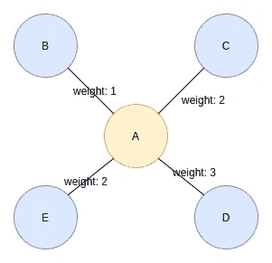

加权图上的一阶随机游动。图片由作者提供。

在加权图中，遍历特定连接的机会是其权重除以所有相邻权重之和。例如，从节点 A 遍历到节点 E 的概率是 2 除以 8 (25%)，从节点 A 遍历到节点 D 的概率是 37.5%。

## 二阶有偏随机游动

二阶遍历将当前状态和先前状态都考虑在内。简而言之，当算法计算遍历概率时，它还会考虑前一步的位置。

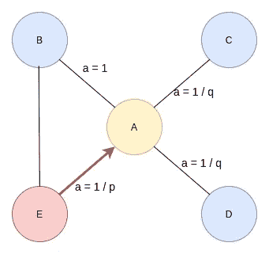

二阶有偏随机游动。图片由作者提供。

在上一步中，该遍历刚刚从节点 E 遍历到节点 A，现在正在评估其下一步。回溯遍历并立即重新访问遍历中的节点的可能性由 **return** 参数 p 控制。将参数 p 设置为高值可确保重新访问节点的机会较低，并避免采样中的 2 跳冗余。这种策略也鼓励适度的图形探索。另一方面，如果 p 参数的值较低，则遍历中回溯的机会较高，从而使随机遍历更接近起始节点。

**inOut** 参数 q 允许遍历计算区分向内和向外的节点。将参数 q (q > 1)设置为高值会使随机游走偏向靠近上一步中的节点的节点。回到上一张图片，如果您为参数 q 设置了一个较高的值，则从节点 A 开始的随机行走偏向于更靠近节点 e 的节点。这种行走在行走和近似广度优先搜索中获得了基础图相对于起始节点的局部视图。相反，如果 q 的值较低(q < 1)，walk 更倾向于访问离节点 e 更远的节点。这种策略鼓励向外探索，并近似于深度优先搜索。

## 同向性与结构等价

二阶有偏随机游走中 return 和 inOut 参数的各种配置在节点之间产生不同的相似性。具体来说，您可以调整 node2vec，使其遵循**同质性**相似性**。**在这种情况下，同向性被定义为属于相同网络社区的节点(即，在网络中彼此更接近)。通过设置较小的 q 值可以实现同向搜索。较小的 q 值近似于深度优先搜索。

另一方面，您可以通过设置更高的 q 值来鼓励更多的**结构等价**相似性。结构等价是指两个节点连接到相同节点的程度，即它们共享相同的邻域，而不要求这两个节点直接连接。乍一看不太直观的是，结构等价节点也会**正则等价**。常规等价被定义为与其他节点具有相似连接模式的节点。一个例子是网络中的桥接节点。有关结构和规则等价的更多信息，请阅读 graphs 论文中的[社区检测。](https://arxiv.org/pdf/0906.0612.pdf)

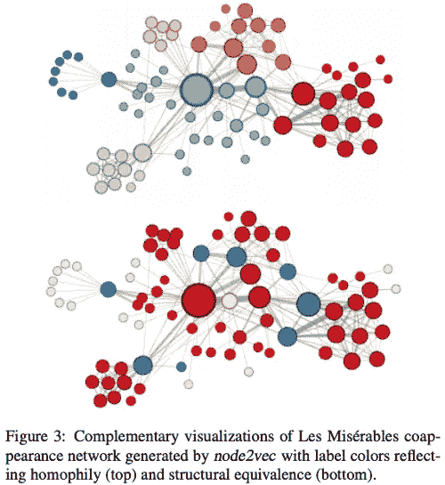

[node2vec:网络的可扩展特征学习](http://arxiv.org/abs/1607.00653)。a .格罗弗 j .莱斯科维奇。 *ACM SIGKDD 知识发现与数据挖掘国际会议(KDD)* ，2016。

对这个数字最好的解释是作者自己的话:

> 图 3(上图)显示了当我们设置 p = 1，q = 0.5 时的示例。请注意网络区域(即网络社区)是如何使用相同的颜色着色的。在这种背景下，node2vec 发现了在小说的主要副情节中经常相互作用的角色群/社区。由于字符之间的边缘是基于共现的，我们可以得出结论，这一特征与同向性密切相关。为了发现哪些节点具有相同的结构角色，我们使用相同的网络，但是设置 p = 1，q = 2，使用 node2vec 获得节点特征，然后基于获得的特征对节点进行聚类。在这里，node2vec 获得了节点到集群的互补分配，因此颜色对应于图 3(底部)所示的结构等价。例如，node2vec 将蓝色节点紧密地嵌入在一起。这些节点代表在小说的不同子情节之间充当桥梁的角色。类似地，黄色节点主要代表处于外围并且具有有限交互的角色

## 节点 2 虚拟详细信息

在我让您离开之前，我想分享一些高级 node2vec 实现的后果。首先，node2vec 算法不区分节点或关系类型。如果您的图有许多节点或关系类型，node2vec 算法不会考虑这一点。其次，节点属性或特征不能添加到算法输入中。所得的节点嵌入仅受网络拓扑的影响，而不受节点属性或特性的影响。

最后，但同样重要的是，node2vec 算法是一种**直推式**节点嵌入算法，这意味着它需要整个图都可以用来学习节点嵌入。不能对测试和训练数据单独运行 node2vec 算法。类似地，当一个新节点被添加到图中时，如果希望为新节点生成嵌入，需要在整个图上重新运行 node2vec 算法。

## 摘要

Node2vec 算法可以概括为两个部分的过程。首先，它使用二阶有偏随机行走来生成节点或“句子”的序列。通过微调随机漫步超参数，您可以影响随机漫步长度，以及您是否希望封装更多的同质性或结构等价相似性。第二，一旦生成了节点序列，它们就被用作负采样跳跃图模型的输入。skip-gram 模型首先生成给定上下文窗口大小的输入和上下文节点对，然后将它们馈送到浅层两层神经网络。一旦训练了神经网络，就可以检索隐藏层权重作为节点嵌入。隐藏层中神经元的数量将决定嵌入的大小。

## 参考

*   托马斯·米科洛夫，程凯，格雷戈·科拉多，杰弗里·迪恩:[向量空间中单词表征的有效估计](http://arxiv.org/abs/1301.3781)，2013，arXiv:1301.3781
*   页（page 的缩写）巴塔格利亚等人，[关系归纳偏差、深度学习和图网络](https://arxiv.org/abs/1806.01261) (2018)，arXiv:1806.01261。
*   [node2vec:网络的可扩展特征学习](http://arxiv.org/abs/1607.00653)。a .格罗弗 j .莱斯科维奇。*2016 年 ACM SIGKDD 知识发现与数据挖掘国际会议(KDD)* 。
*   c .麦考密克(2016 年 4 月 19 日)。 *Word2Vec 教程——跳格模型*。从 http://www.mccormickml.com[取回](http://www.mccormickml.com/)
*   fortunato S..[图形中的社区检测](https://arxiv.org/abs/0906.0612)abs/0906.0612 (2009): n. pag。
*   关于学习 Word2Vec 的思考。J 超级计算机 (2021)。[https://doi.org/10.1007/s11227-021-03743-2](https://doi.org/10.1007/s11227-021-03743-2)
*   y . levy(2014 年)。基于依存关系的单词嵌入。在*计算语言学协会第 52 届年会会议录(第 2 卷:短文)*(第 302–308 页)。计算语言学协会。