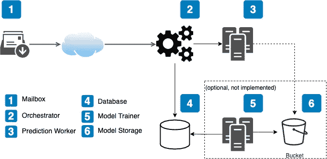

# NLP 任务的完整机器学习管道

> 原文：<https://towardsdatascience.com/complete-machine-learning-pipeline-for-nlp-tasks-f39f8b395c0d?source=collection_archive---------11----------------------->

## 具有基本实现的用于电子邮件中命名实体识别的端到端机器学习管道



管道架构

# 放弃

1.  这个项目的灵感来自于我在职业生涯中有机会解决的一个问题，然而，这里提出的问题是不同的，本文不包含该产品中使用的任何代码和/或解决方案。
2.  这里给出的解决方案是一个简化的解决方案。文章的最后讨论了使其更接近可靠的生产就绪服务所需的进一步步骤。
3.  给定的材料假设读者熟悉机器学习和软件工程的基础，但很想知道如何让它们一起工作。

# 介绍

几年前，在生产中运行并带来真正价值的可靠 ML 系统是 big tech 的特权，其他公司无法获得实现此类产品的人才和技术。然而，时代已经变了，现在越来越多的非技术公司享受现实世界的 ML 应用的好处。

本文提供了将 PoC 转化为成熟的 ML 产品所需的一切，包括简化管道的参考实现以及下一步要做什么的提示。该系统解决的具体问题可以描述如下:从收到的电子邮件中提取公司名称并记录下来。这听起来像是一个表面问题，但应该能够证明如何将 ML 系统投入生产。

# 系统概况

建议的体系结构显示在文章开头的图中。

它有以下组件:

1.  要轮询新邮件的邮箱

2.控制数据流的工作流协调器:

*   轮询邮箱(1)
*   向预测工作者发出请求(3)
*   将电子邮件正文以及提取的实体保存到 DB (4)

3.预测工作者实际上是通过提取实体将模型应用于给定的电子邮件正文来执行 ML

4.存储电子邮件正文和提取实体的数据库

5.(可选)模型训练器将:

*   形成针对数据库查询的训练数据集(4)
*   需要时(重新)训练模型
*   根据测试数据集验证模型
*   将模型存储在模型存储器(6)中
*   如果验证成功，将生产模型指针更改为新模型

6.(可选)对象存储形式的模型存储，如 S3 存储桶

# 履行

本文附有[资源库](https://github.com/isenilov/ml-pipeline)，里面有完整系统的代码和运行指令。

<https://github.com/isenilov/ml-pipeline>  

让我们详细回顾一下组件。

## 邮筒

SMTP(发送电子邮件)/ IMAP(阅读电子邮件)邮件服务器使用 [GreenMail docker 镜像](https://registry.hub.docker.com/r/greenmail/standalone)打开各自的端口进行模拟:

## 工作流编排器

在我们的系统中，我们使用一个非常简单的脚本，该脚本定期轮询邮箱(1)，将电子邮件正文发送给预测工作者(3)，并将结果记录到数据库(4):

另一方面，在真实的生产系统中，工作流编排引擎之一，如 [Apache Airflow](https://airflow.apache.org/) 、 [Argo Workflows](https://github.com/argoproj/argo-workflows) 等..可以使用(可以在[这里](https://github.com/meirwah/awesome-workflow-engines)找到此类工具的良好列表)以获得可靠性和更简单的工作流声明。

## 预测工作者

预测工作器是一个微服务，它提供了一个端点，用于根据传入的文本预测实体。在我们的示例中，我们将自己限制在一个非常简单的基于 [FastAPI](https://fastapi.tiangolo.com/) 的 web 服务上，该服务从 [SpaCy](https://spacy.io/) 加载一个预训练的模型，并将其应用于输入。

## 数据库ˌ资料库

DB 只是 PostgreSQL DB 的一个实例。同样，我们假设它对于合理的负载应该足够了，并且当您希望拥有一个群集或为分析创建一个只读副本以便分析师不能影响生产实例时，我们不考虑可靠性问题。

使用[官方 PostgreSQL docker 图像](https://hub.docker.com/_/postgres):

# 运行管道

本文附带了库,其中包含了运行端到端管道所需的所有代码。

## 要求

用于运行管道的 PC 应该安装了 [Docker](https://www.docker.com/) 和 [telnet](https://www.unix.com/man-page/linux/1/telnet/) 。如果需要，请参考您系统的安装说明。

可以使用以下命令克隆存储库:

```
git clone [https://github.com/isenilov/ml-pipeline.git](https://github.com/isenilov/ml-pipeline.git)
```

## 运行它

4 个服务(邮件服务器、数据库、预测服务和 orchestrator)的整个管道可以通过一个命令启动:

```
docker-compose -f docker-compose.yaml up --build
```

它应该开始打印来自服务的日志消息。

## 发送电子邮件

管道由邮箱中出现的未读邮件触发。为了发送一个，可以使用 telnet util。

连接到 IMAP 邮件服务器:

```
telnet localhost 3025
```

使用 telnet 发送电子邮件:

```
EHLO user
MAIL FROM:<example@some-domain.com>
RCPT TO:<user>
DATA
Subject: Hello World

Hello!She works at Apple now but before that she worked at Microsoft.
.
QUIT
```

如果一切顺利，日志中应该会出现这样的内容:

```
orchestrator_1 | Polling mailbox…
prediction-worker_1 | INFO: 172.19.0.5:55294 — “POST /predict HTTP/1.1” 200 OK
orchestrator_1 | Recoded to DB with id=34: [{‘entity_text’: ‘Apple’, ‘start’: 24, ‘end’: 29}, {‘entity_text’: ‘Microsoft’, ‘start’: 58, ‘end’: 67}]
```

## 检查结果

数据也必须记录到数据库中。为了检查这一点，任何数据库客户机都可以使用以下连接参数:

```
host: localhost
port: 5432
database: maildb
username: pguser
pasword: password
```

和跑步

```
SELECT * FROM mail LIMIT 10
```

查询。

# 生产化

这个实现可以给读者一个真实 ML 系统是什么样子以及它的组件如何交互的概念。然而，为了使系统健壮、可靠和高性能，需要更多的步骤。

## 异步服务

给定的实现包括由 Orchestrator (2)和预测工作器(3)中的同步处理程序使用的同步版本的[请求](https://docs.python-requests.org/en/latest/)库，这意味着不能并行处理几个请求，即在下一个请求可以被发送之前必须完成一个预测。这可能是次优的，因为当预测工作者在做他们的工作时，编排器只是空转。

要解决这个问题，可以采取以下措施:

*   在客户端使用 [aiohttp](https://github.com/aio-libs/aiohttp)
*   在服务器(预测工作器)端定义[异步处理器](https://fastapi.tiangolo.com/async/)

## 消息队列

尽管定期的邮箱轮询可以作为一种队列，但是在 Orchestrator(发布到主题的数据生产者)和预测工作者(订阅主题的数据消费者)之间以及数据源和 Orchestrator 之间放置一个真正的队列，如 [Apache Kafka](https://kafka.apache.org/) 主题，可能是一个好主意。如果预测工作者不能处理大量的请求，它将更多地分离服务，并可能平滑负载峰值和避免超时。

## 部署和扩展

拥有一个分布式微服务系统而不是一个可以做所有事情的整体系统的优势之一是易于扩展。出于可靠性以外的原因，合理的负载可能不需要将 Workflow Orchestrator 扩展到单个主机之外，但是，单个预测工作者很可能无法应对更高的负载。幸运的是，Prediction Worker 是一个无状态服务，这意味着它不需要维护单个请求上下文之外的状态(即，服务实例之间没有[竞争条件](https://en.wikipedia.org/wiki/Race_condition))，这反过来使其水平扩展变得简单，就像在工作机群前面添加一个[负载平衡](https://en.wikipedia.org/wiki/Load_balancing_(computing))服务，如 [nginx](https://www.nginx.com/) 。

本文附带的示例使用 docker-compose 来部署管道，主要是因为简单。然而，真正的生产系统很少依赖这个工具。我经历了在科技公司部署微服务的两种主要方式:

*   一个自行编写的系统，用于管理云中或本地的部署。
*   不同口味的 Kubernetes 及其包装，例如 kube flow 为裸 Kubernetes 增添了许多 ML 特有的便利。

采用 GitOps 管理部署方式的后一种选择似乎是当今最流行的。

## 监视

一些服务甚至可以在没有任何额外代码的情况下发出指标，比如 Airflow [integration](https://airflow.apache.org/docs/apache-airflow/stable/logging-monitoring/metrics.html) 与 [statsd](https://github.com/statsd/statsd) 或 [Datadog 与 gunicorn](https://docs.datadoghq.com/integrations/gunicorn/) 的集成。虽然这些集成可以为我们提供基本的指标，如 HTTP 响应代码的速率或响应延迟，但 ML pipeline 需要的不仅仅是这些。让我们看看还可以/应该监控什么:

*   来自服务器(预测工作器(3)本身)和客户端(编制器(2))的预测时间
*   预测工作器返回 HTTP 代码的速率
*   模型预测漂移检测的不同预测标签和预测置信度/相似度的比率。某个实体的检测率的变化可以表明潜在的模型过时和需要重新训练/微调，这可以由编排器(2)基于例如某个漂移阈值来触发
*   用于检测输入数据分布漂移的输入数据参数，例如，输入文本的长度、字数等…与上一点类似，但此处的变化可能表明数据的性质已经改变，模型可能需要适应它
*   与主机相关的标准指标，如 CPU 负载、内存/磁盘空间等…

# 结论

这结束了生产就绪的机器学习解决方案世界的短暂旅程，并为读者提供了进一步探索的方向和关于所涵盖的每个主题的谷歌关键词。

希望这篇文章和代码对您有用，如果您对这个主题有任何问题或对未来文章有任何建议，请随时通过 [LinkedIn](https://www.linkedin.com/in/isenilov/) 联系我。