# 从头开始完成逐步共轭梯度算法

> 原文：<https://towardsdatascience.com/complete-step-by-step-conjugate-gradient-algorithm-from-scratch-202c07fb52a8?source=collection_archive---------2----------------------->

## 实践教程

## 和一般函数优化的实现


克里斯蒂安·鲍文在 [Unsplash](https://unsplash.com?utm_source=medium&utm_medium=referral) 上的照片

```
**Table of Contents** (read till the end to see how you can get the complete python code of this story)· [Conjugate Gradient for Solving a Linear System](#791f)
· [Improving the Algorithm](#834b)
  ∘ [Theorem](#9d26)
  ∘ [Simple Problems](#474d)
· [Conjugate Gradient for Nonlinear Optimization Problem](#c404)
  ∘ [Wolfe Line Search](#73ae)
  ∘ [Implementation](#01af)
  ∘ [Scenarios](#e04a)
· [Conclusion](#cd74)
```

T 共轭梯度是数学上涉及的算法之一。所以，为了简化事情，我们会砍掉任何不必要的冗长的解释。后面我们还会用到一个数学定理但不会证明。我们先导入一些库。

# 解线性系统的共轭梯度法

考虑一个线性方程 *Ax = b* 其中 *A* 是一个 *n × n* 对称正定矩阵， *x* 和 *b* 是 *n × 1* 向量。求解这个方程对于 *x* 等价于下面凸函数 *f(x)* 的最小化问题

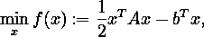

也就是说，这两个问题都有相同的唯一解。

我们将迭代求解 *x* 的 *Ax = b* 。定义残差*r(x)*:=∇*f(x)= ax b*。然后在迭代 *xₖ* ，我们有

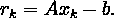

沿着 *xₖ + αpₖ* 的 *f* 的一维极小元显式给出(通过将*f(xₖ+αpₖ】*w . r . t .*α*的一阶导数设为零)如下

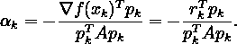

在共轭梯度法中，选择方向集{ *p₀，p₁，…* }，使其元素相对于 *A* 为*共轭*，即，

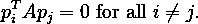

每个方向 *pₖ* 被选择为负残差- *rₖ* (这是函数 *f* 的最陡下降方向)和前一个方向 *pₖ₋₁* 的线性组合。我们写作

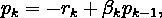

其中标量 *βₖ* 由要求 *pₖ₋₁* 和 *pₖ* 必须相对于 *A* 共轭来确定。通过将最后一个等式乘以

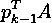

并强加条件

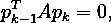

我们发现

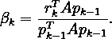

已知 *αₖ* 和 *pₖ* ，下一次迭代可以像往常一样使用

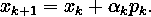

如前所述，选择方向集{ *p₀，p₁，…* }，使得其元素相对于 *A* 为*共轭*。但是我们如何选择第一个搜索方向 *p₀* ？简单的用好 ol '最陡下降方向在初始点 *x₀* ，也就是 *p₀ = -r₀* 。

我们现在有了一个可行的算法:

```
1\. Initialize x₀
2\. Calculate r₀ = Ax₀ − b
3\. Assign p₀ = −r₀
4\. For k = 0, 1, 2, …:
    * calculate αₖ = -rₖ'pₖ / pₖ'Apₖ
    * update xₖ₊₁ = xₖ + αₖpₖ
    * calculate rₖ₊₁ = Axₖ₊₁ - b
    * calculate βₖ₊₁ = rₖ₊₁'Apₖ / pₖ'Apₖ
    * update pₖ₊₁ = -rₖ₊₁ + βₖ₊₁pₖ
```

这里，*撇号*表示转置操作，以方便书写。

[](/complete-step-by-step-gradient-descent-algorithm-from-scratch-acba013e8420) [## 从头开始完成逐步梯度下降算法

### 以及恒定学习速率和线搜索的实现

towardsdatascience.com](/complete-step-by-step-gradient-descent-algorithm-from-scratch-acba013e8420) 

# 改进算法

我们可以进一步提高计算 *αₖ* 和 *βₖ* 的时间和空间复杂度。为此，我们提出了以下定理。前面说过，这里不证明定理。

## 定理 1

设 *x₀* ∈ ℝ *ⁿ* 为任意起点，并假设序列{ *xₖ* }如上所述生成。然后

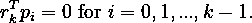

固定 *k > 0* 。因为我们已经


然后

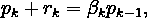

因此

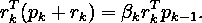

因为由**定理 1** 右手边是零，那么我们有

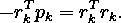

将两边除以

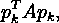

我们获得

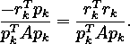

最后一个等式的左手边正是αₖ。于是我们有了一种更经济的形式 *αₖ* 如下

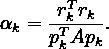

既然*rₖ=axₖb*，我们就有*rₖ₊₁rₖ=a(xₖ₊₁xₖ)*。结合步骤方程式 *xₖ₊₁ = xₖ + αₖpₖ* ，我们得出


将最后一个方程代入上面建立的 *βₖ₊₁* 方程，我们得到

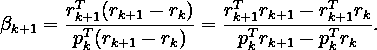

考虑以下观察结果:

*   从**定理 1** ，我们有

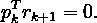

*   我们以前证明过

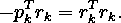

*   因为


我们有

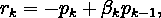

因此

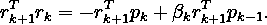

自由**定理 1**

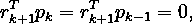

我们有

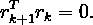

将这三个观察值代入上面最新的 *βₖ₊₁* 方程，我们得到

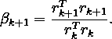

现在，我们已经具备了构建求解线性系统的共轭梯度算法的所有要素。

我们将尝试使用该算法来解决 *x* 的 *Ax = b* ，其中 *A* 和 *b* 对于下面三个问题的定义是不同的。

## 问题 1

*A* 是 2 × 2 对称正定矩阵 *b* 是 2 × 1 向量。两者都是使用来自`scikit-learn`的`make_spd_matrix`函数随机生成的。

```
A
 [[ 2.5409 -0.0113]
  [-0.0113  0.5287]]b
 [1.3864  0.3719]The solution x* should be
 [0.5488  0.7152]
```

让我们运行共轭梯度算法，初始点 *x₀* 在[-3，-4]。

```
Iteration: 1 	 x = [ 0.7428 -2.9758] 	 residual = 2.0254
Iteration: 2 	 x = [ 0.5488  0.7152] 	 residual = 0.0000Solution: 	 x = [ 0.5488  0.7152]
```

这个解是在两次迭代中找到的。我们可以使用`numpy`中的`allclose`功能来检查解决方案是否是我们想要的。如果它返回`True`，则解是正确的。

```
True
```

最后，我们可以将这个问题转化为函数 *f* 的最小化，其中 *f* 定义如下。

为了可视化学习路径，我们创建一些 python 函数，如下所示。

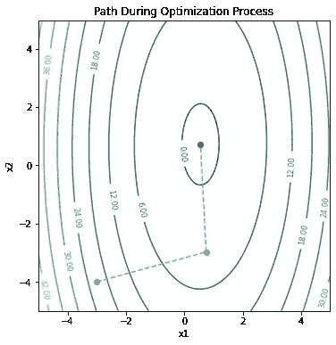

图片由[作者](https://dwiuzila.medium.com/membership)

从上面的图中，我们可以确认在两次迭代中确实找到了解决方案。对于下面的另外两个问题，我们不会费心绘图，因为 *x* 的维数大于 2，因此很难或不可能绘图。

## 问题 2

*A* 是一个 3 × 3 对称正定矩阵， *b* 是一个 3 × 1 向量，两者都是像以前一样随机生成的。

```
A
 [[ 0.7444 -0.5055 -0.0851]
  [-0.5055  3.4858  0.0572]
  [-0.0851  0.0572  0.4738]]b
 [-0.0043  2.2501  0.2798]The solution x* should be
 [ 0.5488  0.7152  0.6028]
```

让我们运行共轭梯度算法，初始点在[3，1，-7]。

```
Iteration: 1 	 x = [ 0.0261  1.8702 -2.1522] 	 residual = 4.3649
Iteration: 2 	 x = [-0.5372  0.5115 -0.3009] 	 residual = 0.7490
Iteration: 3 	 x = [ 0.5488  0.7152  0.6028] 	 residual = 0.0000Solution: 	 x = [ 0.5488  0.7152  0.6028]
```

这个解是在三次迭代中找到的。我们再次看到，这确实是我们想要的解决办法。

```
True
```

## 问题 3

*A* 是一个 6 × 6 的对称正定矩阵， *b* 是一个 6 × 1 的向量，两者都是像以前一样随机生成的。

```
A
 [[ 3.4430 -0.3963  2.5012  0.9525  0.6084 -1.2728]
  [-0.3963  0.6015 -0.4108 -0.1359 -0.0295  0.2630]
  [ 2.5012 -0.4108  2.5927  0.7072  0.5587 -1.0613]
  [ 0.9525 -0.1359  0.7072  1.1634  0.1920 -0.4344]
  [ 0.6084 -0.0295  0.5587  0.1920  0.7636 -0.3261]
  [-1.2728  0.2630 -1.0613 -0.4344 -0.3261  1.0869]]b
 [ 3.0685  0.0484  2.5783  1.2865  0.8671 -0.8230]The solution x* should be
 [ 0.5488  0.7152  0.6028  0.5449  0.4237  0.6459]
```

让我们运行共轭梯度算法，初始点在[9，0，-2，3，-2，5]。

```
Iteration: 1   x = [ 6.0798  0.2932 -3.6765  1.9076 -2.1460  5.5981]
               residual = 5.2930
Iteration: 2   x = [ 1.5966 -0.3208 -0.2777 -0.5521  1.3176  1.3223]
               residual = 1.1933
Iteration: 3   x = [ 0.6074  0.2616  0.2860  0.7581  0.8068  0.6812]
               residual = 0.3795
Iteration: 4   x = [ 0.5343  0.6703  0.6294  0.5496  0.4109  0.6765]
               residual = 0.0346
Iteration: 5   x = [ 0.5477  0.7172  0.6058  0.5464  0.4280  0.6519]
               residual = 0.0047
Iteration: 6   x = [ 0.5488  0.7152  0.6028  0.5449  0.4237  0.6459]
               residual = 0.0000Solution:      x = [ 0.5488  0.7152  0.6028  0.5449  0.4237  0.6459]
The solution is correct.
```

这个解是在六次迭代中找到的。我们再次看到，这确实是我们想要的解决办法。

我们能从这些例子中学到什么？最明显的就是共轭梯度算法求解所需的迭代与矩阵 *A* 的维数相同。这就是为什么我们不需要在`LinearCG`函数中保护我们的算法免于无限循环(例如使用最大迭代)。事实上，如果 *A* 只有 *r* 个不同的特征值，那么共轭梯度迭代最多在 *r* 次迭代中终止于解。

共轭梯度法只推荐用于大问题；否则，高斯消去法或诸如奇异值分解之类的其他因子分解算法是优选的，因为它们对舍入误差不太敏感。

# 非线性优化问题的共轭梯度

在上一节中，我们已经实现了共轭梯度作为凸二次函数 *f* 的最小化算法。我们已经准备好加强我们的比赛。我们能否采用这种方法来最小化一般的凸函数，甚至一般的非线性函数 *f* ？

我们可以通过改变前面算法中的两件事来做到这一点:

*   步长 *αₖ* 目前是沿着 *pₖ* 的 *f* 的精确最小值。相反，我们希望使用线搜索算法将 *αₖ* 作为最小化点的近似值。
*   残差 *rₖ* 现在应该是目标函数 *f* 的梯度。

我们已经在[上一篇文章](/complete-step-by-step-gradient-descent-algorithm-from-scratch-acba013e8420)中介绍了一种线搜索算法:[阿米霍线搜索](/complete-step-by-step-gradient-descent-algorithm-from-scratch-acba013e8420#9f3c)。然而，因为在共轭梯度法中，我们有

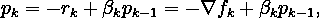

如果 *βₖpₖ₋₁* 占优势，仅充分下降条件不足以确保下降方向。

输入沃尔夫线搜索。

## 沃尔夫线搜索

我们增加另一个条件，叫做*曲率条件*，它要求 *αₖ* 满足

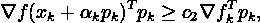

对于某些常数*c₂*∑*(c₁，1)* 其中 *c₁* 是来自阿米霍条件的常数。注意，左手边仅仅是 *f(xₖ + αpₖ)* 在 *αₖ* 的导数，因此曲率条件确保 *f(xₖ + αpₖ)* 在 *αₖ* 的斜率大于 *c₂* 乘以初始斜率

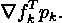

该条件排除了 Armijo 条件优选的不可接受的短步长，因此 *f* 可以显著减少。结合阿米霍条件，这两个条件也被称为*沃尔夫条件*。

我们可以修改曲率条件，以迫使 *αₖ* 至少位于 *f* 的局部极小点或驻点的宽邻域内。这种修改被称为*强沃尔夫条件*并要求 *αₖ* 满足

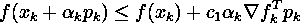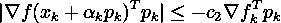

对于我们在[上一篇文章](/complete-step-by-step-gradient-descent-algorithm-from-scratch-acba013e8420)中讨论的阿米霍线搜索，我们通过将 *αₖ* 乘以收缩项 *ρ* 来定位最终步长。这种策略对于强 Wolfe 条件来说是低效的，因为它违背了该条件的目的。因此，对于选择阶段，我们放大以定位最终步长，这通常会在搜索所需步长的过程中减少括号间隔，并插入在早期步骤中收集的一些函数和导数信息，以猜测最小点的位置。我们不会在这里解释数学，因为它非常乏味，直接阅读下面的代码可能会更好。

哇，这是一个长的。现在我们准备实现 Wolfe 线搜索到共轭梯度算法。

## 履行

首先，我们定义一个目标函数来求解:[格里万克函数](https://en.wikipedia.org/wiki/Griewank_function)。

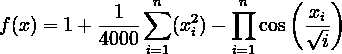

我们将使用二维版本的格里万克函数( *n = 2* )，正如在[上一篇文章](/complete-step-by-step-gradient-descent-algorithm-from-scratch-acba013e8420)中所做的那样。

最后，让我们建立非线性共轭梯度算法。如前所述，我们使用

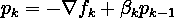

以*为方向，αₖ* 从沃尔夫线搜索为步长。此外，将采取措施，直到满足以下停止标准之一:

*   *f* 的梯度的范数足够接近零，也就是说，

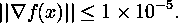

*   采取的步骤数是 1000

前面提到的 *βₖ* 的公式是由弗莱彻-里维斯(FR)开发的。这种方法的一个主要问题是，如果我们，不管什么原因，最终走向错误的方向 *pₖ* ，那么 FR 继续产生错误的方向。出于这个原因，Polak-Ribiere (PR)开发了另一种形式的 *βₖ* ，

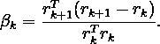

在实践中，PR 的共轭梯度算法通常比 FR 的效果更好。然而，强沃尔夫条件并不能保证 *pₖ* 是下降方向。

在下面的代码中，我们还介绍了βₖ的许多其他变体:

*   赫斯泰尼斯-斯蒂费尔
*   戴渊(DY)
*   哈格-张(赫兹)

然后，我们创建一个 python 函数来创建两个图:

*   *x* 的学习路径以及 *f(x)* 的轮廓图
*   每走一步 *f(x)* 的值

对于一个初始值 *x₀* 和一些 *β* 估计方法，我们在不同的场景下对 *f* 运行共轭梯度算法:

*   *x₀ =* [ *0，3* ]并使用 FR
*   *x₀ =* [ *2，1* ]并使用 FR
*   *x₀ =* [ *2，1* ]并使用 PR
*   *x₀ =* [ *2，1* ]并使用 HS
*   *x₀ =* [ *2，1* ]并使用 DY
*   *x₀ =* [ *2，1* ]并使用赫兹
*   *x₀ =* [ *2，2* ]并使用赫兹

## 场景 1: *x₀ =* [ *0，3* ]并使用 FR

```
Initial condition: y = 1.5254, x = [0 3]Iteration: 1 	y = 0.0004, x = [ 0.0000 -0.0389], gradient = 0.0195
Iteration: 2 	y = 0.0000, x = [ 0.0000 -0.0012], gradient = 0.0006
Iteration: 3 	y = 0.0000, x = [ 0.0000  0.0000], gradient = 0.0000
Iteration: 4 	y = 0.0000, x = [ 0.0000  0.0000], gradient = 0.0000Solution: 	y = 0.0000, x = [ 0.0000  0.0000]
```

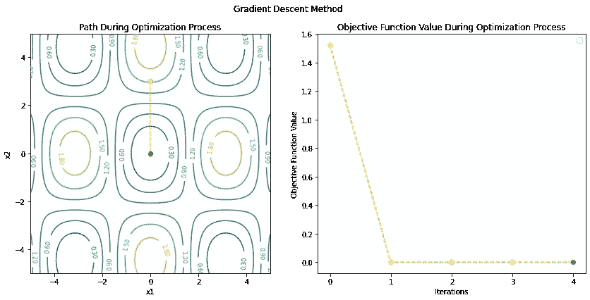

图片由[作者](https://dwiuzila.medium.com/membership)

## 场景 2: x₀ = [2，1]并使用 FR

```
Initial condition: y = 1.3176, x = [2 1]Iteration: 1 	y = 0.5170, x = [ 0.2435  1.4838], gradient = 0.6077
Iteration: 2 	y = 0.3029, x = [-0.3727  1.0246], gradient = 0.5152
Iteration: 3 	y = 0.1579, x = [-0.5426  0.2577], gradient = 0.5198
Iteration: 4 	y = 0.0758, x = [-0.3477 -0.2603], gradient = 0.3566
Iteration: 5 	y = 0.0462, x = [-0.1203 -0.3975], gradient = 0.2265
Iteration: 6 	y = 0.0329, x = [ 0.0433 -0.3585], gradient = 0.1822
Iteration: 7 	y = 0.0220, x = [ 0.1482 -0.2118], gradient = 0.1796
Iteration: 8 	y = 0.0120, x = [ 0.1548 -0.0102], gradient = 0.1543
Iteration: 9 	y = 0.0064, x = [ 0.0865  0.1037], gradient = 0.1005
Iteration: 10 	y = 0.0042, x = [ 0.0221  0.1262], gradient = 0.0668
Iteration: 11 	y = 0.0031, x = [-0.0241  0.1051], gradient = 0.0578
Iteration: 12 	y = 0.0020, x = [-0.0511  0.0513], gradient = 0.0571
Iteration: 13 	y = 0.0010, x = [-0.0451 -0.0090], gradient = 0.0453
Iteration: 14 	y = 0.0006, x = [-0.0222 -0.0367], gradient = 0.0288
Iteration: 15 	y = 0.0004, x = [-0.0031 -0.0397], gradient = 0.0201
Iteration: 16 	y = 0.0003, x = [ 0.0104 -0.0304], gradient = 0.0184
Iteration: 17 	y = 0.0002, x = [ 0.0169 -0.0114], gradient = 0.0178
Iteration: 18 	y = 0.0001, x = [ 0.0128  0.0059], gradient = 0.0132
Iteration: 19 	y = 0.0001, x = [ 0.0055  0.0124], gradient = 0.0083
Iteration: 20 	y = 0.0000, x = [-0.0001  0.0123], gradient = 0.0062
Iteration: 21 	y = 0.0000, x = [-0.0041  0.0085], gradient = 0.0059
Iteration: 22 	y = 0.0000, x = [-0.0053  0.0021], gradient = 0.0055
Iteration: 23 	y = 0.0000, x = [-0.0035 -0.0027], gradient = 0.0038
Iteration: 24 	y = 0.0000, x = [-0.0013 -0.0041], gradient = 0.0024
Iteration: 25 	y = 0.0000, x = [ 0.0004 -0.0037], gradient = 0.0019
Iteration: 26 	y = 0.0000, x = [ 0.0015 -0.0023], gradient = 0.0019
Iteration: 27 	y = 0.0000, x = [ 0.0016 -0.0002], gradient = 0.0016
Iteration: 28 	y = 0.0000, x = [ 0.0010  0.0010], gradient = 0.0011
Iteration: 29 	y = 0.0000, x = [ 0.0003  0.0013], gradient = 0.0007
Iteration: 30 	y = 0.0000, x = [-0.0002  0.0011], gradient = 0.0006
Iteration: 31 	y = 0.0000, x = [-0.0005  0.0006], gradient = 0.0006
Iteration: 32 	y = 0.0000, x = [-0.0005 -0.0001], gradient = 0.0005
Iteration: 33 	y = 0.0000, x = [-0.0002 -0.0004], gradient = 0.0003
Iteration: 34 	y = 0.0000, x = [-0.0000 -0.0004], gradient = 0.0002
Iteration: 35 	y = 0.0000, x = [ 0.0001 -0.0003], gradient = 0.0002
Iteration: 36 	y = 0.0000, x = [ 0.0002 -0.0001], gradient = 0.0002
Iteration: 37 	y = 0.0000, x = [ 0.0001  0.0001], gradient = 0.0001
Iteration: 38 	y = 0.0000, x = [ 0.0001  0.0001], gradient = 0.0001
Iteration: 39 	y = 0.0000, x = [ 0.0000  0.0001], gradient = 0.0001
Iteration: 40 	y = 0.0000, x = [-0.0000  0.0001], gradient = 0.0001
Iteration: 41 	y = 0.0000, x = [-0.0001  0.0000], gradient = 0.0001
Iteration: 42 	y = 0.0000, x = [-0.0000 -0.0000], gradient = 0.0000
Iteration: 43 	y = 0.0000, x = [-0.0000 -0.0000], gradient = 0.0000
Iteration: 44 	y = 0.0000, x = [ 0.0000 -0.0000], gradient = 0.0000
Iteration: 45 	y = 0.0000, x = [ 0.0000 -0.0000], gradient = 0.0000
Iteration: 46 	y = 0.0000, x = [ 0.0000 -0.0000], gradient = 0.0000
Iteration: 47 	y = 0.0000, x = [ 0.0000  0.0000], gradient = 0.0000
Iteration: 48 	y = 0.0000, x = [ 0.0000  0.0000], gradient = 0.0000Solution: 	y = 0.0000, x = [ 0.0000  0.0000]
```

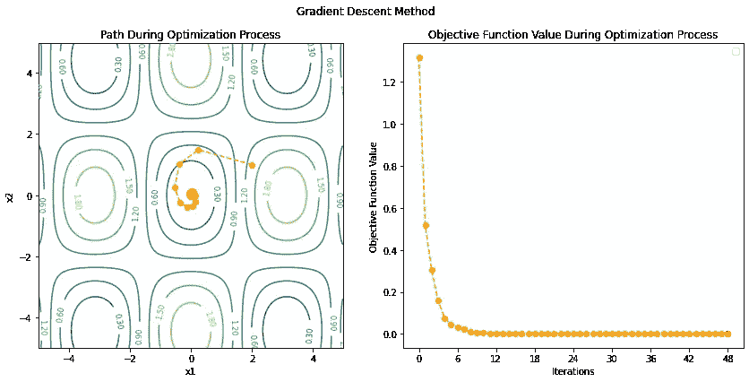

图片由[作者](https://dwiuzila.medium.com/membership)

## 场景 3: x₀ = [2，1]并使用 PR

```
Initial condition: y = 1.3176, x = [2 1]Iteration: 1 	y = 0.5170, x = [ 0.2435  1.4838], gradient = 0.6077
Iteration: 2 	y = 0.3194, x = [-0.4134  1.0358], gradient = 0.5266
Iteration: 3 	y = 0.0004, x = [-0.0111  0.0355], gradient = 0.0209
Iteration: 4 	y = 0.0004, x = [-0.0072  0.0370], gradient = 0.0198
Iteration: 5 	y = 0.0000, x = [ 0.0054  0.0041], gradient = 0.0057
Iteration: 6 	y = 0.0000, x = [-0.0000  0.0000], gradient = 0.0000Solution: 	y = 0.0000, x = [-0.0000  0.0000]
```

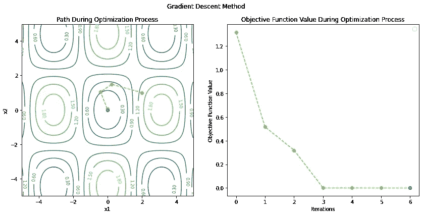

图片由[作者](https://dwiuzila.medium.com/membership)

## 场景 4: x₀ = [2，1]并使用 HS

```
Initial condition: y = 1.3176, x = [2 1]Iteration: 1 	y = 0.5170, x = [ 0.2435  1.4838], gradient = 0.6077
Iteration: 2 	y = 0.3072, x = [-0.3836  1.0276], gradient = 0.5182
Iteration: 3 	y = 0.0004, x = [ 0.0119  0.0358], gradient = 0.0215
Iteration: 4 	y = 0.0002, x = [-0.0077  0.0221], gradient = 0.0135
Iteration: 5 	y = 0.0000, x = [-0.0000 -0.0000], gradient = 0.0000Solution: 	y = 0.0000, x = [-0.0000 -0.0000]
```

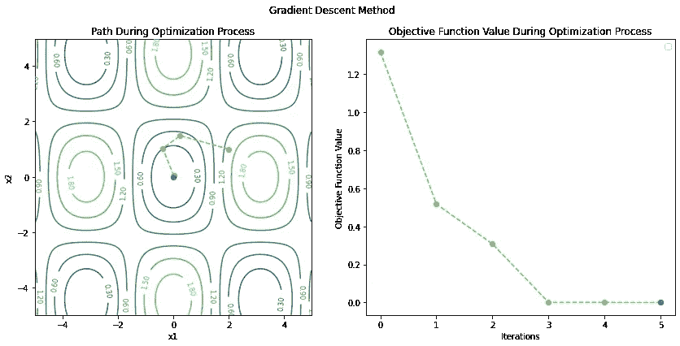

图片由[作者](https://dwiuzila.medium.com/membership)

## 场景 5: x₀ = [2，1]并使用 DY

```
Initial condition: y = 1.3176, x = [2 1]Iteration: 1 	y = 0.5170, x = [ 0.2435  1.4838], gradient = 0.6077
Iteration: 2 	y = 0.2887, x = [-0.4140  0.9624], gradient = 0.5140
Iteration: 3 	y = 0.1582, x = [-0.5550  0.1947], gradient = 0.5287
Iteration: 4 	y = 0.0763, x = [-0.3343 -0.2981], gradient = 0.3502
Iteration: 5 	y = 0.0480, x = [-0.1058 -0.4143], gradient = 0.2270
Iteration: 6 	y = 0.0341, x = [ 0.0594 -0.3606], gradient = 0.1872
Iteration: 7 	y = 0.0225, x = [ 0.1599 -0.1985], gradient = 0.1855
Iteration: 8 	y = 0.0120, x = [ 0.1550  0.0073], gradient = 0.1545
Iteration: 9 	y = 0.0065, x = [ 0.0819  0.1131], gradient = 0.0991
Iteration: 10 	y = 0.0044, x = [ 0.0172  0.1302], gradient = 0.0673
Iteration: 11 	y = 0.0032, x = [-0.0290  0.1046], gradient = 0.0598
Iteration: 12 	y = 0.0020, x = [-0.0540  0.0461], gradient = 0.0587
Iteration: 13 	y = 0.0010, x = [-0.0445 -0.0140], gradient = 0.0451
Iteration: 14 	y = 0.0006, x = [-0.0206 -0.0392], gradient = 0.0284
Iteration: 15 	y = 0.0004, x = [-0.0016 -0.0407], gradient = 0.0204
Iteration: 16 	y = 0.0003, x = [ 0.0119 -0.0299], gradient = 0.0191
Iteration: 17 	y = 0.0002, x = [ 0.0175 -0.0096], gradient = 0.0182
Iteration: 18 	y = 0.0001, x = [ 0.0125  0.0074], gradient = 0.0130
Iteration: 19 	y = 0.0001, x = [ 0.0050  0.0131], gradient = 0.0082
Iteration: 20 	y = 0.0000, x = [-0.0006  0.0125], gradient = 0.0063
Iteration: 21 	y = 0.0000, x = [-0.0045  0.0082], gradient = 0.0061
Iteration: 22 	y = 0.0000, x = [-0.0055  0.0015], gradient = 0.0055
Iteration: 23 	y = 0.0000, x = [-0.0034 -0.0031], gradient = 0.0037
Iteration: 24 	y = 0.0000, x = [-0.0011 -0.0043], gradient = 0.0024
Iteration: 25 	y = 0.0000, x = [ 0.0005 -0.0038], gradient = 0.0020
Iteration: 26 	y = 0.0000, x = [ 0.0016 -0.0022], gradient = 0.0020
Iteration: 27 	y = 0.0000, x = [ 0.0016 -0.0000], gradient = 0.0016
Iteration: 28 	y = 0.0000, x = [ 0.0009  0.0011], gradient = 0.0011
Iteration: 29 	y = 0.0000, x = [ 0.0002  0.0014], gradient = 0.0007
Iteration: 30 	y = 0.0000, x = [-0.0003  0.0011], gradient = 0.0006
Iteration: 31 	y = 0.0000, x = [-0.0006  0.0005], gradient = 0.0006
Iteration: 32 	y = 0.0000, x = [-0.0005 -0.0001], gradient = 0.0005
Iteration: 33 	y = 0.0000, x = [-0.0002 -0.0004], gradient = 0.0003
Iteration: 34 	y = 0.0000, x = [-0.0000 -0.0004], gradient = 0.0002
Iteration: 35 	y = 0.0000, x = [ 0.0001 -0.0003], gradient = 0.0002
Iteration: 36 	y = 0.0000, x = [ 0.0002 -0.0001], gradient = 0.0002
Iteration: 37 	y = 0.0000, x = [ 0.0001  0.0001], gradient = 0.0001
Iteration: 38 	y = 0.0000, x = [ 0.0001  0.0001], gradient = 0.0001
Iteration: 39 	y = 0.0000, x = [-0.0000  0.0001], gradient = 0.0001
Iteration: 40 	y = 0.0000, x = [-0.0000  0.0001], gradient = 0.0001
Iteration: 41 	y = 0.0000, x = [-0.0001  0.0000], gradient = 0.0001
Iteration: 42 	y = 0.0000, x = [-0.0000 -0.0000], gradient = 0.0000
Iteration: 43 	y = 0.0000, x = [-0.0000 -0.0000], gradient = 0.0000
Iteration: 44 	y = 0.0000, x = [ 0.0000 -0.0000], gradient = 0.0000
Iteration: 45 	y = 0.0000, x = [ 0.0000 -0.0000], gradient = 0.0000
Iteration: 46 	y = 0.0000, x = [ 0.0000 -0.0000], gradient = 0.0000
Iteration: 47 	y = 0.0000, x = [ 0.0000  0.0000], gradient = 0.0000
Iteration: 48 	y = 0.0000, x = [ 0.0000  0.0000], gradient = 0.0000Solution: 	y = 0.0000, x = [ 0.0000  0.0000]
```


图片由[作者](https://dwiuzila.medium.com/membership)

## 场景 6: x₀ = [2，1]并使用赫兹

```
Initial condition: y = 1.3176, x = [2 1]Iteration: 1 	y = 0.5170, x = [ 0.2435  1.4838], gradient = 0.6077
Iteration: 2 	y = 0.2369, x = [-0.4269  0.8147], gradient = 0.4939
Iteration: 3 	y = 0.0000, x = [-0.0064 -0.0053], gradient = 0.0070
Iteration: 4 	y = 0.0000, x = [ 0.0003 -0.0008], gradient = 0.0005
Iteration: 5 	y = 0.0000, x = [ 0.0000  0.0000], gradient = 0.0000Solution: 	y = 0.0000, x = [ 0.0000  0.0000]
```

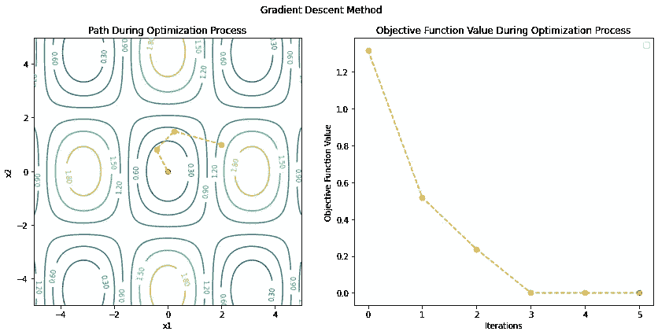

图片由[作者](https://dwiuzila.medium.com/membership)

## 场景 7: x₀ = [2，2]并使用赫兹

```
Initial condition: y = 1.0669, x = [2 2]Iteration: 1 	y = 0.9666, x = [ 1.7144  2.5793], gradient = 0.2652
Iteration: 2 	y = 0.0075, x = [ 3.1474  4.4532], gradient = 0.0104
Iteration: 3 	y = 0.0074, x = [ 3.1379  4.4420], gradient = 0.0028
Iteration: 4 	y = 0.0074, x = [ 3.1400  4.4384], gradient = 0.0000Solution: 	y = 0.0074, x = [ 3.1400  4.4384]
```

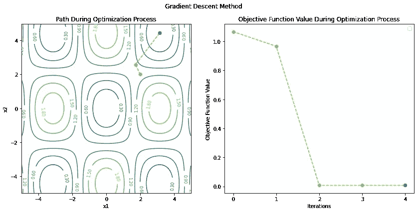

图片由[作者](https://dwiuzila.medium.com/membership)

从这些例子中，我们看到，采用共轭梯度算法进行一般函数优化将不再确保过程在某个特定的迭代次数终止。这就是为什么我们使用`max_iter`来保护算法。

*βₖ* 计算方法的不同导致算法性能的不同。此外， *xₖ* 的不良初始化可能不会导致过程中的全局最小值。

从这些结果中你还能推断出什么？让我们在下面的回复部分讨论这个问题。

# 结论

共轭梯度算法用于求解线性系统，或者等价地，优化二次凸函数。它设置学习路径方向，使得它们相对于系数矩阵 *A* 是*共轭*，因此该过程在最多 *A* 次迭代之后终止。该算法可用于利用 Wolfe 线搜索优化一般可微函数，并可通过考虑方向系数 *βₖ* 的变化进行改进。


🔥你好！如果你喜欢这个故事，想支持我这个作家，可以考虑 [***成为会员***](https://dwiuzila.medium.com/membership) *。每月只需 5 美元，你就可以无限制地阅读媒体上的所有报道。如果你注册使用我的链接，我会赚一小笔佣金。*

🔖*想了解更多经典机器学习模型的工作原理，以及它们是如何优化参数的？或者 MLOps 大型项目的例子？有史以来最优秀的文章呢？继续阅读:*


[艾伯斯·乌兹拉](https://dwiuzila.medium.com/?source=post_page-----202c07fb52a8--------------------------------)

## 从零开始的机器学习

[View list](https://dwiuzila.medium.com/list/machine-learning-from-scratch-b35db8650093?source=post_page-----202c07fb52a8--------------------------------)8 stories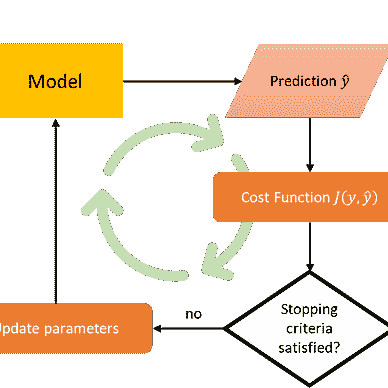

[艾伯斯·乌兹拉](https://dwiuzila.medium.com/?source=post_page-----202c07fb52a8--------------------------------)

## 高级优化方法

[View list](https://dwiuzila.medium.com/list/advanced-optimization-methods-26e264a361e4?source=post_page-----202c07fb52a8--------------------------------)7 stories

[艾伯斯·乌兹拉](https://dwiuzila.medium.com/?source=post_page-----202c07fb52a8--------------------------------)

## MLOps 大型项目

[View list](https://dwiuzila.medium.com/list/mlops-megaproject-6a3bf86e45e4?source=post_page-----202c07fb52a8--------------------------------)6 stories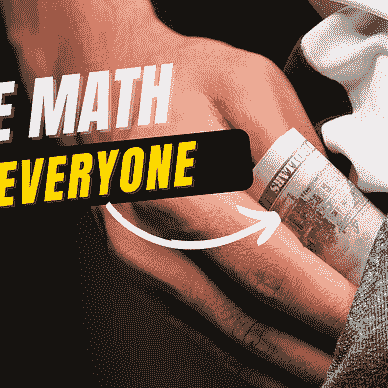

[艾伯斯·乌兹拉](https://dwiuzila.medium.com/?source=post_page-----202c07fb52a8--------------------------------)

## 我最好的故事

[View list](https://dwiuzila.medium.com/list/my-best-stories-d8243ae80aa0?source=post_page-----202c07fb52a8--------------------------------)24 stories

[艾伯斯·乌兹拉](https://dwiuzila.medium.com/?source=post_page-----202c07fb52a8--------------------------------)

## R 中的数据科学

[View list](https://dwiuzila.medium.com/list/data-science-in-r-0a8179814b50?source=post_page-----202c07fb52a8--------------------------------)7 stories[](https://dwiuzila.medium.com/membership)