# 从头开始完成逐步梯度下降算法

> 原文：<https://towardsdatascience.com/complete-step-by-step-gradient-descent-algorithm-from-scratch-acba013e8420?source=collection_archive---------0----------------------->

## 实践教程

## 以及恒定学习速率和线搜索的实现

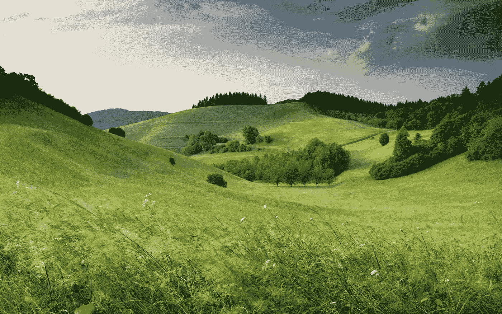

梯度下降算法就像一个球滚下山坡。克劳迪奥·泰斯塔在 [Unsplash](https://unsplash.com?utm_source=medium&utm_medium=referral) 上拍摄的照片

```
**Table of Contents** (read till the end to see how you can get the complete python code of this story)· [What is Optimization?](#0050)
· [Gradient Descent (the Easy Way)](#04b4)
· [Armijo Line Search](#9f3c)
· [Gradient Descent (the Hard Way)](#86f7)
· [Conclusion](#774e)
```

# 什么是优化？

如果你研究机器学习的时间足够长，你可能会听说过诸如 SGD 或 Adam 这样的术语。它们是许多优化算法中的两种。优化算法是机器学习的核心，负责机器学习模型从数据中学习的复杂工作。事实证明，优化已经存在很长时间了，甚至在机器学习领域之外。

> 人们优化。投资者寻求创建能够避免过度风险、同时实现高回报率的投资组合。制造商的目标是在生产过程的设计和操作中实现最大效率。工程师调整参数以优化他们设计的性能。

Jorge Nocedal 的数值优化书的第一段已经解释了很多。它继续说，即使是自然优化。物理系统趋向于最小能量状态。孤立的化学系统中的分子相互反应，直到它们的电子总势能最小。光线沿着最小化其传播时间的路径行进。

为了理解什么是优化，首先，我们必须确定*目标*，它可能是回报率、能量、旅行时间等。该目标取决于被称为*变量*的系统的某些特征。我们的目标是找到优化目标的变量的值。在某种程度上，变量通常是受约束的。

从数学上来说，优化是通过搜索适当的变量 *x* 来最大化或最小化目标函数 *f(x)* 的过程，该过程受到一些约束 *cᵢ* 的约束，可以简洁地写成如下。

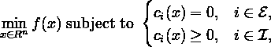

其中ℰ和ℐ分别是平等和不平等约束的指数集。

乍一看，这种数学陈述确实令人望而生畏，也许是因为它是对优化的一般描述，在这里没有太多可以推断的。但是不要担心，到我们得到代码的时候，一切都会清楚的。

[](/complete-step-by-step-conjugate-gradient-algorithm-from-scratch-202c07fb52a8) [## 从头开始完成逐步共轭梯度算法

### 和一般函数优化的实现

towardsdatascience.com](/complete-step-by-step-conjugate-gradient-algorithm-from-scratch-202c07fb52a8) 

# 梯度下降(最简单的方法)

现在，我们如何求解 **min** 函数？多亏了微积分，我们有了一个叫做*梯度*的工具。想象一下山顶上有一个球。我们知道这座山在不同的地方有不同的坡度。由于重力的作用，球会沿着山坡的曲线下降。它往哪边走？到最陡的坡度。一段时间后，球将到达局部最小值，此时地面相对于其周围环境是平坦的。

这就是梯度下降的本质。我们可以将球的平滑路径量化为微小的步长。在第 *k* 步，我们会有两个量:步长 *αₖ* 和方向 *pₖ* 。为了看到渐变下降的效果，让我们首先导入一些库。

首先，我们将定义一个简单的目标函数*f(x)= x2x 3*，其中 *x* 是实数。由于梯度下降使用梯度，我们也将定义 *f* 的梯度，它正好是 *f* 的一阶导数，即∇*f(x)= 2x 2*。

接下来，我们定义 python 函数，用于在优化过程中绘制目标函数和*学习路径*。我们所说的学习路径就是每个下降步骤后的点 *x* 。

从下面的图中，我们可以很容易地看到 *f* 在 *x = 1* 处有一个最小值(因此 *f(x) = -4* )。假设我们从 *x = -4* (下面用红点表示)开始，我们将看看梯度下降是否能定位到局部最小值 *x = 1* 。

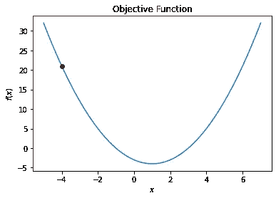

图片作者[作者](http://dwiuzila.medium.com/membership)

定义一个简单的梯度下降算法如下。对于步骤 *k* 开始时的每个点 *xₖ* ，我们保持步长 *αₖ* 不变，并将方向 *pₖ* 设置为梯度值的负值(在 *xₖ* 处最陡下降)。我们使用公式采取步骤

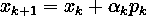

而梯度仍然高于某个容差值(在我们的例子中为 1 × 10⁻⁵)，并且步数仍然低于某个最大值(在我们的例子中为 1000)。

从 *x = -4* 开始，我们用不同的场景在 *f* 上运行梯度下降算法:

*   *αₖ = 0.1*
*   *αₖ = 0.9*
*   *αₖ = 1 × 10⁻⁴*
*   *αₖ = 1.01*

## 情景 1: αₖ = 0.1

```
Solution found:
  y = -4.0000
  x = 1.0000
```

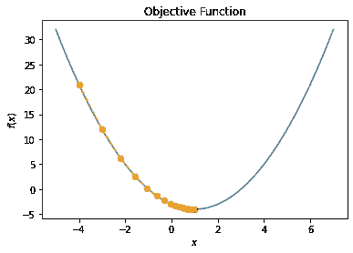

图片作者[作者](http://dwiuzila.medium.com/membership)

## 情景 2: αₖ = 0.9

```
Solution found:
  y = -4.0000
  x = 1.0000
```

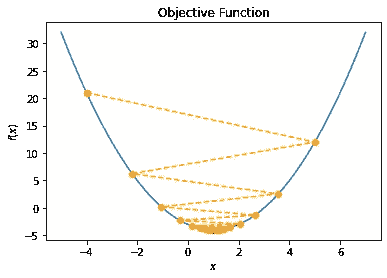

图片作者[作者](http://dwiuzila.medium.com/membership)

## 情景 3: αₖ = 1 × 10⁻⁴

```
Gradient descent does not converge.
```

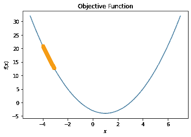

图片作者[作者](http://dwiuzila.medium.com/membership)

## 情景 4: αₖ = 1.01

```
Gradient descent does not converge.
```

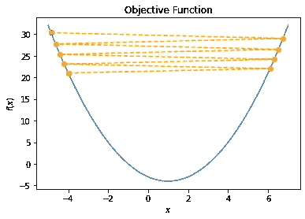

图片由[作者](http://dwiuzila.medium.com/membership)

这是我们得到的信息:

*   第一个场景像魔咒一样收敛。即使步长是恒定的，方向也向零减小，因此导致收敛。
*   第二种情况也是收敛的，即使学习路径由于大步长而在解附近振荡。
*   第三个场景走向解决方案。但是步长太小，以至于迭代次数达到最大。增加`max_iter`将会解决问题，尽管需要更长的时间才能找到解决方案。
*   第四种情况由于大步长而发散。在这里，我们设置`max_iter` = 8，以使可视化更令人愉快。

总之，解 *x = 1* 可以通过具有合适步长的梯度下降来达到。

你可能会想，为什么我们不用精确的解析解:对 *f* 求导，然后求解 *x* 使得导数为零。对于我们之前的例子，我们会发现使 *f* 最小的 *x* 将满足∇*f(x)= 2x 2 = 0*，即 *x = 1* 。

是的，这是一条路。但是当你面对一个优化问题时，这并不是一个推荐的技术，在这个优化问题中, *f* 的导数很难计算或者不可能求解。

# 阿米霍线搜索

现在，我们可以从梯度下降算法中改进什么？我们之前看到，步长 *α* 在整个步骤中保持不变，错误选择 *α* 可能会导致步骤发散。我们能为每个步进方向寻找最佳的 *α* 吗？

进入*线搜索*。

在线搜索策略中，该算法选择一个方向 *pₖ* (可以像最速下降-∇ *f(x)* 一样简单)并且沿着这个方向从当前迭代 *xₖ* 开始搜索具有更低函数值的新迭代。沿着 *pₖ* 移动的距离可以通过近似求解以下一维最小化问题来找到步长 *α* :

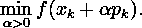

如前所述，通过精确求解，我们将从方向 *pₖ* 中获得最大收益，但是精确的最小化可能是昂贵的，并且通常是不必要的。取而代之的是，线搜索算法产生有限数量的试验步长，直到它找到一个宽松地接近最小的 *f(xₖ + α pₖ)* 。在新的点 *xₖ₊₁ = xₖ + α pₖ* ，计算新的搜索方向和步长，并重复该过程。

一个流行的不精确线搜索条件规定， *αₖ* 应该首先在目标函数 *f* 中给出一个*足够的减少量*，如所谓的*阿米霍条件*所测量的:

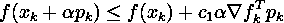

对于某些常数*∈*(0，1)* 。换句话说， *f* 的减少应与步长 *αₖ* 和方向导数∇ *fₖpₖ* 成比例。在迭代 *xₖ* 时，我们从一些初始的 *αₖ* 开始，当阿米霍条件不满足时，我们简单地用一些收缩因子 *ρ* 收缩 *αₖ* 。收缩过程将在某一点终止，因为对于足够小的 *αₖ* ，阿米霍条件总是满足的。*

*下面是 Armijo 行搜索的代码。注意我们用 *ρ = 0.5* 和 *c₁ = 1 × 10⁻⁴* 。*

*现在我们准备实现 Armijo 线搜索到梯度下降算法。*

# *梯度下降(艰难的道路)*

*首先，我们定义一个更难求解的目标函数:[格里万克函数](https://en.wikipedia.org/wiki/Griewank_function)。*

*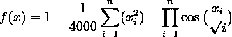*

*我们将使用 Griewank 函数的二维版本( *n = 2* )。为了说明一些问题，我们可以将这个函数绘制如下。*

*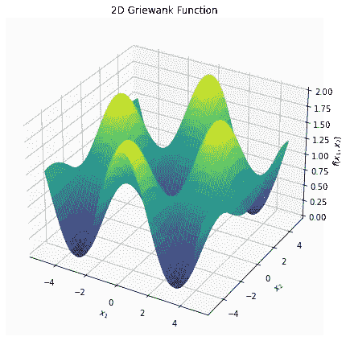*

*图片作者[作者](http://dwiuzila.medium.com/membership)*

*我们可以看到这个函数有很多局部最优解。我们应该预料到梯度下降算法会陷入这些局部极小值之一。我们还可以注意到，全局最小值在 *x =* [ *0，0* ]处，其中 *f(x) = 0* 。*

*最后，让我们最后一次构建梯度下降算法。如前所述，我们使用来自阿米霍线搜索的 *pₖ = -* ∇ *f(xₖ)* 作为方向和 *αₖ* 作为步长。此外，将采取措施，直到满足以下停止标准之一:*

*   *目标函数的梯度的范数足够接近零，也就是说，*

*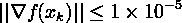*

*   *采取的步骤数是 1000*

*然后，我们创建一个 python 函数来创建两个图:*

*   **x* 的学习路径以及 *f(x)* 的轮廓图*
*   *每走一步 *f(x)* 的值*

*对于初始值 *x₀* ，我们使用不同的场景对 *f* 运行梯度下降算法:*

*   **x₀ =* [ *0，3* ]*
*   **x₀ =* [ *1，2* ]*
*   **x₀ =* [ *2，1* ]*
*   **x₀ =* [ *1，3* ]*
*   **x₀ =* [ *2，2* ]*
*   **x₀ =* [ *3，1**

## *场景 1: x₀ = [0，3]*

```
*Initial condition: y = 1.5254, x = [0 3] Iteration: 1 	 y = 1.1245, x = [0.0000 2.3959], gradient = 0.7029
Iteration: 2 	 y = 0.6356, x = [0.0000 1.6929], gradient = 0.6591
Iteration: 3 	 y = 0.2558, x = [0.0000 1.0338], gradient = 0.4726
Iteration: 4 	 y = 0.0778, x = [0.0000 0.5612], gradient = 0.2736
Iteration: 5 	 y = 0.0206, x = [0.0000 0.2876], gradient = 0.1430
Iteration: 6 	 y = 0.0052, x = [0.0000 0.1447], gradient = 0.0723
Iteration: 7 	 y = 0.0013, x = [0.0000 0.0724], gradient = 0.0362
Iteration: 8 	 y = 0.0003, x = [0.0000 0.0362], gradient = 0.0181
Iteration: 9 	 y = 0.0001, x = [0.0000 0.0181], gradient = 0.0090
Iteration: 10 	 y = 0.0000, x = [0.0000 0.0090], gradient = 0.0045
Iteration: 11 	 y = 0.0000, x = [0.0000 0.0045], gradient = 0.0023
Iteration: 12 	 y = 0.0000, x = [0.0000 0.0023], gradient = 0.0011
Iteration: 13 	 y = 0.0000, x = [0.0000 0.0011], gradient = 0.0006
Iteration: 14 	 y = 0.0000, x = [0.0000 0.0006], gradient = 0.0003
Iteration: 15 	 y = 0.0000, x = [0.0000 0.0003], gradient = 0.0001
Iteration: 16 	 y = 0.0000, x = [0.0000 0.0001], gradient = 0.0001
Iteration: 17 	 y = 0.0000, x = [0.0000 0.0001], gradient = 0.0000
Iteration: 18 	 y = 0.0000, x = [0.0000 0.0000], gradient = 0.0000
Iteration: 19 	 y = 0.0000, x = [0.0000 0.0000], gradient = 0.0000Solution: 	 y = 0.0000, x = [0.0000 0.0000]*
```

*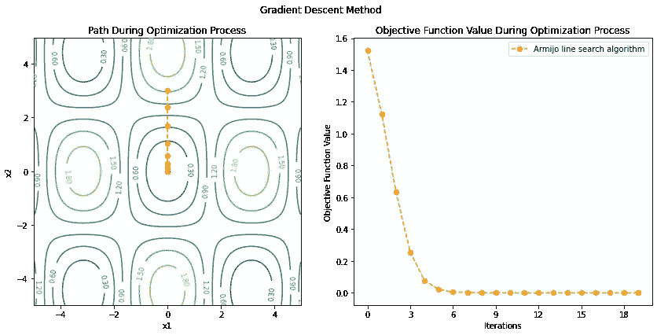*

*图片作者[作者](http://dwiuzila.medium.com/membership)*

## *场景 2: x₀ = [1，2]*

```
*Initial condition: y = 0.9170, x = [1 2] Iteration: 1 	 y = 0.7349, x = [0.8683 1.6216], gradient = 0.5225
Iteration: 2 	 y = 0.4401, x = [0.5538 1.2044], gradient = 0.5705
Iteration: 3 	 y = 0.1564, x = [0.2071 0.7513], gradient = 0.3932
Iteration: 4 	 y = 0.0403, x = [0.0297 0.4004], gradient = 0.1997
Iteration: 5 	 y = 0.0103, x = [0.0012 0.2027], gradient = 0.1011
Iteration: 6 	 y = 0.0026, x = [0.0000 0.1016], gradient = 0.0508
Iteration: 7 	 y = 0.0006, x = [0.0000 0.0508], gradient = 0.0254
Iteration: 8 	 y = 0.0002, x = [0.0000 0.0254], gradient = 0.0127
Iteration: 9 	 y = 0.0000, x = [0.0000 0.0127], gradient = 0.0063
Iteration: 10 	 y = 0.0000, x = [0.0000 0.0063], gradient = 0.0032
Iteration: 11 	 y = 0.0000, x = [0.0000 0.0032], gradient = 0.0016
Iteration: 12 	 y = 0.0000, x = [0.0000 0.0016], gradient = 0.0008
Iteration: 13 	 y = 0.0000, x = [0.0000 0.0008], gradient = 0.0004
Iteration: 14 	 y = 0.0000, x = [0.0000 0.0004], gradient = 0.0002
Iteration: 15 	 y = 0.0000, x = [0.0000 0.0002], gradient = 0.0001
Iteration: 16 	 y = 0.0000, x = [0.0000 0.0001], gradient = 0.0000
Iteration: 17 	 y = 0.0000, x = [0.0000 0.0000], gradient = 0.0000
Iteration: 18 	 y = 0.0000, x = [0.0000 0.0000], gradient = 0.0000
Iteration: 19 	 y = 0.0000, x = [0.0000 0.0000], gradient = 0.0000Solution: 	 y = 0.0000, x = [0.0000 0.0000]*
```

**

*图片由[作者](http://dwiuzila.medium.com/membership)*

## *场景 3: x₀ = [2，1]*

```
*Initial condition: y = 1.3176, x = [2 1] Iteration: 1 	 y = 0.8276, x = [1.3077 1.1907], gradient = 0.6583
Iteration: 2 	 y = 0.4212, x = [0.6639 1.0529], gradient = 0.5903
Iteration: 3 	 y = 0.1315, x = [0.2104 0.6750], gradient = 0.3682
Iteration: 4 	 y = 0.0320, x = [0.0248 0.3570], gradient = 0.1784
Iteration: 5 	 y = 0.0081, x = [0.0008 0.1803], gradient = 0.0900
Iteration: 6 	 y = 0.0020, x = [0.0000 0.0903], gradient = 0.0452
Iteration: 7 	 y = 0.0005, x = [0.0000 0.0451], gradient = 0.0226
Iteration: 8 	 y = 0.0001, x = [0.0000 0.0225], gradient = 0.0113
Iteration: 9 	 y = 0.0000, x = [0.0000 0.0113], gradient = 0.0056
Iteration: 10 	 y = 0.0000, x = [0.0000 0.0056], gradient = 0.0028
Iteration: 11 	 y = 0.0000, x = [0.0000 0.0028], gradient = 0.0014
Iteration: 12 	 y = 0.0000, x = [0.0000 0.0014], gradient = 0.0007
Iteration: 13 	 y = 0.0000, x = [0.0000 0.0007], gradient = 0.0004
Iteration: 14 	 y = 0.0000, x = [0.0000 0.0004], gradient = 0.0002
Iteration: 15 	 y = 0.0000, x = [0.0000 0.0002], gradient = 0.0001
Iteration: 16 	 y = 0.0000, x = [0.0000 0.0001], gradient = 0.0000
Iteration: 17 	 y = 0.0000, x = [0.0000 0.0000], gradient = 0.0000
Iteration: 18 	 y = 0.0000, x = [0.0000 0.0000], gradient = 0.0000
Iteration: 19 	 y = 0.0000, x = [0.0000 0.0000], gradient = 0.0000Solution: 	 y = 0.0000, x = [0.0000 0.0000]*
```

*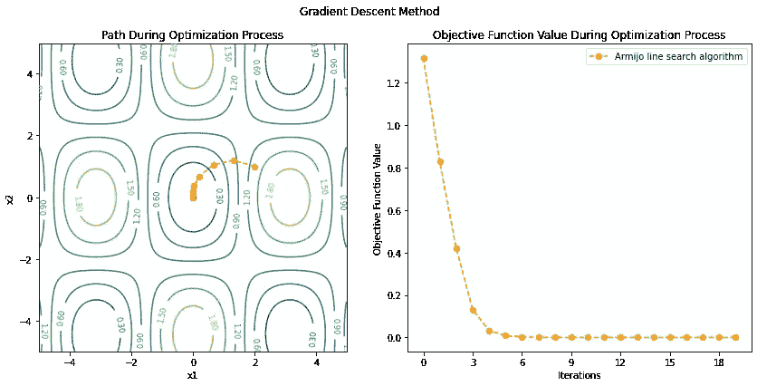*

*图片由[作者](http://dwiuzila.medium.com/membership)*

## *场景 4: x₀ = [1，3]*

```
*Initial condition: y = 1.2852, x = [1 3] Iteration: 1 	 y = 1.0433, x = [1.4397 2.6729], gradient = 0.3230
Iteration: 2 	 y = 0.9572, x = [1.7501 2.5838], gradient = 0.2763
Iteration: 3 	 y = 0.8638, x = [1.9986 2.7045], gradient = 0.4098
Iteration: 4 	 y = 0.6623, x = [2.3024 2.9796], gradient = 0.5544
Iteration: 5 	 y = 0.3483, x = [2.6813 3.3842], gradient = 0.5380
Iteration: 6 	 y = 0.1116, x = [3.0054 3.8137], gradient = 0.3231
Iteration: 7 	 y = 0.0338, x = [3.1265 4.1133], gradient = 0.1618
Iteration: 8 	 y = 0.0141, x = [3.1396 4.2745], gradient = 0.0818
Iteration: 9 	 y = 0.0091, x = [3.1400 4.3564], gradient = 0.0411
Iteration: 10 	 y = 0.0078, x = [3.1400 4.3974], gradient = 0.0205
Iteration: 11 	 y = 0.0075, x = [3.1400 4.4179], gradient = 0.0103
Iteration: 12 	 y = 0.0074, x = [3.1400 4.4282], gradient = 0.0051
Iteration: 13 	 y = 0.0074, x = [3.1400 4.4333], gradient = 0.0026
Iteration: 14 	 y = 0.0074, x = [3.1400 4.4359], gradient = 0.0013
Iteration: 15 	 y = 0.0074, x = [3.1400 4.4372], gradient = 0.0006
Iteration: 16 	 y = 0.0074, x = [3.1400 4.4378], gradient = 0.0003
Iteration: 17 	 y = 0.0074, x = [3.1400 4.4381], gradient = 0.0002
Iteration: 18 	 y = 0.0074, x = [3.1400 4.4383], gradient = 0.0001
Iteration: 19 	 y = 0.0074, x = [3.1400 4.4384], gradient = 0.0000
Iteration: 20 	 y = 0.0074, x = [3.1400 4.4384], gradient = 0.0000
Iteration: 21 	 y = 0.0074, x = [3.1400 4.4384], gradient = 0.0000Solution: 	 y = 0.0074, x = [3.1400 4.4384]*
```

*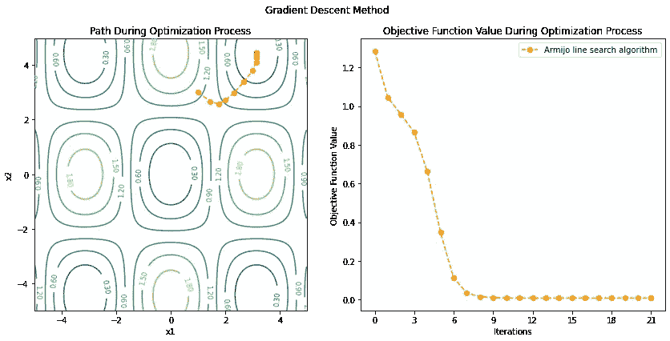*

*图片作者[作者](http://dwiuzila.medium.com/membership)*

## *场景 5: x₀ = [2，2]*

```
*Initial condition: y = 1.0669, x = [2 2] Iteration: 1 	 y = 0.9886, x = [1.8572 2.2897], gradient = 0.2035
Iteration: 2 	 y = 0.9414, x = [1.9025 2.488 ], gradient = 0.2858
Iteration: 3 	 y = 0.8372, x = [2.0788 2.713 ], gradient = 0.4378
Iteration: 4 	 y = 0.6117, x = [2.3753 3.035 ], gradient = 0.5682
Iteration: 5 	 y = 0.2941, x = [2.7514 3.461 ], gradient = 0.5082
Iteration: 6 	 y = 0.0894, x = [3.0423 3.8777], gradient = 0.2863
Iteration: 7 	 y = 0.0282, x = [3.1321 4.1495], gradient = 0.1438
Iteration: 8 	 y = 0.0127, x = [3.1398 4.2931], gradient = 0.0726
Iteration: 9 	 y = 0.0087, x = [3.1400 4.3657], gradient = 0.0364
Iteration: 10 	 y = 0.0077, x = [3.1400 4.4021], gradient = 0.0182
Iteration: 11 	 y = 0.0075, x = [3.1400 4.4203], gradient = 0.0091
Iteration: 12 	 y = 0.0074, x = [3.1400 4.4294], gradient = 0.0045
Iteration: 13 	 y = 0.0074, x = [3.1400 4.4339], gradient = 0.0023
Iteration: 14 	 y = 0.0074, x = [3.1400 4.4362], gradient = 0.0011
Iteration: 15 	 y = 0.0074, x = [3.1400 4.4373], gradient = 0.0006
Iteration: 16 	 y = 0.0074, x = [3.1400 4.4379], gradient = 0.0003
Iteration: 17 	 y = 0.0074, x = [3.1400 4.4382], gradient = 0.0001
Iteration: 18 	 y = 0.0074, x = [3.1400 4.4383], gradient = 0.0001
Iteration: 19 	 y = 0.0074, x = [3.1400 4.4384], gradient = 0.0000
Iteration: 20 	 y = 0.0074, x = [3.1400 4.4384], gradient = 0.0000
Iteration: 21 	 y = 0.0074, x = [3.1400 4.4384], gradient = 0.0000Solution: 	 y = 0.0074, x = [3.1400 4.4384]*
```

*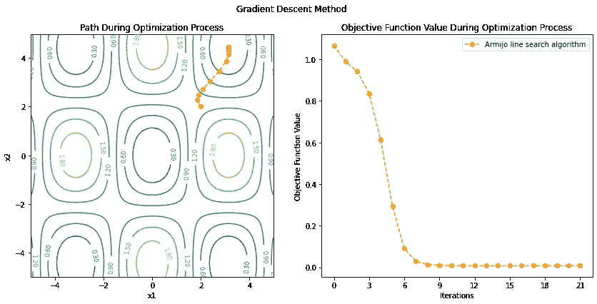*

*图片作者[作者](http://dwiuzila.medium.com/membership)*

## *场景 6: x₀ = [3，1]*

```
*Initial condition: y = 1.7551, x = [3 1] Iteration: 1 	 y = 1.5028, x = [2.8912 1.4543], gradient = 0.6001
Iteration: 2 	 y = 1.1216, x = [2.7619 2.0402], gradient = 0.6522
Iteration: 3 	 y = 0.7074, x = [2.7131 2.6906], gradient = 0.6214
Iteration: 4 	 y = 0.3449, x = [2.8471 3.2973], gradient = 0.5273
Iteration: 5 	 y = 0.1160, x = [3.0458 3.7858], gradient = 0.3246
Iteration: 6 	 y = 0.0361, x = [3.1298 4.0993], gradient = 0.1683
Iteration: 7 	 y = 0.0147, x = [3.1397 4.2673], gradient = 0.0854
Iteration: 8 	 y = 0.0092, x = [3.1400 4.3528], gradient = 0.0429
Iteration: 9 	 y = 0.0079, x = [3.1400 4.3956], gradient = 0.0214
Iteration: 10 	 y = 0.0075, x = [3.1400 4.4170], gradient = 0.0107
Iteration: 11 	 y = 0.0074, x = [3.1400 4.4278], gradient = 0.0053
Iteration: 12 	 y = 0.0074, x = [3.1400 4.4331], gradient = 0.0027
Iteration: 13 	 y = 0.0074, x = [3.1400 4.4358], gradient = 0.0013
Iteration: 14 	 y = 0.0074, x = [3.1400 4.4371], gradient = 0.0007
Iteration: 15 	 y = 0.0074, x = [3.1400 4.4378], gradient = 0.0003
Iteration: 16 	 y = 0.0074, x = [3.1400 4.4381], gradient = 0.0002
Iteration: 17 	 y = 0.0074, x = [3.1400 4.4383], gradient = 0.0001
Iteration: 18 	 y = 0.0074, x = [3.1400 4.4384], gradient = 0.0000
Iteration: 19 	 y = 0.0074, x = [3.1400 4.4384], gradient = 0.0000
Iteration: 20 	 y = 0.0074, x = [3.1400 4.4384], gradient = 0.0000
Iteration: 21 	 y = 0.0074, x = [3.1400 4.4384], gradient = 0.0000Solution: 	 y = 0.0074, x = [3.1400 4.4384]*
```

*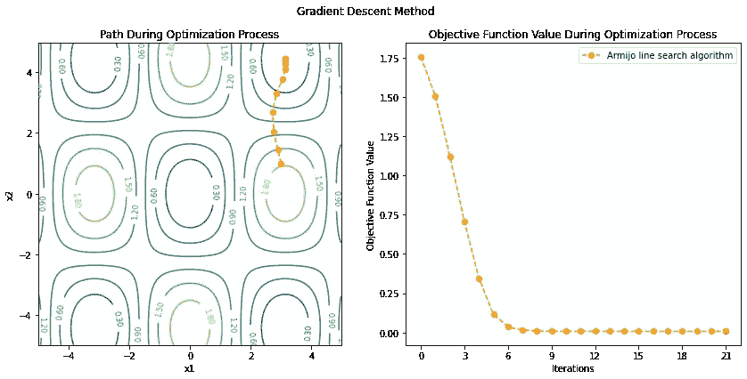*

*图片由[作者](http://dwiuzila.medium.com/membership)*

*在前 3 种情况下，算法收敛到全局最小值，其中 *f(x) = 0* ，尽管第一种情况似乎浪费了太多步骤，因为对于这种情况 *x₀* 的第一个坐标已经是 0。*

*在最后 3 种情况下，算法陷入局部最小值，其中 *f(x) = 0.0074* ，因为 *x₀* 离坐标 *0，0* 太远。这并不奇怪，因为线搜索方法通过朝向函数值减小且梯度的范数接近零的方向来寻找 *f* 的最小值，因此当该方法获得梯度非常接近零的坐标时，该点被认为是函数最小值，而不管最小值是局部的还是全局的。*

*如果我们对原始目标函数*f(x)= x**2x**3*应用这个版本的梯度下降，我们会得到以下结果。*

```
*Initial condition: y = 21.0000, x = -4 Iteration: 1 	 y = -4.0000, x = 1.0, gradient = 0.0000Solution: 	 y = -4.0000, x = 1.0*
```

*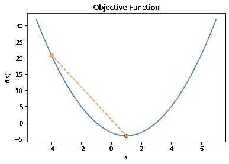*

*图片作者[作者](http://dwiuzila.medium.com/membership)*

*解决方法一步到位！*

*对此你怎么看？是因为新的梯度下降版本对于这个功能来说太大材小用了吗？还是这只是巧合，改变 *ρ* 等参数不会产生比原来简单的梯度下降更好的结果？请在下面的回复部分告诉我你的想法！*

# *结论*

*在本文中，我们了解了梯度下降算法在优化问题中的工作，从简单的高中教科书问题到现实世界的机器学习成本函数最小化问题。简单的实现假设一个恒定的学习速率，而较难的实现使用 Armijo 线搜索来搜索学习速率。算法本身是最基本的，并且根据目标函数的性质有许多变化和实现。像许多其他优化算法一样，梯度下降算法可能会陷入局部最小值。*

**

*🔥你好！如果你喜欢这个故事，想支持我这个作家，可以考虑 [***成为会员***](https://dwiuzila.medium.com/membership) *。每月只需 5 美元，你就可以无限制地阅读媒体上的所有报道。如果你注册使用我的链接，我会赚一小笔佣金。**

*🔖*想了解更多关于经典机器学习模型如何工作以及如何优化其参数的信息？或者 MLOps 大型项目的例子？有史以来最优秀的文章呢？继续阅读:**

*

[艾伯斯·乌兹拉](https://dwiuzila.medium.com/?source=post_page-----acba013e8420--------------------------------)* 

## *从零开始的机器学习*

*[View list](https://dwiuzila.medium.com/list/machine-learning-from-scratch-b35db8650093?source=post_page-----acba013e8420--------------------------------)**8 stories********

[艾伯斯·乌兹拉](https://dwiuzila.medium.com/?source=post_page-----acba013e8420--------------------------------)* 

## *高级优化方法*

*[View list](https://dwiuzila.medium.com/list/advanced-optimization-methods-26e264a361e4?source=post_page-----acba013e8420--------------------------------)**7 stories********

[艾伯斯·乌兹拉](https://dwiuzila.medium.com/?source=post_page-----acba013e8420--------------------------------)* 

## *MLOps 大型项目*

*[View list](https://dwiuzila.medium.com/list/mlops-megaproject-6a3bf86e45e4?source=post_page-----acba013e8420--------------------------------)**6 stories********

[艾伯斯·乌兹拉](https://dwiuzila.medium.com/?source=post_page-----acba013e8420--------------------------------)* 

## *我最好的故事*

*[View list](https://dwiuzila.medium.com/list/my-best-stories-d8243ae80aa0?source=post_page-----acba013e8420--------------------------------)**24 stories********

艾伯斯·乌兹拉* 

## *R 中的数据科学*

*[View list](https://dwiuzila.medium.com/list/data-science-in-r-0a8179814b50?source=post_page-----acba013e8420--------------------------------)**7 stories********[](https://dwiuzila.medium.com/membership)*