# 构建量子计算控件

> 原文：<https://towardsdatascience.com/composing-quantum-computing-controls-f1acd83c48a8?source=collection_archive---------53----------------------->

## 如何创建受控-受控-非门

本帖是本书的一部分: [**动手用 Python 学习量子机器**](https://www.pyqml.com/page?ref=medium_controls&dest=/) **。**

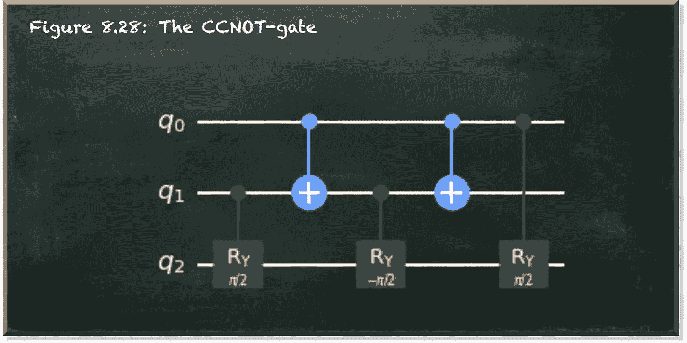

作者弗兰克·齐克特的图片

量子变换门允许我们使用量子位。RY-gate 允许我们指定量子位状态向量角度θ，该角度控制测量量子位的概率为`0`或`1`。我们用它让一个量子位代表边际概率。

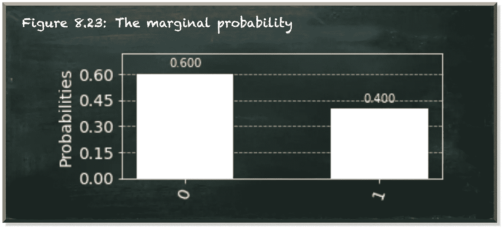

作者弗兰克·齐克特的图片

X 门(非门)切换量子位的概率振幅。我们用它来设置一个量子位值给特定状态下的`1`。例如，在我们计算了边际概率之后，处理剩余的部分。

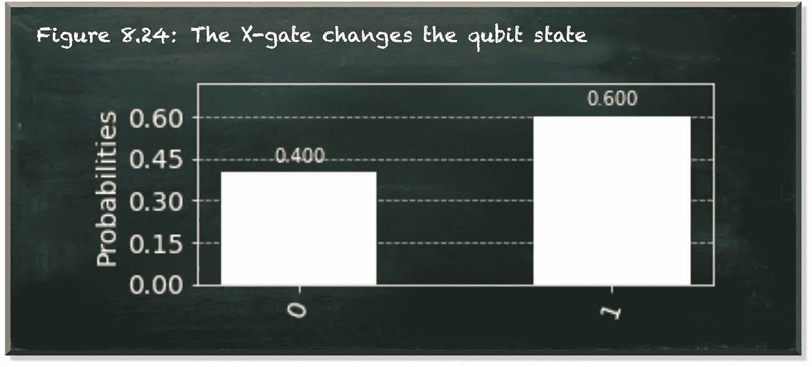

作者弗兰克·齐克特的图片

这是很有用的，因为当另一个量子位(控制量子位)处于|1⟩.状态时，一些门只对一个量子位(控制量子位)进行转换例如，受控的 RY-gate (CRY-gate)让我们指定边际剩余的联合概率和另一个概率。

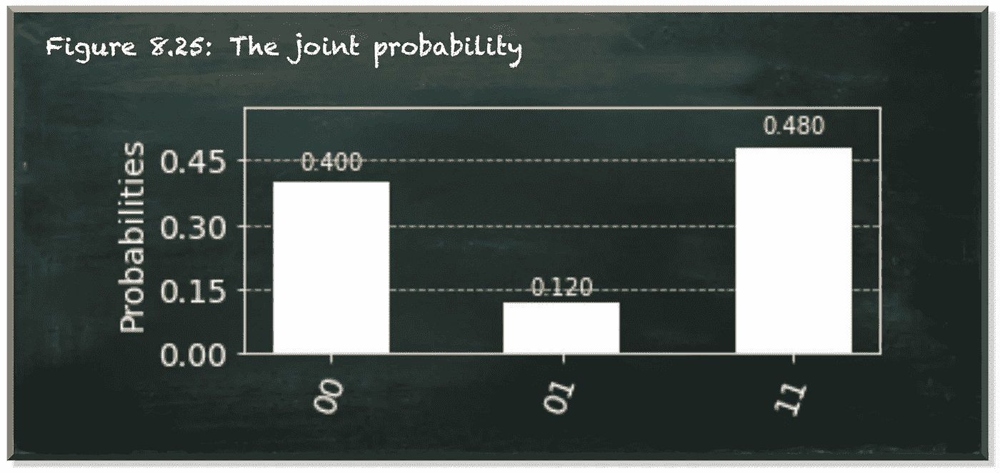

作者弗兰克·齐克特的图片

呼叫器是一种复合门。在[这篇文章](/quantum-programming-for-non-mathematicians-bd6956d63b7c)中，我们学习了如何从更多的基本门创建这个门。首先，我们使用 CNOT 门。

乍一看，如果一个量子位是|1⟩，对另一个量子位应用 X-gate 的能力似乎并不重要。但是 X-gate 在创造更高级别的量子比特时起着核心作用，因为它纠缠着两个量子比特。概念上，纠缠量子比特共享一个叠加态。实际上，CNOT 门是大多数复合量子变换门的组成部分。

下面的代码描述了 CRY-gate 的分解。

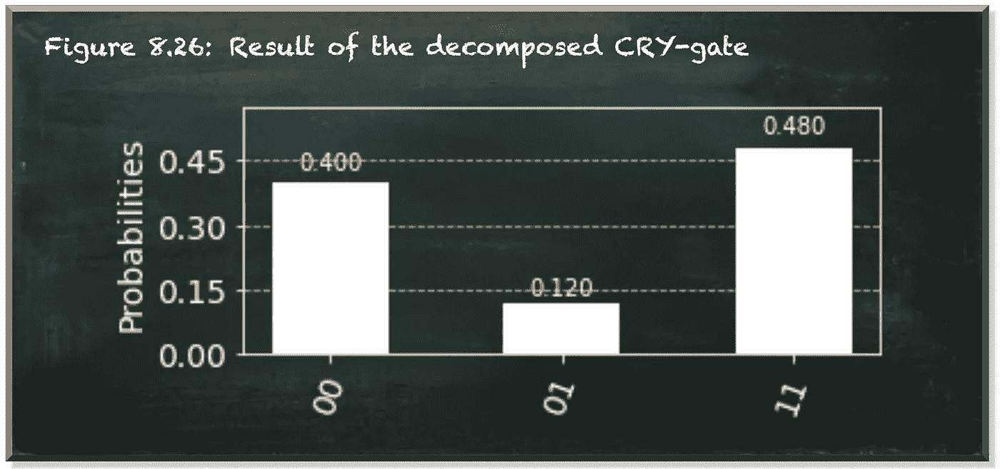

作者弗兰克·齐克特的图片

如果你想应用某个门，当且仅当另外两个量子比特处于|1⟩态时，会怎么样？你可能会反对`AND`不是一个有效的量子位门。简单看一下真值表就知道`AND`算子是不可逆的。如果它的输出是 false，就无法判断输入是什么。它可能是三种不同状态中的一种。

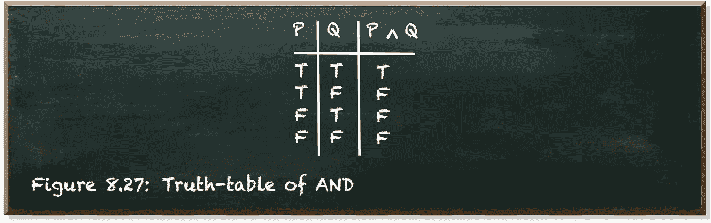

作者弗兰克·齐克特的图片

但是 CNOT 门提供了一条出路。请记住，当我们构造 CRY-gate 时，我们使用 CNOT 门在整个旋转的前半部分和后半部分的旋转过程中转换受控量子位的振幅。类似的模式允许我们创建一个受控门。这种门包含一种`AND`关系，因为它有两个控制量子位，并且只有当两个控制量子位都处于|1⟩.状态时，它才改变受控量子位

下图描述了 CCNOT 门(一种受控-受控非门)的电路。

```
The CCNOT-gate is also known as the Toffoli-gate. The Toffoli-gate has a different algorithm than this one. The Toffoli-gate uses qubit phases. Phases are concept we cover later in this book. The implementation we presented here is not optimal but it provides a vivid explanation of the underlying concept.
```


作者弗兰克·齐克特的图片

下面的列表描述了这个 CCNOT 门序列的代码。我们定义了一个可重用的函数`ccnot`(第 4 行)。它以量子位 q0 作为控制量子位的受控旋转开始(第 6 行)。它将受控量子位旋转约θ=π/2，这是我们之前定义的值(第 2 行)。

然后，我们有另一个受控旋转，其量子位与控制量子位(第 11 行)相同，被封装到 CNOT 门(第 10 行和第 12 行)中。需要注意的是，这种封装的 CRY-gate 以θ为参数。它表示反方向旋转。

最后，我们有另一个关于θ的受控旋转，量子位 q1 是控制量子位。

让我们一个接一个地检查电路。首先，我们定义我们的θ=π/2(第 2 行)。值π/2 表示旋转了圆周的四分之一。这是我们想要应用的整体旋转的一半。旋转半圈(π)会将振幅从|0⟩转换到|1⟩，反之亦然。

在第一步中，如果量子位 q1 通过一个 CRY(π/2)门(第 8 行)处于|1⟩状态，我们旋转受控量子位大约四分之一圈。

如果两个控制量子位都处于|1⟩状态，这个门的结果如下图所示。

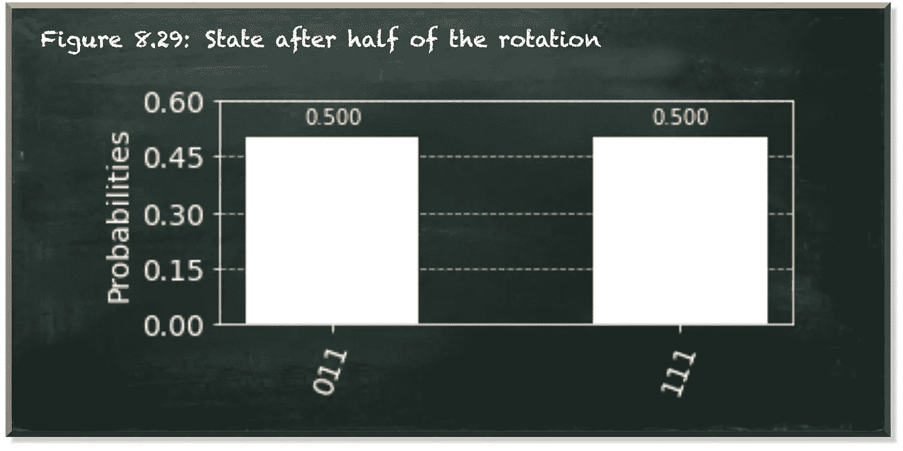

作者弗兰克·齐克特的图片

按照我们的初始化，两个控制量子位(从右到左读取)都处于|1⟩状态。然后，有一半的时间(按照大约π/2 的旋转)，受控量子位处于|1⟩.状态

接下来，我们应用一系列 CNOT 门，q0 是控制量子位，q1 是受控量子位。因为 q0 处于|1⟩，所以它将 q1 的状态从|1⟩更改为|0⟩.随后用 q1 作为控制量子位的受控旋转没有影响，因为 q1 现在处于|0⟩状态，并且如果控制量子位处于|1⟩.状态，则 CRY-gate 仅改变受控量子位下一个 CNOT 门恢复了第一个 CNOT 门的效果。因为控制量子位 q0 仍然处于|1⟩状态，它将 q1 的状态从|0⟩状态切换回|1⟩.状态

如果两个控制量子位都处于|1⟩状态，这三个门根本没有作用。

最后，我们用 q0 作为控制量子位，施加一个约π/2 的受控旋转。这使得受控量子位 q2 的状态从一半时间处于|1⟩状态变为一直处于|1⟩状态。它将量子位状态向量旋转了圆周的四分之一，总共旋转了半圈。如下图所示，绕圆旋转半周，|0⟩就变成了|1⟩。

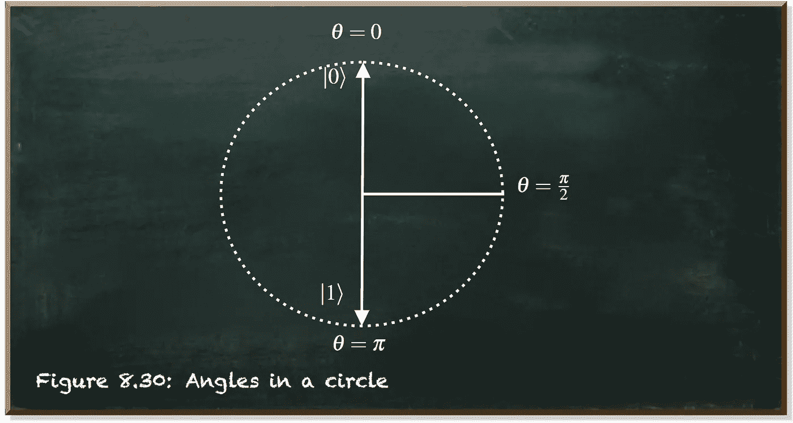

作者弗兰克·齐克特的图片

让我们看看代码和结果，如果两个控制量子位都处于|1⟩.状态

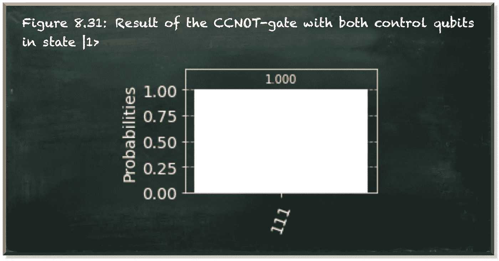

作者弗兰克·齐克特的图片

我们看到量子位 q2 一直处于|1⟩状态。它完全从初始状态|0⟩.

如果其中一个控制量子位不在|1⟩态呢？假设量子位 q0 处于|0⟩.态

同样，第一个 CRY-gate 将受控量子位的量子位状态向量旋转π/2——四分之一圈——因为控制量子位 q1 处于|1⟩.状态

但是这一次，下面的 CNOT 门不起作用。因为量子位 q0 处于|0⟩状态，它不会将量子位 q1 的状态从|1⟩切换到|0⟩.因此，θ=，π/2 的下述 CRY-gate 生效。它恢复了第一个哭泣之门的效果。因为量子位 q0 处于|0⟩.状态，所以随后的非门和最后的安全门不起作用因此，我们只应用了前两个 CRY-gate，第二个恢复了第一个。让我们看看代码和结果。

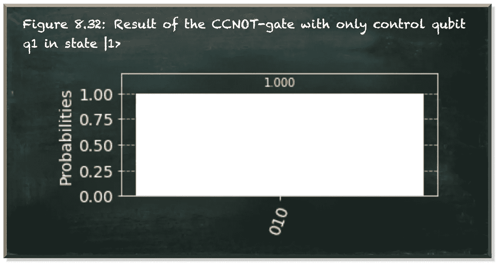

作者弗兰克·齐克特的图片

我们看到整体状态没有改变。受控量子位仍处于|0⟩.状态

最后，让我们看看，如果只有控制量子位 q0 处于|1⟩态，而量子位 q1 不处于，会发生什么。然后，第一次呼喊没有效果地通过了。封装在 CNOT-gates 中的第二个 CRY-gate 的以下序列首先将量子位 q1 从|0⟩切换到|1⟩，然后应用受控量子位的大约θ=-π/2 的旋转，并将量子位 q1 从|1⟩切换回|0⟩.现在受控量子位已经反方向旋转了半圈。下图描述了迄今为止的结果。

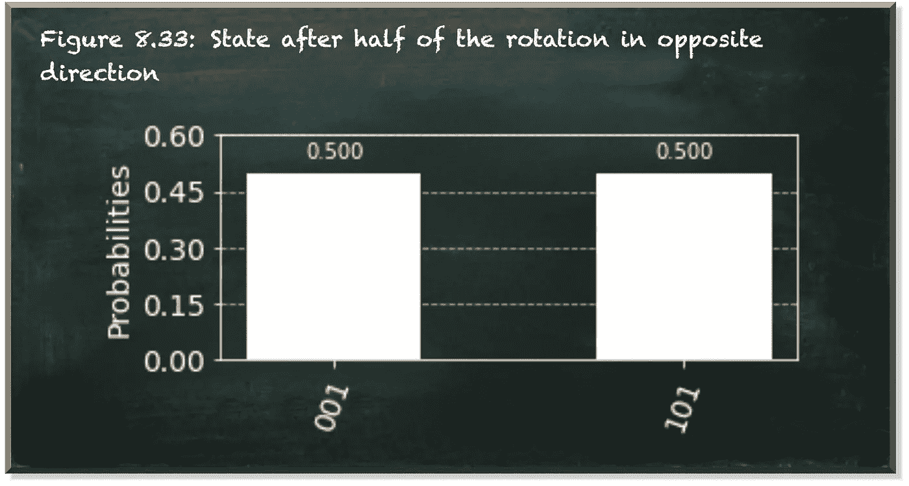

作者弗兰克·齐克特的图片

一半时间，受控量子位处于|1⟩.状态由于概率是我们通过旋转改变的振幅的平方，我们在这里看不到负值。

最后，由于控制量子位 q0 处于|1⟩.状态，最后一个 CRY-gate 将控制量子位往回旋转θ结果又是原始状态，如下面的代码和结果所示。


作者弗兰克·齐克特的图片

# 结论

我们通过 CNOT 门和哭泣门的组合创造了一个受控非门。我们甚至可以通过 CNOT 门和里门进一步创作哭喊门。这有效地显示了 CNOT 门的重要性。这不仅是解释量子纠缠的最好例子，也是制造更多受控门的基础。或受控门。甚至是受控门。你可以继续这个序列，直到你用完量子位。

本帖是本书的一部分: [**用 Python 动手做量子机器学习**](https://www.pyqml.com/page?ref=medium_controls&dest=/) **。**


在这里免费获得前三章。