# 组合人工智能:企业人工智能的未来

> 原文：<https://towardsdatascience.com/compositional-ai-the-future-of-enterprise-ai-3d5289dfa888?source=collection_archive---------15----------------------->

## [行业笔记](https://towardsdatascience.com/tagged/notes-from-industry)

## AI/ML 网格，集成数据操作、多操作、API 操作

**摘要**。*在过去的几年里，企业对人工智能/人工智能服务的采用显著加快。然而，大多数 ML 模型仍然是以解决单一任务为目标而开发的，例如预测、分类。在这项工作中，我们将提出合成人工智能的新兴范式，也称为合成学习。组合人工智能设想无缝组合现有的人工智能/人工智能服务，以提供一个新的(复合)人工智能/人工智能服务，能够解决复杂的多领域用例。在企业环境中，这在开发和维护工作中实现了重用、敏捷性和效率。*

这是我最近在 2021 年 3 月 31 日俄罗斯斯科尔科沃举行的国际 [**数据融合会议**](https://data-fusion.ru/) 上发表的一篇主题演讲的扩展文章。( [youtube](https://www.youtube.com/watch?v=0MC5QkdCGaU) 录制)( [ppt](https://www.slideshare.net/DebmalyaBiswas/compositional-ai-fusion-of-aiml-services) )

# 企业人工智能

如今，企业 AI/ML 用例无处不在。企业用例可以根据支持它们的三个核心 AI/ML 功能进行大致分类:自然语言处理(NLP)、计算机视觉/图像识别和预测分析(如下图所示)。

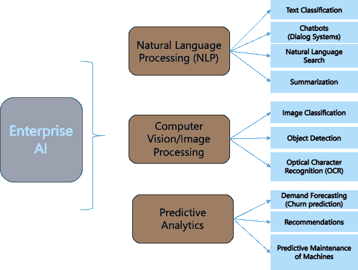

企业人工智能用例(图片由作者提供)

在过去的 2-3 年里，我们一直在努力在企业中实现各种 AI/ML 用例。然而，我们一直专注于构建最具性能的模型

> 大多数 AI/ML 模型仍然是以解决**单一任务**为目标开发的，例如预测、分类。

考虑到这一点，是时候超越模型精度，转向更全面的*组合 AI* 框架，实现企业中已部署 AI/ML 解决方案的最大重用。

# 合成人工智能场景

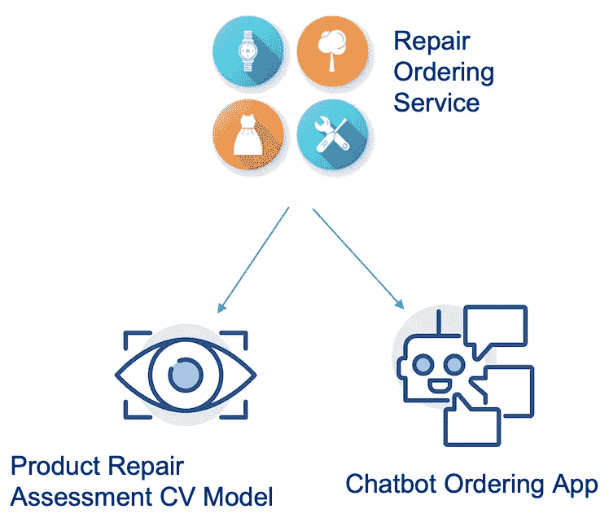

人工智能合成示例—维修服务(图片由作者提供)

考虑一家奢侈品供应商的在线维修服务。这项服务包括一个计算机视觉( **CV** )模型，给定客户上传的产品图片，该模型能够评估所需的维修。如果用户对报价满意，评估之后将进行订购**聊天机器人**对话，获取处理用户维修请求所需的其他详细信息，例如产品损坏详细信息、用户名、联系方式等。

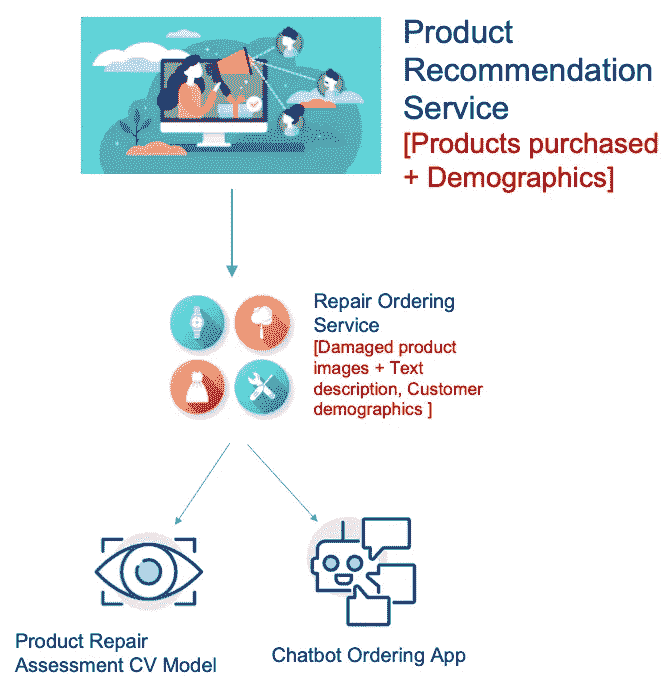

人工智能合成示例—产品推荐服务(图片由作者提供)

未来，当企业在找模特开发一个**产品推荐服务**；考虑维修服务。维修服务收集的数据:用户拥有的产品状态(由 CV 评估模型收集)及其人口统计数据(由订购聊天机器人收集)-为推荐服务提供额外的训练数据。然而，在这种情况下，CV 评估应用程序、订购聊天机器人[1]的**隐私**政策，或管理分层生态系统的任何全球隐私政策(例如，FTC FIPs [2]，要求用户数据仅用于特定目的，对此用户已提供明确的选择加入)可能会阻止他们的数据被合并，这样，他们就不能用于描述客户。

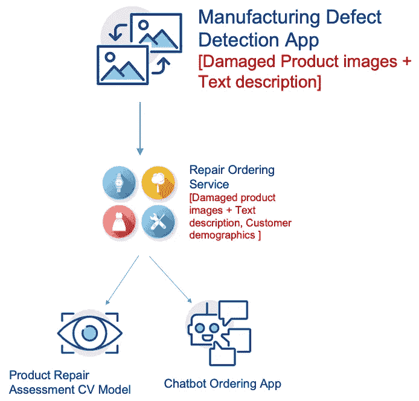

人工智能合成示例—制造缺陷检测(图片由作者提供)

现在让我们考虑另一个分层组合场景，其中企业进一步希望开发一个 CV 应用程序/模型来检测制造过程中的**缺陷产品**。**维修服务**可以提供帮助，因为它已经标记了受损产品的图像(提供给聊天机器人的产品损坏描述充当“标签”)。因此，它将标记的图像作为反馈环提供给 CV 模型，作为训练数据来改进其底层模型。

# **背景**

组合性是指通过组合现有(组件)服务的功能来形成新(组合)服务的能力。现有的服务本身可能是组合的，从而导致分层组合。

这个概念不是新的，以前在不同的背景下研究过；最值得注意的是，Web 服务组合和安全协议的安全组合。

## Web 服务组合

Web 服务遵循面向服务的计算(SOC)方法，将业务功能包装在自包含的服务中。组合服务主要有两种方法:动态和静态。在动态方法中，给定一个复杂的用户请求，系统根据运行时可用 Web 服务的能力提出一个满足请求的计划。在静态方法中，给定一组 Web 服务，组合服务是在设计时结合它们的功能手工定义的。

[BPEL](https://www.oracle.com/technical-resources/articles/matjaz-bpel.html) 是这种规范的一个很好的例子，它将现有的 Web 服务编排(或编排)到复杂的业务工作流中。在解决 Web 服务组合的发现[3]、监控[4]和可靠性[5]方面已经有了相当多的工作。

## 安全合成

安全合成协议的一个很好的例子是 Ran Canetti 的通用可合成(UC)框架[6]。

给定一个复杂的任务，基本思想是将该任务划分为多个更简单的子任务。然后，设计安全实现子任务的协议。UC 框架确保由(UC-secure)子协议组成的协议将继续保证在新颖、不可预测和敌对的执行环境中的安全性，即使其他协议同时运行。

# ML 现有技术

## 集成学习

集成学习试图优化来自多个模型的预测，然而迎合了**相同的问题**。

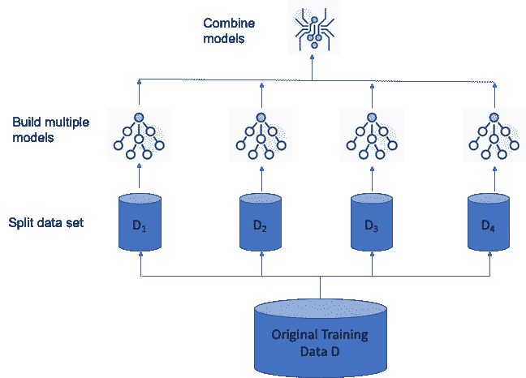

集成学习(图片来自作者)

常用的集成学习技术包括:Bagging、Boosting 和 Stacking。基本思想是分割训练数据，在分割的数据集上建立模型(预测器、分类器)，然后组合模型-在预测的情况下，这可能意味着平均预测值；在分类的情况下，这可能意味着选择具有最高精度的输出。

> 在这种情况下,“整体”指的是融合模型，但不一定是融合解决不同问题的模型——组合人工智能的目标。

## 联合学习

联合学习(FL) [7] **，**也称为协作学习**，**或隐私保护机器学习**，**使多个(不信任的)实体能够协作在它们的组合数据集上训练 ML 模型。

> 集成和联合学习的主要区别在于，这种情况下的训练数据属于不同的组织，这些组织可能不一定信任彼此来共享数据；但是仍然对开发具有与在组合数据集上训练的模型相当的精确度的全局模型感兴趣。

最近的工作考虑了基于 FL 的深度神经网络(DNNs)训练[8]。

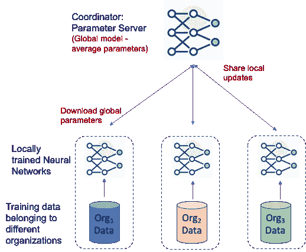

深度神经网络的联邦训练(图片由作者提供)

1.  所有节点同意**相同的**神经网络架构和**任务**来训练全局模型。协调器节点充当参数服务器，维护全局模型参数值的最新版本。
2.  在每个时期，叶节点从它们的父节点下载全局模型参数，并且使用它们的本地数据集上的梯度下降的一些变体来本地更新它们；与协调器节点共享更新后的值。
3.  协调器节点对从所有节点收集的参数值进行平均。
4.  这种联合训练一直持续到全局模型收敛。

# 人工智能服务

在这种背景下，让我们回到绘图板，并尝试定义一个“人工智能服务”。

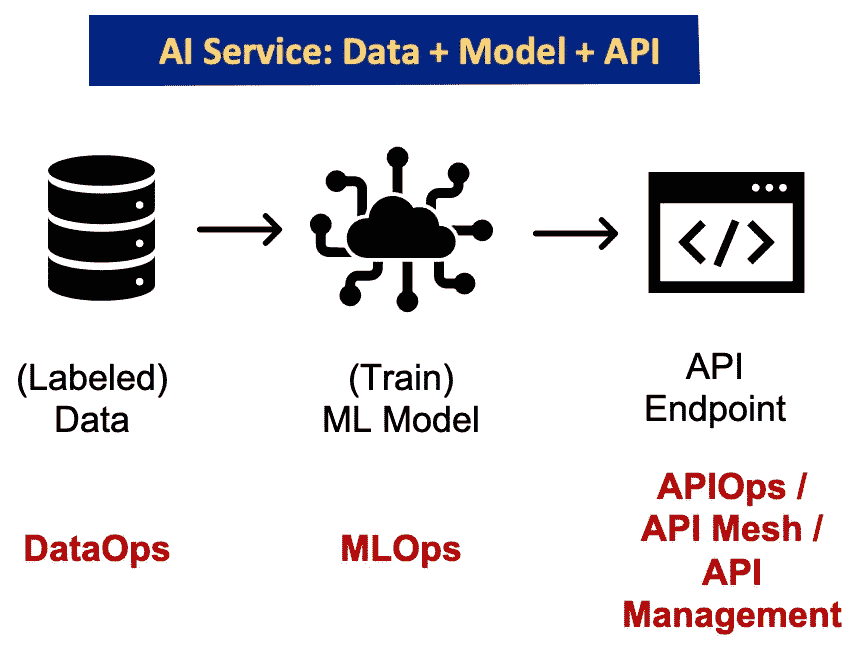

AI 服务:数据+模型+ API(图片作者提供)

在监督学习的非常原始的世界中，一个**人工智能服务**由(标记的)**数据**组成，用于训练一个**模型**，然后它被公开为一个 **API** 。

当然还有一个替代的部署管道，可以将一个经过训练的模型部署在一个边缘设备上，以离线方式执行[9]。然而，我们改天再讨论这个问题。

有趣的是，今天有重叠的方法，DataOps、MLOps 和 APIOps(或 API 管理)试图分别解决数据、模型和 API 的操作方面。

## 数据操作

DataOps 是一种自动化、面向流程的方法，由分析和数据团队使用，用于提高质量和缩短数据分析的周期时间—维基百科

在当今的大多数组织中，“数据湖”是执行不同数据转换步骤的分层平台:(免责声明:下面显示的工具绝不是对工具/供应商的认可；还有提供类似功能的替代工具，对其功能的详细比较超出了本文的范围。)

数据湖分层架构(图片由作者提供)

*   数据摄取:侧重于从不同的数据源(传统、专有、云和内部)获取和保存数据。
*   数据(预)处理:与清理、质量检查和提取/转换相关数据以进行集成相关。
*   数据访问:这一层使用户和应用程序可以分别以报告和 API 的形式使用经过处理的数据。
*   **数据集成**:是本次讨论中最有趣的一层。它显示了数据生态系统的成熟度，通过多种工具/框架从聚合数据中获得洞察力。数据集成方法的例子包括
    (i)联合:数据保留在原来的源系统中。联邦查询引擎负责分割给定的查询，并将子查询委托给它们各自的源系统；然后合并不同源系统返回的结果。
    (ii)数据集市:在这种情况下，数据被物理地移动，相关数据被复制、合并并存储为数据集市以备访问。
    (iii)知识图:捕获不同数据源之间的语义关系，使得能够利用确定的图结构进行复杂的查询。

> 不幸的是，今天缺乏类似的用于人工智能服务的集成/融合工具——这是组合人工智能的一个关键要求。

## 数据治理

到目前为止，我们已经考虑了操作部分:数据操作、MLOps、APIOps。

> 答案是否在于建立一个治理框架？

如下图所示，数据治理是一种横向能力，包含许多与数据相关的方面，例如，数据目录、数据字典、主数据管理(MDM)、*数据起源和沿袭跟踪*等。

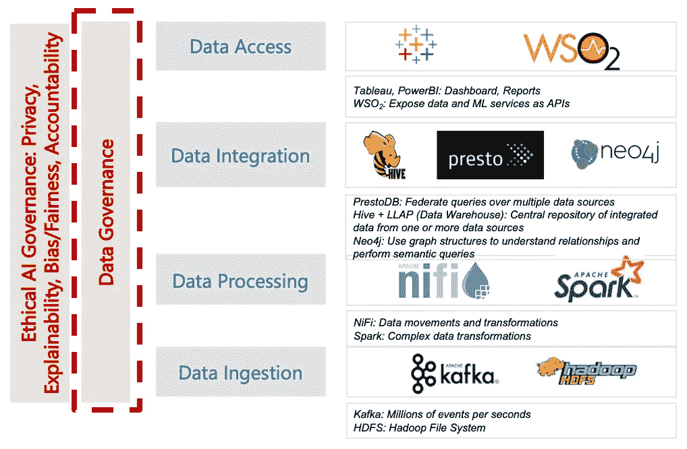

治理框架(图片由作者提供)

在这种情况下，一个有希望的框架是 FAIR [9]，它已经开始在医疗保健研究中被广泛采用。

*   **F** indable:数据对于人类和机器来说都应该容易找到，这意味着丰富的元数据和唯一/持久的标识符。
*   **答**可访问性:通过认证和授权条款，可以以可信的方式访问数据。
*   互操作性:用于知识表示的共享本体，确保数据可以与多个应用程序/工作流进行互操作，以进行分析、存储和处理。
*   eusable:清晰的出处/沿袭规范和使用许可，这样数据可以在不同的环境中重用。

虽然从数据治理的角度来看，FAIR 非常有趣，但它如何在医疗保健研究之外被采用还有待观察。公平原则在指定数据血统和出处、最大化重用以及使用户能够决定哪些数据适合他们的目的方面提供了指导。软件/ ML 代码部分——不考虑数据如何转换。这导致了**潜在的开放数据与开源软件**框架的冲突。开放数据许可证(如 Creative Commons)与更成熟的开源软件(如 Apache、MIT [10])大相径庭。

> *很有可能我们会陷入另一场标准化/许可混乱，而不是一个以统一方式存储、访问和分析数据和模型(代码)的综合框架。*

# 伦理人工智能——合成人工智能中的隐私问题

另一个值得注意的治理趋势是企业中的道德 AI 治理框架/委员会，其任务是确保 AI/ML 应用程序得到负责任的培训和部署，符合企业战略和政策。不同的政府组织和监管机构发布了各自的指导方针和政策，对术语的定义几乎没有达成一致，这使得这项工作变得复杂，例如,“公平”的定义有 20 多种。

伦理人工智能包含许多人工智能/人工智能原则，例如，可解释性、偏见/公平、问责制和隐私。在这篇文章中。我们关注隐私方面。关于其他方面的讨论，请参考[11]。

> 组合设置中的主要隐私问题是(训练的)模型可能仍然包含专有信息或泄露与基础训练数据集相关的见解[12]。

这是因为(在反向传播过程中)DNN 给定图层的梯度是使用该图层的特征值和下一图层的误差来计算的。例如，在顺序完全连接的层的情况下，

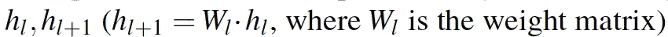

误差 E 相对于 toW_l 的梯度定义为:

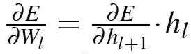

也就是说，W_l 的梯度是来自下一层的误差和特征 h_l 的内积；以及梯度和特征之间的相关性。这就是 esp。如果权重矩阵中的某些权重对参与者数据集中的特定特征或值敏感(例如，语言预测模型中的特定单词[13])，则为 true。

> 在这种情况下，联邦贸易委员会最近的裁决[14]指出，当用户选择退出时，仅仅删除数据是不够的；组织还需要删除根据该数据训练的模型/算法。

在组合设置中实施这一点需要捕获直接或间接访问底层(受影响的)培训数据的(较高级别的)组合服务。

> 类似地，如前所述，隐私政策，例如 FTC FIPs [2]，建议数据仅用于特定目的(用户已明确选择加入)，并且不与其他数据集结合以揭示可用于描述用户的额外见解。

在组合设置中，这种数据聚合可能很难检测，因为(更高)级别的组合服务可以(通过中间服务)聚合属于不同服务的数据，而无需它们的明确批准。

# 结论

总之，我们在本文中介绍了组合人工智能的新兴范例。一旦我们有了复合 AI/ML 服务，由多个(组件)AI/ML 服务组成；我们考虑过

> 你如何获取潜在不同服务的部分信息，底层数据、模型、APIs 并以无缝的方式组合新的服务，照顾治理、隐私、血统和其他伦理/非功能方面——是组合 AI/ML 的全部挑战。

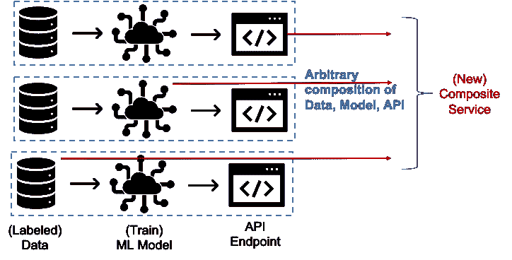

合成 AI/ML 摘要(图片由作者提供)

# 参考

1.  D.比斯瓦斯。*隐私保护聊天机器人对话*。在保护隐私的机器学习研讨会(PPML)，2020 年，[https://ppml-workshop.github.io/pdfs/Biswas.pdf](https://ppml-workshop.github.io/pdfs/Biswas.pdf)
2.  R.盖尔曼。*公平信息实践:基础历史—版本 2.20* 。2021.doi: 10.2139/ssrn.2415020。
3.  D.比斯瓦斯。Web 服务发现和约束组合。2007 年经常资源:73-87。
4.  D.维德亚桑卡·比斯瓦斯。*监控分层 Web 服务组合*。TES 2005 年:98–112。
5.  D.维德亚桑卡·比斯瓦斯。*受限可见性下分层 Web 服务组合的最优补偿*。IEEE APSCC 2009:293–300。
6.  兰·卡内蒂。2020.*普遍可组合证券*。J. ACM 67，5，第 28 条(2020 年 10 月)。
7.  D.比斯瓦斯。*联邦学习——隐私保护机器学习*。([中型](/federated-learning-privacy-preserving-machine-learning-3eea09761e47))
8.  B.麦克马汉等人。艾尔。*从分散数据进行深度网络的通信高效学习*。AISTATS 2017:1273–1282。
9.  公平行事。*科学数据管理和监督的公平指导原则* ( [链接](https://www.nature.com/articles/sdata201618))
10.  D.比斯瓦斯。*在企业中管理开源软件。*中等，2020( [链接](https://debmalyabiswas.medium.com/managing-open-source-software-oss-at-your-enterprise-aec22396f1d6))
11.  D.比斯瓦斯。*伦理人工智能:其对企业人工智能用例及治理的影响*。在 2020 年 12 月举行的 Linux 基金会开放合规峰会上发表([中](/ethical-ai-its-implications-for-enterprise-ai-use-cases-and-governance-81602078f5db))
12.  Nasr，m .，Shokri，r .，& Houmansadr，A. (2019)。*深度学习的综合隐私分析:针对集中式和联邦式学习的被动和主动白盒推理攻击*。2019 年 IEEE 安全与隐私研讨会(SP)，739–753。
13.  H.b .麦克马汉、e .摩尔、d .拉梅奇、s .汉普森和 B. A .阿卡斯。*从分散数据中进行深度网络的通信高效学习，* 2017，[https://arxiv.org/abs/1602.05629](https://arxiv.org/abs/1602.05629)
14.  联邦贸易委员会。*2021 年，加州公司解决了 FTC 指控其在照片存储应用*中使用面部识别欺骗消费者的问题