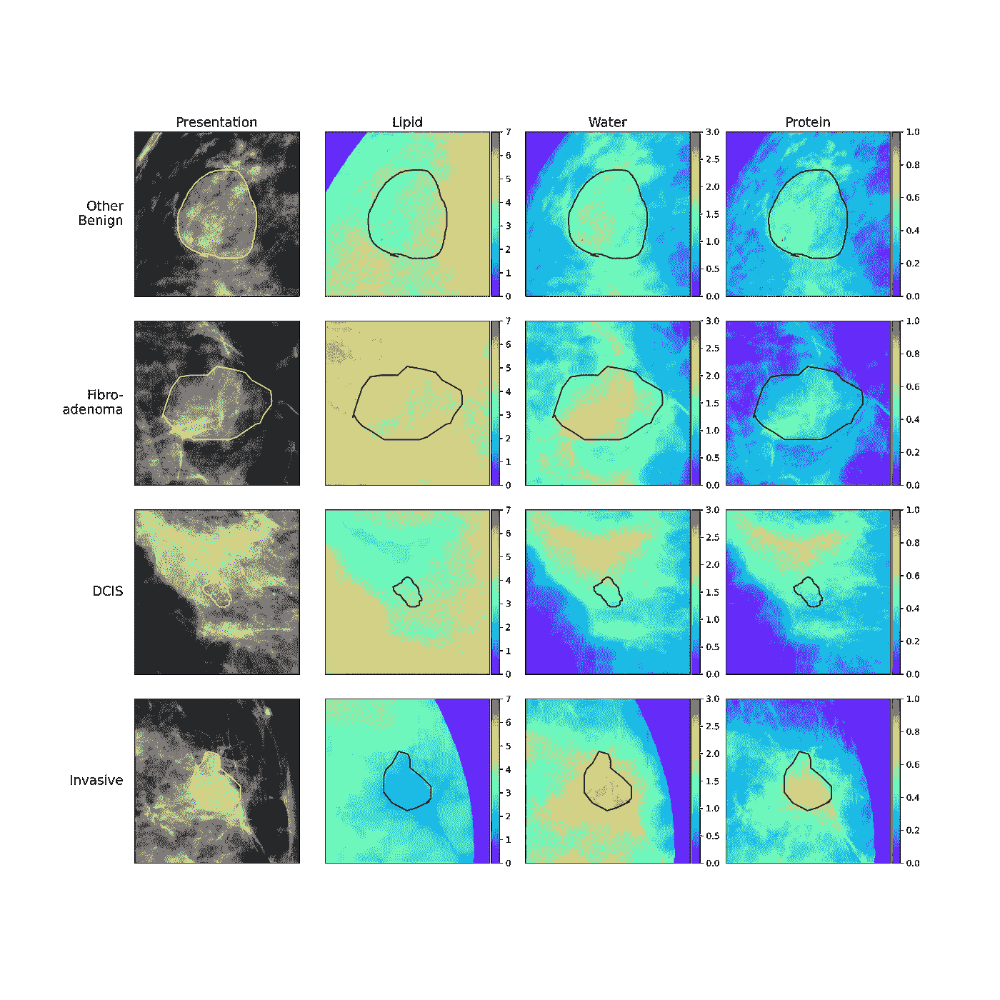
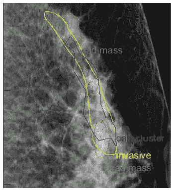
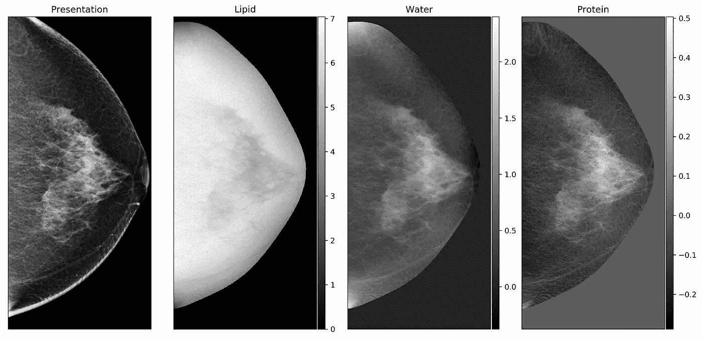
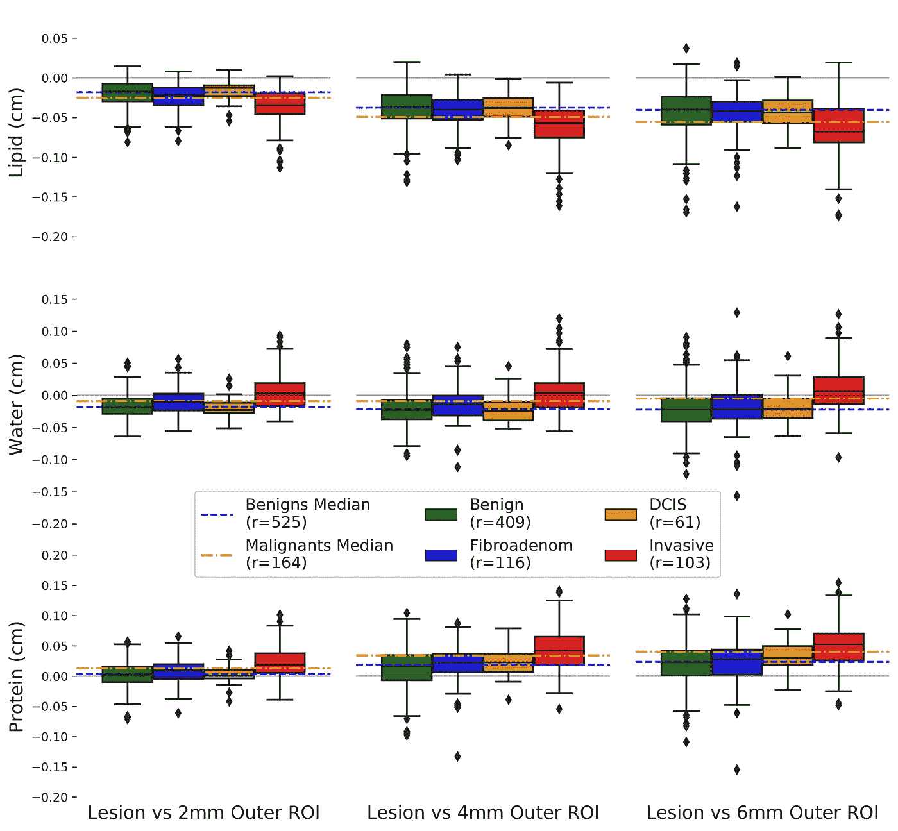
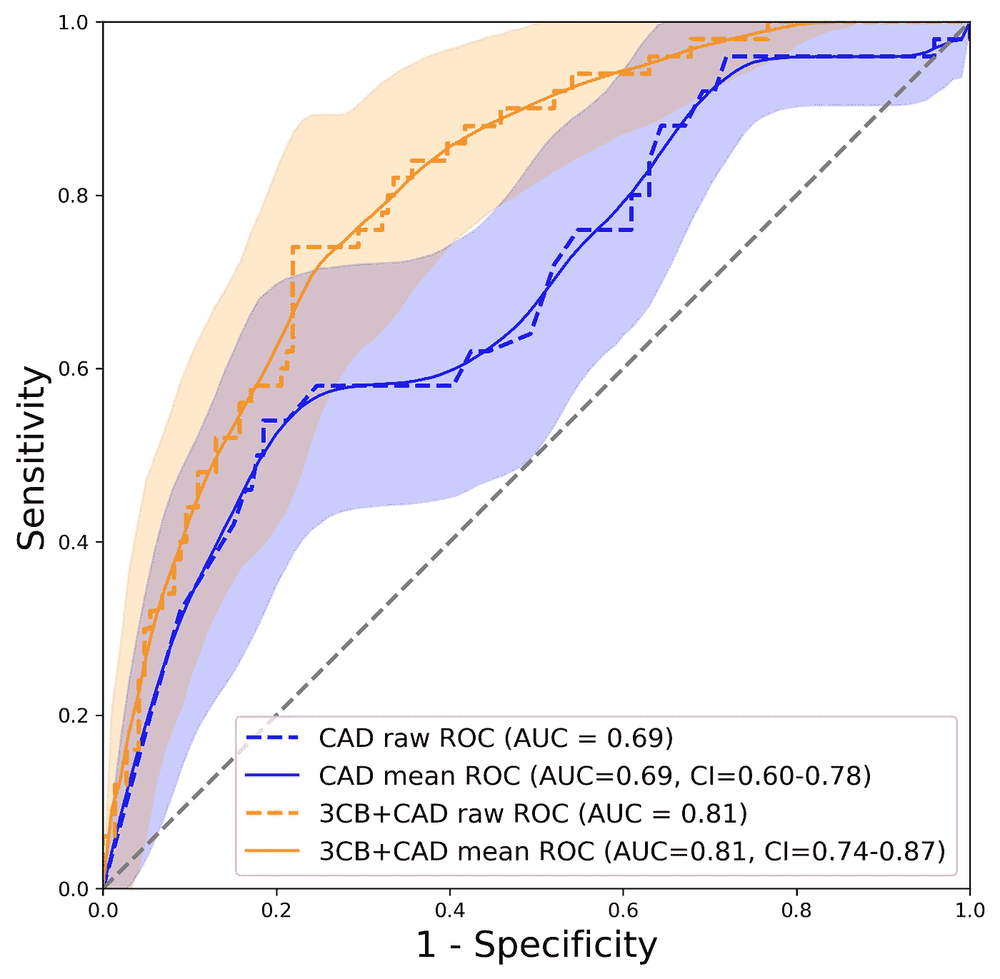
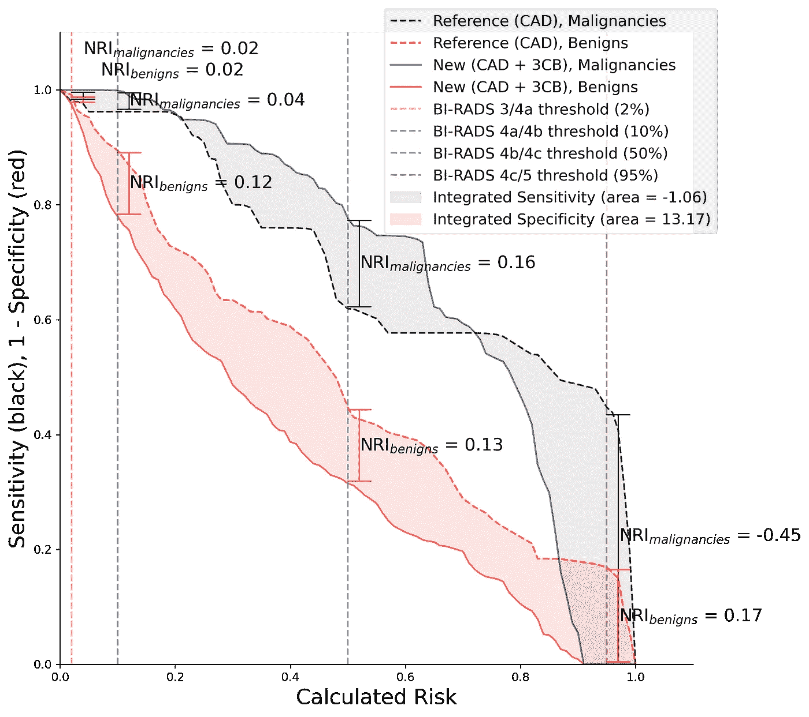

# 利用人工智能的组合成像来改进乳腺癌检测

> 原文：<https://towardsdatascience.com/compositional-breast-imaging-with-artificial-intelligence-to-improve-cancer-detection-c5f8f38f2266?source=collection_archive---------20----------------------->

## 癌症研究与技术

## 我们使用双能 X 射线成像技术和神经网络来研究新的健康成分成像生物标志物

癌性和非癌性乳腺病变类型的成分热图。作者图片

# 摘要

*   本文是对标题为[“双能量三室乳腺成像用于成分生物标记物以改善恶性病变检测”](https://www.nature.com/articles/s43856-021-00024-0)的文章的直接回应。
*   成分乳腺成像允许发现新的癌症生物标志物
*   成分信息与诊断相关，有助于改善癌症检测，从而减少不必要的活检数量。

<https://rdcu.be/cSENN>  

# 当前乳腺癌成像技术

截至今天，(2021)乳腺癌是全球女性癌症死亡的主要原因。有几种治疗方案，如手术切除、化疗和放疗，但这只是解决方案的一部分。早期发现和识别癌症与治疗本身同样重要，如果不是更重要的话。

成像对降低癌症死亡率产生了巨大的影响。乳房 X 线照相术是一种基于 X 射线的成像技术，是乳腺癌的主要成像技术，它允许临床医生看到下面的组织和结构。在过去的十年中，数字乳房断层合成(DBT)已经成为护理的标准，这种成像技术产生三维(3D) X 射线图像，而标准乳房 X 线照相术提供 2D 图像。

作者图片

**图 1:** 计算机辅助检测(CAD)发现肿块(绿色)、钙化点(红色)和钙化簇(蓝色)。放射科医生发现的实际癌症病变是黄色的。

放射科医生检查从标准乳房 x 线照相术或 DBT 获得的图像，寻找可疑的病变和钙化。乳房组织中的钙化并不少见，有时预示着癌症或发展为癌症的风险。[计算机辅助检测或 CAD 软件](https://www.lambertleong.com/projects/compositional-breast-cancer-ai#img-CAD)已经开发出来，并获得食品和药物管理局(FDA)的批准，以帮助临床医生筛查癌症图像。人工智能(AI)的最新进展导致了 CAD 的巨大进步，甚至基于 AI 的 CAD 软件的开发。

# 活检的问题

因此，随着乳腺成像技术的巨大进步，对抗癌症应该变得更容易了，对吗？简单的答案是肯定的，但有一个小问题。虽然成像确实有助于识别更多的癌症并降低死亡率，但仍然存在假阳性活检的问题。当一个病变在影像学上被认为可疑时，通常会进行活检。活组织检查是一种侵入性程序，从妇女的乳房中取出可疑病变的组织样本，在显微镜下观察。假阳性活检意味着病理学家在组织中没有发现任何癌症迹象，并且在成像上看到的病变是良性或非癌性的。从本质上讲，假阳性会导致不必要的侵入性活检，并可能对一个人的身心健康有害。这个问题的存在部分是因为成像变得更加灵敏，可以看到更多的病变。然而，特异性还没有提高到足够的程度，这意味着仍然很难区分癌性病变和非癌性病变。

# 什么是合成成像

[三室乳房(3CB)成像](https://www.lambertleong.com/projects/compositional-breast-cancer-ai#img-3cb)是一种双能 X 射线技术，可生成成像乳房内不同组织类型的图像或地图。3CB 技术受双能 X 射线吸收法(DXA)的启发，双能 X 射线吸收法通常用于评估骨密度和身体成分。使用 3CB，可以快速连续拍摄两幅图像。一幅图像是低能量的，相当于标准的乳房 x 线照片，而另一幅图像是以较高的能量拍摄的。不同能量的 X 射线在穿过不同的组织时将具有不同的行为，并且高能量和低能量 X 射线图像之间的对比被用于导出特定的组织类型。3CB 成像技术有助于可视化和量化乳房中的脂质、水和蛋白质的量。

作者图片

**图 2:** 标准乳房 x 线照片，旁边是从双能三室乳房(3CB)成分成像获得的脂质、水分和蛋白质图。

应该注意的是，在 3CB 中使用较高能量的 X 射线是安全的，辐射水平没有什么可担心的。事实上，3CB 成像只需要 2 张图像，而标准 DBT 成像需要大约 7 到 9 张图像，具体取决于系统。因此，3CB 技术产生的额外辐射水平与 DBT 图像序列相当，如果不是更低的话。为了进一步强调 3CB 的安全性，对比增强乳房 x 线照相术(CEM)使用几乎相同的成像协议来采集高能和低能图像。CEM 也获得了 FDA 的批准，总体上可能比 3CB 风险更大，因为在 CEM 使用的造影剂可能会引起过敏反应的不良反应。

# 作文能有什么帮助

众所周知，组成对于乳腺癌是重要的。乳房密度是一个强大的风险因素，密度往往是由于高纤维腺组织或蛋白质。其他人在细胞/分子水平上研究了乳腺癌病变，并发现浸润性病变类型倾向于消耗或代谢脂质。据推测，这种行为的机制是由于侵入性乳腺病变的侵略性生长性质。脂质或脂肪是一种能量来源，侵袭性肿瘤会消耗一切可以为其快速生长提供燃料的物质。结果，我们发现我们可以获得表征恶性病变类型的信号。该[信号](https://www.lambertleong.com/projects/compositional-breast-cancer-ai#img-comp-sig)由与周围区域相比具有较低脂肪或脂质含量的癌性病变组成。

作者图片

**图 3:** 在距离病变 2、4 和 6 毫米处捕获脂质、水和蛋白质信号。橙色和蓝色虚线之间的空间显示了癌性和非癌性病变类型在组成上的显著差异。

# 人工智能的作用

为了证明我们的 3CB 成分成像的效用，我们使用人工智能来观察是否可以学习癌性和非癌性病变之间的成分差异。我们还想知道从 3CB 技术中获得的成分信息如何为现有的临床范例增加有用的诊断信息。我们使用 CAD 作为我们的基线，我们想看看具有 3CB 的 AI 是否能胜过 CAD。

作者图片

**图 4:**95%置信区间(CI)下 CAD 和 CAD+3CB 性能的受试者操作特征曲线(AUC)下面积。橙色线表示与单独的 CAD 相比，具有组合的 CAD 具有更好的检测性能，以蓝色显示。
**代码用于生成 AUC 与 CI 图详细* [*此处*](https://lambertleong.medium.com/area-under-the-curve-and-beyond-f87a8ec6937b) *或* [*此处*](https://www.lambertleong.com/thoughts/AUC-IDI-NRI)

正如您从我们的[区域的受试者操作特征曲线(AUC)](https://www.lambertleong.com/projects/compositional-breast-cancer-ai#img-auc) 中看到的，AI+3CB+CAD 模型的表现优于单独的 CAD。这表明构图很重要，并提供了 CAD 无法单独捕捉的附加信息。换句话说，CAD 和放射科医生使用标准乳房 x 线照相术使用形状、纹理和形态测量信息来识别癌症。3CB 提供了相同的信息以及成分，这已被证明是有益的。综合辨别改进(IDI)图表明，由于假阳性的减少，性能的改进是显著的。如前所述，存在活检问题，使用 3CB 组合物减少假阳性可以减少不必要的活检并改善该问题。

作者图片

**图 5:** 综合判别改善(IDI)和净重新分类指数(NRI)显示 3CB 改善特异性。乳房成像报告和数据系统(BI-RADS)临界值旁边标有指标，供临床参考。
**代码用于生成 IDI 与 NRI 的剧情详细* [*此处*](https://lambertleong.medium.com/area-under-the-curve-and-beyond-f87a8ec6937b) *或* [*此处*](https://www.lambertleong.com/thoughts/AUC-IDI-NRI)

# 3CB 的下一步是什么

我们正在继续我们对 3CB 的工作和研究，通过修改协议使其适用于 CEM 机器[1r 01 ca 257652–01a 1](https://reporter.nih.gov/project-details/10316696)。使用 FDA 批准的现有对比增强乳房 x 光机进行 3CB 成像将有助于加快该技术的采用。

# 参考

[【1】](https://www.nature.com/articles/s43856-021-00024-0)Leong，l .、Malkov，s .、Drukker，k .、Niell，b .、Sadowski，p .、Wolfgruber，t .…&Shepherd，j .、双能量三隔室乳腺成像(3CB)，用于改进恶性病变检测的新型成分生物标志物，(2021)。

【https://www.lambertleong.com】原载于 2021 年 11 月 14 日<https://www.lambertleong.com/projects/compositional-breast-cancer-ai>**。**