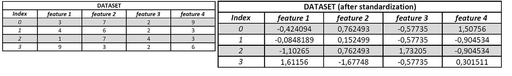

# 主成分分析综合指南

> 原文：<https://towardsdatascience.com/comprehensive-guide-for-principal-component-analysis-7bf2b4a048ae?source=collection_archive---------6----------------------->

## 用 python 实现主成分分析的理论和实践部分

```
***Table of Contents* 1\. Introduction
2\. Principal Component Analysis (PCA)
3\. Theory
3.1\. Calculating PCA
3.1.1\. Rescaling (Standardization)
3.1.2\. Covariance Matrix
3.1.3\. Eigenvalues and Eigenvectors
3.1.4\. Sorting in Descent Order
3.2\. Is PCA one of the feature extraction&feature selection methods?
4\. Implementation
4.1\. Traditional Machine Learning Approaches
4.2\. Deep Learning Approaches
5\. PCA Types
5.1\. Kernel PCA
5.2\. Sparse PCA
5.3\. Randomized PCA
5.4\. Incremental PCA**
```

# **1。简介**

本文涵盖了 PCA 的定义，没有 Sklearn 库的 PCA 理论部分的 Python 实现，PCA 与特征选择&特征提取的区别，机器学习&深度学习的实现，并举例说明了 PCA 的类型。


由[内森·杜姆劳](https://unsplash.com/@nate_dumlao?utm_source=medium&utm_medium=referral)在 [Unsplash](https://unsplash.com?utm_source=medium&utm_medium=referral) 上拍摄的照片

# 2.主成分分析

主成分分析是一种基于数学和统计学的非常有用的方法，它通过从不同角度对数据集进行评价来进行降维。它在机器学习中的任务是减少数据集中输入的维数，并通过算法或根据无监督方法中的特征对数据集进行分组来促进学习。这个降维过程是各种数学运算的结果。以坐标平面中具有两个特征的 2D 数据集(x，y)为例。当我们用主成分分析将数据集转换成 1D 时，数据集的分类变得容易得多。现在让我们用 PCA 实现并可视化降维:

癌症数据集(编码中定义为 cancer_data)由 596 个样本和 30 个特征组成。首先使用 StandardScaler 对这些数字特征进行缩放，然后使用 Sklearn 库导入的 PCA 方法对数据集进行二维处理，并对“恶性”和“良性”目标进行着色，如图 1 所示。X 轴代表 8 个分量中的第一个，y 轴代表 8 个分量中的第二个分量。


图一。第一主成分图和第二主成分图，作者图像

从图 1 中可以看出，在 PCA 过程之后，不使用任何算法就可以进行分类，这几乎是人眼可以预测的。然而，考虑到 30 个特征的数值数据集，这对于人类来说是根本不可能的。

看各个分量的方差值，看到有**【0.44272026，0.18971182，0.09393163，0.06602135，0.05495768，0.04024522，0.02250734，0.01588724】**。第一和第二分量对应于整个数据集的 63%。8 个组成部分的累积方差图如图 2 所示。


图二。组件数量的累积方差，按作者排序的图像

将数据集转换为不同维度时，在新维度中定位数据的过程称为**投影**。在图 3 中，根据新创建的维度和与 *mglearn* 库中 PCA 图的差异，可以看出区别。


图 3。使用 mglearn 库的 PCA 可视化，图片由作者提供

那么这个将 30 维转化为 2 维的神奇过程背后到底隐藏着什么呢？

# 3.理论

PCA 改变组件的方向以实现最大方差，并以此方式降低数据集的维数。

> 方差:给出关于数据集分布的信息。例如，让我们举一个将 5cl 液体装入瓶子的例子。假设第一种情况下的瓶子是 4cl、5cl、5cl、5cl、6cl，第二种情况下的瓶子是 2cl、3cl、5cl、7cl、8cl。虽然两者的平均值都是 5cl，但是第一种情况下的填充物将比第二种情况下的填充物更均匀，因为第一种情况下的样本分布方差低于第二种情况下的样本分布方差。这表明分配更加成功。

## 3.1.**计算 PCA**

图 4 显示了如何使用 PCA 进行降维的流程图。


图 4。降维流程图，作者图片

PCA 是在不使用 sklearn 库的情况下通过数学运算创建的，并且与 sklearn 库的组件进行比较。

每一步的输出都逐步显示在表格中。

3.1.1。重新缩放(标准化)

在第一阶段，对数值数据集应用缩放。为此，计算每个特征的平均值和标准差。使用这些计算，按照公式 x _ new =(x-mean(x 的列))/STD(x 的列)创建新的数据集。对于此操作，每个特征的平均值= 0，标准值= 1(用标准定标器标准化)



图 5。数据集(左)和缩放数据集(右)，按作者分类的图像

**3.1.2。协方差矩阵**

协方差矩阵根据以下公式创建，缩放后的数据集根据彼此之间的关系完全重建:


图 6。协方差矩阵公式，[来源](https://medium.com/analytics-vidhya/understanding-principle-component-analysis-pca-step-by-step-e7a4bb4031d9)

根据该方程计算所有协方差值后，得到(n_features，n_features)的矩阵。主要目标是重新排列数据集，以最大化数据集中的方差。为了检测这一点，需要协方差矩阵。

> 协方差是相关性的度量。通过协方差，我们知道两个变量一起变化的方向(正的话方向相同，负的话方向相反)。然后我们可以用相关性来找出这种变化的程度。协方差以单位来度量。在数据科学中，协方差涵盖两个变量或数据集的关系。


图 7。协方差矩阵，图片由作者提供

3.1.3。特征值和特征向量

从具有协方差矩阵的数据集中计算特征值，并且获得相应的特征向量作为特征的总数。


图 8。特征值(左)和相应的特征向量(右)，作者图片

**3.1.4。按降序排序**

特征值从最高到最低排序。希望为 PCA 选择多少分量，选择对应于该数量的特征值的特征向量，并降低数据集维数。

> 关于特征值的提示:
> 
> 矩阵 x 的迹等于其特征值之和。
> 
> 矩阵 x 的行列式等于其特征值的乘积。
> 
> 矩阵 x 的秩等于矩阵 x 的非零特征值的个数。


图 9。无 Sklearn 的 PCA 结果无 Sklearn(左)，有 Sklearn 的 PCA 结果(右)，图片作者

用数学方程计算数据集的第一和第二主成分，可以看出，结果与导入 Sklearn 库的结果相同。

## **3.2。PCA 是特征选择&特征提取方法之一吗？**

既可以是也可以不是。由于主成分分析降低了特征的维数，因此它可以被理解为提取特征或选择影响结果的最有效的特征。但是理解了上面提到的理论部分，这个就清楚了。在 PCA 机器学习应用之外，它是关于在另一个坐标系中解释数据集。我们可以认为这是用傅里叶变换将信号从时间轴转换到频率轴。

通过考虑数值和连续变量的方差值，对它们进行重新评估，并使用 PCA 从不同的窗口查看数据集。虽然在技术上可以实现，但对分类变量使用 PCA 不会产生可靠的结果。同样，当理解上述理论部分时，**用 PCA 执行特征选择的条件是合理的，因为影响结果的最重要的特征具有最大的方差。**当然，技术上还是可以实现的，只是选择权在开发者。

# 4.履行

## 4.1.传统的机器学习方法

有人提到，主成分分析是一种非常有用的方法，尽管会丢失信息，但会降低维数减少和特征值。在影像数据集中，每个像素都被视为一个要素。换句话说，对于 128x128 RGB (3 通道)图像，有 128*128*3 = 49152 个特征。这个数字对于监督学习模型来说是相当高的。在这一部分中，在由 81 个杯子、74 个盘子和 78 个盘子组成的厨房用具图像数据集上，在利用 PCA 对数据集进行图像增强和维度缩减之后，XGBoost 被应用如下:

数据集从本地文件夹导入后，使用定义的 Imagedatagenerator 复制 15 次，获得 3495 个样本。在编码中， *x:代表数据集，y:代表标签。*然后，为了测量来自不同源的模型的泛化性能，下载 5 个杯子、5 个盘子和 5 个盘子，并且这些也从本地文件夹中导入。在必要的数据预处理之后，将图像添加到 x 的末端，将标签添加到 y 的末端。**将获取的图像添加到训练和测试数据集中以评估模型泛化性能的原因是相同的 PCA 过程应用于所有图像。**数据集合并后，使用 sklearn 库导入 PCA，49152 像素(特征)减少到 300。此时，使用 NumPy 再次提取具有 15 个样本的模型泛化性能数据集，并且 3495 个数据集被分离为训练数据集和测试数据集。这里的问题不是是否使用五氯苯甲醚，而只是作为一种应用。也可以使用 SelectPercentile 进行特征选择。然后，在标签适应 XGBoost 模型之后，训练数据集被训练，并且用测试数据集评估该模型。最后，用分离的 15 个样本的外部数据集检验了模型的预测。

结果如图 10 所示。


图 10。外部数据集的混淆矩阵(左)和测试数据集的混淆矩阵(右)，图片由作者提供

## 4.2.深度学习方法

编码器和解码器是深度学习处理的首选。然而，应用五氯苯甲醚在技术上是可行的。让我们对用上述数据导入和预处理操作以及用 PCA 降维准备的数据集进行分类，用密集层。

结果如图 11 所示:


图 11。外部数据集的混淆矩阵(左)和测试数据集的混淆矩阵(右)，图片由作者提供

# 5.PCA 类型

## 5.1.核主成分分析

虽然 PCA 是一个线性模型，但在非线性情况下可能不会给出成功的结果。内核 PCA 是一种方法，也称为内核技巧，可以非线性地分离数据。


图 12。数据集(左)、含 PCA 的数据集(中)、含内核 PCA 的数据集(右)、按作者分类的图像

## 5.2.稀疏主成分分析

其目的是在稀疏主成分分析中更容易解释模型。虽然整个数据集的线性组合是 PCA 中的每个主成分，但是每个主成分是稀疏 PCA 中数据集子集的线性组合。

## 5.3.随机化主成分分析

随机化 PCA 与随机梯度下降一起工作，被称为随机化 PCA。通过查找前 x 个主成分来加快 PCA 过程。

## 5.4.增量 PCA

它通过将大规模数据集以小批量保存在内存中来执行 PCA 方法。

方法在上面的 Sklearn 库中给出，并且可以根据数据集容易地实现。

## 回到指引点击[此处](https://ibrahimkovan.medium.com/machine-learning-guideline-959da5c6f73d)。

[](https://ibrahimkovan.medium.com/machine-learning-guideline-959da5c6f73d) [## 机器学习指南

### 所有与机器学习相关的文章

ibrahimkovan.medium.com](https://ibrahimkovan.medium.com/machine-learning-guideline-959da5c6f73d)