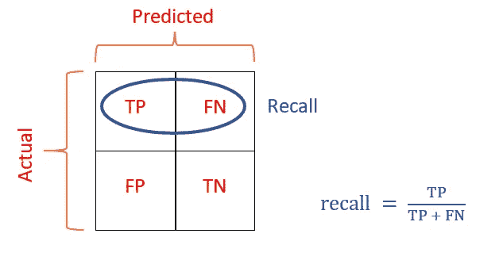
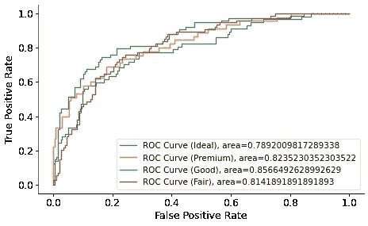

# 多类分类标准综合指南

> 原文：<https://towardsdatascience.com/comprehensive-guide-on-multiclass-classification-metrics-af94cfb83fbd?source=collection_archive---------0----------------------->

## 成为生活的书签:你需要的所有多类分类标准都有清晰的解释

**照片由** [**德昂黑**](https://www.pexels.com/@deon-black-3867281?utm_content=attributionCopyText&utm_medium=referral&utm_source=pexels) **上** [**像素**](https://www.pexels.com/photo/long-fitness-health-measure-5915361/?utm_content=attributionCopyText&utm_medium=referral&utm_source=pexels)

## 介绍

我最近发表了[我最具挑战性的文章](/comprehensive-guide-to-multiclass-classification-with-sklearn-127cc500f362?source=your_stories_page-------------------------------------)，主题是多类分类(MC)。我在这个过程中所面临的困难很大程度上是由于我必须学习和解释过多的分类标准。当我完成的时候，我已经意识到这些指标应该有一篇自己的文章。

因此，这篇文章将是关于 7 个最常用的 MC 指标:精确度、召回率、F1 值、ROC AUC 值、Cohen Kappa 值、Matthew 相关系数和对数损失。您将了解它们是如何计算的，它们在 Sklearn 中的细微差别，以及如何在您自己的工作流程中使用它们。

<https://ibexorigin.medium.com/membership>  

获得由强大的 AI-Alpha 信号选择和总结的最佳和最新的 ML 和 AI 论文:

<https://alphasignal.ai/?referrer=Bex>  

## 解释 N 乘 N 混淆矩阵

您今天将要介绍的所有指标都以这样或那样的方式与混淆矩阵相关联。虽然 2 乘 2 混淆矩阵直观且易于理解，但更大的混淆矩阵可能会*真正混淆*。出于这个原因，在深入研究从矩阵中导出的指标之前，最好先了解一些较大的 N 乘 N 矩阵。

在本文中，我们将使用钻石分类的例子。具体来说，目标包含 4 种类型的钻石:理想、优质、优质和一般。对该钻石数据的任何分类器进行评估将产生一个 4x 4 矩阵:

尽管随着类别数量的增加，解释矩阵变得越来越困难，但是有一些万无一失的方法可以找到任何形状的矩阵。

第一步是始终确定你的积极和消极类。这取决于你要解决的问题。如果分类是平衡的，也就是说，你平等地关心每一个类(这种情况很少发生)，可能就不会有任何积极或消极的类。如果是这种情况，正类和负类是按类定义的。

但是，作为珠宝店老板，您可能希望您的分类器能够更好地分类理想钻石和优质钻石，因为它们更贵。在这种情况下，理想和优质标签将是一个积极的类别，其他标签被统称为消极的。

识别阳性和阴性类别后，定义真阳性、真阴性、假阳性和假阴性。就我们自己的问题而言:

*   **真阳性，类型 1** :实际理想值，预测理想值
*   **真阳性，类型 2** :实际保费，预测保费
*   **真否定**:正确预测的任何否定类别标签(好、一般)
*   **误报**:实际值属于“良好”或“一般”类别，但预测为“理想”或“溢价”
*   **假阴性**:实际值属于阳性类别，但预测为良好或一般

一旦你定义了 4 项，从矩阵中找出每一项应该很容易，因为这只是简单的加法和减法。

## 从二元度量到多元类

默认情况下，大多数分类指标都是针对二元情况定义的。在将这些二进制度量扩展到多类时，使用了几种平均技术。

首先，使用一对一(OVO)或一对其余(OVR，也称为一对所有)方法，将多类问题分解为一系列二元问题。OVO 存在计算上的缺陷，所以专业人士更喜欢 OVR 方法。正如我在我的上一篇文章中详细讨论了这两种方法的区别，我们今天将只关注 OVR。

本质上，一对一策略将一个多类问题转化为目标中每个类的一系列二元任务。例如，分类 4 种类型的钻石类型可以用 OVR 二进制化为 4 个任务:

*   任务 1:理想与[优质、良好、一般] —即理想与不理想
*   任务 2:优质与[理想、良好、一般]——即优质与非优质
*   任务 3:好与[理想、优质、一般] —即好与不好
*   任务 4:公平与[理想、优质、良好] —即公平与不公平

对于每个任务，将构建一个二进制分类器(在所有任务中应该是相同的分类器)，并使用二进制分类度量(如 precision)(或我们今天将讨论的任何度量)来测量它们的性能。结果将是 4 个精确分数。为了比较一个分类器和另一个分类器，我们需要一个单一的精度分数，而不是 4，所以我们需要一种方法来表示所有类的精度。这就是平均技术的用武之地。

具体来说，有 3 种适用于多类分类的平均技术:

*   **macro** :这是跨类的所有指标的简单算术平均值。这种技术对所有类别赋予相同的权重，使其成为平衡分类任务的好选择。
*   **加权**:通过计算目标中每个类别的样本数加权的二进制度量的平均值，说明类别不平衡。如果 3 个类别的 3 ( *精度分数*)分别为:类别 1 (0.85)、类别 2 (0.80)和类别 3 (0.89)，则通过将每个分数乘以每个类别的出现次数并除以样本总数来计算加权平均值。
*   **微**:这个和精度一样。微平均是用矩阵对角线单元之和除以所有单元之和，即精度。由于精确度是一个误导性的指标，这种平均技术很少使用。

现在，让我们最终转向实际的指标！

## 多类分类的精度和召回率

Precision 回答了“预测阳性**与实际阳性*的比例是多少？”当然，你只能用二元分类来回答这个问题。这就是为什么你问这个问题的次数和目标中类的数量一样多。每一次，你都将针对一个班级向其他班级提出问题。对于我们的钻石分类，一个例子是“预测的理想钻石有多少比例实际上是理想的？”***

*通过将真阳性除以真阳性和假阳性之和来计算精度(*三 p 规则*):*

**

*让我们计算理想类的精度。以下是混淆矩阵，供参考:*

**

*理想钻石的真阳性是左上角的单元格(22)。假阳性是其他类型的钻石被预测为理想的所有细胞。这些是左上角单元格下面的单元格(5 + 2 + 9 = 19)。因此，精度将是:*

***精度(理想):22 / (22 + 19) = 0.536** —很恐怖的分数。*

*当你想减少*假阳性*的数量时，你应该优化你的模型的精确度。在我们的案例中，针对理想钻石的精度进行优化是有意义的。原因是理想钻石是最贵的，得到一个误报意味着将一个更便宜的钻石归类为理想。如果你不小心漏掉了这样的事件，你可能会被指控欺诈。现在，让我们继续*回忆*。*

*Recall 回答了“有多少比例的**实际阳性**被正确分类？”它的计算方法是将真阳性的数量除以真阳性和假阴性的总和。*

**

*让我们为特级钻石计算一下。*

**

*有 27 个真阳性(第 2 行，第 2 列)。假阴性是指优质钻石被归类为理想、良好或一般的任何情况。这些将是真阳性细胞左边和右边的细胞(5 + 7 + 6 = 18)。因此，召回将是:*

***召回(溢价):27/(27+18)= 0.6**——也不是个好成绩。*

*如果你想减少*假阴性*的数量，你应该优化你的召回模型。如果您试图在黄色和红色香蕉中检测蓝色香蕉，您会希望减少假阴性，因为蓝色香蕉非常罕见(如此罕见，以至于您第一次听说它们)。你不会想把它们和普通的香蕉混在一起。*

*如果你想查看所有类的精度和召回率以及它们的宏观和加权平均值，你可以使用 Sklearn 的`classification_report`函数。假设我们的标签在`y_test`并且预测在`y_pred`，钻石分类的报告将是:*

*最后两行显示的是精度和召回率的宏观和加权平均值，看起来不太好！*

## *多类分类的 F1 分数*

*由于它们的性质，精确度和召回率是一种权衡关系。你可能不得不以牺牲另一个为代价来优化一个。然而，如果您想要一个分类器，它在最小化误报和漏报方面同样出色，该怎么办呢？例如，有一个模型是有意义的，该模型同样擅长于捕捉意外出售廉价钻石作为理想钻石的情况，以便您不会被起诉，并检测意外以更低的价格出售理想钻石的情况。*

*这就是 F1 分数的来源。它是通过取精度和召回率的调和平均值来计算的，范围从 0 到 1。*

**

*为什么要取调和平均值而不是简单的算术平均值？调和平均值有一个很好的算术特性，代表一个真正平衡的平均值。如果准确率或召回率较低，就会受到严重影响。例如，假设我们正在比较两个分类器。第一个分类器的精度和召回率分别为 0.9、0.9，第二个分类器的精度和召回率分别为 1.0 和 0.7。计算两者的 F1 得到 0.9 和 0.82。如你所见，第二个分类器的低回忆分数降低了分数。*

*使用分类报告输出，您可以看到 F1 的两个平均分数:*

*F1 分数通常介于精确度和召回率之间，但是取加权平均值可能会给出超出其范围的值。*

*在接下来的几节中，我们将讨论 ROC AUC 得分并将其与 F1 进行比较。你会发现这两个指标的主要缺点。*

## *多类分类的 ROC AUC 得分*

*二元分类中另一个常用的度量是受试者操作特征曲线下的面积(ROC AUC 或 AUROC)。它量化了模型区分各个类别的能力。该度量仅用于可以生成类成员概率的分类器。就 Sklearn 估计器而言，这些是具有`predict_proba()`方法的模型。*

*例如，如果目标包含猫和狗类，那么使用`predict_proba`方法的分类器可以为每个样本生成隶属概率，例如猫为 0.35，狗为 0.65。然后，基于像 0.5 这样的决策阈值对每个预测进行分类。在进一步解释 AUROC 之前，我们先来详细看看它是如何计算 MC 的。*

*在使用`predict_proba`方法的二元分类器被选择之后，它被用于为 OVR 的第一个二元任务生成成员概率。然后，选择接近 0 的初始决策阈值。使用阈值，进行预测，并创建混淆矩阵。从这个混淆矩阵中，计算出两个度量，真阳性率(与回忆相同)和假阳性率:*

**

*然后，选择新的、更高的阈值，并创建新的混淆矩阵。使用这个混淆矩阵，计算新的 TPR 和 FPR。对于 0 和 1 之间的许多不同的判决阈值重复该过程，并且对于每个阈值，找到新的 TPR 和 FPR。最后，所有 TPR 和 FPR 相互对应绘制:*

**

*该图是在我们的 diamonds 数据集中计算理想类相对于其他类的 ROC 曲线的实现。对于所有其他二进制任务，重复整个过程。换句话说，又发现了 3 条 ROC 曲线:*

**

*最终的图还显示了这些曲线下的面积。AUROC 越大，等级之间的差别就越大。最终的 AUROC 也使用宏观或加权方法进行平均。以下是这一切在 Sklearn 中的实现:*

*我们的平均得分是 0.82。*

## *多类分类中 ROC AUC 分数与 F1 分数的对比*

*简而言之，ROC AUC 和 F1 之间的主要差异与类别不平衡有关。以下是阅读了许多 StackOverflow 线程后对如何选择一个线程的总结:*

*如果你有很高的类别不平衡，总是选择 F1 分数，因为高的 F1 分数同时考虑了精确度和召回率。为了获得高 F1，假阳性和假阴性都必须低。另一方面，ROC AUC 可以以足够高的假阳性数给出宝贵的高分。此外，您还可以将 ROC AUC 分数视为在各种阈值下评估的 F1 分数(好的和坏的)的平均值。当你有阶级不平衡的时候，总是使用 F1。更高的 ROC AUC 不一定意味着更好的分类器。*

*如果你想更多地了解这种差异，下面的讨论对我有所帮助:*

*   *[F1 得分与 ROC AUC 的对比](https://stackoverflow.com/questions/44172162/f1-score-vs-roc-auc)*
*   *[如何解释几乎完美的准确性和 AUC-ROC 但 f1-得分、精确度和召回为零](https://stackoverflow.com/questions/34698161/how-to-interpret-almost-perfect-accuracy-and-auc-roc-but-zero-f1-score-precisio#34698935)*
*   *[如何在 ROC AUC 和 F1 成绩之间做出选择？](https://stats.stackexchange.com/questions/210700/how-to-choose-between-roc-auc-and-f1-score)*
*   *[AUC 和 F1-score 有什么区别？](https://stats.stackexchange.com/questions/123036/what-are-the-differences-between-auc-and-f1-score())*

## *Cohen 的多类分类 Kappa 评分*

*你可以把 *kappa 评分*看作是准确性的增强版，这个版本也整合了对机会和等级不平衡的测量。*

*正如你可能知道的，准确性可能非常误导人，因为它没有考虑到阶级的不平衡。在正负比率为 10:100 的目标中，如果分类器简单地正确预测所有负样本，您仍然可以获得超过 90%的准确性。此外，由于机器学习算法依赖于数据的概率假设，我们需要一个分数来衡量生成预测时固有的不确定性。以雅各布·科恩(Jacob Cohen)命名的 Kappa 评分是少数几个可以在一个指标中代表所有这些的评分之一。*

*在官方文献中，它的定义是“量化两个评分者之间的一致程度的度量标准。”这是维基百科的定义:*

> *Cohen 的 kappa 系数(κ)是一种统计数据，用于测量定性(分类)项目的评分者之间的可靠性(以及评分者内部的可靠性)。一般认为这是一个比简单的百分比一致计算更稳健的方法，因为κ考虑了偶然发生一致的可能性。*

*以下是官方公式:*

**

*在分类中，这个公式解释如下:*

**P0*是实际值和预测值之间的*观测比例一致*。这将是任何混淆矩阵的对角线单元的总和除以非对角线单元的总和。换句话说，简单准确性的另一个名称。*

**P_e* 是真值和假值偶然重合的概率。我们将看到如何使用我们在本指南中使用的矩阵来计算这些值:*

**

*让我们先找出精确度:对角线单元格的总和除以非对角线单元格的总和— 0.6。为了找到 *P_e* 的值，我们需要找到每个类的真实值与预测值偶然相同的概率。*

1.  **理想*类—真实值和预测值都是*理想值*的概率。共有 250 个样品，其中 57 个是理想钻石。因此，随机钻石成为理想钻石的概率是*

***P(实际 _ 理想)= 57 / 250 = 0.228***

*现在，在所有 250 个预测中，有 38 个是理想的。所以，随机预测成为理想预测的概率是*

***P(预测 _ 理想)= 16 / 250 = 0.064***

*两个条件都为真的概率是它们的乘积，所以:*

***P_e(实际 _ 理想，预测 _ 理想)= 0.228 * 0.064 = 0.014592***

*现在，我们将为其他类做同样的事情:*

1.  **溢价*类——真实值和预测值的概率都是*溢价*偶然:*

***P(actual _ premium)= 45/250 = 0.18***

***P(预测保费)= 28 / 250 = 0.112***

***P_e(实际 _ 溢价，预测 _ 溢价)= 0.02016***

1.  **好*类—真实值和预测值都是*好*偶然的概率:*

***P(实际 _ 良好)= 74 / 250 = 0.296***

***P(predicted _ good)= 26/250 = 0.104***

***P_e(实际 _ 良好，预测 _ 良好)= 0.030784***

1.  **一般*类—真实值和预测值的概率都*一般*偶然:*

***P(实际 _ 公平)= 74 / 250 = 0.296***

***P(predicted _ fair)= 30/250 = 0.12***

***P_e(实际 _ 公平，预测 _ 公平)= 0.03552***

*最终 P_e 是上述计算的总和:*

***P_e(最终)= 0.014592+0.02016+0.030784+0.03552 = 0.101056***

***精度，P_0 = 0.6***

*插入数字:*

**

*好消息是，您可以使用 Sklearn 在一行代码中完成所有这些工作:*

*一般来说，0.8 以上的分数被认为是优秀的。我们得到的分数是一个谦逊的温和派。*

*想了解更多信息，我建议阅读这两篇优秀的文章:*

*   *[简单的多类指标，第三部分:Kappa 分数(又名科恩的 Kappa 系数)](/multi-class-metrics-made-simple-the-kappa-score-aka-cohens-kappa-coefficient-bdea137af09c)*
*   *[科恩的卡帕统计是什么？](https://www.statisticshowto.com/cohens-kappa-statistic/)*

## *多类分类的马修相关系数*

*来看看精确度的另一个单一数字替代品——马修相关系数。我认为这是统计学家能够想出的唯一一个包含所有 4 个矩阵术语并且实际上有意义的指标:*

**

*即使我知道为什么它是这样计算的，我也不会费心去解释它。您只需要知道这个度量表示真实值和预测值之间的相关性。类似于皮尔逊的相关系数，范围从-1 到 1。1.0 的分数意味着完美的分类器，而接近 0 的值意味着我们的分类器不比随机机会好。*

*MCC 的酷之处在于它完全对称。与精确度和召回率不同，交换正类和负类会得到相同的分数。况且它只关心每个类预测的好不好，不考虑类的不平衡性。根据维基百科，一些科学家甚至说 MCC 是在混淆矩阵上下文中建立分类器性能的最佳得分。*

*幸运的是，Sklearn 也包含了这个指标:*

*我们得到了 0.46 的分数，这是一个中等强度的相关性。一般来说，超过 0.7 的值被认为是好成绩。*

*顺便说一下，上面的公式是针对二元分类器的。对于多类，Sklearn 给出了一个更可怕的公式:*

**

***图片由 Sklearn 提供。(他们甚至不辞辛苦，试图简化公式，他们真好！)***

## *多类分类的对数损失*

*最稳健的单一数字度量之一是*对数损失*，称为交叉熵损失和逻辑错误损失。它不是一个点度量(越大越好)，而是一个误差函数(越低越好)。因此，尽可能最小化对数函数的分类器被认为是最好的分类器。*

*log loss 的另一个优点是，它只对概率分数起作用，或者换句话说，是可以生成概率成员分数的算法。这意味着这个误差函数考虑了模型的不确定性。例如，分数为 0.9 的类预测比分数为 0.6 的预测更确定。我们今天讨论的许多指标使用预测标签(即 1 类、2 类)，这些标签隐藏了模型在生成这些预测时的不确定性，而测井曲线损失则没有。*

*它严重地惩罚了模型预测低分数的类成员的情况。对于二进制情况，其公式为:*

**

*以上是二进制情况的公式。多类的情况更加复杂。我将不再解释这个函数是如何计算的，因为这已经超出了本文的范围。因此，我将用 Sklearn 展示一个例子，并留下一些链接，可能有助于您进一步理解这一指标:*

*这里有几个链接可以巩固你的理解:*

*   *[一本关于测井记录丢失的笔记本](https://www.kaggle.com/dansbecker/what-is-log-loss)*
*   *[从 Kaggle 看测井曲线丢失](https://www.kaggle.com/c/tabular-playground-series-jun-2021/discussion/243636)*
*   *[Sklearn 原木损耗用户指南](https://scikit-learn.org/stable/modules/model_evaluation.html#log-loss)*
*   *[每类多类对数损失函数](https://stats.stackexchange.com/questions/113301/multi-class-logarithmic-loss-function-per-class)*

## *摘要*

*今天，我们学习了如何以及何时使用 7 个最常见的多类分类指标。我们还了解了它们是如何在 Sklearn 中实现的，以及它们是如何从二进制模式扩展到多类的。使用这些指标，您可以评估任何分类器的性能，并将它们相互比较。*

*这是最后一张备忘单，根据你在多类问题中的需要来决定使用哪种度量标准:*

*   *以单一指标比较一个分类器与另一个分类器的整体性能—使用马修相关系数、科恩 kappa 和对数损失。*
*   *衡量分类器在平衡分类中区分各类别的能力: **ROC AUC** 得分*
*   *在不平衡分类中最小化假阳性和假阴性的度量: **F1 分数***
*   *专注于减少单个类的误报:该类的**精度***
*   *专注于减少单个类别的假阴性:**召回该类别的**。*

****

# *您可能也会对…感兴趣*

******