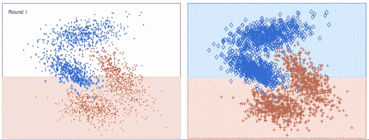
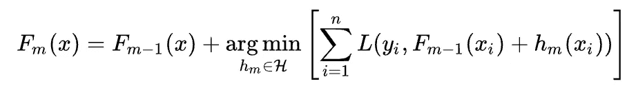
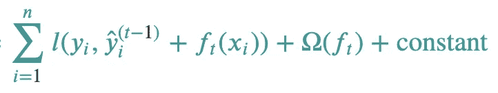
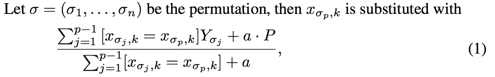

# 助推模型综合指南

> 原文：<https://towardsdatascience.com/comprehensive-guide-to-boosting-models-37714471e94d?source=collection_archive---------12----------------------->

图片来源:[https://Twitter . com/wrathofgnon/status/1250287741247426565/photo/1](https://twitter.com/wrathofgnon/status/1250287741247426565/photo/1)

## 在表格数据建模领域，有一个统治王朝:增强模型。

虽然情况在变化，但 ML 和 AI 中的大多数问题仍然是监督建模问题。尽管深度学习应用程序(图像、视频、文本、语音)占据了左右头条，但现实生活中的大多数问题都使用表格数据，尤其是在商业领域。在这个世界上只有一个统治者:推动模型。

参加过 Kaggle 比赛的人都非常熟悉助推模型。XGBoost 开始统治大多数比赛。王冠很快就传给了 LightGBM。但这些并不是唯一的助推算法。最近，有人在 AdaBoost 上问我一个问题，这让我意识到我忽略了这一点。所以我决定写一个全面的指南，主要是作为自我参考，但也作为其他人的总结。这篇博文旨在讨论这些模型之间的结构差异及其性能。

# 关于集合和推进的初级读本

在我们深入研究不同的模型之前，让我们快速了解一下什么是 boosting 及其同类。Boosting 是一种用于组合输出的方法，如果你没有接触过这个概念，这听起来相当神秘。集成是一种组合不同模型/决策/功能的输出的方法。助推是集合的一种方式。有三种主要的组装方法:装袋、助推和堆叠。

基本上，在集成中，我们有一堆更简单的模型(所谓的“弱学习者”)，它们理想地捕捉我们数据的不同方面，我们使用他们的所有判断来达到最佳解决方案。有点像算法代议制民主。就像在民主国家一样，如果观点非常相似，你最终会进入一个回音室，这个回音室过度适应你的数据的一个方面，你的模型就会在实践中失败。所以我们的“弱学习者”在理论上具有低相关性。关于这一点的更正式和更少固执己见的解释，请参见偏差-方差权衡。

在助推/打包*树*算法中，当我们说弱学习者时，我们实际上指的是决策树。但是弱学习者是一个通用术语，用于任何比随机机会表现稍好的 ML 模型。

## 制袋材料

Bagging 是一种方法，在这种方法中，我们使用来自所有弱学习者的决定。基本上，你有来自每个弱学习者的投票，你决定使用最普遍的意见(在分类的情况下)或平均值(在回归的情况下)。假设我们有 5 个学习能力差的人，其中 3 个回答“是”，2 个回答“这个人会在泰坦尼克号上幸存吗？”最后的决定是肯定的。随机森林是在这种背景下最著名的 bagging 算法。

图片来源:[https://en . Wikipedia . org/wiki/File:Random _ forest _ diagram _ complete . png](https://en.wikipedia.org/wiki/File:Random_forest_diagram_complete.png)

## 助推

另一方面，助推以不同的方式解决问题。它通过调整每一步的误差反复建立自己的观点。每个弱学习者都建立在前一组学习者的基础上。例如，假设我们已经建立了 5 个弱学习者，假设这 5 个学习者的组合输出决策是固定的，第 6 个学习者被期望与训练输出相比纠正他们的错误。在 boosting 中，每个弱学习者都以这样或那样的方式被加权，以优化损失函数。这就是为什么叫‘助推’。它“提升”了前一套模型的性能。这种加权机制是增强算法彼此不同的一个方面。

## 堆垛

概括一下，装袋平均产量。增强将输出与一些权重相结合。从这个意义上说(除了联合和迭代建模方法)，bagging 和 boosting 在加权方法上有所不同。Bagging 对所有弱学习者具有相同的权重，boosting 基于弱学习者在损失函数上的表现对其进行加权。相比之下，*堆叠*使用*又一个*学习器来学习如何组合弱学习器。堆叠层可以有任何模型作为所有弱学习者的组合子。所以基本上代替权重，你可以使用，比如说，神经网络来组合来自你的弱学习者的输出。

# 推进模型:又名我们如何从“大卫·鲍依的”创造出“约翰·沃森”？

如果你读过我以前的任何作品，你就会知道我永远无法抗拒一句晦涩难懂的引用，但这一句是如此贴切，而不是真的那么晦涩难懂，我不得不给出一个[参考](https://www.goodreads.com/quotes/500086-if-you-took-a-couple-of-david-bowies-and-stuck#:~:text=Quotes%20%3E%20Quotable%20Quote-,%E2%80%9CIf%20you%20took%20a%20couple%20of%20David%20Bowies%20and%20stuck,have%20something%20which%20didn't)。现在我已经通过引用以最清晰的方式解释了 ensembling 的作用，下面我可以继续列出不同的升压模型。

*   adaboost 算法
*   梯度推进机器
*   XGBoost
*   CatBoost
*   LightGBM

## adaboost 算法

AdaBoost 是最初的升压模型，代表自适应升压。在每次提升迭代中，它根据模型在每个样本上的当前性能调整权重。使用这些权重，数据集被重新采样(替换)到新的训练集中。基本上，通过增加每个错误分类样本的权重并减少正确分类样本的权重，我们增加了这些错误分类样本在下一次迭代中出现在我们的训练子集中的机会(可能不止一次)。因此，该模型不断地重新关注我们无法分类的项目，以找到一些表示它们的方式。

AdaBoost 在行动——来源:[http://srl.informatik.uni-freiburg.de/videos](http://srl.informatik.uni-freiburg.de/videos)

## 梯度推进机器

如前所述，并不是所有的 boosting 模型都像 AdaBoost 一样进行更新。在 GBM 的情况下，与改变数据的采样权重相反，模型更新是通过给定损失函数的梯度下降来完成的。更新规则如下:

图片来源:[维基百科](https://en.wikipedia.org/wiki/Gradient_boosting)

基本上，这告诉你的是，在迭代 *m* 时，选择弱学习者 *h* ，其最小化实际值 *y_i* 和我们先前估计的 *F_{m-1}(x_i) +* 预测的 *h* (即弱学习者)。找到使其最小化的 *h* 的方法是通过梯度下降。

在优化回归的均方误差的情况下，梯度就是残差。并且每个连续的弱学习器适合于*残差*，因为我们试图补偿误差。想象一下这个场景，当我们开始时，我们对我们的输出没有任何线索。因此，我们的输出向量 *y* 中的每个值实际上都是一个残差。因此，我们首先让弱学习者适应我们的初始残差。然后，我们的弱学习者做出一些预测，其中一些比另一些更好，所以我们试图学习错误并继续这样下去。这个过程相当于使用梯度下降来训练 boosting 模型。数学很简单，但是太长了，不能放在这里。对于没有优化 MSE 的分类和其他回归问题，我们以这样的方式训练我们的弱学习者，他们将执行梯度下降。因此，GBM 是广义 boosting 方法，可以适用于任何可微损失函数。这里的是关于这个主题的一套很好的课堂讲稿，它也展示了拟合残差和梯度下降的等价性。

## 极端梯度推进(又名 XGBoost)

XGBoost 是 GBMs 的一个规范化变体。XGBoost 没有像上述 GBM 中那样最小化损失，而是在损失函数中增加了一个正则化项。这是一个简单但非常有效的防止过度拟合的技巧。该正则化术语强制要求应用更新的最低梯度水平。如果正则项比梯度大得多，那么梯度将完全没有效果，因此更新被停止。如果正则项非常小，那么这个更新等价于 GBM。因此，不是最小化上面 GBM 等式的 *argmin* 部分，我们现在找到最小化以下内容的学习者 *f_t* :

XGBoost 学习。图片来源: [XGBoost docs](https://xgboost.readthedocs.io/en/latest/tutorials/model.html#) 。

此外，XGBoost 增加了叶节点的比例收缩，以进一步防止过度拟合和其他与处理器性能相关的变化。XGBoost 中的 x 与数据科学或 ML 相关概念无关，它更多地指向开发人员必须将分布式快速算法引入 ML 空间的工程焦点。

## CatBoost

虽然 XGBoost 是处理表格数据的一个很好的算法，但它本身并不处理分类值。它们必须通过某种形式的数字编码来手动处理。另一方面，CatBoost 能够处理分类变量，只要您指定列名。其工作方式是，它生成虚拟(单热编码)变量，最多可达由 *one_hot_max_size* 参数提供的最大列数。如果分类变量具有比该参数更多的唯一值，则使用巧妙的排列和随后的类平均来创建每个类和类别的平均目标值。下面给出了公式，它看起来有点复杂，但它的意思是:对于一个给定的排列，找出计数到这一点为止的样本数(j)，其中 *y(输出变量)*等于 1(假设二进制分类)，在它之前加上一些，然后除以到这一点为止的对象总数。

这意味着几件事情，给定一个特征 *x* ，我们将它 *n* 次，以获得该特征的不同排序，然后逐个样本，我们计算带有一些偏移的正类与迄今条目数的比率。这意味着，在第一个实例中，如果我们有类值 *a* ，并且 *y=1* ，这意味着我们的替换值是(1+ a.P)/(1+a)，在第二个实例中，假设我们有类值 *b* 和 *y = 0* ，那么我们的替换值将是(0 + a.P)/(2 + a)。就这样，我们继续前进。请注意，我们使用扩展窗口扫描所有样本，因此如果样本数量较多，这可能会非常慢。本质上，该公式是使用贝叶斯在线估计观察到该特性中该类别值的正类的*概率。它的“贝叶斯”成分来自先验(P)和系数 *a* 是我们对初始先验概率的信任程度。公平地说，这不是一个真正的原创想法，它已经被许多数据科学家用于分类表示。CatBoost 是第一个将它正式化的 boosting ML 模型。它适用于具有大量类别的分类特征，但是 DS 从业者可以在不直接依赖 CatBoost 的情况下实现它。*

## LightGBM

LightGBM 是对 XGBoost 的另一个改进，它也可以直接处理分类值。这个模型实现了一些结构上的变化。

*   计算分裂时的不同采样策略:基于梯度的单侧采样(GOSS)。XGBoost 使用基于直方图的分割策略。基本上，它计算数据的直方图，并基于直方图上的*信息增益*执行树分裂。另一方面，LightGBM 首先执行基于梯度的采样，然后根据样本子集计算分割。其工作方式是，保留所有具有高梯度的行，并对 x%的具有低梯度的行进行采样，然后在该子集上建立新的模型。这个算法的伪代码可以在论文中找到:[https://papers . nips . cc/paper/2017/file/6449 f 44 a 102 FDE 848669 BDD 9 EB 6b 76 fa-paper . pdf](https://papers.nips.cc/paper/2017/file/6449f44a102fde848669bdd9eb6b76fa-Paper.pdf)
*   高效的功能捆绑，通过删减专有功能集来减少功能数量。想法是，您可以将非零值之间没有重叠的要素分组为一个要素。
*   逐叶分割与逐级分割:LightGBM 生长叶，最大程度地减少损失函数。理论上，这棵树只能长在一边。其他算法默认逐层增长树，这意味着树一次只增长一层。XGBoost 还可以执行逐叶生长。这提高了算法的速度和效率，因为它是一种贪婪的搜索机制，然而会导致过拟合，尤其是在数据稀疏和/或小的情况下。

# 结论和实用资源

这篇文章只是收集了算法中的设计差异，然而基于这些设计决策，算法之间存在性能差异。

*   GBM 是 OG(原始梯度)，在不同的数据集上表现良好，但是它不能处理多种实际情况，如空值或分类值。它在多个标准库中都有实现，比如 scikit-learn，所以作为基线模型之一使用总是一个好主意。我尝试使用多种方法:GLMs、决策树、Random Forest 和 GBM，看看哪种复杂程度能给出可接受的基线性能。它指导下面的模型选择决策，但我现在离题了。
*   XGBoost 相对于 GBM 是一个显著的性能改进，但是在 sklearn 中没有实现。也不能处理分类变量。可以处理空值。
*   CatBoost 是对 XGBoost 分类值增加的改进，但训练效率较低。适用于大量独特的特征值。sklearn 中没有原生实现。
*   LightGBM 是对 XGBoost 改进，它可以处理分类值，也非常有效，但是如果不仔细调整，它会被修剪以适应过度。sklearn 中没有原生实现。然而，Python 包有一个 sklearn 子模块，它符合 sklearn fit-transform 语法，并且可以很好地与 sklearn 集成。

关于如何调优和使用这些算法的实用技巧，下面是一组我个人引用过并继续引用的博客帖子。这些软件包的官方文档也非常好，所以请务必参考这些文档。最后，检查原始论文也是一个好主意，因为它们提供了一种以更结构化的方式阅读创作者想法的方式。

*   [XGB 与 LGBM](/lightgbm-vs-xgboost-which-algorithm-win-the-race-1ff7dd4917d) 参数调整
*   [CatBoost vs. XGB vs. LGBM 参数比较](/catboost-vs-light-gbm-vs-xgboost-5f93620723db)
*   [XGBoost 文档](https://xgboost.readthedocs.io/en/latest/)
*   [CatBoost 文档](https://catboost.ai/docs/concepts/about.html)
*   [CatBoost 论文](https://arxiv.org/pdf/1706.09516.pdf)
*   [CatBoost 其他论文](http://learningsys.org/nips17/assets/papers/paper_11.pdf)
*   [LightGBM 文档](https://lightgbm.readthedocs.io/en/latest/)
*   [LightGBM 纸](https://papers.nips.cc/paper/2017/file/6449f44a102fde848669bdd9eb6b76fa-Paper.pdf)
*   [LightGBM 回购](https://github.com/microsoft/LightGBM)