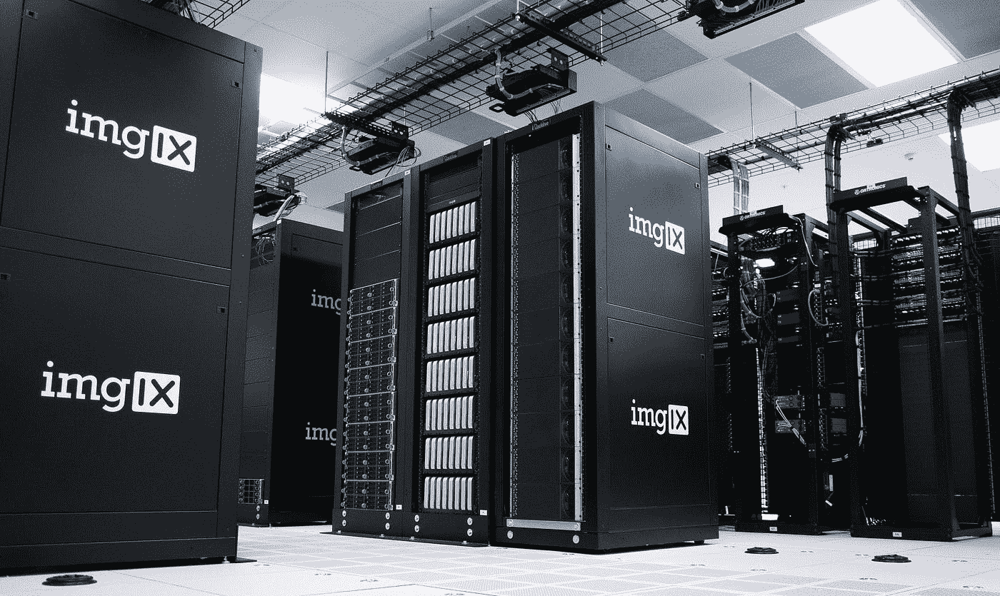
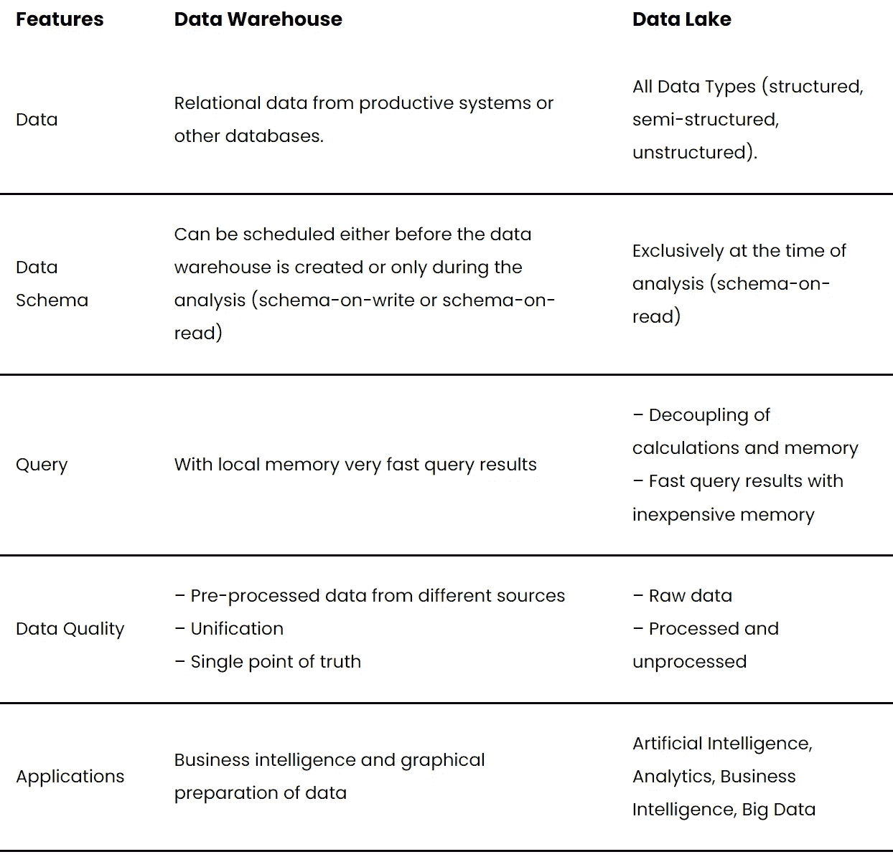

# 数据仓库综合指南

> 原文：<https://towardsdatascience.com/comprehensive-guide-to-data-warehouses-6374617f45d5?source=collection_archive---------17----------------------->

## 您需要知道的一切，包括与数据湖的比较

照片由 [imgix](https://unsplash.com/@imgix?utm_source=medium&utm_medium=referral) 在 [Unsplash](https://unsplash.com?utm_source=medium&utm_medium=referral) 上拍摄

[数据](https://databasecamp.de/en/data)仓库是公司或组织中的中央数据存储，它从各种来源收集关系数据。信息从不同的交易系统或其他关系数据库转移到数据仓库，在那里它可供分析师和决策者使用。

# 数据仓库可以用来做什么？

数据仓库用于商业环境的许多领域。整个公司都使用该数据库来制定数据驱动的决策或检查流程。由于中央数据仓库从许多不同的系统中提取信息，因此它被视为一个单一的事实。这是为了确保公司中的每个人都在谈论相同的数据，并且决策是基于这些信息的。

跨部门，数据仓库可用于以下任务:

*   成本和资源分析
*   内部流程分析(如生产、雇佣等)。)
*   商业智能
*   计算和提供公司范围内的关键绩效指标
*   用于分析或数据挖掘的数据源
*   将公司范围的数据标准化为固定的模式

# 数据仓库的属性

在创建中央数据仓库时，可以遵循某些特征，这些特征应该有助于更好地缩小数据仓库的结构和必要数据。

## 主题定位

数据仓库包含特定主题的信息，而不是单个业务交易的信息。例如，这些主题可以是销售、采购或营销。

该仓库旨在借助商业智能和目标 KPI 来支持决策。与决策无关或用于分析的信息最初不会出现在这个中央数据库中，这一事实也支持这种解释。

## 综合

该仓库集成了来自各种系统和来源的数据。因此，必须为信息创建一个通用的模式，以便它是统一的和可比较的。否则，集中分析和 KPI 创建是不可能的。

## 时间段参考

数据仓库存储特定时期的数据，因此与过去相关。此外，数据通常以聚集的形式传输，例如在每日级别，因此数据量仍然有限。因此，粒度可能不够细，正如人们习惯于从操作系统中得到的那样。

另一方面，操作系统是基于时间的，因为它们输出当前正在积累的信息。同时，可以非常详细地查看信息。

## 非挥发性

中央仓库的另一个重要特征是数据的非易失性。在操作系统中，信息通常只临时存储很短一段时间，一旦添加新数据，旧数据就会被覆盖。另一方面，在数据仓库中，数据是永久存储的，即使添加了新数据，旧数据也会持续存在。

# 数据湖和数据仓库的区别

这个中央数据库还可以由一个数据湖来补充，在这个数据湖中，非结构化的原始数据以较低的成本被临时存储，以便以后使用。这两个概念的主要区别在于它们存储的数据和存储信息的方式。

数据仓库和数据湖的比较|图片:作者

# 这是你应该带走的东西

*   数据仓库集中存储公司范围的信息。
*   这是为了支持数据驱动的决策，并使商业智能成为可能。
*   数据湖中的非结构化原始数据为数据仓库中的关系数据和已处理数据提供了很好的补充。

*如果你喜欢我的作品，请在这里订阅***或者查看我的网站* [*数据大本营*](http://www.databasecamp.de/en/homepage) *！还有，medium 允许你每月免费阅读* ***3 篇*** *。如果你希望有****无限制的*** *访问我的文章和数以千计的精彩文章，不要犹豫，点击我的推荐链接:*[【https://medium.com/@niklas_lang/membership】](https://medium.com/@niklas_lang/membership)每月花$***5****获得会员资格**

* [## 谷歌了解我什么？找出来！

### 在我们之前的一篇文章中，我们谈到了陷入数字过滤泡沫是多么容易，信息…

medium.com](https://medium.com/@niklas_lang/what-does-google-know-about-me-find-it-out-c6115dca17e4)  [## 理解递归神经网络

### 递归神经网络(RNNs)是第三种主要类型的神经网络，前向网络和神经网络

medium.com](https://medium.com/@niklas_lang/what-are-recurrent-neural-networks-5c48f4908e34)  [## kubernetes(k8s)——简单解释！

### Kubernetes 是一个容器编排系统。这意味着应用程序可以在不同的容器之间拆分…

medium.com](https://medium.com/@niklas_lang/kubernetes-k8s-simply-explained-3dc2e1558b7c)*