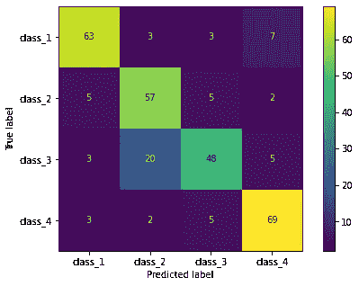
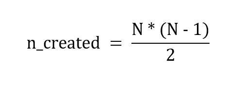
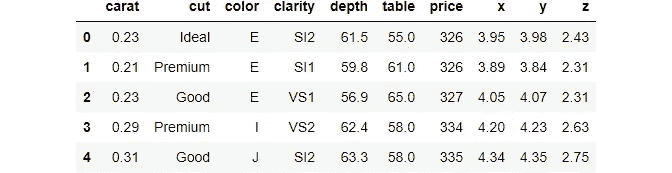
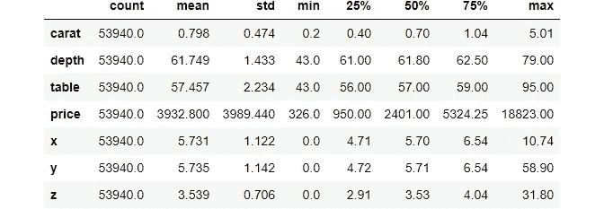
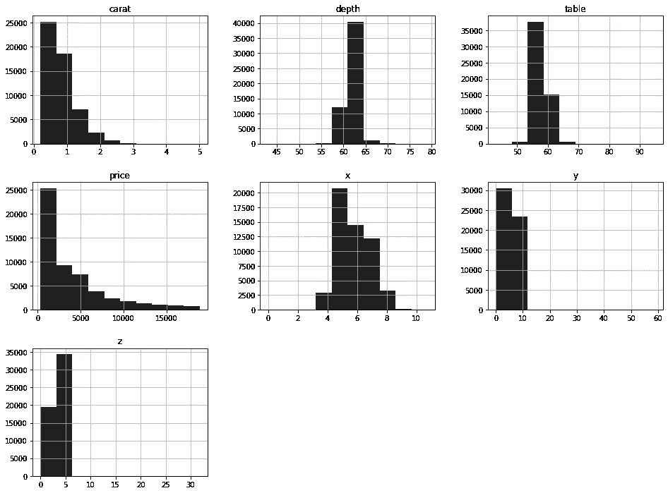
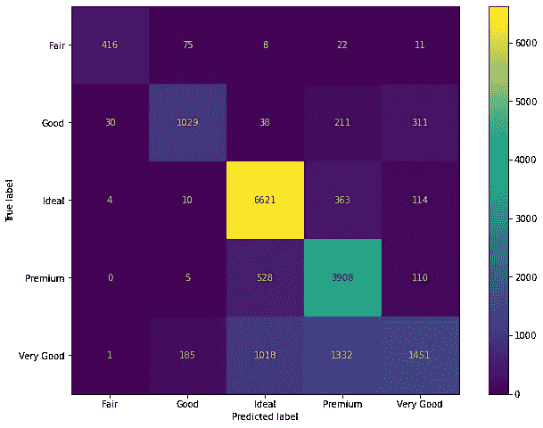
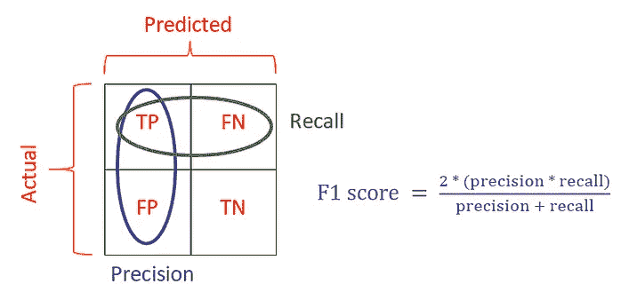
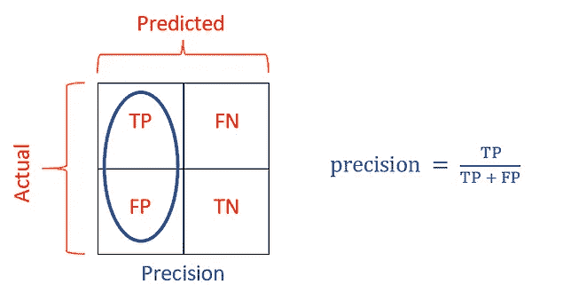
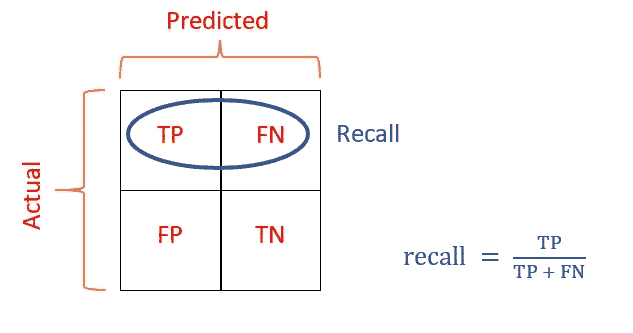
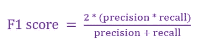

# Sklearn 多类分类综合指南

> 原文：<https://towardsdatascience.com/comprehensive-guide-to-multiclass-classification-with-sklearn-127cc500f362?source=collection_archive---------1----------------------->

## 模型选择、制定策略和选择评估标准

学习如何用 Sklearn 解决任何多类分类问题。本教程涵盖了如何选择模型选择策略、几个多类评估指标，以及如何使用它们完成超参数调整，以优化用户定义的指标。


**照片由** [**塞尔吉奥·亚科布**](https://www.pexels.com/@sergiu-iacob-10475786?utm_content=attributionCopyText&utm_medium=referral&utm_source=pexels) **上** [**像素**](https://www.pexels.com/photo/wave-dark-abstract-motion-7868341/?utm_content=attributionCopyText&utm_medium=referral&utm_source=pexels)

## 介绍

尽管多类分类并不常见，但它确实比二元分类问题提出了更大的挑战。你可以相信我的话，因为这篇文章是我写过的最有挑战性的文章(已经写了将近 70 篇)。

我发现多类分类这个话题很有深度，充满了细微差别。我读了那么多文章，读了多个 StackOverflow 线程，自己创建了几个，花了几个小时浏览 Sklearn 用户指南，做实验。多类分类的核心主题，例如

*   选择将问题二值化的策略
*   选择基本模式
*   理解非常多的指标
*   筛选出解决您业务问题的单一指标，并对其进行定制
*   为此定制度量调整超参数
*   最后用 Sklearn 把所有的理论付诸实践

都分散在互联网黑暗肮脏的角落里。这足以得出结论，没有一个单一的资源显示了在互联网上处理多类分类问题的端到端工作流(也许，我错过了)。

出于这个原因，本文将是一个关于如何使用 Sklearn 解决任何多类监督分类问题的综合教程。您将学习上述核心概念的理论和实现。这将是一个漫长而技术性的阅读，所以去喝杯咖啡吧！

<https://ibexorigin.medium.com/membership>  

获得由强大的 AI-Alpha 信号选择和总结的最佳和最新的 ML 和 AI 论文:

<https://alphasignal.ai/?referrer=Bex>  

## 本地多类分类器

根据你选择的模型，Sklearn 以 3 种不同的方式处理多类分类问题。换句话说，Sklearn 估计器根据其处理多类数据的策略分为 3 类。

第一组也是最大的一组估计器本身支持多类分类:

*   `[naive_bayes.BernoulliNB](https://scikit-learn.org/stable/modules/generated/sklearn.naive_bayes.BernoulliNB.html#sklearn.naive_bayes.BernoulliNB)`
*   `[tree.DecisionTreeClassifier](https://scikit-learn.org/stable/modules/generated/sklearn.tree.DecisionTreeClassifier.html#sklearn.tree.DecisionTreeClassifier)`
*   `[tree.ExtraTreeClassifier](https://scikit-learn.org/stable/modules/generated/sklearn.tree.ExtraTreeClassifier.html#sklearn.tree.ExtraTreeClassifier)`
*   `[ensemble.ExtraTreesClassifier](https://scikit-learn.org/stable/modules/generated/sklearn.ensemble.ExtraTreesClassifier.html#sklearn.ensemble.ExtraTreesClassifier)`
*   `[naive_bayes.GaussianNB](https://scikit-learn.org/stable/modules/generated/sklearn.naive_bayes.GaussianNB.html#sklearn.naive_bayes.GaussianNB)`
*   `[neighbors.KNeighborsClassifier](https://scikit-learn.org/stable/modules/generated/sklearn.neighbors.KNeighborsClassifier.html#sklearn.neighbors.KNeighborsClassifier)`
*   `[svm.LinearSVC](https://scikit-learn.org/stable/modules/generated/sklearn.svm.LinearSVC.html#sklearn.svm.LinearSVC)`(设置 multi_class="crammer_singer ")`
*   `[linear_model.LogisticRegression](https://scikit-learn.org/stable/modules/generated/sklearn.linear_model.LogisticRegression.html#sklearn.linear_model.LogisticRegression)`(设置 multi_class= "多项式")
*   `[linear_model.LogisticRegressionCV](https://scikit-learn.org/stable/modules/generated/sklearn.linear_model.LogisticRegressionCV.html#sklearn.linear_model.LogisticRegressionCV)`(设置 multi_class= "多项式")

对于一个 N 类问题，他们会产生 N 乘 N [的混淆矩阵](/how-to-tune-models-like-a-puppet-master-based-on-confusion-matrix-fd488f9b5e65?source=your_stories_page-------------------------------------)，大部分评估指标都是从中推导出来的:



我们将在教程的后面关注多类混淆矩阵。

## 一对一(OVO)策略的二元分类器

其他监督分类算法主要是为二进制情况设计的。然而，Sklearn 实现了两种称为一对一(OVO)和一对其余(OVR，也称为一对所有)的策略，将一个多类问题转换为一系列二元任务。

OVO 将一个多类问题分解成每对类的一个二元分类任务。换句话说，对于每一对，将建立单个二元分类器。例如，一个具有 4 个类别(脑癌、肺癌、乳腺癌和肾癌)的目标使用 6 个单独的分类器将问题二值化:

*   分类器 1:肺与乳房
*   分类器 2:肺对肾
*   分类器 3:肺对脑
*   分类器 4:乳房对肾脏
*   分类器 5:乳房对大脑
*   分类器 6:肾对脑

Sklearn 建议这些分类器最好与 OVO 方法一起使用:

*   [svm。NuSVC](https://scikit-learn.org/stable/modules/generated/sklearn.svm.NuSVC.html#sklearn.svm.NuSVC)
*   [svm。SVC](https://scikit-learn.org/stable/modules/generated/sklearn.svm.SVC.html#sklearn.svm.SVC)
*   [高斯 _ 过程。GaussianProcessClassifier](https://scikit-learn.org/stable/modules/generated/sklearn.gaussian_process.GaussianProcessClassifier.html#sklearn.gaussian_process.GaussianProcessClassifier) (设置 multi_class = "one_vs_one ")

Sklearn 还在`sklearn.multiclass.OneVsOneClassifier`下提供了上述模型的包装器估算器:

这种策略的一个主要缺点是它的计算工作量。由于每对类都需要一个单独的二进制分类器，所以基数高的目标可能需要很长时间来训练。为了计算将为 N 类问题构建的分类器的数量，使用以下公式:



在实践中，由于这个缺点，一对其余的策略是更可取的。

## 一对一(OVR)策略的二元分类器

或者，OVR 策略为目标中的每个类创建一个单独的分类器。本质上，每个二进制分类器选择一个类，并将其标记为正，编码为 1。其余的类被认为是负标签，因此用 0 编码。对 4 种癌症进行分类:

*   分类器 1:肺 vs .[乳腺、肾、脑]——(肺癌，不是肺癌)
*   分类器 2:乳房对[肺、肾、脑]——(乳腺癌，不是乳腺癌)
*   分类器 3:肾对[肺、乳房、脑]——(肾癌，不是肾癌)
*   分类器 4:大脑 vs .[肺、乳腺、肾]——(脑癌，不是脑癌)

Sklearn 建议这些分类器最好与 OVR 方法一起使用:

*   `[ensemble.GradientBoostingClassifier](https://scikit-learn.org/stable/modules/generated/sklearn.ensemble.GradientBoostingClassifier.html#sklearn.ensemble.GradientBoostingClassifier)`
*   `[gaussian_process.GaussianProcessClassifier](https://scikit-learn.org/stable/modules/generated/sklearn.gaussian_process.GaussianProcessClassifier.html#sklearn.gaussian_process.GaussianProcessClassifier)`(设置 multi_class = "one_vs_rest ")
*   `[svm.LinearSVC](https://scikit-learn.org/stable/modules/generated/sklearn.svm.LinearSVC.html#sklearn.svm.LinearSVC)`(设置 multi_class="ovr ")
*   `[linear_model.LogisticRegression](https://scikit-learn.org/stable/modules/generated/sklearn.linear_model.LogisticRegression.html#sklearn.linear_model.LogisticRegression)`(设置 multi_class="ovr ")
*   `[linear_model.LogisticRegressionCV](https://scikit-learn.org/stable/modules/generated/sklearn.linear_model.LogisticRegressionCV.html#sklearn.linear_model.LogisticRegressionCV)`(设置 multi_class="ovr ")
*   `[linear_model.SGDClassifier](https://scikit-learn.org/stable/modules/generated/sklearn.linear_model.SGDClassifier.html#sklearn.linear_model.SGDClassifier)`
*   `[linear_model.Perceptron](https://scikit-learn.org/stable/modules/generated/sklearn.linear_model.Perceptron.html#sklearn.linear_model.Perceptron)`

或者，您可以使用默认`OneVsRestClassifier`的上述模型:

尽管这种策略显著降低了计算成本，但事实上只有一个类被认为是正面的，而其余的被认为是负面的，这使得每个二元问题成为一个不平衡的分类。对于目标中比例较低的班级，这个问题更加突出。

在这两种方法中，根据传递的估计量，所有二元分类器的结果可以用两种方式总结:

*   多数投票:每个二元分类器预测一个类别，从所有分类器中获得最多投票的类别被选择
*   根据类成员概率分数的 arg max:LogisticRegression 等分类器计算每个类的概率分数(`.predict_proba()`)。然后，选择分数总和的 argmax。

我们将在本教程的后面部分详细讨论如何对这些策略进行评分。

## 样本分类问题和预处理流水线

作为一个示例问题，我们将使用 Kaggle 的[钻石数据集](https://www.kaggle.com/shivam2503/diamonds)来预测钻石的质量:



上面的输出显示了不同比例的特征，建议我们使用某种类型的归一化。这一步对于许多基于线性的模型的良好运行是必不可少的。

数据集混合了数值和分类特征。我在我的上一篇文章中详细介绍了二进制分类的预处理步骤。您可以很容易地将这些想法应用到多类的情况中，所以我在这里将保持解释简洁明了。

目标是“削减”，它有 5 个等级:理想、优质、非常好、良好和一般(质量递减)。我们将用 OneHotEncoder 对文本特征进行编码。

让我们快速浏览一下每个数字要素的分布，以决定使用哪种类型的归一化:

```
>>> diamonds.hist(figsize=(16, 12));
```



价格和克拉显示偏斜分布。我们将使用对数转换器使它们尽可能呈正态分布。对于其他的，简单的标准化就足够了。如果您不熟悉数字转换，请查看我的关于该主题的文章。同样，下面的代码包含了一个 Sklearn 管道的例子，你可以从[这里](/how-to-use-sklearn-pipelines-for-ridiculously-neat-code-a61ab66ca90d?source=your_stories_page-------------------------------------)了解所有关于它们的内容。

让我们开始工作:

我们管道的第一个版本使用了`RandomForestClassifier`。让我们通过生成预测来查看它的混淆矩阵:



在第 8 行和第 9 行，我们创建了矩阵并使用特殊的 Sklearn 函数来绘制它。`ConfusionMatrixDisplay`也有`display_labels`参数，我们将通过`pipeline.classes_`属性访问的类名传递给它。

## 解读 N 乘 N 混淆矩阵

如果你读过我的另一篇关于二进制分类的文章，你就会知道混淆矩阵是监督分类问题的圣杯。在 2 乘 2 矩阵中，矩阵项易于解释和定位。

尽管随着类别数量的增加，解释矩阵变得越来越困难，但是有一些万无一失的方法可以找到任何形状的矩阵。

第一步是始终确定你的积极和消极类。这取决于你要解决的问题。作为珠宝店老板，我可能希望我的分类器能够比其他类型更好地区分理想钻石和优质钻石，使这些类型的钻石成为我的正面类别。其他类将被视为负面。

在早期建立正类和负类对于评估模型性能和超参数调整非常重要。这样做之后，你应该定义你的真阳性、真阴性、假阳性和假阴性。在我们的案例中:

*   **阳性等级**:理想和优质钻石
*   **负等级**:非常好，好，和公平的钻石
*   **真阳性，类型 1** :实际理想值，预测理想值
*   **真阳性，类型 2** :实际保费，预测保费
*   **真阴性**:其余钻石类型预测正确
*   **假阳性**:实际值属于 3 个阴性类别中的任何一个，但预测为理想值或溢价值
*   **假阴性**:实际值为理想值或溢价值，但由 3 个阴性类别中的任何一个预测。

总是以这种方式列出矩阵的术语，你的工作流程的其余部分将会容易得多，正如你将在下一节看到的。

## Sklearn 如何计算多类分类指标— ROC AUC 得分

这一节仅仅是关于 Sklearn 如何为多类分类计算公共度量的基本细节。具体来说，我们将探究 4 个最常见的指标:ROC_AUC、precision、recall 和 f1 得分。尽管我将对每个指标做一个简要的概述，但我将主要关注在实践中使用它们。如果您想更深入地了解每个指标衡量的内容，请参考这篇[文章](/multi-class-metrics-made-simple-part-i-precision-and-recall-9250280bddc2)。

我们将讨论的第一个指标是 ROC AUC 得分或*受试者工作特征曲线*下的面积。当我们想要测量一个分类器的性能来区分每一个类时，它是最常用的。这意味着 ROC AUC 更适合平衡分类任务。

实质上，ROC AUC 分数用于二进制分类，并与可以基于某个阈值生成类别成员概率的模型一起使用。以下是计算二元分类 ROC AUC 步骤的简要概述:

1.  一个二元分类器，可以用它的`predict_proba`方法生成类成员概率，比如 LogisticRegression。
2.  选择接近 0 的初始决策阈值。例如，如果概率高于 0.1，则预测该类为负，否则为正。
3.  使用该阈值，创建混淆矩阵。
4.  发现真阳性率(TPR)和假阳性率(FPR)。
5.  选择新的阈值，并重复步骤 3-4。
6.  对 0 到 1 之间的各种阈值重复步骤 2-5，以创建一组 TPR 和 FPR。
7.  绘制所有 TPR 与 FPR 的关系图，以生成接收器工作特性曲线。
8.  计算这条曲线下的面积。

对于多类分类，您可以使用 OVO 或 OVR 策略计算所有类的 ROC AUC。由于我们一致认为 OVR 是一个更好的选择，以下是 OVR 分类的 ROC AUC 计算方法:

1.  使用 OVR 创建的每个二元分类器使用上述步骤找到其自身类别的 ROC AUC 分数。
2.  然后使用以下两种方法之一对所有分类器的 ROC AUC 评分进行平均:

*   “宏观”:这只是分数的算术平均值
*   “加权”:通过找到一个加权平均值，将阶级不平衡考虑在内。每个 ROC AUC 乘以其类别权重并求和，然后除以样本总数。

例如，假设目标中有 100 个样本—类别 1 (45)，类别 2 (30)，类别 3 (25)。OVR 创建了 3 个二元分类器，每个类别一个，它们的 ROC AUC 分数分别为 0.75、0.68、0.84。所有类别的加权 ROC AUC 分数将为:

**ROC AUC(加权):((45 * 0.75)+(30 * 0.68)+(25 * 0.84))/100 = 0.7515**

以下是这一切在 Sklearn 中的实现:

上面，我们为我们的钻石分类问题计算了 ROC AUC，得到了一个优秀的分数。使用`roc_auc_score`时，不要忘记正确设置`multi_class`和`average`参数。如果您想要生成某个特定课程的分数，以下是您的操作方法:

ROC AUC 分数只是一个很好的衡量标准，可以看出分类器如何区分不同的类别。更高的 ROC AUC 分数不一定意味着更好的模型。最重要的是，我们更关心我们的模型对理想钻石和优质钻石进行分类的能力，因此 ROC AUC 这样的指标对我们的情况来说不是一个好的选择。

## 多类分类的精确度、召回率和 F1 分数

衡量渠道绩效的更好指标是使用精确度、召回率和 F1 分数。对于二进制情况，它们易于理解且直观:



作者提供的图片

在多类的情况下，这 3 个度量是基于每类计算*。例如，让我们再来看看混淆矩阵:*


精度告诉我们有多少比例的预测阳性是真正的阳性。如果我们想要计算理想钻石的精度，真正的阳性将是正确预测的理想钻石的数量(矩阵的中心，6626)。假阳性将是任何细胞计数的次数，我们的分类预测其他类型的钻石是理想的。这些单元格位于矩阵中心的上方和下方(1013 + 521 + 31 + 8 = 1573)。使用精度公式，我们将其计算为:

**精度(理想)= TP/(TP+FP)= 6626/(6626+1573)= 0.808**

召回的计算方法类似。我们知道真正阳性的数量——6626。假阴性将是对分类器预测属于任何其他阴性类别的钻石的理想类型的次数进行计数的任何单元。这些单元格位于矩阵中心的左右两侧(3 + 9 + 363 + 111 = 486)。使用回忆公式，我们计算出它是:

**回忆(理想)= TP/(TP+FN)= 6626/(6626+486)= 0.93**

那么，对于理想的类，我们如何在召回率和精确度之间进行选择呢？这取决于你试图解决的问题的类型。如果你想尽量减少其他更便宜的钻石被预测为理想钻石的情况，你应该优化精度。作为一个珠宝店老板，你可能会因为将便宜的钻石冒充昂贵的理想钻石出售而被起诉欺诈。

另一方面，如果您想最大限度地减少意外低价出售理想钻石的情况，您应该优化理想类的召回。的确，你不会被起诉，但你可能会赔钱。

第三个选择是拥有一个同样擅长上述两种场景的模型。换句话说，一个具有高精度和高召回率的模型。幸运的是，有一个指标可以衡量这一点:F1 分数。F1 得分取精确度和召回率的调和平均值，并产生一个介于 0 和 1 之间的值:



因此，理想班级的 F1 分数应该是:

**F1(理想)= 2 *(0.808 * 0.93)/(0.808+0.93)= 0.87**

至此，我们只计算了理想类的 3 个指标。但是在多类分类中，Sklearn 为所有类计算它们。你可以用`classification_report`来看这个:

你可以检查我们对理想类的计算是否正确。表格的最后一列— `support`显示了每个类别有多少个样本。此外，最后两行显示了 3 个指标的平均分数。我们已经介绍了 ROC AUC 示例中的宏观平均值和加权平均值。

对于像这样的不平衡分类任务，你很少选择平均精度，F1 分数的回忆。同样，选择一个指标来优化一个特定的类取决于您的业务问题。对于我们的情况，我们将选择优化理想和高级类的 F1 分数(是的，您可以同时选择多个类)。首先，让我们看看如何计算所有类别的加权 F1:

以上与`classification_report`的输出一致。要选择理想和高级课程的 F1 分数，请指定`labels`参数:

最后，让我们看看如何通过超参数调优来优化这些指标。

## 调整超参数以优化自定义指标的模型性能

为一个指标优化模型性能几乎与我们为二进制情况所做的一样。唯一的区别是我们如何将评分函数传递给 GridSearch 这样的超参数调谐器。

到目前为止，我们一直使用 RandomForestClassifier 管道，因此我们将为此估计器创建一个超参数网格:

> 不要忘记在每个超参数名称前面加上您在评估器管道中选择的步骤名称。当我们创建管道时，我们将 RandomForests 指定为“base”。更多信息见[本](https://stackoverflow.com/a/66344804/11922237)讨论。

我们将使用 HalvingGridSeachCV (HGS ),它比常规的网格搜索要快得多。你可以阅读这篇文章来看看我的实验:

</11-times-faster-hyperparameter-tuning-with-halvinggridsearch-232ed0160155>  

在我们将上面的网格提供给 HGS 之前，让我们创建一个定制的评分函数。在二进制的情况下，我们可以传递字符串值作为我们想要使用的度量的名称，比如“precision”或“recall”但是在多类的情况下，这些函数接受额外的参数，如果我们将函数名作为字符串传递，我们就不能这样做。为了解决这个问题，Sklearn 提供了`make_scorer`功能:

正如我们在上一节中所做的，我们粘贴了`average`和`labels`参数的自定义值。

最后，让我们初始化 HGS，并通过三重交叉验证使其适合全部数据:

搜索完成后，您可以分别使用`.best_score_`和`.best_estimator_`属性获得最佳得分和估计值。

你的模型的好坏取决于你选择用来评估它的标准。超参数调整将是耗时的，但假设您在此之前做了所有正确的事情，并且给出了足够好的参数网格，那么一切都会如预期的那样。如果没有，这是一个迭代过程，所以调整预处理步骤，重新审视您选择的指标，也许可以扩大您的搜索范围。感谢您的阅读！

## 相关文章

*   [简化多类指标，第一部分:精度和召回率](/multi-class-metrics-made-simple-part-i-precision-and-recall-9250280bddc2)
*   [简化多类指标，第二部分:F1-得分](/multi-class-metrics-made-simple-part-ii-the-f1-score-ebe8b2c2ca1)
*   [如何计算不平衡分类的精度、召回率和 F-Measure](https://machinelearningmastery.com/precision-recall-and-f-measure-for-imbalanced-classification/)

## 讨论

*   [如何在 ROC AUC 和 F1 成绩之间做出选择？](https://stats.stackexchange.com/questions/210700/how-to-choose-between-roc-auc-and-f1-score)
*   [AUC 和 F1-score 有什么区别？](https://stats.stackexchange.com/questions/123036/what-are-the-differences-between-auc-and-f1-score)

## API 和用户指南

*   [分类指标](https://scikit-learn.org/stable/modules/model_evaluation.html#classification-metrics)
*   [多类和多输出算法](https://scikit-learn.org/stable/modules/multiclass.html)