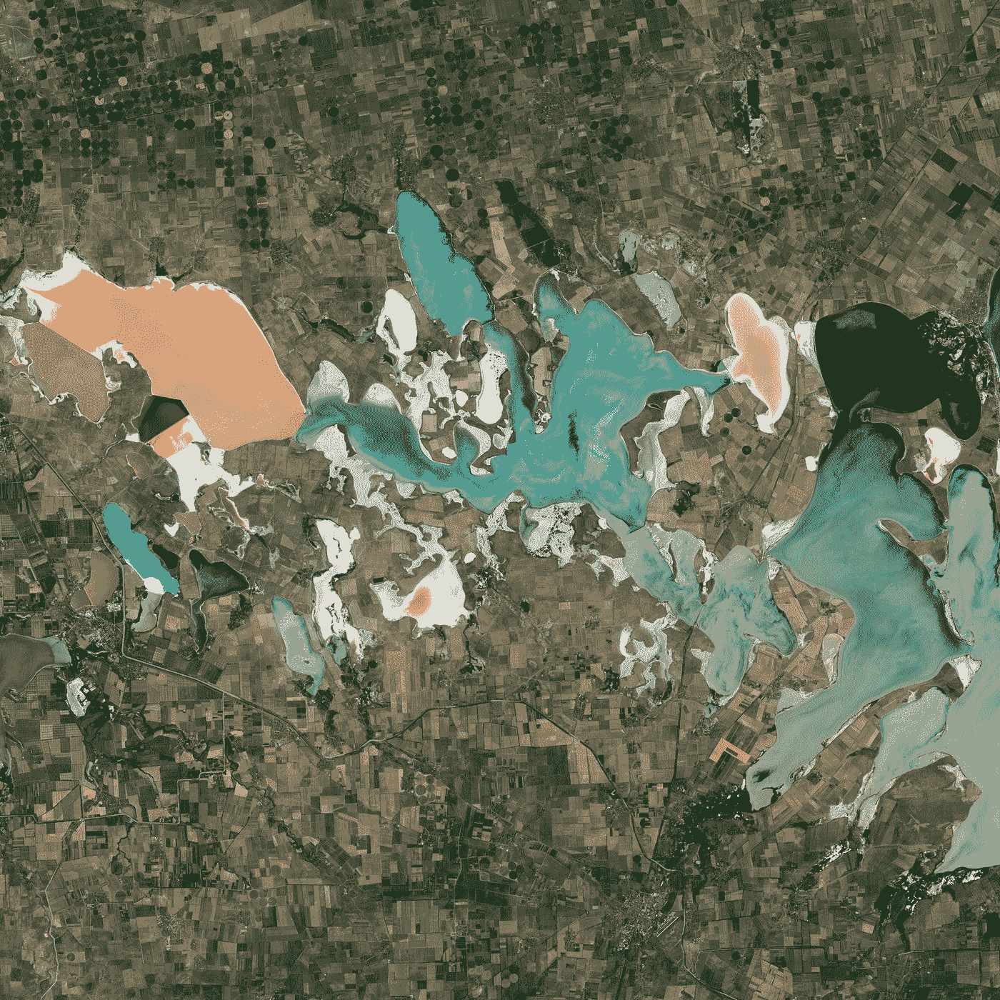
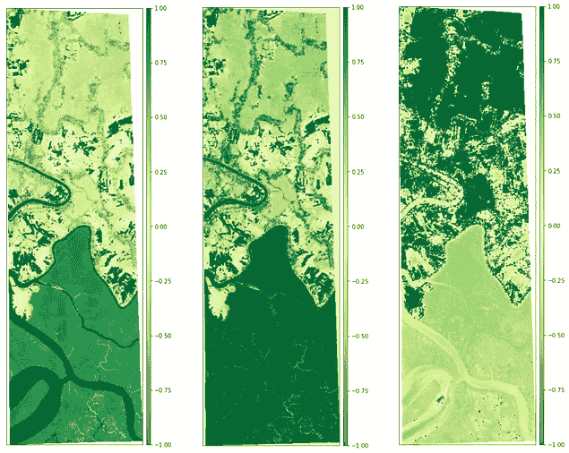
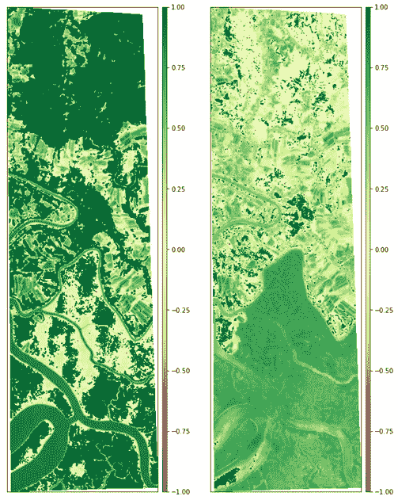
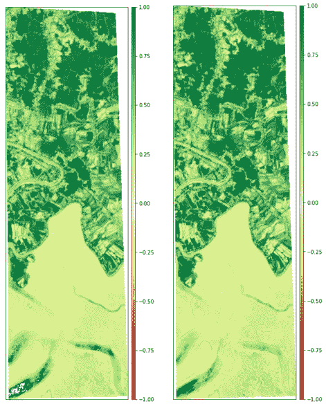

# 使用 Python 进行卫星影像分析的综合指南

> 原文：<https://towardsdatascience.com/comprehensive-guide-to-satellite-imagery-analysis-using-python-1b4153bad2a?source=collection_archive---------11----------------------->

## [实践教程](https://towardsdatascience.com/tagged/hands-on-tutorials)，数据科学|遥感|实践教程

## 使用 Python 分析卫星影像的不同方法和机器学习技术，以及实践教程和示例。

[美国地质勘探局](https://unsplash.com/@usgs?utm_source=medium&utm_medium=referral)在 [Unsplash](https://unsplash.com?utm_source=medium&utm_medium=referral) 上拍摄的照片

本文通过实践教程和示例，帮助用户了解使用 Python 分析卫星影像的不同方法以及有监督和无监督的机器学习技术。

# 内容

1.  **卫星图像指数**
2.  **卫星图像中的监督学习**
3.  **卫星图像中的无监督学习**
4.  **结论**

*让我们开始吧✨*

# **卫星图像指数**

归一化卫星指数是根据多光谱卫星图像计算的图像。这些图像强调了存在的特定现象，同时减轻了降低图像效果的其他因素。例如，植被指数将健康植被显示为指数图像中的亮色，而不健康植被的值较低，贫瘠地形为暗色。由于地形变化(丘陵和山谷)的阴影会影响图像的强度，因此创建索引时会强调对象的颜色，而不是对象的强度或亮度。

## 植被指数

NDVI、SAVI 和 VARI 的孙德尔本斯卫星数据，图片由作者提供

为了确定一块土地上的绿色密度，研究人员必须观察植物反射的可见光(VIS)和近红外(NIR)阳光的不同颜色(波长)。一些广泛使用的植被指数是:

*   归一化差异植被指数(NDVI)
*   土壤调整植被指数(SAVI)
*   可见大气阻力指数(VARI)

## 水指数

MNDWI 和 NDMI od Sundarbans 卫星数据，图片由作者提供

地表水变化是环境、气候和人类活动的一个非常重要的指标。sentinel-2、Landsat 等遥感器在过去四十年里一直在提供数据，这对于提取森林和水等土地覆盖类型很有用。研究人员提出了许多地表水提取技术，其中基于指数的方法因其简单和成本效益高而受到欢迎。一些广泛使用的水指数是:

*   修正的归一化差异水指数
*   归一化差异湿度指数(NDMI)

## 地质指数

事实证明，卫星图像和航空摄影是支持矿产勘探项目的重要工具。它们可以以多种方式使用。首先，它们为地质学家和野外工作人员提供轨迹、道路、栅栏和居住区的位置。

孙德尔本斯卫星数据的粘土和含铁矿物比例，图片由作者提供

*   **粘土矿物比率—** 粘土比率是 SWIR1 和 SWIR2 带的比率。这一比率利用了粘土、明矾石等含水矿物吸收光谱中 2.0-2.3 微米部分的辐射这一事实。由于该指数是一个比率，因此可以减轻由于地形造成的光照变化。
*   **含铁矿物比率—** 含铁矿物比率突出显示含铁物料。它使用 SWIR 波段和近红外波段之间的比率。

使用下面的文章，这是一个关于上述 Sundatbands 卫星数据的卫星指数的实践教程。

</satellite-imagery-analysis-using-python-9f389569862c>  

# **卫星图像中的监督学习**

监督学习算法如 K-最近邻分类器(KNNC)、支持向量机(SVM)、深度神经网络(DNNs)、卷积神经网络(CNN)广泛应用于土地覆盖分类、多标签分类等领域

使用下面的文章，涵盖不同的卫星影像分类算法。

</hyperspectral-image-analysis-classification-c41f69ac447f>  </land-cover-classification-of-hyperspectral-imagery-using-deep-neural-networks-2e36d629a40e>  </land-cover-classification-of-satellite-imagery-using-convolutional-neural-networks-91b5bb7fe808>  

# 卫星图像中的无监督学习

无监督学习算法如主成分分析(PCA)、线性判别分析(LDA)、e.t.c 等被用于卫星图像的降维。KMeans、带噪声的基于密度的应用程序空间聚类(DBSCAN)等用于对卫星图像数据进行聚类。

使用下面的文章，涵盖了孙德尔本斯卫星影像的维数减少和聚类。

</dimensionality-reduction-in-hyperspectral-images-using-python-611b40b6accc>  </autoencoders-for-land-cover-classification-of-hyperspectral-images-part-1-c3c847ebc69b>  </unsupervised-learning-in-satellite-imagery-using-python-e2f48bb68b17>  

# 结论

这篇文章涵盖并帮助读者理解监督和非监督机器学习技术和指数，以分析卫星图像。文章中提到的实践教程可以通过 GitHub 资源库获得。

<https://github.com/syamkakarla98/Satellite_Imagery_Analysis>  <https://github.com/syamkakarla98/Hyperspectral_Image_Analysis_Simplified>  

# 参考

<https://link.springer.com/chapter/10.1007/978-981-15-3338-9_12>    </wildfire-detection-using-satellite-imagery-with-python-d534d74d0505>  <https://landsat.gsfc.nasa.gov/landsat-8/landsat-8-bands> 