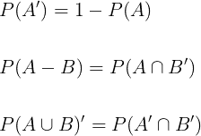
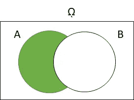
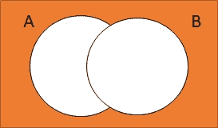
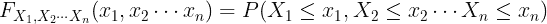
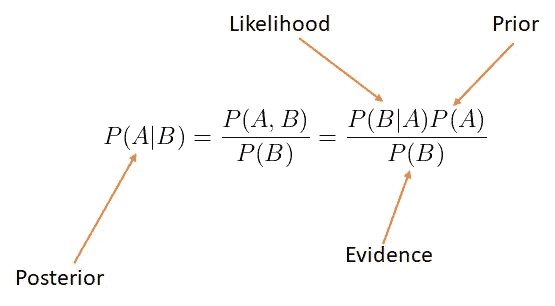

# 随机变量、随机过程及其性质的综合概述(第 1 部分)

> 原文：<https://towardsdatascience.com/comprehensive-overview-of-random-variables-random-processes-and-their-properties-part-1-5c4692a338c6?source=collection_archive---------18----------------------->

在 [Unsplash](https://unsplash.com?utm_source=medium&utm_medium=referral) 上由 [Klara Avsenik](https://unsplash.com/@curryandlove?utm_source=medium&utm_medium=referral) 拍摄的照片

这是一篇由两部分组成的文章。在第 1 部分(这一部分)，我将回顾随机变量，随机向量，以及它们的性质。在第 2 部分，我将讨论随机过程及其性质。

随机变量和随机过程在现实世界中扮演着重要的角色。它们广泛应用于机器学习、信号处理、数字通信、统计学等领域。

以下是这篇文章的提纲:

# 概述

*   **概率复习。**(第一部分)
*   **随机变量。(第一部分)**
*   **随机变量的性质。(第一部分)**
*   **概率中的重要定理。(第一部分)**
*   **随机向量。(第一部分)**
*   **随机过程**。**(第二部分)**
*   **随机过程的性质。(第二部分)**
*   **不同类别的随机过程。(第二部分)**
*   **随机过程通过 LTI 系统。(第二部分)**
*   **机器学习、人工智能、信号处理中的重要随机过程。(第三部分)**

托拜厄斯·凯勒在 [Unsplash](https://unsplash.com?utm_source=medium&utm_medium=referral) 上的照片

# 概率复习

概率被定义为一个事件在长期内的相对频率(频率主义者)或现实世界中不确定性或信念的度量(贝叶斯)。要了解更多关于贝叶斯和频率主义的观点，请参考这篇文章。

</essential-parameter-estimation-techniques-in-machine-learning-and-signal-processing-d671c6607aa0>  

样本空间被定义为一个实验的所有可能实现的集合，用ω表示。比如抛硬币对应的样本空间是ω= { H，T}(其中 H =头，T =尾)或者掷骰子对应的样本空间是:ω= { 1，2，3，4，5，6}。

概率的三个众所周知的公理如下:

1-任何事件的概率介于 0 和 1 之间。

2-样本空间的概率为 1(它总是发生)，即

3-如果 A 和 B 是两个任意事件，那么 A 或 B 的概率计算如下:

∪和∩分别表示逻辑 or 和逻辑 and。

图 1:使用文氏图的联合 B

设 A '是 A 的补，A 是样本空间中不在 A 中的所有元素的集合；那么下面的关系通常是正确的:

图 2:A 的补集的维恩图

图 3:A-B 的维恩图

图 4:A∪B 补码的维恩图

图 1、图 2、图 3 和图 4 分别代表 A 的并集 B、A 的补集、A -B 和 A 的并集 B 的补集的文氏图。文氏图是一种图形和直观的方式来表示集合及其关系。

# 随机变量

随机变量是样本空间元素到真实直线的映射。它既不是随机的，也不是可变的，但它是一个函数，其定义域是样本空间ω，其值域是ℝ(实数)。

图 5:从样本空间到真实线的映射

随机变量可以是离散的，连续的，或是两者的混合。我用大写字母表示随机变量，小写字母表示其值(有时称为实现)。离散随机变量用概率质量函数(PMF)来表示，概率质量函数是不同 k 值下随机变量 X 等于 k 的概率，例如抛一枚公平硬币对应的 PMF 如下:

作为另一个例子，考虑 PMF 掷出的公平骰子:

连续随机变量取特定值的概率为零。因此，它们不是由 PMF 表示，而是由概率密度函数(PDF)表示，概率密度函数是随机变量 X 在 X 和 x + δ之间的概率，通常用 f(x)表示。

图 PDF 的定义

累积分布函数或 CDF 被定义为随机变量 X 取值小于或等于 X 的概率。它被定义为离散和连续随机变量。

CDF 的一些重要属性如下:

1-是单调递增的。

2-是右连续(参考下图)。

图 CDF 的右连续性

3-随机变量 X 在 a 和 b 之间的概率计算如下:

CDF 和 PDF 可以按如下方式相互关联:

n 个随机变量的联合 CDF 定义类似:

有时我们会希望在给定随机变量 Y 已经发生的情况下，求出随机变量 X 的概率。这是用 P(X |Y)表示的条件概率的一个例子。人们可以认为所有的概率都是有条件的，因为它们取决于样本空间，例如:

上面的等式是正确的，因为样本空间以概率 1 发生，因此，我们不需要显式地写它。给定 Y，X 的条件概率计算如下:

上述等式背后的直觉如下:既然事件 Y 已经在发生，那么样本空间就从ω变为 Y，这就解释了分母。现在我们只关心 X 和 Y 之间常见的结果，这解释了分子。

**注:** P(X ∩ Y)有时写成 P(X，Y)。

从联合分布中寻找事件的边际概率/密度的过程称为边缘化，其定义如下:

边缘化是一个消除除了利益变量之外的其他变量的过程。这是通过对除感兴趣的随机变量之外的所有其他变量求和/积分来完成的。

综合发展框架的边缘化定义如下:

这意味着要找到 X₁的边际 CDF，我们所要做的就是用联合 CDF 表达式中的∞来代替其他随机变量。从上面的公式可以明显看出这一点，因为任何变量都小于∞的概率为 1。以下是 CDF 的更多属性:

由[威尔·斯图尔特](https://unsplash.com/@wilstewart3?utm_source=medium&utm_medium=referral)在 [Unsplash](https://unsplash.com?utm_source=medium&utm_medium=referral) 上拍摄的照片

# 随机变量的性质

在这一节中，我将讨论在统计、机器学习、信号处理等领域广泛使用的随机变量的一些众所周知的性质。

## 均值、方差和协方差

随机变量 X 的平均值或期望值定义如下:

连续随机变量由 PDF 定义并使用积分计算，而离散随机变量由 PMF 定义并通过求和计算。
方差是随机变量相对于平均值的离差或可变性的度量。方差越大，平均值的分布越广。数学上定义如下:

协方差是两个随机变量相对于彼此的线性可变性的度量。其定义如下:

在上面的等式中，用 X 代替 Y，就可以用协方差得到随机变量的方差。

使用协方差推导方差

假设 X 和 Y 是两个任意随机变量，并且 **a** 和 **b** 是两个定标器，那么下面是期望值、方差和协方差的一些重要属性:

协方差、期望和方差的性质

这些属性用简单的英语表达如下:

*   期望值是一个线性算子，因此它满足叠加性质(同质性和可加性(前两行))。
*   给随机变量加一个常数不会改变随机变量的方差。
*   将随机变量乘以常数 **a** 会将变量的方差乘以**a**
*   将常数 **a** 和 **b** 加到任一随机变量上不会改变它们之间的协方差。
*   将任意一个随机变量乘以常数 **a** 会将它们之间的协方差乘以 **a.**

## 皮尔逊相关

用符号ρ表示的皮尔逊相关或简称相关，度量两个随机变量或向量之间的线性相关。其定义如下:

皮尔逊相关

在某种意义上，皮尔逊相关是两个随机变量之间的归一化协方差。ρ的最大值为+1，表示完全正相关，-1 表示完全负相关，0 表示没有线性相关。

## 独立性和条件期望

两个随机变量 X 和 Y 被认为是独立的，如果知道了其中一个，你就不会得到关于另一个随机变量的额外信息。回想一下条件概率的定义，就是给定随机变量 Y 已经发生的情况下，随机变量 X 的概率。如果 X 和 Y 是独立的，下面的关系是真的:

独立性的定义

回想一下，条件概率也可以用联合概率和边际概率来定义。因此，独立性的一个更常见的定义是:

用联合概率定义独立性

上面的等式说的是两个随机变量的联合分布等于它们的边值的乘积。

给定随机变量 Y，随机变量 X 的条件期望定义如下:

## 互斥事件

两个事件 A 和 B 是互斥的，如果它们的交集是空的。
数学上定义为 A ∩ B = ∅，或者 P(A ∩ B ) = 0。

图 8:两个互斥事件的示意图

## 独立与不相关的随机变量

如果随机变量 X 和 Y 是独立的，那么它们是不相关的(因为它们之间的协方差是零)，但是反过来不一定是正确的，除非 X 和 Y 是联合高斯分布，那么独立和不相关是相同的事情。
在本文的第 2 部分中，当我讨论高斯随机过程时，我再次提到了这个概念。

# 概率中的重要定理

**全概率定律** 如果 B₁，B₂，。。。，Bₙ这样划分样本空间:

这意味着它们的并集跨越样本空间，并且它们是互斥的(它们的交集是空的)。那么任何事件 A 都可以表示如下:

图 9:全概率定律的文氏图

**贝叶斯定理** 这是机器学习、信号处理、统计学等领域中应用最广泛的定理之一。它是把给定 B 的条件概率和给定 A 的 B 的条件概率联系起来的一种方法，在另一个世界里，它是把似然和后验分布联系起来的一种技术。其数学定义如下:

图 10:贝叶斯法则

有关贝叶斯定律、后验概率和可能性的更多信息，请参考以下文章和 Youtube 视频。

</essential-parameter-estimation-techniques-in-machine-learning-and-signal-processing-d671c6607aa0>  

总期望定律
假设你想知道加州大学洛杉矶分校平均有多少学生喜欢下棋。一种方法是亲自采访每一个学生，用爱下棋的学生人数除以学生总数，得出平均值。然而，这种技术非常繁琐，并且不可扩展。
相反，更实用的方法是按专业/系对学生进行分类，并计算每个系喜欢下棋的学生的平均人数(这可以由多人完成，每个人采访一个系)，然后在这些平均人数中找出平均值，得出想要的结果。从数学上来说，这写如下:

总期望定律

这里 y 是划分人的标准(像专业、科室、性别、年龄等)。

**中心极限定理(CLT)** 中心极限定理指出，如果 X₁、X₂、.。。、Xₙ均为独立同分布随机变量，均值为μ，方差为σ，随机变量 Zₙ定义如下:

当 n 趋于∞(变得很大)时，Zₙ的 CDF 收敛于标准的正常 CDF。关于 CLT 的好处是，它与 X₁、X₂等发行版无关。。。、Xₙ都有，它们可以是离散或连续的随机变量。

# 随机向量

随机变量的下一个扩展是随机向量。它被定义为有限数量的随机变量的集合。例如， **X** 是一个随机向量，如下所示:

X 的每个元素都是随机变量，具有一定的概率分布、均值、方差等。随机向量 X 的 CDF 定义如下:

由于 X 的每个元素都是随机变量，因此不同分量之间可能存在相关性，因此我们定义协方差矩阵来捕捉所有元素之间的方差和协方差。

均值和协方差矩阵的定义

因此，协方差矩阵是这样的矩阵，其主对角线上的元素是每个分量的方差，非对角线元素是每两个随机变量之间的协方差。
回想一下皮尔逊相关的定义及其与两个随机变量协方差的关系。上述协方差矩阵可以写成如下形式:

基于皮尔逊相关的协方差矩阵定义

现在，让我们讨论协方差矩阵的性质。

*   它是对称的，因为 X₂的 cov(x₁= x₁).的 Cov(X₂
*   它是半正定的。这意味着:

*   它的所有特征值都是非零的。

## 高斯随机向量

如果随机变量 X₁，X₂，。。。，Xₙ是联合高斯那么随机向量 x 是高斯随机向量和 X₁，X₂，.。。，Xₙ也是高斯随机变量。
高斯随机向量 X 的 PDF 由其均值向量μ和协方差矩阵 c 表征。其数学定义如下:

高斯随机向量的 PDF

如果一个高斯随机向量有一个对角协方差矩阵，那么它的分量都是独立和不相关的。这是因为每两个元素的协方差为零。

# 结论

在这篇文章中，我讨论了概率规则，随机变量，随机向量，它们的性质，以及概率论中的重要定理。这是这个两部分文章的第一部分。

在下一部分，我将讨论随机过程，它的性质，随机过程的不同类别，以及通过 LTI 系统的随机过程。