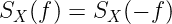

# 随机变量、随机过程及其性质的综合概述(第 2 部分)

> 原文：<https://towardsdatascience.com/comprehensive-overview-of-random-variables-random-processes-and-their-properties-part-2-4cf352a9b7f2?source=collection_archive---------8----------------------->

## 你所需要的关于随机过程和它们的性质

在 [Unsplash](https://unsplash.com?utm_source=medium&utm_medium=referral) 上 [Matteo Catanese](https://unsplash.com/@matteocatanese?utm_source=medium&utm_medium=referral) 拍摄的照片

这是一篇由两部分组成的文章。在第 2 部分(这一部分)，我将回顾随机过程(随机过程)，它们的性质，以及它们对线性时不变(LTI)信道的响应。在第 1 部分中，我讨论了概率、随机变量及其性质。如果您尚未阅读第一部分，请先阅读以下内容:

</comprehensive-overview-of-random-variables-random-processes-and-their-properties-part-1-5c4692a338c6>  

第一部分是理解这一部分的基础，因为随机过程是随机变量和随机向量的一般扩展。
随机变量和随机过程在现实世界中扮演着重要的角色。它们广泛应用于机器学习、信号处理、数字通信、统计学等领域。

以下是这篇文章的提纲:

# 概述

*   **概率的复习。**(第一部分)
*   **随机变量。(第一部分)**
*   **随机变量的性质。(第一部分)**
*   **概率中的重要定理。(第一部分)**
*   **随机向量。(第一部分)**
*   **随机过程**。**(第二部分)**
*   **随机过程的性质。(第二部分)**
*   **不同类别的随机过程。(第二部分)**
*   **随机过程通过 LTI 系统。(第二部分)**
*   **机器学习、人工智能、信号处理中的重要随机过程。(第三部分)**

照片由 [Kunal Shinde](https://unsplash.com/@editholic7?utm_source=medium&utm_medium=referral) 在 [Unsplash](https://unsplash.com?utm_source=medium&utm_medium=referral) 上拍摄

# 随机**流程**

随机过程 X(w；t)是 t 和 w 的时变函数，其中 t 通常是时间，w 是样本空间的元素(ω)。因此，有两种方法来看待随机过程。
**案例一:t(时间)固定，w 在变化:**

**图 1:固定 t 的随机过程定义**

如果 t 固定为 t = tᵢ，那么当 w 变化时，我们得到 I 的每个值的随机变量。因此，如果 w 在变化，随机过程就是随机变量的集合。
**情况二:w 不变，t 在变:**

**图 2:固定 w 的随机过程**

如果 w 固定在 wᵢ，那么我们得到一个时域信号或实现。因此，对于固定的 w，随机过程是确定的时域函数。

**观察 1:** 随机过程中的随机性是由于 w，而不是 t，因此，在随机过程的定义中通常省略 w(假设 w 是变化的)；因此，我们有时称随机过程 X(w，t)为 X(t)。

**直觉:**把随机过程想象成一包时域信号(函数、实现)，每次你把手放进包里，抓住其中一个信号，但你不知道你拿的是哪一个(这就是随机性的来源)。

**观察二:**你可以把一个随机过程看成一个 n 维随机向量的一般版本，其中 n 趋近于无穷大。

你可以在我的 Youtube 频道上找到更多关于随机过程的信息:

# 随机过程的性质

随机过程由一些属性描述，例如均值、自相关、互相关、自协方差、功率谱密度和平均功率。
均值，或随机过程 X(t)的平均值(回想一下，由于假设它是变化的，所以符号中遗漏了 w)，定义类似于随机变量和随机向量(请参考第 1 部分)。

**观察 3:** 回想一下当 w 在变化时，一个随机过程对于每个时间 t 都是一个随机变量，因此在每个时间点，随机变量的期望就是均值。一般来说，平均值是时间函数。

随机过程 X(t)的自相关被定义为随机过程 X(t)在不同时间点与其自身(因此单词 auto)的相关性。

**图 3:不同时间点的随机过程。**

随机过程 X(t)的自协方差被定义为随机过程 X(t)在不同时间点与其自身(因此单词 auto)的协方差。

关于两个随机变量的协方差的定义，请参考第 1 部分的文章(链接在上面的介绍中给出)。

随机过程 X(t)和 Y(t)之间的互相关是两个不同时间点上它们之间相关性的度量。

功率谱密度(PSD)被定义为每个频带中的功率量，并且是自相关函数的傅立叶变换。在下一节讨论广义平稳(WSS)过程时，我将更多地讨论 PSD 和总功率。
如果 **t** 取实线上的任意值，那么 X(t)称为连续时间随机过程(随机过程)，如果 **t** 是可数集合的成员，那么 X(t)是随机序列。
**观测 4:** { X(t)，t ∈ ℝ}称为连续时间随机过程而{ X(t)，t ∈ ℕ}称为离散时间随机过程或随机序列。

# 不同类别的随机过程

## 平稳过程

如果过程 X(t)的统计特性(CDF、PDF 等)不随时间变化，则称其为平稳过程。例如，X(t)是静止的当且仅当:

**观察值 5:** 上式说的是，对于任意 t 和任意δ，平稳过程的 CDF 随时间保持不变。

同样对于平稳过程，X(t₁和 X(t₂的联合分布随时间保持不变。数学上，这定义如下:

平稳过程也称为严格意义上的平稳过程(SSS)，如果对 t₁、t₂、。。、tₙ和任何δ，满足以下条件:

一般来说，要证明一个进程是否是 SSS 是非常困难的，因此我们关注较弱的符号。

## 弱/广义静止(WSS)

如果对于所有 t₁、t₂ ∈ ℝ和所有δ∈ℝ，以下两个条件成立，则 X(t)是 WSS 过程:

**观察值 5:** 如果一个过程的均值是常数，且其自相关是时滞的函数，则该过程是 WSS(t₁- t₂).时滞通常用τ表示。

从现在开始，我将关注 WSS 过程，因为大多数真实世界的过程都被建模为 WSS 过程。

有关随机过程的更多内容，请访问我的 YouTube 频道:

## WSS 过程自相关的性质

1-这是时间滞后的唯一功能。

2-它是一个偶数函数。

3-滞后(τ)为零时的自相关给出平均功率。

4-当时滞为零时，出现自相关的最大值。

5-如果 X(t)是实值随机过程，则自相关是实值函数。

欲了解更多信息，请访问我的 YouTube 频道:

## 联合 WSS 进程

如果下列两个条件成立，则称两个随机过程 X(t)和 Y(t)是联合 WSS:

**观察值 6:** 上述两个条件表明，对于联合 WSS 的过程 X(t)和 Y(t ),则每一个都应该是 WSS(常数均值和自相关应该只是时滞的函数),而互相关(第二个条件)应该只是时滞的函数。

## 功率谱密度

PSD 被定义为 WSS 过程的自相关的傅立叶变换。它用符号 s 表示。

## WSS 过程的功率谱密度特性

1-如果 X(t)是实值随机过程，则它是实值函数。

2-它是一个偶数函数。

PSD 曲线下的面积是平均功率。

属性 3 是最重要的一个，因为它提供了三种不同的方法来计算随机过程的平均功率。

**观察值 7:** 通过对 PSD 曲线下的面积进行积分，计算零点滞后处的自相关函数，计算随机过程的期望平方，从而计算出信号的平均功率。

# 通过 LTI(线性时不变)系统的随机过程

线性系统由脉冲响应函数 h(t)唯一表示。如果 X(t)和 Y(t)是线性系统的输入和输出，则 Y(t)可以计算为 X(t)和脉冲响应 h(t)的卷积。

**图 4:线性系统输入输出关系**

如果 X(t)是随机过程并且被输入到 LTI 系统，那么输出 Y(t)也是随机过程。

**定理 1:** 若 X(t)是 WSS 随机过程，并以脉冲响应 h(t)输入 LTI 系统，则 X(t)和 Y(t)共同为 WSS 过程。

由于 Y(t)是一个 WSS 随机过程，那么它的平均值是常数，它的自相关只是时间滞后的函数。以下是 Y(t)的平均值、自相关性以及 X(t)和 Y(t)之间的互相关性的表达式。

**观察值 7:** 由于 X(t)是 WSS 过程，因此它具有恒定的平均值，因此 Y(t)的期望值也是恒定的(等式 1)。等式 2 表示 X(t)和 Y(t)之间的互相关只是时滞的函数。等式 3 表示输出的自相关仅是时滞的函数。(等式 1 和 3 声称 Y(t)是 WSS 过程，等式 1、2 和 3 声明 X(t)和 Y(t)共同是 WSS 过程。)

## 频域分析

假设 H(f)是 LTI 系统的频率响应(脉冲响应的傅立叶变换)，Sx(f)和 Sy(f)(输入和输出的自相关的傅立叶变换)分别是输入和输出的功率谱密度，则可以在频域中分析上述方程。

**观测 8:** 在求联合 X(t)和 Y(t)(方程 5)的功率谱密度时，我们利用了 H(-f)是 H(f)的共轭的性质(傅里叶变换性质。)

# 结论

在这篇文章中，我讨论了随机过程，它们的性质，不同类别的随机过程，以及通过 LTI 系统的随机过程。在下一部分(第三部分)，我将回顾机器学习，人工智能和信号处理中的重要随机过程，如马尔可夫链，高斯随机过程，隐马尔可夫模型(HMM)等。