# 最小二乘估计的综合研究(上)

> 原文：<https://towardsdatascience.com/comprehensive-study-of-least-square-estimation-part-1-32d24347f9e3?source=collection_archive---------24----------------------->

## 普通、约束、多目标和非线性最小二乘。

Lukasz Szmigiel 在 [Unsplash](https://unsplash.com?utm_source=medium&utm_medium=referral) 上的照片

最小二乘估计是机器学习、信号处理和统计中使用最广泛的技术之一。这是解决线性回归的常用方法，广泛用于模拟连续结果。

它可以被建模为具有二次成本的 MMSE 估计量或贝叶斯估计量。我已经写了关于机器学习和信号处理中使用的各种估计器的综合文章。请查看以下文章了解更多信息。

</essential-parameter-estimation-techniques-in-machine-learning-and-signal-processing-d671c6607aa0>  

我还制作了一系列 YouTube 视频来更深入地了解各种评估技术。请查看并订阅我的 YouTube 频道了解更多信息。

这是一篇由三部分组成的文章，讨论了关于最小二乘估计的所有要点。下面是这篇文章的提纲:

## 概述

*   **普通最小二乘(OLS)估计**
*   **OLS 问题的解决**
*   **正交原理**
*   **OLS 使用 QR 分解(高级读者)**
*   **矩阵的最小二乘问题**
*   **多目标最小二乘法(第二部分)**
*   **约束最小二乘法(第三部分)**
*   **非线性最小二乘法(第四部分)**

在本文中，我将深入讨论最小二乘，在以后的文章中，我将深入讨论多目标、约束和非线性最小二乘。我还将链接到我在 YouTube 上关于最小二乘主题的视频，以获得更多信息和更全面的解释。

## 普通最小二乘法(OLS)

假设 A 是一个 m×n 矩阵，其中 m 大于或等于 n (A 是一个高矩阵)，那么下面的超定方程组或者有**唯一**或者**无解**。

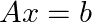

**图 1:线性方程**

如果 b 是 a 的列的线性组合，唯一的解决方案就会出现，这意味着如果你认为 a 被写成列表示，那么 b 将在 a 的列空间中。另一种解释方式是，有 scaler x₁，x₂。。。，xₙ，使得下面的方程有解。

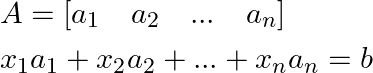

**图 2:线性无关的条件**

**注:**要知道为什么如果解存在，那么它是唯一的，考虑最小二乘问题的假设。它声明 A 是高的，并且有线性无关的列，那么它有一个左逆。然后把方程 1 的左右两边乘以 A 的左逆，就得到唯一解了。本文的其余部分解释了如何找到这个解决方案。

**注**:要了解超定、待定方程组、高、宽矩阵、矩阵的行列解释，请参考以下视频:

如果 Ax = b 无解，那么我们的目标是找到 x，使得它最小化 Ax 和 b 之间的距离的范数。

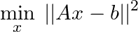

**图 3:最小二乘问题公式化**

## 最小二乘法的列解释:

对于列解释，我们试图找到与向量 b 最接近的 A 列的线性组合。数学上，这可以表示如下:

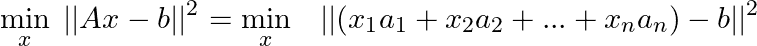

**图 4:最小二乘法的列表示**

## 最小二乘法的行解释；

对于行解释，我们试图最小化对应于 m 个线性方程的 m 个残差的总和。

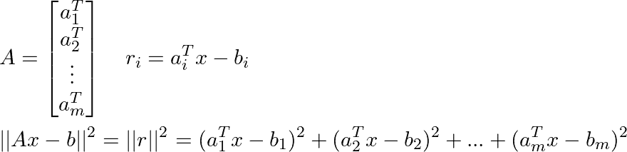

**图 5:最小平方**的行表示

r 是残差向量，其中 r 的每个分量对应于线性方程中的一个残差。例如:

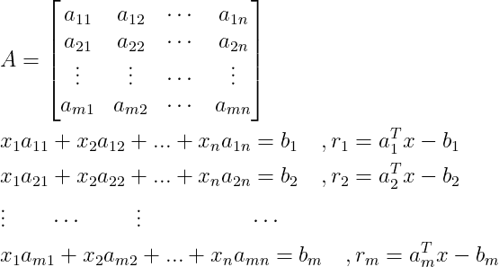

**图 6:最小二乘法的行表示**

## 最小二乘问题的解

这里我将介绍两种解决 OLS 问题的方法。这两种方法是等效的。

**方法 1:** 基于组件的符号

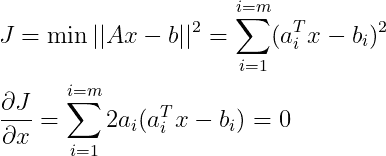

**图 7:最小二乘解**

这种方法是基于将目标函数 J 写成它的分量，然后对目标函数 x 求微分，并将其设置为零。

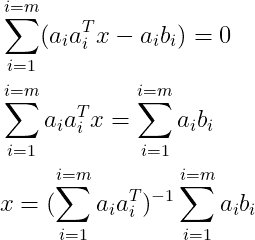

**图 8**

**方法二:**矩阵-向量表示法
这种方法是基于将向量的欧氏范数写成向量转置和自身的乘积。

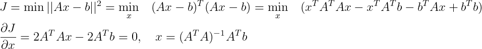

**图 9:使用矩阵向量符号的最小二乘解**

产生最小二乘问题的解的以下方程被称为**标准**方程。

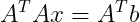

**图 10:法线方程**

方法 1 和 2 产生相同的结果，但是方法 1 是基于元素的格式，而方法 2 给出了更简洁的解决方案。

## 解决方案的解释

(AᵗA)⁻ A(转置的乘积，a 被称为格拉姆矩阵，并且如果 a 具有线性独立的列，则它是可逆矩阵)被称为矩阵 a 的左伪逆。这意味着:

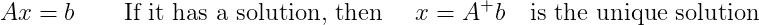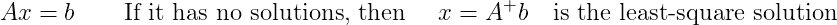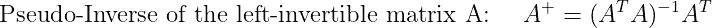

**注:**若 A 是左可逆矩阵(有线性无关列)最小二乘解存在且唯一。

**注:**要了解更多关于 gram 矩阵、左可逆矩阵和右可逆矩阵的信息，请参考以下视频:

## 正交原则:

我在“基本参数估计技术文章”中讨论了一般估计量的正交性原理，请参考以下参考资料了解更多信息

</essential-parameter-estimation-techniques-in-machine-learning-and-signal-processing-d671c6607aa0>  

但是这里我将在最小平方估计的上下文中引入正交性原理。
**正交性原理说明残差与最优估计量正交。**

例如，考虑下图:

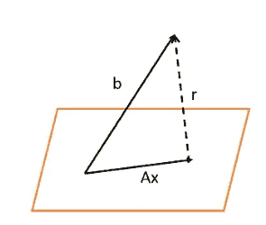

**正交原理**

b 是我们想要估计的向量，r 是残差，Ax 是估计量。

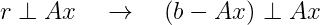

**图 11:正交条件**

现在，为了检查最小二乘解是否是最优解，我们进行如下:
如果 x 是最小二乘解，则正规方程成立，意思是:

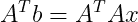

因此，正交性原则如下:

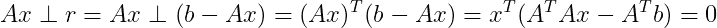

其中最后的结果是由于正常的方程。上述等式表明，如果 x 是最小二乘解，则 Ax 与残差正交，因此 Ax 是向量 b 的最佳估计量

## **OLS 使用 QR 分解(高级题目)**

这一节需要接触 QR 分解，这就是为什么我把它归类为一个更高级的主题。有关 QR 方法的信息和逐步解释，请观看以下视频:

我们将首先通过让 A = QR 使用 QR 分解来分解矩阵 A，其中 Q 是正交矩阵，R 是上三角矩阵。然后我们用它的 QR 分解等价物代替 OLS 解中的 A。

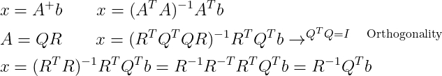

**图 12:使用 QR 分解的最小二乘解**

最后一行表示使用 QR 分解的解决方案。QR 分解提供了一种使用以下算法求解最小二乘法的有效方法:

*   求矩阵 A 的 QR 分解，即 A = QR。
*   计算 Q 转置和 b 的乘积。
*   用回代法解下式(因为 R 是上三角矩阵)。

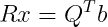

## **矩阵的最小二乘问题**

假设 A 是 m×n 矩阵，X 是 n×p 矩阵，B 是 m×p 矩阵。然后目标是最小化 Ax-B 的 Frobenius 范数。该问题类似于根据矩阵 X 和 B 的列表示来表示矩阵 X 和 B 之后的向量的最小二乘问题。

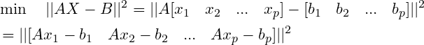

**注:**矩阵的欧几里德或弗罗贝纽斯范数定义如下:

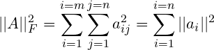

其中 aᵢⱼ是矩阵 a 的 iᵗʰ行和 jᵗʰ列的元素 aᵢ是矩阵 a 的 iᵗʰ列上面等式说的是**一个矩阵的 Frobenius 范数是每列的欧氏范数之和。** 因此结果简化如下:

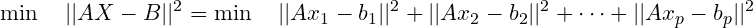

可以看出，| | AX-B | |(Frobenius 范数的平方)可以写成 p 个普通最小二乘目标函数之和，但是每个目标函数都可以独立最小化。因此，实际上我们正在求解 p 个独立的最小二乘问题，以找到对应于矩阵 x 的 p 列的 p 个最优解。

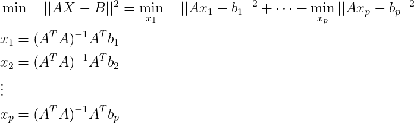

在更简洁的形式中，该解可以表示如下:

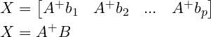

完成第一部分后，请务必查看第二和第三部分。第 2 部分讨论了多目标最小二乘法。第 3 部分讨论了约束最小二乘问题。

</comprehensive-study-of-least-square-estimation-part-2-8a0b5549c1>  

## 结论

在本文中，我讨论了普通的最小二乘问题，解决方案的行和列解释，正交性原则，以及使用 QR 分解的 OLS 解决方案。在下一篇文章中，我将讨论多目标和约束最小二乘问题。
我在之前的一篇关于“基本参数估计技术”的文章中讨论过 OLS(那篇文章的链接在这里给出)。
在我的 YouTube 频道中还有一个完整的关于数值线性代数和优化的系列视频，在其中我详细讨论了所有这些主题。