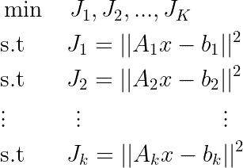
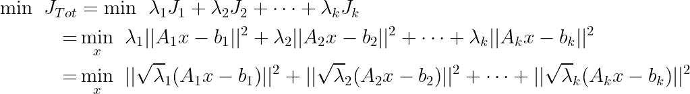
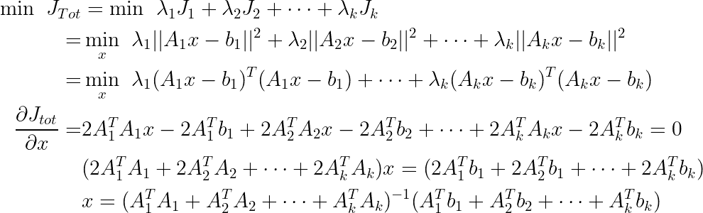
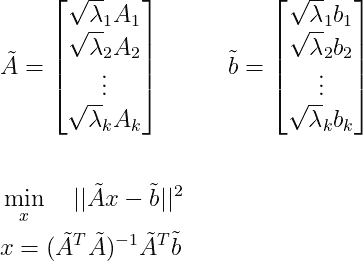
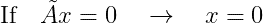
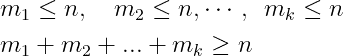
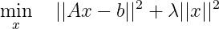
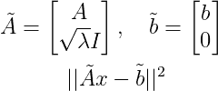
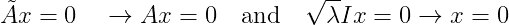
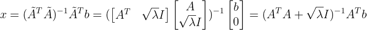

# 最小二乘估计的综合研究(下)

> 原文：<https://towardsdatascience.com/comprehensive-study-of-least-square-estimation-part-2-8a0b5549c1?source=collection_archive---------37----------------------->

## 普通、约束、多目标和非线性最小二乘。

杰伊·曼特里在 [Unsplash](https://unsplash.com?utm_source=medium&utm_medium=referral) 上的照片

在第一部分，我详细讨论了普通最小二乘问题。在这一部分(第二部分)，我将回顾多目标最小二乘问题。如果您尚未阅读第一部分，请参考以下文章了解更多信息:

</comprehensive-study-of-least-square-estimation-part-1-32d24347f9e3> [## 最小二乘估计的综合研究(上)

towardsdatascience.com](/comprehensive-study-of-least-square-estimation-part-1-32d24347f9e3) 

更多信息和更详细的解释，请参考我的 YouTube 频道。

<https://www.youtube.com/channel/UCjNDIlqrFdKUgSeN9wV-OzQ/featured>  

## 多目标最小二乘

假设我们正在寻找一个使多个目标/成本函数变小的解决方案。这个问题被称为多目标优化问题。如果所有的目标函数都是最小二乘问题的形式，那么这个问题就叫做多目标最小二乘问题。

## 问题定式化

假设我们有 K 个最小二乘目标函数，我们的目标是找到一个使它们都变小的 x。

**图 1:多目标最小二乘问题公式化**

其中每个 Aᵢ是 mᵢ×n 矩阵，每个 bᵢ是 mᵢ×1 向量。
有许多方法可以解决和制定多目标 LS 问题，但最常用的方法可能是最小化所有目标函数的加权和，其中权重决定每个目标函数的影响或重要性。

**图 2:多目标最小二乘问题公式化**

其中λ是每个目标函数的权重。这里我介绍两种解决多目标最小二乘问题的方法。

**方法一:直接求导** 在这种方法中，我们取 Jₜₒₜ关于 x 的导数，并设为零。

**图 3:使用直接微分的多目标最小二乘解**

虽然这种方法看起来足够简单，但是第二种方法更常见，并且提供了更好的直觉。
**方法 1:堆叠矩阵** 这是解决多目标 LS 问题的更好方法，因为它利用了 OLS 问题的解决方案，并将问题直接建模为 OLS 问题。
我们首先构建一个新的矩阵 A 和 B，然后使用我们在图 2 中推导出的公式将问题表述为一个简单的 OLS 问题，如下所示。

**图 4:使用堆叠矩阵的多目标 LS 解决方案**

这种方法仅在堆叠的 A 具有类似于 OLS 的线性独立列的情况下有效，其中它要求矩阵 A 具有线性独立的列(高和左可逆矩阵)。

## 当堆叠矩阵具有线性独立的列时

如前所述，要使用堆叠矩阵方法，我们需要确保堆叠矩阵是左可逆的或具有线性独立的列，这意味着:

**图 5:线性无关列的条件**

*   如果矩阵 A₁、A₂、.。。，Aₖ具有线性独立的列，那么堆叠矩阵将具有线性独立的列。
*   然而，堆叠矩阵可以具有线性独立的列，即使所有矩阵 A₁、A₂、.。。，Aₖ具有线性相关的列，并且这在满足以下条件时发生:
    假设 A₁是 m₁x n，A₂是 m₂ x n，Aₖ是 mₖx n，则如果每个 m_i 小于或等于 n，但是它们的和大于或等于 n，则堆叠矩阵仍然是高的，并且可以是左可逆矩阵(线性独立的列)。从数学上来说，这意味着:

**图 6:线性无关列的条件**

## 吉洪诺夫正则化

假设你正试图解决一个最小二乘问题:

*   矩阵 A 没有线性无关的列。
*   或者我们希望最小化||Ax — b||使得||x||很小(x 的范数很小)。

表述这个问题的一种方法如下:

**图 7:正则化最小二乘法**

在图 7 中，λ是一个正权重，决定了第二个目标函数相对于第一个目标函数的重要性。如果λ是零，那么我们回到 OLS。如果λ很小，那么我们在第一个目标函数上放置更多的权重。这是通过将主要目标函数的权重归一化为 1 并让λ表示相对权重来公式化多目标问题的常见方式。

为了求解上述方程，我们可以使用方法 1 或方法 2，但为了演示堆叠矩阵方法，我们将使用第二种方法。

**图 8:使用堆叠矩阵正则化最小二乘法**

在解决图 8 中的上述问题之前，证明堆叠矩阵 A 具有线性独立的列是很重要的。有两种方法可以证明这一点:

1.  单位矩阵具有线性无关的列，因此无论 A 是否具有依赖列，堆叠矩阵都具有线性无关的列。
2.  按照标准程序证明色谱柱的线性独立性:

**图 9:证明堆叠矩阵有线性无关的列**

既然堆叠矩阵具有线性独立的列，那么解可以容易地确定如下:

**图 10:正则化最小二乘解**

想了解更多关于多目标最小二乘法的知识，请参考我的 YouTube 频道。

## **接下来是什么:**

请务必阅读第 3 部分关于约束最小二乘法的文章。

</comprehensive-study-of-least-square-estimation-part-3-9ebefbbe8634> [## 最小二乘估计的综合研究(三)

towardsdatascience.com](/comprehensive-study-of-least-square-estimation-part-3-9ebefbbe8634) 

## 结论

在本文中，我讨论多目标最小二乘问题，在下一部分(第 3 部分)我将讨论约束最小二乘问题。
如果你觉得这篇文章或上一篇文章的任何部分很复杂，请参考我的 YouTube 频道，那里有一系列关于数值线性代数和优化的视频，不需要矩阵代数或优化的先验知识。