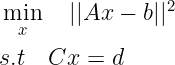
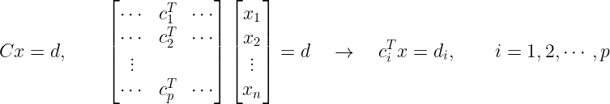
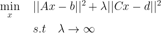
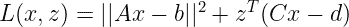
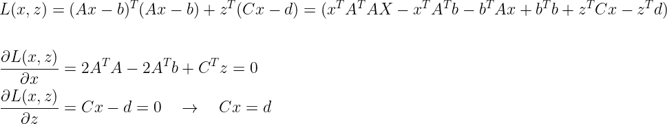
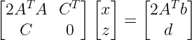
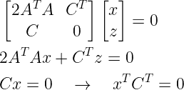
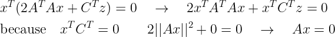
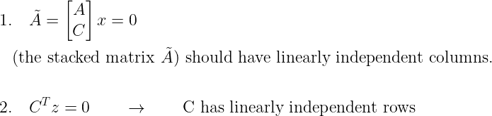
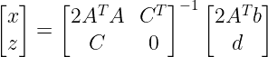

# 最小二乘估计的综合研究(三)

> 原文：<https://towardsdatascience.com/comprehensive-study-of-least-square-estimation-part-3-9ebefbbe8634?source=collection_archive---------35----------------------->

## 普通、约束、多目标和非线性最小二乘法

威尔·斯图尔特在 [Unsplash](https://unsplash.com?utm_source=medium&utm_medium=referral) 上拍摄的照片

这是“最小二乘估计的综合研究”系列文章的第三部分。在前两部分，我讨论了普通最小二乘和多目标最小二乘问题。如果您尚未阅读前两部分，您可以在此查看:

 [## 最小二乘估计的综合研究(上)

towardsdatascience.com](/comprehensive-study-of-least-square-estimation-part-1-32d24347f9e3)  [## 最小二乘估计的综合研究(下)

towardsdatascience.com](/comprehensive-study-of-least-square-estimation-part-2-8a0b5549c1) 

在本文中，我将讨论在机器学习、控制、信号处理和统计中经常出现的约束最小二乘问题。
和以前一样，我想鼓励你看看我的 YouTube 频道上关于数值线性代数和最优化(我有多个关于最小二乘法的视频)、随机过程和参数估计技术的完整系列视频。

 [## 马尼·塔达扬

### 关于数值线性代数、最优化、统计学、机器学习、编码等的教育视频。我的媒介…

www.youtube.com](https://www.youtube.com/channel/UCjNDIlqrFdKUgSeN9wV-OzQ) 

## 约束最小二乘法

约束最小二乘问题试图寻找线性约束最小二乘问题的解。问题的一般形式如下:

**图 1:约束最小二乘法**

在图 1 中，||Ax-b||称为目标函数，Cx = d 是线性约束集(与 C 的行数一样多)。a 是 m×n，C 是 p×n 矩阵。向量 x、b 和 d 分别是 n×1、m×1 和 p×1。线性约束可以写成如下的 p 个线性方程:

**图 2:线性约束**

我们称一个向量 x 为最优向量，如果它使目标函数最小，并且满足约束条件。

约束最小二乘问题也可以表述为多目标最小二乘问题，如下所示:

**图 3:作为多目标 LS 的约束 LS**

上述等式背后的逻辑如下:如果λ非常大，并且我们的目标是最小化两个目标函数的加权和，其中一个目标函数由λ加权。然后我们需要确定乘以λ的东西实际上是零。因此，Cx-d 的范数应该为零，因此 Cx = d。

## 最优性条件(拉格朗日乘数)

拉格朗日乘子是一种众所周知的解决约束优化问题的强大算法。在本文中，我们使用拉格朗日乘子法来驱动约束最小二乘问题的最优性条件。

假设我们的目标是使用拉格朗日乘数法解决图 1 中给出的一个问题。

*   首先，按如下方式构造拉格朗日函数:

**图 4:图 1** 的拉格朗日函数

其中 z 是 p×1 个拉格朗日乘数的向量。

*   将 L(x，z)相对于 x 和 z(原始变量和拉格朗日乘数)求微分，并将其设置为零。

**图 5:最优性条件**

*   最后，将所有内容以更紧凑的形式放在一起，得到了众所周知的约束最小二乘的最优性条件:

**图 6:约束 LS 的最优性条件**

最优性条件通常被称为 **KKT 条件。**图 6 左侧的矩阵称为 KKT 矩阵。

## 约束最小二乘解

为了找到最佳 x，我们倾向于求解图 6 中的矩阵向量方程。因此我们需要找到 KKT 矩阵可逆的条件。我们来看看维数:A 是 m x n，C 是 p x n 个矩阵，d 是 p x 1，b 是 m x 1 个向量。因此 KKT 矩阵是一个正方形(p + n) x (p + n)矩阵。为了找到可逆性的条件，我们对平凡的零空间或线性无关的列施加条件。

**图 7**

将图 7 中顶部的等式乘以 x 转置，并使用底部的等式得出以下结果:

**图 8:KKT 矩阵可逆的条件**

将图 7 和图 8 中的等式放在一起，我们得出 KKT 矩阵可逆的以下两个条件:

**图 9:KKT 矩阵可逆的条件**

**因此，KKT 矩阵可逆的条件是 A 和 C 的堆叠矩阵应该具有线性独立的列，C 应该具有线性独立的行**(请参考 YouTube 视频和关于矩阵和最小二乘法的讲座，以完整掌握这些概念)。

*   如果满足上述条件，则可以找到如下解决方案:

**图 10:受限 LS 的解决方案**

## 结论

在本文中，我讨论了约束最小二乘问题。在前两部分中(我讨论了普通最小二乘法和多目标最小二乘法问题，您可以在本文开头找到这些文章的链接)。

在下一部分，我将讨论非线性最小二乘问题。请务必订阅我的 YouTube 频道，获取更多视频和更详细的解释。