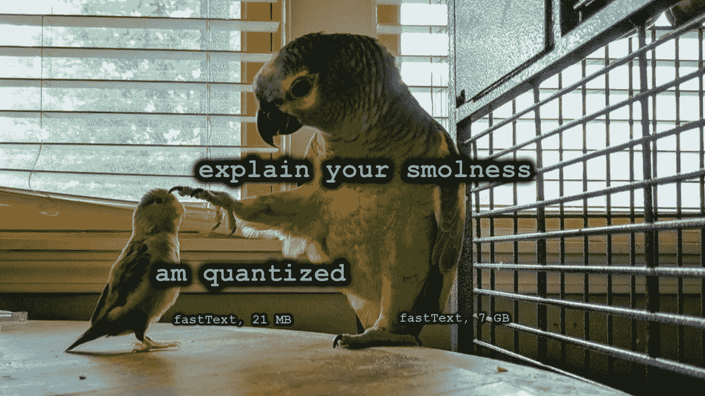
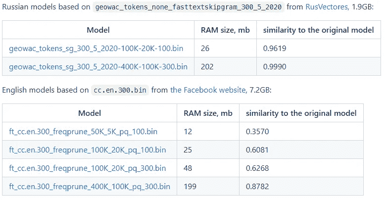
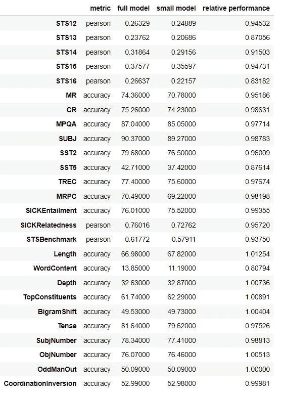

# 压缩无监督的快速文本模型

> 原文：<https://towardsdatascience.com/compressing-unsupervised-fasttext-models-eb212e9919ca?source=collection_archive---------15----------------------->

## 如何将单词嵌入模型减少 300 倍，同时在下游 NLP 任务上具有几乎相同的性能

[FastText](https://fasttext.cc/) 是一种将单词编码为数字向量的方法，由脸书于 2016 年开发。预训练的快速文本嵌入有助于解决文本分类或命名实体识别等问题，并且比 BERT 等深度神经网络更快、更易于维护。然而，典型的快速文本模型是非常巨大的:例如，[脸书](https://fasttext.cc/docs/en/crawl-vectors.html)的英语模型，解压缩后占据了 7GB 的磁盘空间。

在这篇文章中，我展示了 Python 包 [compress-fasttext](https://github.com/avidale/compress-fasttext) ，它可以将这个模型压缩到 21MB (x300！)在准确性上只有轻微的损失。这使得 fastText 在磁盘或内存有限的环境中更有用。



作者图片:利用 smolness 迷因制作 fastText(由[迷因库](https://www.meme-arsenal.com/create/template/3082202)生成)

在本文的第一部分，我展示了如何使用压缩的 fastText 模型。在第二部分，我解释了 fastText 及其压缩背后的一些数学原理。

# 怎么用？

## 使用现有模型

简单用`pip install compress-fasttext`就可以安装包了。它基于 fastText 的 [Gensim 实现，具有相同的接口。模型可以直接从 web 加载到 Python 中:](https://radimrehurek.com/gensim/models/fasttext.html)

```
import compress_fasttext
small_model = compress_fasttext.models.CompressedFastTextKeyedVectors.load(
'https://github.com/avidale/compress-fasttext/releases/download/v0.0.4/cc.en.300.compressed.bin')
```

您可以将这个模型视为一个字典，它将任何单词映射到它的 300 维向量表示(也称为[嵌入](https://lena-voita.github.io/nlp_course/word_embeddings.html)):

```
print(small_model['hello'])
# [ 1.847366e-01  6.326839e-03  4.439018e-03 ... -2.884310e-02]  
# a 300-dimensional numpy array
```

词义相近的词往往有相似的嵌入。因为嵌入是向量，它们的相似性可以用[余弦度量](https://en.wikipedia.org/wiki/Cosine_similarity)来评估。对于相关的单词(例如“猫”和“狗”)，余弦相似度接近 1，而对于不相关的单词，余弦相似度接近 0:

```
def cosine_sim(x, y):
    return sum(x * y) / (sum(x**2) * sum(y**2)) ** 0.5print(cosine_sim(small_model['cat'], small_model['cat']))
# 1.0print(cosine_sim(small_model['cat'], small_model['dog']))
# 0.6768642734684225print(cosine_sim(small_model['cat'], small_model['car']))
# 0.18485135055040858
```

实际上，你可以使用余弦相似度来查找一个单词的最近邻。例如，我们的压缩 fastText 模型知道 Python 是一种编程语言，并认为它类似于 PHP 和 Java。

```
print(small_model.most_similar('Python'))
# [('PHP', 0.5253), ('.NET', 0.5027), ('Java', 0.4897),  ... ]
```

在实际应用中，您通常将快速文本嵌入提供给其他模型。例如，您可以在 fastText 上训练一个分类器来区分可食用和不可食用的东西:

```
import numpy as np
from sklearn.pipeline import make_pipeline
from sklearn.linear_model import LogisticRegression
from sklearn.base import BaseEstimator, TransformerMixinclass FastTextTransformer(BaseEstimator, TransformerMixin):
    """ Convert texts into their mean fastText vectors """
    def __init__(self, model):
        self.model = model def fit(self, X, y=None):
        return self def transform(self, X):
        return np.stack([
            np.mean([self.model[w] for w in text.split()], 0)
            for text in X
        ])

classifier = make_pipeline(
    FastTextTransformer(model=small_model), 
    LogisticRegression()
).fit(
    ['banana', 'soup', 'burger', 'car', 'tree', 'city'],
    [1, 1, 1, 0, 0, 0]
)classifier.predict(['jet', 'cake'])
# array([0, 1])
```

## 有什么型号

一些英语和俄语的模型可以从[发布页面](https://github.com/avidale/compress-fasttext/releases/tag/gensim-4-draft)下载。对于英语，建议使用[25MB 型号](https://github.com/avidale/compress-fasttext/releases/download/gensim-4-draft/ft_cc.en.300_freqprune_100K_20K_pq_100.bin)，尺寸和精度平衡良好。



作者图片:[https://github . com/avidale/compress-fast text/releases/tag/gensim-4-draft](https://github.com/avidale/compress-fasttext/releases/tag/gensim-4-draft)截图。

如果你需要其他语言，你可以看看 Liebl Bernhard 的集合，它包含了 101 种语言的压缩快速文本模型。

## 压缩模型

如果您想要创建自己的压缩模型，您需要安装带有一些额外依赖项的库:

```
pip install compress-fasttext[full]
```

首先，您需要加载您将要压缩的模型。如果模型已经使用脸书包进行了训练，则按如下方式加载它:

```
from gensim.models.fasttext import load_facebook_model
big_model = load_facebook_model('path-to-original-model').wv
```

否则，如果模型是 Gensim 格式的，则将其加载为

```
import gensim
big_model = gensim.models.fasttext.FastTextKeyedVectors.load('path-to-original-model')
```

现在，您可以用三行代码压缩模型:

```
import compress_fasttext
small_model = compress_fasttext.prune_ft_freq(big_model, pq=True)
small_model.save('path-to-new-model')
```

如果您愿意，可以使用额外的参数来控制模型的大小:

```
small_model = compress_fasttext.prune_ft_freq(
    big_model, 
    new_vocab_size=20_000,   # number of words
    new_ngrams_size=100_000, # number of character ngrams
    pq=True,                 # use product quantization
    qdim=100,                # dimensionality of quantization
)
```

通过使用较小的词汇大小和维数，您创建了一个较小的模型，但相对于原始模型降低了其准确性。

# 它是如何工作的？

## 相关著作

最初的 fastText 库[确实支持模型压缩](https://fasttext.cc/blog/2017/10/02/blog-post.html#model-compression)(甚至有[一篇关于它的论文](https://arxiv.org/abs/1612.03651))，但是只针对在特定分类任务上训练的监督模型。另一方面， [compress-fastText](https://github.com/avidale/compress-fasttext) 用于无监督模型，提供可用于多项任务的单词向量。我的作品部分基于 Andrey Vasnetsov 2019 年的文章，部分基于俄罗斯 navec 图书馆。它最初是在我的俄语帖子中描述的[。](https://habr.com/ru/post/489474/)

## fastText 可以压缩到什么程度？

FastText 不同于其他单词嵌入方法，因为它将单词的嵌入与字符 n 元语法(即几个连续字符的序列)的嵌入相结合。单词和 n-grams 的嵌入被平均在一起。如果单词不在词汇表中，则它只由 n-grams 组成，这使得 fastText 可以顺利地处理拼写错误的单词、新词和具有丰富词法的语言。

以下伪代码演示了计算过程:

```
def embed(word, model):
    if word in model.vocab:
        result = model.vectors_vocab[word]
    else:
        result = zeros()
    n = 1
    for ngram in get_ngrams(word, model.min_n, model.max_n):
        result += model.vectors_ngrams[hash(ngram)]
        n += 1
    return result / n
```

正如你所看到的，所有的信息都来自两个矩阵，`vectors_vocab`和`vectors_ngrams`，这些矩阵占据了空间。大型矩阵的大小可以通过几种方式来减小:

*   删除矩阵中的大多数行，只保留最常用的单词和 n-gram；
*   存储精度较低的矩阵(`float16` 代替`float32`)；
*   将矩阵分成小块，对它们进行聚类，并存储相应聚类的 id，而不是每个块。这叫*产品量化；*
*   将矩阵因式分解为两个较小矩阵的乘积(不推荐，因为精度低)。

库 [compress-fasttext](https://github.com/avidale/compress-fasttext) 支持全部四种压缩方式，建议结合前三种。这就是方法`prune_ft_freq`实际做的事情。

## 压缩的型号够好吗？

为了确认压缩后模型仍然保留有用的信息，我们可以使用工具 [SentEval](https://github.com/facebookresearch/SentEval) 对它们进行评估。该工具包括 17 个下游任务，如短文本分类、文本间语义相似性评估和自然语言推理，以及 10 个诊断任务。对于每项任务，要么直接使用嵌入，要么在顶部使用小型线性模型。我修改了 [bow.py](https://github.com/facebookresearch/SentEval/blob/main/examples/bow.py) 示例以使用 fastText，并使用[完整的 7GB 英文版本](https://rusvectores.org/ru/models/)和[其 25MB 压缩版本](https://github.com/avidale/compress-fasttext/releases/tag/gensim-4-draft)来执行它。下表显示了两种模型在所有任务中的表现:



作者图片:SentEval 上的模型评估

平均而言，小型号的性能分数是全型号性能的 0.9579，而小型号几乎是全型号的 300 倍。这证实了如果由于某种原因不希望模型太大，那么压缩 fastText 模型并不是一个坏主意。

# 结论

FastText 是计算有意义的单词嵌入的一种很好的方法，但是典型的 fastText 模型的大小限制了它在移动设备或适度的免费主机上的使用。在 [compress-fastText](https://github.com/avidale/compress-fasttext) 中收集的方法允许将模型大小减少数百倍，而不会显著影响下游性能。我发布了一个[包](https://github.com/avidale/compress-fasttext)和[压缩模型](https://github.com/avidale/compress-fasttext/releases/tag/gensim-4-draft)，可以用来高效地解决各种 NLP 问题。

在未来，我计划发布更多的微型模型，例如[一个用于英语和俄语的 45MB BERT 模型](https://huggingface.co/cointegrated/rubert-tiny)。订阅，敬请关注！

这篇文章是由大卫·戴尔([https://daviddale.ru/en](https://daviddale.ru/en))写的，他是 NLP 的研究科学家和聊天机器人的开发者。

如果你在科学论文中提到这篇文章(或文章包),请注明出处:

```
@misc{dale_compress_fasttext, 
   author = "Dale, David",
   title  = "Compressing unsupervised fastText models", 
   editor = "towardsdatascience.com", 
   url    = "[https://towardsdatascience.com/eb212e9919ca](/eb212e9919ca)", 
   month  = {December},
   year   = {2021},   
   note = {[Online; posted 12-December-2021]},
}
```