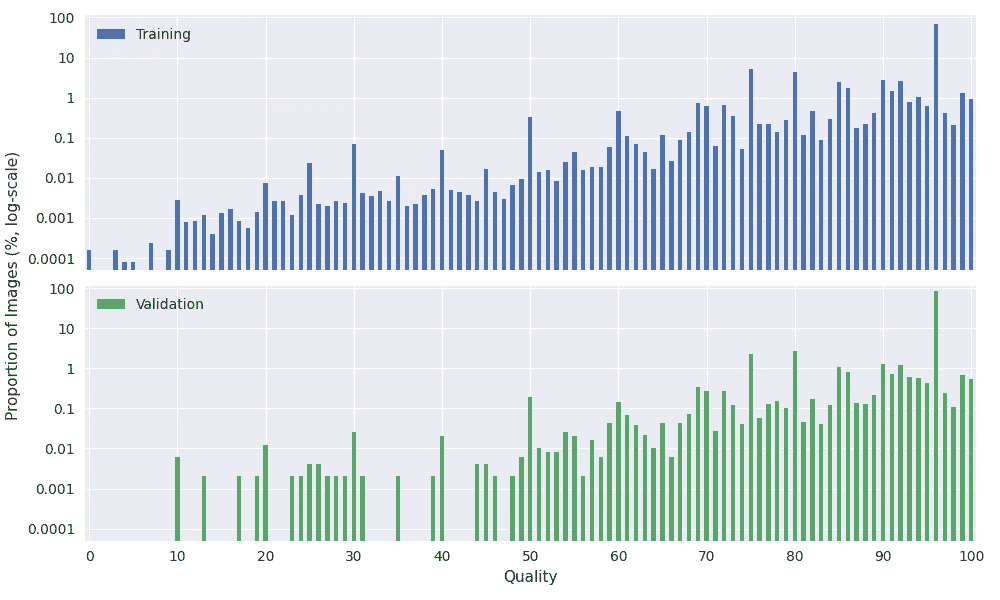

# ImageNet 数据集中的压缩

> 原文：<https://towardsdatascience.com/compression-in-the-imagenet-dataset-34c56d14d463?source=collection_archive---------20----------------------->

## [理解大数据](https://towardsdatascience.com/tagged/making-sense-of-big-data)

## 深度学习最受欢迎的基准测试的压缩设置

弗兰肯斯坦的数据集怪物？请继续阅读，寻找答案。图片作者。

我最近的一项任务是让更多的人思考有损压缩如何影响他们的深度学习模型[1]。在这个过程中，我花了很多时间使用 ImageNet [2]，它完全由 JPEG 文件组成，我开始注意到一些特殊的压缩设置。为了了解这些奇怪设置的系统性，我决定调查整个数据集的压缩设置。在这篇文章中，我报告了我所看到的，包括为什么我认为其中一些设置很奇怪，并展示了我为每个相关的压缩设置计算的统计数据。最后，我展示了通过绘制这些压缩设置的 2D 投影，实际上可以图形化地看到在 ImageNet 的创建过程中涉及到几个不同的来源。

# 方法学

为了检查图像，我使用了来自 [torchjpeg](https://queuecumber.gitlab.io/torchjpeg/api/torchjpeg.codec.html#torchjpeg.codec.read_coefficients) 的`read_coefficients`函数。这个函数直接从 JPEG 文件中读取 DCT 系数，不需要解码，允许我检查低层次的细节，比如色度二次采样和量化。这个过程揭示了训练集中的一个图像实际上根本不是 JPEG。这是一个 PNG，有人将其重命名为. JPEG 扩展名。处理训练集总共需要大约 4.5 小时，处理验证集大约需要 10 分钟。处理后，我绘制了结果。我已经在[这个要点](https://gitlab.com/-/snippets/2118212)中提供了所有的数据收集和绘图代码，以及全尺寸的 PDF 绘图。

请注意，所有图表上的 Y 轴都使用对数刻度。

# 概观

总的来说，ImageNet 中的大多数图像都是“轻度”压缩的，非常小。最常见的图像大小似乎是 500 乘 500 左右，尽管有一些异常值非常大或比例异常。例如，2592 乘 3888(非常大)的图像，或者 500 乘 33 的图像(比例奇怪)。这一点很重要，因为大多数人在预处理过程中将图像的大小调整为 224 乘 224，怪异的纵横比或大得多/小得多的图像会因重采样而产生伪像。

绝大多数图像是彩色图像，不是色度二次采样，而是以质量 96 进行量化。这表示压缩非常轻微，不会对图像产生明显影响。当然这里也有例外，比如 4:1:1 二次采样(非常差)和一些质量< 10 的图像(也非常差)。对于所有这些参数，训练集和测试集之间似乎也存在一些差异。

如果你对我上面使用的术语不熟悉，不要担心，当我们深入研究结果的细节时，我会解释一切。

# 那巴布亚新几内亚呢？

在我们继续之前:是的，“n02105855/n02105855_2933。JPEG”实际上是一个 PNG，有人把它重命名为. JPEG。下面是:

“n02105855/n02105855_2933。JPEG”图像鸣谢:ImageNet [2]。

在十六进制编辑器中打开它会非常清楚地显示出来:

大 oof。图片作者。

除了指出它比其他类似大小的图像大一个数量级，没有什么可说的了。

# 颜色

让我们从简单的开始，多少图像是彩色的，多少是灰度的。

颜色结果。图片作者。

相当简单，几乎所有的图像都是彩色的。关于这一点需要注意的是，JPEG 区分了用完全相同的三个颜色通道存储的灰度图像和用一个通道存储的实际灰度图像，我们在这里计算的是后者:加载时只返回一个通道的图像。

# 图像尺寸

接下来，让我们看看图像尺寸，这部分有一些最有趣的结果。图像大小很难可视化，用图形绘制它们很难理解(我确实有这些图形以及要点中的绘制代码)，所以我在热图上绘制了宽度和高度。因为它们很大，为了清晰起见，我把它们裁剪为 1000x1000(全尺寸热图是要点)。这是训练集:

训练集热图。图片作者。

该图中的每个像素代表一个大小，例如位置(10，70)处的像素显示宽度为 10、高度为 70 的图像的数量。更亮的颜色表示更多的图像。

我们可以看到一些有趣的行为。有一个明显的偏好宽度和高度为 500，以及其他一些间隔。从地图的左上角到右下角有一些有趣的对角线。这是同一张图片，但有些东西被贴上了标签:

培训热图已标注。图片作者。

为了使对角线的解释更容易，我覆盖了一组表示纵横比 1:1(红色)、4:3(绿色)和 3:2(蓝色)的线。

具有纵横比的训练热图。图片作者。

我们可以看到这些线对应着这些长宽比。1:1 和 4:3 有道理，但 3:2 我只从 35mm 胶片上知道，所以坦率地说，我很确定它是如何以如此大的数量出现在这里的。

让我们简单看一下验证集的相同热图:

验证集热图。图片作者。

它不仅明显更稀疏(事实上几乎所有的图像都在 500 宽或 500 高的区域)，而且长宽比也更合理。这是值得关注的，因为验证集中的大小分布并不反映训练集。

是时候举一些病理学的例子了。下面是一个来自训练集的小图像示例，其大小仅为 20 x 17:

“n07760859/n07760859_5275。JPEG "图像来源:ImageNet [2]

我不知道这应该是什么，缩放没有帮助，我怀疑你的神经网络也能解决这个问题。

这里有一个疯狂的长宽比，它是 500 乘 32:

“n04228054/n04228054_11471。JPEG "图像来源:ImageNet [2]

我觉得是滑雪板？调整到 224x224 大小后，无论有没有中间裁剪，看起来肯定会很奇怪:

“n04228054/n04228054_11471。JPEG”后居中裁剪和调整大小(左)和只调整大小(右)。图片来源:ImageNet [2]

# 色度子采样

接下来，我们可以看看色度二次采样设置。我将首先解释什么是色度二次采样，如果你熟悉，可以跳过这一部分，然后我将进入结果。

**什么是色度子采样？** 人类视觉对颜色的微小变化不如对亮度的微小变化敏感。JPEG 压缩利用这一点，通过对颜色信息进行二次采样来节省额外的空间，换句话说，它存储的颜色信息比亮度信息少。该算法通过将给出的标准 RGB 图像转换到 YCbCr 色彩空间来实现这一点。这个颜色空间将像素的亮度或*亮度*与颜色或*色度分开。*Y 通道存储亮度，并以全分辨率保存。Cb 和 Cr 通道存储颜色信息(大致分别为蓝色和红色),通常会进行下采样。

当我们谈论如何进行下采样时，我们使用以下符号:“4:a:b”。该方案指的是 4 列 2 行的像素块。“a”表示第一行中颜色样本的数量,“b”表示第二行中变化的这些样本的数量。因此，如果我们有 4:2:2 二次采样，我们说对于每 4 个亮度样本，第一行只有 2 个色度样本，第二行两者都发生变化。我们将此解释为色度通道的宽度是亮度通道的一半，但高度相同。

这个符号起初很奇怪，但是当你习惯于看它的时候就有意义了，在下一节讨论结果的时候，我会完整地解释这个方案的解释。

**结果**

色度子采样结果。图片作者。

上面你可以看到色度二次采样的结果。这里有几件有趣的事情需要注意，首先是绝大多数图像使用“4:4:4”，这意味着没有*子采样。大约 10%使用“4:2:0 ”,这意味着色度通道是宽度和高度的一半。这是实践中最常见的设置，因为它是许多 JPEG 实现中的默认设置，所以如果您正在部署一个将在真实图像上工作的系统，ImageNet 可能对您来说不够有代表性。*

真正突出的一点是“4:1:1”图像的数量。这是一个奇怪的问题(实践中不常见)，它表明色度通道的宽度只有亮度通道的 1/4(但高度相同)。这将导致图像出现非常明显的退化。还要注意的是，虽然它们仍然只占总图像的一小部分，但是在验证集中的这些图像比在训练集中的要多一个数量级。

这是一个来自训练集的 4:1:1 图像的示例

“n02445715/n02445715_2673。JPEG”。Image credit ImageNet [2]。

请注意，它看起来很糟糕，颜色很大程度上没有意义。

# 质量

对 JPEG 的大小和保真度影响最大的设置是其质量设置。这实际上是不标准的，但相当普遍，任何导出 JPEG 文件的人可能都熟悉这个滑块，它要求质量从 0 到 100。较低质量的图像看起来更差，但比高质量的图像小得多。和上一节一样，我将首先解释这个质量实际上是什么，然后我们来看看结果。

**什么是 JPEG 质量？** 当保存一个 JPEG 文件时，它实际上并不是存储像素，而是存储离散余弦变换(DCT)的系数。DCT 被应用于像素以产生变换系数，然后这些系数通过舍入被*量化*以节省空间。这种舍入是 JPEG 压缩中信息损失的主要来源，也是节省大部分空间的原因。本质上，质量用于控制舍入的数量，因此高质量意味着舍入越少，文件越大。JPEG 通过计算质量因子的矩阵来控制舍入，质量因子用于按元素划分系数。矩阵中较大的条目意味着除法运算后系数较小，因此需要更多的舍入。舍入允许将系数表示为整数，并创建连续的零和重复元素(较低熵表示)。

因为质量是非标准的，所以它不存储在 JPEG 文件中，并且估计质量并不总是简单的。我使用了[torch JPEG . quantization . ijg](https://queuecumber.gitlab.io/torchjpeg/api/torchjpeg.quantization.html#module-torchjpeg.quantization.ijg)库来计算每个图像从 0 到 100 的每个质量的量化矩阵，直到我找到一个与文件中存储的量化矩阵完全匹配的量化矩阵。这很耗时，而且只有在图像是用 libjpeg 压缩的情况下才有效，幸运的是它们都是。

**结果**

质量结果。图片作者。

以上是质量结果。我们可以看到质量为 96 的大峰值，表明绝大多数图像都是以这种质量压缩的。96 非常高，不会明显影响图像。这里要注意的有趣的事情是，在训练集中有一小部分非常低质量(通常小于 10)的图像，这些图像几乎会被压缩完全破坏。还要注意验证集的稀疏性，其中训练集覆盖了各种各样的质量(尽管比例很小)，这些通常不在验证集中表示。

这是训练集中质量为 3 的图像的示例。

“n02441942/n02441942_6428。JPEG "图像信用 ImageNet [2]

请注意，它只是有些可识别性，颜色基本上消失了。

# 探索图像的空间

有一件事立即引起了我的注意，那就是 ImageNet 似乎是由几个非常不同的来源组合而成的，有点像科学怪人的数据集。很明显，有一个源经过精心的压缩设置，将默认设置更改为 96 质量和 4:4:4 子采样，并使用 500 乘 500 的图像。然后还有一些其他的，看起来缺乏那种有意的设计，但是它们以足够的数量出现，以至于它们看起来以某种方式相关联。这可能得到了来自不同来源的单一图像的补充，这可以解释一些异常值。了解数据集历史的人可能会证实这一点。

我们实际上可以形象化地描述这一点。为此，我将压缩设置存储为 4D 向量(色度子采样类型、宽度、高度、质量)，并使用 UMAP [8]将它们投影到 2D 中。我在训练集上计算了一下，我只使用了 10%的宽度**或**高度为 500 的图像，因为这些图像往往会控制信号。这是我给一些非常清晰的集群着色后的样子:

突出显示突出集群的图像空间。图片作者。

检查这些集群给我们一个想法，为什么他们分组在一起。橙色群集仅包含以质量 96 压缩的大小为 500 x375 的图像，并且使用 4:4:4 色度子采样。绿色群集包含 375 乘 500 个图像(橙色群集的转置)，其他设置相同。红色群集也是一样的，但是有 333 乘 500 个图像。

接下来，让我们通过色度二次采样方案来给这些点着色

由色度子采样方案着色的图像空间。图片作者。

我们得到了一个很好的，清晰的，分离。黄色点为 4:2:0，紫色点为 4:4:4，其余介于两者之间。一个 4:2:2(蓝色)的群集出现在左侧，回头看上面的原始图，现在我们已经确定了它，这个群集更加突出。

按质量给点着色给出了另一个有趣的结果

按质量着色的图像空间。图片作者。

我们可以看到较低的质量在右下方得到了很好的体现。这是 4:2:0 色度二次采样非常突出的同一区域。

如果我不得不根据这些图来猜测，我会说左手边较小的聚类代表一些初始数据来源。它们有相似的参数，只是尺寸不同，而且数量很少。在它们的左侧是从其他来源收集的图像，但具有相似的参数。右手边代表数据收集方法的巨大变化，代表了非常不同的参数。对此要有所保留，因为像 UMAP 这样的投影技术并不能保证完美地模拟空间，这只是我的推测。

# 结论

尽管 ImageNet 仍然是最受欢迎的计算机视觉数据集，但它的标签[3，4]，它的广泛使用[5]及其潜在的社会影响[6，7]已经逐渐为人所知。我想回应这些担忧，同时提出我自己的一个担忧:数据质量。在我最近的论文[1]中，我展示了压缩设置会对深层网络产生巨大的、有时是意想不到的影响。虽然大多数压缩都是轻量级的，但有足够多的离群值值得关注，并且在训练集和验证集之间存在差异。此外，图像大小变化很大，并且包含极端的纵横比，这可能会在调整图像大小以输入到网络时造成问题。基于这一分析，我强烈建议您在下次考虑使用 ImageNet 时考虑这些问题以及它们是否会影响您的性能。这并不是说 ImageNet 在客观上是一个糟糕的数据集，它多年来为社区提供了很好的服务，在某些情况下，它甚至可能有助于这种变化。但是，随着深度学习发展成为一门更精确的科学，对这些问题采取积极的方法并尽早确定它们对您的特定应用是否重要是很好的。

# 确认

这篇文章的灵感来自于我的研究[1],该研究得到了美国国防高级研究计划局医学研究中心、美国国防高级研究计划局塞马福尔和脸书·艾的独立资助。我还要感谢我的合著者，UMD 的 Abhinav Shrivastava 教授和 Larry Davis 教授以及脸书 AI 的 Ser-Nam Lim 博士所做的贡献。

# 参考

1.  分析和减轻深度学习中的压缩缺陷。arXiv 预印本 arXiv:2011.08932 (2020)。
2.  邓，贾，等，“Imagenet:一个大规模的层次图像数据库”2009 年 IEEE 计算机视觉和模式识别会议。Ieee，2009 年。
3.  拜尔、卢卡斯等人,《我们对 ImageNet 的使用结束了吗？."arXiv 预印本 arXiv:2006.07159 (2020)。
4.  云，桑都，等。“重新标记图像网络:从单标签到多标签，从全球到本地化标签。”arXiv 预印本 arXiv:2101.05022 (2021)。
5.  塔格纳、卢卡斯、于尔根·施密德胡伯和蒂洛·施塔代尔曼。“在 imagenet 上优化 cnn 架构是否足够？."arXiv 预印本 arXiv:2103.09108 (2021)。
6.  Birhane、Abeba 和 Vinay Uday Prabhu。“大型图像数据集:计算机视觉得不偿失的胜利？."IEEE/CVF 计算机视觉应用冬季会议录。2021.
7.  杨，，等，〈图像网络中的人脸混淆技术研究〉。arXiv 预印本 arXiv:2103.06191 (2021)。
8.  麦金尼斯、利兰、约翰·希利和詹姆斯·梅尔维尔。"统一流形逼近和投影降维."arXiv 预印本 arXiv:1802.03426 (2018)。