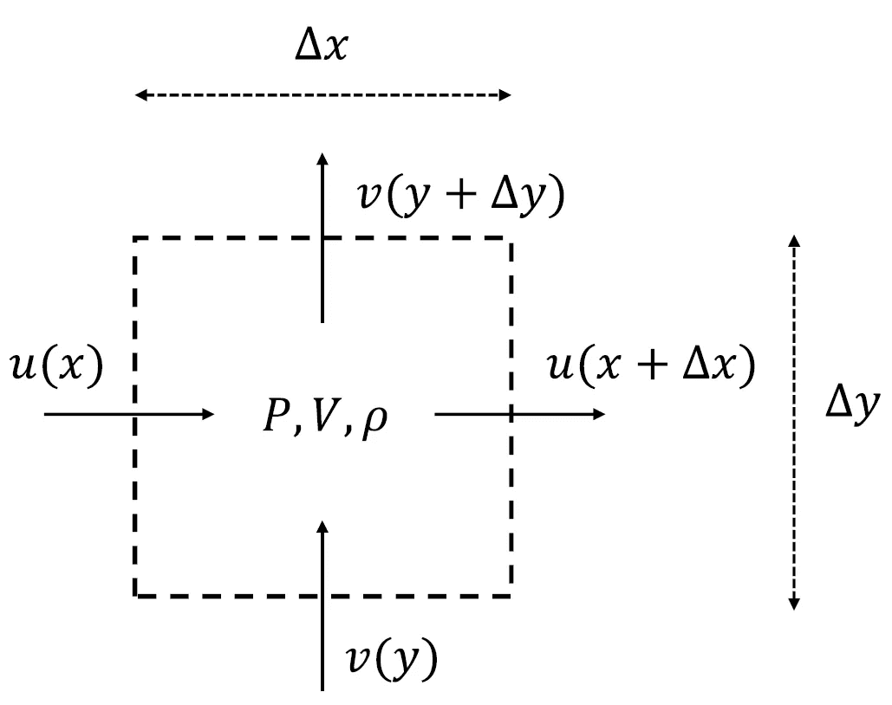
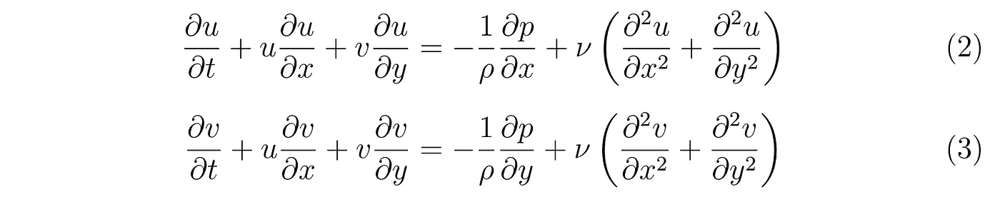
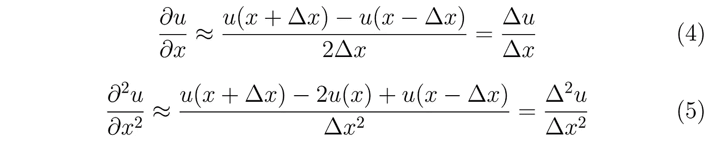
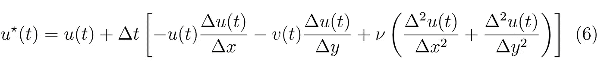
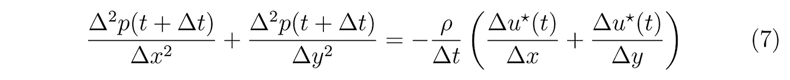
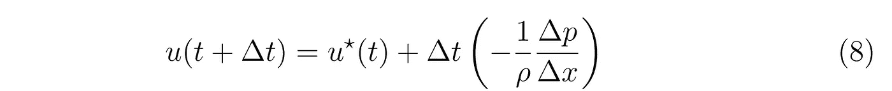
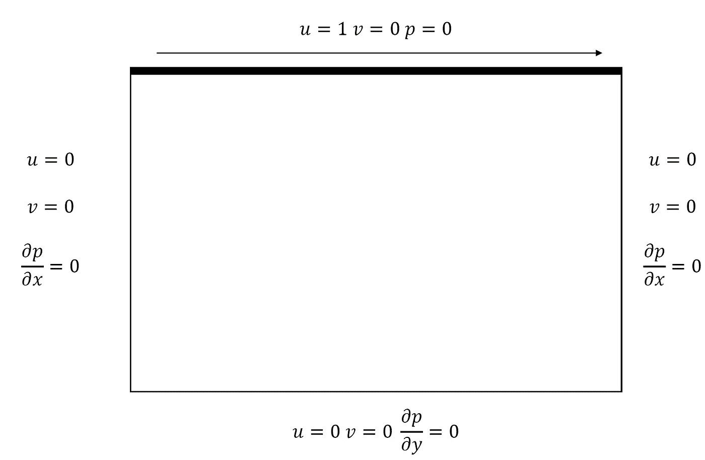
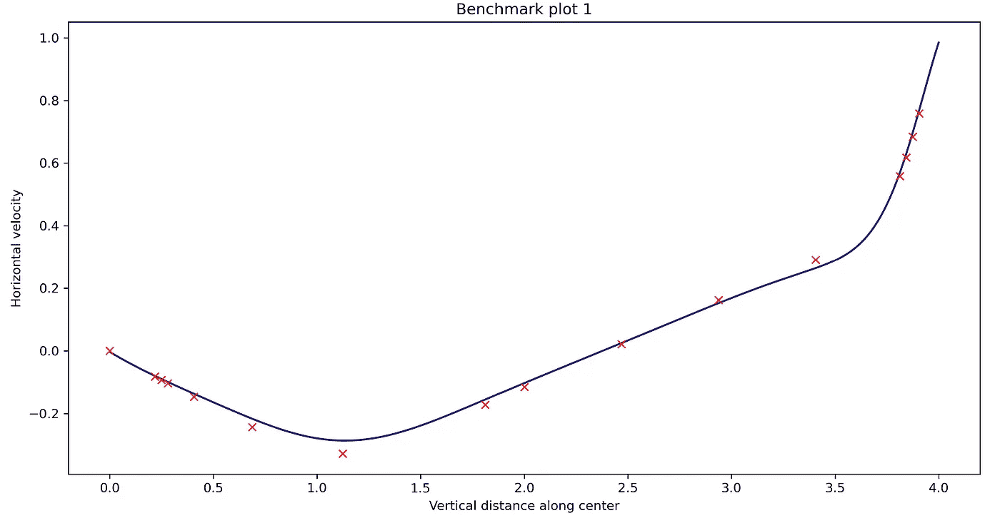
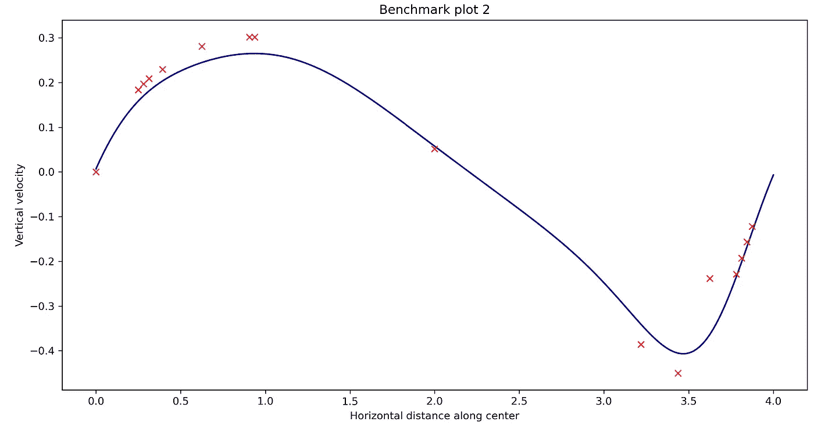

# 使用 Python 的计算流体动力学:层流建模

> 原文：<https://towardsdatascience.com/computational-fluid-dynamics-using-python-modeling-laminar-flow-272dad1ebec?source=collection_archive---------0----------------------->

## 结晶器的流体力学

## 使用有限差分法求解单相层流的 2D 纳维尔-斯托克斯方程，并使用基准 lid 空腔试验验证结果


照片由 [Unsplash](https://unsplash.com?utm_source=medium&utm_medium=referral) 上的 [Amadej Tauses](https://unsplash.com/@amadejtauses?utm_source=medium&utm_medium=referral) 拍摄

这是结晶器的*流体力学系列文章的第一篇。该系列将涵盖化学反应器中的流体动力学、传热、传质和结晶的建模。为了简化教程，模型构建将分阶段进行，首先创建层流流体解算器(文章 1)，添加热量和质量传递组件(文章 2)，最后求解种群平衡模型以模拟结晶(文章 3)。*

本代码是在两个信息丰富的参考文献的帮助下编写的 Lorena Barba 教授的[“Navier Stokes 的 12 个步骤”](https://lorenabarba.com/blog/cfd-python-12-steps-to-navier-stokes/)和 Mark Owkes 教授的[“编写第一个 CFD 解算器的指南”](https://www.montana.edu/mowkes/research/source-codes/GuideToCFD_2020_02_28_v2.pdf)。如果您已经熟悉流体力学背后的理论和数学，并且想要浏览代码，您可以跳到本文的第 5 节。

# 1.介绍

流体流动可以在许多自然现象中观察到，从舒缓的瀑布到恼人的咖啡溅到你的电脑键盘上。你在看完你被毁坏的键盘上的咖啡后的第一个想法可能不是“多有趣啊！”但是从另一方面来说，从悬崖上流下的平静而又动态的水自然会唤起一种奇妙的感觉。我们能理解这些情况下的流体流动吗？我们能预测流体在特定条件下如何运动吗？更重要的是，我们能防止未来的咖啡飞溅吗？

回答这些问题的一种方法是在实验室中用实际的流体进行实验，并使用各种成像仪器研究它们的流动特性。这是实验方法。另一种方法包括编写一组可以描述流体流动的方程，应用一组简化的假设和条件，执行一些数学魔术，并推导出一个控制方程，在输入正确的值后，该方程可以为您提供预测流动动态的能力。这是分析方法。

然而，随着计算能力的增加，出现了第三种方法来回答这些问题——数值方法。虽然描述流体流动的方程组对于任意一组条件都是解析不可解的，但是如果你有一台足够强大的计算机，它们的输出肯定是可以计算的。使用这种方法在计算机上研究流体流动的动力学通常被称为计算流体动力学(CFD)。

# 2.控制方程

那么，这一组能完整描述一种流体如何流动，它们从何而来的方程组是什么呢？在回答前一个问题之前，我们先讨论后一个问题。

考虑一个空间体积固定的 2D 盒子。这就是我们所说的*控制体积。*



图 1:控制音量

首先，我们将把*质量守恒*的原理应用于*控制容积*中的流体。对于不可压缩的流体(大多数液体)，这意味着无论什么流体进入盒子都必须离开它。这在流体力学中被称为*连续性方程*。


其次，我们将把*动量守恒*的原理应用到*控制体积上。*与之前的情况相比，这稍微更抽象和复杂，但最终，这简化为不可压缩的*纳维尔-斯托克斯方程。*



如果我们能够在应用必要的边界条件后同时求解这些偏微分方程(PDEs ),我们将获得作为时间函数的瞬时速度和压力，从而允许我们预测流体将如何流动。然而，在不应用简化假设的情况下，没有解析方法来求解这些方程(以它们的完整形式)。因此，我们求助于数值技术来求解这些方程。

# 3.数值方法

有各种不同的数值方法来解决偏微分方程，每一个都有自己的一套警告。最简单的方法是有限差分法，其中使用低阶泰勒级数近似将 PDEs 转换为一组代数方程。下面给出一个例子，说明如何将一阶和二阶导数转换成它们的有限差分近似。



虽然这不是在所有情况下模拟流体流动的最佳方法，但我们将继续使用它，因为它简化了结晶器模拟的其他方面，这是本系列文章的最终目标。对于更严格的数值处理，你可能想使用有限体积或有限元方法。

# 4.代码的组织

代码被组织成三个不同的文件或脚本。第一个“FlowPy.py”包含使用有限差分法对一般输入集求解 PDEs 的代码。使用作为用户界面的“FlowPy_Input.py”脚本向该脚本提供输入。最后，“FlowPy_Visualizer.py”脚本用于在运行模拟后制作流的动力学动画。

# 5.模拟代码——flow py

用 Python 编写代码的一个优点是，我们可以利用面向对象编程(OOP)来组织和简化代码。这也将使增加传热和传质扩展变得非常简单。因此，代码被组织成各种类和对这些类的对象进行操作的函数。将第 5 节中的代码保存到名为 *FlowPy.py* 的文件中

## 步骤 1:导入所需的模块

需要以下模块— *numpy* 和 *os。*就是这样！

```
import numpy as np
import os
```

## 步骤 2:构建类

我们从边界条件开始，为问题的特定属性创建类。通过应用某些边界条件来求解偏微分方程，这些边界条件指示了流体在区域边界的行为。例如，流过管道的流体将具有零流体速度的壁，以及具有某一特定流速的入口和出口。

数学上，边界条件可以用两种形式表示——狄利克雷和诺依曼边界。前者指定因变量在边界处的值，而后者指定因变量在边界处的导数的值。

因此，我们创建了一个*边界*类，它有两个属性——类型和值。

```
class Boundary:
    def __init__(self,boundary_type,boundary_value):
        self.DefineBoundary(boundary_type,boundary_value)

    def DefineBoundary(self,boundary_type,boundary_value):
        self.type=boundary_type
        self.value=boundary_value
```

接下来，由边界包围的区域(如管道内部)使用 2D 网格或栅格表示，在栅格中的盒子中心(压力)或盒子表面(速度)计算因变量的值。这被称为交错网格方法。为了表示网格，我们创建了一个名为 *Space 的类。*方法 *CreateMesh* 为因变量创建一个给定大小的矩阵，方法 *SetDeltas* 根据指定的域长度和宽度计算差分长度的值。

```
class Space:
    def __init__(self):
        pass

    def CreateMesh(self,rowpts,colpts):
        #Domain gridpoints
        self.rowpts=rowpts
        self.colpts=colpts #Velocity matrices
        self.u=np.zeros((self.rowpts+2,self.colpts+2))
        self.v=np.zeros((self.rowpts+2,self.colpts+2))
        self.u_star=np.zeros((self.rowpts+2,self.colpts+2))
        self.v_star=np.zeros((self.rowpts+2,self.colpts+2))
        self.u_next=np.zeros((self.rowpts+2,self.colpts+2))
        self.v_next=np.zeros((self.rowpts+2,self.colpts+2))
        self.u_c=np.zeros((self.rowpts,self.colpts))
        self.v_c=np.zeros((self.rowpts,self.colpts))) #Pressure matrices
        self.p=np.zeros((self.rowpts+2,self.colpts+2))
        self.p_c=np.zeros((self.rowpts,self.colpts)) #Set default source term
        self.SetSourceTerm()        

    def SetDeltas(self,breadth,length):
        self.dx=length/(self.colpts-1)
        self.dy=breadth/(self.rowpts-1) def SetInitialU(self,U):
        self.u=U*self.u

    def SetInitialV(self,V):
        self.v=V*self.v

    def SetInitialP(self,P):
        self.p=P*self.p def SetSourceTerm(self,S_x=0,S_y=0):
        self.S_x=S_x
        self.S_y=S_y
```

最后，我们创建一个类*流体*来表示流体的属性——比如密度(*ρ*)和粘度(*μ*)。

```
class Fluid:
    def __init__(self,rho,mu):
        self.SetFluidProperties(rho,mu)

    def SetFluidProperties(self,rho,mu):
        self.rho=rho
        self.mu=mu
```

## 步骤 3:编写函数来实现有限差分法

如前一节所述，我们首先编写函数，在 2D 域的左、右、上、下边界实现水平速度( *u* )、垂直速度( *v* )和压力( *p* )的边界条件。该函数将接受*空间*和*边界*类的对象，并根据这些对象的属性设置边界条件。例如，如果将类型为 Dirichlet 且值为 0 的*边界*对象作为左边界对象传递，该函数将在左边界设置该条件。

```
#Note: The arguments to the function are all objects of our defined classes
#Set boundary conditions for horizontal velocity
def SetUBoundary(space,left,right,top,bottom):
    if(left.type=="D"):
        space.u[:,0]=left.value
    elif(left.type=="N"):
        space.u[:,0]=-left.value*space.dx+space.u[:,1]

    if(right.type=="D"):
        space.u[:,-1]=right.value
    elif(right.type=="N"):
        space.u[:,-1]=right.value*space.dx+space.u[:,-2]

    if(top.type=="D"):
        space.u[-1,:]=2*top.value-space.u[-2,:]
    elif(top.type=="N"):
        space.u[-1,:]=-top.value*space.dy+space.u[-2,:]

    if(bottom.type=="D"):
        space.u[0,:]=2*bottom.value-space.u[1,:]
    elif(bottom.type=="N"):
        space.u[0,:]=bottom.value*space.dy+space.u[1,:] #Set boundary conditions for vertical velocity
def SetVBoundary(space,left,right,top,bottom):
    if(left.type=="D"):
        space.v[:,0]=2*left.value-space.v[:,1]
    elif(left.type=="N"):
        space.v[:,0]=-left.value*space.dx+space.v[:,1]

    if(right.type=="D"):
        space.v[:,-1]=2*right.value-space.v[:,-2]
    elif(right.type=="N"):
        space.v[:,-1]=right.value*space.dx+space.v[:,-2]

    if(top.type=="D"):
        space.v[-1,:]=top.value
    elif(top.type=="N"):
        space.v[-1,:]=-top.value*space.dy+space.v[-2,:]

    if(bottom.type=="D"):
        space.v[0,:]=bottom.value
    elif(bottom.type=="N"):
        space.v[0,:]=bottom.value*space.dy+space.v[1,:]#Set boundary conditions for pressure
def SetPBoundary(space,left,right,top,bottom):
    if(left.type=="D"):
        space.p[:,0]=left.value
    elif(left.type=="N"):
        space.p[:,0]=-left.value*space.dx+space.p[:,1]

    if(right.type=="D"):
        space.p[1,-1]=right.value
    elif(right.type=="N"):
        space.p[:,-1]=right.value*space.dx+space.p[:,-2]

    if(top.type=="D"):
        space.p[-1,:]=top.value
    elif(top.type=="N"):
        space.p[-1,:]=-top.value*space.dy+space.p[-2,:]

    if(bottom.type=="D"):
        space.p[0,:]=bottom.value
    elif(bottom.type=="N"):
        space.p[0,:]=bottom.value*space.dy+space.p[1,:]
```

在我们写有限差分函数之前，我们需要确定一个时间步长来推进模拟。为了确保有限差分法的收敛性，Courant-Friedrichs-Lewy(CFL)标准提供了时间步长的上限，该上限被设置为使用 *SetTimeStep* 函数进行模拟的时间步长。遵循 CFL 准则可确保在一个时间步长内传播的信息不会超过两个网格元素之间的距离。

```
def SetTimeStep(CFL,space,fluid):
    with np.errstate(divide='ignore'):
        dt=CFL/np.sum([np.amax(space.u)/space.dx,\
                           np.amax(space.v)/space.dy])
    #Escape condition if dt is infinity due to zero velocity initially
    if np.isinf(dt):
        dt=CFL*(space.dx+space.dy)
    space.dt=dt
```

确定时间步长后，我们现在准备实施有限差分方案。为了同时求解*连续性方程*和*纳维尔-斯托克斯方程*，我们使用了预测-校正方案，包括以下步骤(更多信息请参考本[指南](https://www.montana.edu/mowkes/research/source-codes/GuideToCFD_2020_02_28_v2.pdf)):

*   从无压力影响的初始速度计算星形速度( *u*和 v*)* 。



*   使用星形速度迭代求解压力泊松方程。



*   根据压力和星形速度计算下一个时间步长的速度。



我们定义了三个不同的函数来执行这三个步骤中的每一步。

此外，定义了一个便利函数，将边界内的速度和压力保存到新变量中，然后可以将这些变量写入文本文件。

```
def SetCentrePUV(space):
    space.p_c=space.p[1:-1,1:-1]
    space.u_c=space.u[1:-1,1:-1]
    space.v_c=space.v[1:-1,1:-1]
```

最后，我们定义了两个用于 I/O 目的的函数— *MakeResultDirectory* 创建一个名为“Result”的目录来存储文本文件，以及 *WriteToFile* 每隔几次迭代(使用 *interval* 参数指定)将变量的值保存到一个文本文件中。

```
def MakeResultDirectory(wipe=False):
    #Get path to the Result directory
    cwdir=os.getcwd()
    dir_path=os.path.join(cwdir,"Result") #If directory does not exist, make it
    if not os.path.isdir(dir_path):
        os.makedirs(dir_path,exist_ok=True)
    else:
        #If wipe is True, remove files present in the directory
        if wipe:
            os.chdir(dir_path)
            filelist=os.listdir()
            for file in filelist:
                os.remove(file)

    os.chdir(cwdir)

def WriteToFile(space,iteration,interval):
    if(iteration%interval==0):
        dir_path=os.path.join(os.getcwd(),"Result")
        filename="PUV{0}.txt".format(iteration)
        path=os.path.join(dir_path,filename)
        with open(path,"w") as f:
            for i in range(space.rowpts):
                for j in range(space.colpts):
                    f.write("{}\t{}\t{}\n".format(space.p_c[i,j],space.u_c[i,j],space.v_c[i,j]))
```

模拟代码部分到此结束。接下来，我们需要编写一个用户界面——即一个脚本，用户可以在其中提供各种输入，如边界条件、初始条件和流体属性。该脚本还将调用 *FlowPy.py* 文件中定义的函数，并运行模拟。

# 6.模拟用户界面— FlowPy_Input

这一节比前一节短——大部分繁重的工作已经完成，我们现在只需要利用所有已定义的类和函数来运行模拟！将第 6 节中的代码保存到名为 *FlowPy_Input.py* 的文件中

首先，我们导入所需的模块，这包括了我们在 *FlowPy.py* 中定义的所有东西

```
import sys
import numpy as np
import matplotlib.pyplot as plt
import matplotlib.cm as cm
from FlowPy import *
```

例如，在本教程中输入了与盖腔试验(雷诺数=400)相关的输入。在这个试验中，流体被保存在一个有三面刚性墙的 2D 盒中，第四面墙(或盖子)以匀速移动。一旦达到稳定状态，就可以将发展流场的统计数据与基准进行比较。



图 2:盖腔问题设置

我们首先指定描述域的输入变量，然后用这些变量创建一个*空间*对象。

```
#### SPATIAL AND TEMPORAL INPUTS
length=4 #Length of computational domain in the x-direction
breadth=4 #Breadth of computational domain in the y-direction
colpts=257 #Number of grid points in the x-direction #KEEP ODD
rowpts=257 #Number of grid points in the y-direction #KEEP ODD#Create an object of the class Space called cavity
cavity=Space()
cavity.CreateMesh(rowpts,colpts)
cavity.SetDeltas(breadth,length)
```

接下来，指定流体的密度和粘度，并创建一个类*流体*的对象。

```
#### FLUID PROPERTIES
rho=1 #Density of fluid
mu=0.01 #Viscosity of fluid#Create an object of the class Fluid called water
water=Fluid(rho,mu)
```

第三，我们创建*边界*对象来设置速度和压力边界条件。

```
#### BOUNDARY SPECIFICATIONS
u_in=1 #Lid velocity
v_wall=0 #Velocity of fluid at the walls
p_out=0 #Gauge pressure at the boundaries#Create objects of the class Boundary having either Dirichlet ("D") or Neumann ("N") type boundaries
flow=Boundary("D",u_in)
noslip=Boundary("D",v_wall)
zeroflux=Boundary("N",0)
pressureatm=Boundary("D",p_out)
```

最后，指定模拟参数和标志来控制模拟时间、保存文本文件等等。

```
#### SIMULATION PARAMETERS
time=150 #Simulation time
CFL_number=0.8 #Reduce this if solution diverges
file_flag=1 #Keep 1 to print results to file
interval=100 #Record values in file per interval number of iterations
```

现在，我们可以编写循环来运行模拟。一般程序如下。在模拟时间完成之前，在每次迭代中执行以下操作:

*   根据 CFL 数标准设置时间步长
*   设置边界条件
*   计算星形速度
*   求解压力泊松方程得到压力场
*   确定下一时间步的速度
*   将结果写入文件(如果文件标志为 1)
*   将时间提前一个等于时间步长的值

```
#### RUN SIMULATION# Print general simulation information
print("######## Beginning FlowPy Simulation ########")
print("#############################################")
print("# Simulation time: {0:.2f}".format(time))
print("# Mesh: {0} x {1}".format(colpts,rowpts))
print("# Re/u: {0:.2f}\tRe/v:{1:.2f}".format(rho*length/mu,rho*breadth/mu))
print("# Save outputs to text file: {0}".format(bool(file_flag)))## Initialization
# Make directory to store results
MakeResultDirectory(wipe=True)# Initialize counters
t=0
i=0## Run
while(t<time):
    #Print time left
    sys.stdout.write("\rSimulation time left: {0:.2f}".format(time-t))
    sys.stdout.flush() #Set the time-step
    SetTimeStep(CFL_number,cavity,water)
    timestep=cavity.dt

    #Set boundary conditions
    SetUBoundary(cavity,noslip,noslip,flow,noslip)
    SetVBoundary(cavity,noslip,noslip,noslip,noslip)
    SetPBoundary(cavity,zeroflux,zeroflux,pressureatm,zeroflux)    #Calculate starred velocities
    GetStarredVelocities(cavity,water)

    #Solve the pressure Poisson equation
    SolvePressurePoisson(cavity,water,zeroflux,zeroflux,\
pressureatm,zeroflux) #Solve the momentum equation
    SolveMomentumEquation(cavity,water) #Save variables and write to file
    SetCentrePUV(cavity)
    if(file_flag==1):
        WriteToFile(cavity,i,interval) #Advance time-step and counter
    t+=timestep
    i+=1
```

至此，我们已经准备好为任何广义输入集运行模拟。这个难题只剩下一个部分了——可视化工具。

# 7.可视化工具— FlowPy_Visualizer

运行模拟后生成的文本文件包含原始数字，这些数字本身可能无法提供流体流动的物理图像。然而，一个简单的动画等高线图可以用来结合三个变量——水平速度、垂直速度和压力——并以直观的方式显示它们的时间演变。将此代码保存在一个名为“FlowPy_Visualizer.py”的单独文件中。

和前面一样，首先导入所需的模块。特别是，我们将需要 *matplotlib.animation* 模块来录制动画。

```
import numpy as np
import sys
import os
import matplotlib.pyplot as plt
import matplotlib.animation as animation
```

为了确保创建适当大小的阵列，需要输入与计算域相关的模拟输入。

```
#### Simulation inputs
rowpts=257
colpts=257
length=4
breadth=4
```

在移至出图之前，必须将模拟过程中保存的文本文件作为数组导入。为此，我们首先遍历*结果*目录，存储所有文件名，并确定文件总数以及打印间隔。

```
#Go to the Result directory
cwdir=os.getcwd()
dir_path=os.path.join(cwdir,"Result")
os.chdir(dir_path)#Go through files in the directory and store filenames
filenames=[]
iterations=[]
for root,dirs,files in os.walk(dir_path):
    for datafile in files:
        if "PUV" in datafile:
            filenames.append(datafile)
            no_ext_file=datafile.replace(".txt","").strip()
            iter_no=int(no_ext_file.split("V")[-1])
            iterations.append(iter_no)#Discern the final iteration and interval
initial_iter=np.amin(iterations)            
final_iter=np.amax(iterations)
inter=(final_iter - initial_iter)/(len(iterations)-1)
number_of_frames=len(iterations)
sorted_iterations=np.sort(iterations)
```

接下来，我们定义一个函数，它可以使用 *numpy 中的 *loadtxt* 函数将文本文件——基于提供的迭代——导入到一个数组中。*

```
def read_datafile(iteration):
    #Set filename and path according to given iteration
    filename="PUV{0}.txt".format(iteration)
    filepath=os.path.join(dir_path,filename) #Load text file as numpy array
    arr=np.loadtxt(filepath,delimiter="\t")
    rows,cols=arr.shape #Define empty arrays for pressure and velocities
    p_p=np.zeros((rowpts,colpts))
    u_p=np.zeros((rowpts,colpts))
    v_p=np.zeros((rowpts,colpts)) #Organize imported array into variables
    p_arr=arr[:,0]
    u_arr=arr[:,1]
    v_arr=arr[:,2]

    #Reshape 1D data into 2D
    p_p=p_arr.reshape((rowpts,colpts))
    u_p=u_arr.reshape((rowpts,colpts))
    v_p=v_arr.reshape((rowpts,colpts))

    return p_p,u_p,v_p
```

是时候开始制作剧情了！在制作图形动画之前，制作一个初始图(用于第 0 次迭代)是一个好主意，这样图形的尺寸、轴、颜色条等都可以固定。此外，用更少的网格点(在本文中是 10 个)绘制流图是一个好主意，这样可以区分箭头。

```
#Create mesh for X and Y inputs to the figure
x=np.linspace(0,length,colpts)
y=np.linspace(0,breadth,rowpts)
[X,Y]=np.meshgrid(x,y)#Determine indexing for stream plot (10 points only)
index_cut_x=int(colpts/10)
index_cut_y=int(rowpts/10)#Create blank figure
fig=plt.figure(figsize=(16,8))
ax=plt.axes(xlim=(0,length),ylim=(0,breadth))#Create initial contour and stream plot as well as color bar
p_p,u_p,v_p=read_datafile(0)
ax.set_xlim([0,length])
ax.set_ylim([0,breadth])
ax.set_xlabel("$x$",fontsize=12)
ax.set_ylabel("$y$",fontsize=12)
ax.set_title("Frame No: 0")
cont=ax.contourf(X,Y,p_p)
stream=ax.streamplot(X[::index_cut_y,::index_cut_x],Y[::index_cut_y,::index_cut_x],u_p[::index_cut_y,::index_cut_x],v_p[::index_cut_y,::index_cut_x],color="k")
fig.colorbar(cont)
fig.tight_layout()
```

为了进一步制作这个情节的动画，matplotlib.animation 中的 *FuncAnimation* 函数将派上用场。它所需要的只是一个函数，可以为迭代提供的值创建一个图。我们定义这样一个函数叫做 *animate* 。

```
def animate(i): #Print frames left to be added to the animation
    sys.stdout.write("\rFrames remaining: {0:03d}".format(len(sorted_iterations)-i))
    sys.stdout.flush() #Get iterations in a sequential manner through sorted_iterations
    iteration=sorted_iterations[i] #Use the read_datafile function to get pressure and velocities
    p_p,u_p,v_p=read_datafile(iteration) #Clear previous plot and make contour and stream plots for current iteration
    ax.clear()
    ax.set_xlim([0,length])
    ax.set_ylim([0,breadth])
    ax.set_xlabel("$x$",fontsize=12)
    ax.set_ylabel("$y$",fontsize=12)
    ax.set_title("Frame No: {0}".format(i))
    cont=ax.contourf(X,Y,p_p)
    stream=ax.streamplot(X[::index_cut_y,::index_cut_x],\
                         Y[::index_cut_y,::index_cut_x],\
                         u_p[::index_cut_y,::index_cut_x],\
                         v_p[::index_cut_y,::index_cut_x],\
                         color="k")
    return cont,stream
```

最后，是时候保存动画并观看一些流体在您的计算机上跳舞了！

```
print("######## Making FlowPy Animation ########")
print("#########################################")
anim=animation.FuncAnimation(fig,animate,frames=number_of_frames,interval=50,blit=False)
movie_path=os.path.join(dir_path,"FluidFlowAnimation.mp4")
anim.save(r"{0}".format(movie_path))
print("\nAnimation saved as FluidFlowAnimation.mp4 in Result")
```

首先运行 *FlowPy_Input.py* 生成模拟数据，然后运行 *FlowPy_Visualizer.py* 保存模拟视频。

# 8.结果

下图显示了 Re=400 时盖子空腔基准的动画轮廓和流图。它显示了随着模拟的进行，在中心形成涡流，并最终过渡到稳定状态。

图 3:盖子空腔基准的动画轮廓和流图

还对稳定流的统计数据与 [Ghia 等人(1982)](https://d1wqtxts1xzle7.cloudfront.net/36145312/Benchmark_LDC_01.pdf?1420437595=&response-content-disposition=inline%3B+filename%3DHigh_Re_Solutions_for_Incompressible_Flo.pdf&Expires=1626953964&Signature=HHfu1-zrLDUWRvJUmH7WE7egqI2-Nma27xFN-kzf2CZzKxwe4kmSiciqdA~0GME92bH8SMaL1vJs3fkE5tYrWU14U7cTv2ogtM2AaoNmFUAhUnP6UXo6ChYuSBw~ukzExYjo8X3ifBUBR04ZeNqLYmpsnc~I08fir~oija-PQTiEU7pS9Br8hf3EUT0~UVnbI~T~E-ZiI-Nq3A3Qpm9Cuw4iKzTQtC63SWe1Ykv0kPS9aGu46iWIZm8grk9CA05R6885nMBVgUvuwuDAZHfUlQ7SKs4YHzZBFTmFJRj-3~LDvKAQTLUbj7bw~3yWg7EiU9Edjtxbt~sIB8O8-datWg__&Key-Pair-Id=APKAJLOHF5GGSLRBV4ZA) 的结果进行了定量比较。具体来说，沿穿过空腔中心的垂直线的水平速度与本文的模拟结果进行了比较。结果显示了合理的一致性。偏差可归因于有限差分格式的较低精度和较小的网格尺寸。



，图 4:基准 1。蓝线代表模拟结果，红点代表 Ghia 等人(1982 年)的结果



图 5:基准 2。蓝线代表模拟结果，红点代表 Ghia 等人(1982 年)的结果

# 9.结束语

虽然本教程仅包括盖腔测试的模拟，但您可以尝试调整输入和边界条件，以模拟各种不同的单相流问题，如管道中的 Poiseuille 流。

随着 FlowPy 的创建和验证，我们可以进入结晶器建模的下一步——向求解器添加热量和质量传递，这将在下一篇文章中介绍。

FlowPy 代码可在 [GitHub](https://github.com/gauravsdeshmukh/FlowPy) 上获得。如有任何问题、建议或任何关于我博客的讨论，请随时通过[电子邮件](mailto:gauravsdeshmukh@outlook.com)或[推特](https://twitter.com/intent/follow?screen_name=ChemAndCode)联系我。如果你想对盖腔测试结果做一个定量的基准，给我发一封邮件，我可以分享一个 Jupyter 笔记本的代码。

重要参考:

*   [巴尔巴，洛杉矶，&福塞斯，G. F. (2018)。CFD Python:纳维尔-斯托克斯方程的 12 个步骤。*开源教育杂志*， *2* (16)，21。](https://jose.theoj.org/papers/10.21105/jose.00021.pdf)
*   [Owkes，M. (2020)，编写第一个 CFD 求解器的指南](https://www.montana.edu/mowkes/research/source-codes/GuideToCFD_2020_02_28_v2.pdf)
*   [吉亚，英国 N. G .，吉亚，k . n .&申正堂(1982)。采用纳维尔-斯托克斯方程和多重网格法的不可压缩流的高精度解*计算物理杂志*， *48* (3)，387–411。](https://www.academia.edu/download/36145312/Benchmark_LDC_01.pdf)