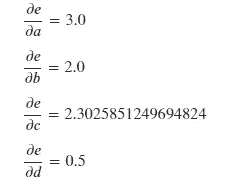
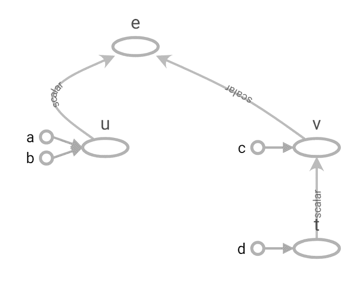

# PyTorch 和 TensorFlow 中的计算图

> 原文：<https://towardsdatascience.com/computational-graphs-in-pytorch-and-tensorflow-c25cc40bdcd1?source=collection_archive---------8----------------------->

## [理解大数据](https://towardsdatascience.com/tagged/making-sense-of-big-data)

由[奥玛·弗洛里斯](https://unsplash.com/@omarg247?utm_source=medium&utm_medium=referral)在 [Unsplash](https://unsplash.com?utm_source=medium&utm_medium=referral) 上拍摄的照片

我在之前的[文章](/back-propagation-demystified-part-1-d7dad2ad447b?sk=547608c8b22272e0bf4f8ee3bf0d6f8a)中解释过深度学习环境中的反向传播算法。这是那篇文章的继续，我建议您阅读那篇文章，以确保您从这篇文章中获得最大的收益。

我将在 PyTorch 和 TensorFlow 中介绍计算图形。这就是允许这些框架为你的神经网络计算梯度的魔力。我将从一些计算图类型的介绍开始，然后是框架的具体细节。

# 计算图形类型[1]

所有深度学习框架都依赖于创建计算图来计算梯度下降优化所需的梯度值。通常，您必须构建正向传播图，框架会为您处理反向差异。

但是在开始 PyTorch 中的计算图之前，我想讨论一下静态和动态计算图。

## 静态计算图:

这些通常包括如下两个阶段。

*   阶段 1:定义一个架构(可能有一些原始的流程控制，比如循环和条件)
*   第二阶段:通过它运行大量数据来训练模型和/或进行预测

**静态图的优势之一是它允许强大的离线优化/图表调度。这意味着这些通常比动态图更快(在每个用例中差别可能并不明显，这取决于我们的图)。缺点是处理结构化甚至可变大小的数据很难看。**

## 动态计算图:

当执行正向计算时，该图被隐式定义(例如，使用运算符重载)。

动态图的优点是更加灵活。该库侵入性较小，允许交叉构建和评估图形。正向计算是用你最喜欢的编程语言编写的，包括所有的特性和算法。不利的一面是几乎没有时间进行图形优化，如果图形没有变化，那么努力可能会白费。**动态图形易于调试。发现代码中的问题要容易得多，因为它允许一行一行地执行代码，并且你可以访问所有的变量。如果你想将深度学习用于行业中的任何真实目的，这绝对是一个非常重要的功能。**

PyTorch 使用动态计算图。Tensorflow 允许创建优化的静态图，也具有类似于动态图的热切执行。它是一个命令式的编程环境，可以立即计算操作，而不需要构建图形，操作返回具体的值，而不是构建一个计算图形供以后运行。

现在让我们看看 PyTorch 中的计算图。

# PyTorch [7]中的计算图

PyTorch 的核心提供了两个特性:

1.  n 维张量，类似于 NumPy，但可以在 GPU 上运行。
2.  用于建立和训练神经网络的自动微分。

深度学习架构及其训练涉及大量矩阵运算。张量只不过是一个 n 维数组。对于来自 Python 背景的人来说，NumPy 应该敲响了警钟。这是一个非常强大和优化的矩阵运算库。然而，出于深度学习的目的，矩阵是巨大的，并且需要巨大的计算能力。

PyTorch 张量是一个 n 维数组。这个框架提供了很多在这些张量上操作的函数。但是为了加速张量的数值计算，PyTorch 允许使用 GPU，这可以提供 50 倍或更高的加速。PyTorch 张量也可以跟踪计算图形和梯度。

在 PyTorch 中，自动签名包提供了自动微分，以自动计算神经网络中的反向传递。你的网络的前向传递定义了计算图；图中的节点是张量，边是从输入张量产生输出张量的函数。通过该图的反向传播给出了梯度。

PyTorch 中的每个张量都有一个标志:required_grad，它允许从梯度计算中细粒度地排除子图，并可以提高效率。如果 x 是一个张量，它的 x.requires_grad=True，那么 x.grad 是另一个张量，它保持 x 相对于某个标量值的梯度。

从上面的例子可以看出，如果一个操作只有一个输入需要梯度，那么它的输出也需要梯度。反之，只有当所有输入都不需要梯度时，输出也不会需要梯度。

## 引擎盖下的亲笔签名

从概念上讲，autograd 在您执行操作时保留了创建数据的所有操作的图形记录，为您提供了一个有向无环图，其叶是输入张量，根是输出张量。通过从根到叶跟踪该图，可以使用链式法则(反向传播)自动计算梯度。

在内部，autograd 将这个图表示为函数对象的图，可以应用它来计算图的求值结果。当计算向前传递时，自动签名同时执行请求的计算并建立一个表示计算梯度的函数的图形。每个火炬的 grad_fn 属性。张量是该图的入口点)。当正向传递完成时，在反向传递中评估图形以计算梯度。

如前所述，PyTorch 中的计算图形是动态的，因此在每次迭代中都要从头开始重新创建，这正是允许使用任意 Python 控制流语句的原因，这些语句可以在每次迭代中改变图形的整体形状和大小。你不必在开始训练前对所有可能的路径进行编码——你所跑的就是你与众不同的。

每个本原自签名算子都是作用于张量的两个函数。forward 函数根据输入张量计算输出张量。后向函数接收输出张量相对于某一标量的梯度，并计算输入张量相对于同一标量的梯度。

总之，张量和函数是相互联系的，构成了一个非循环图，它编码了计算的完整历史。每个张量都有一个. grad_fn 属性，该属性引用了创建该张量的函数(用户创建的张量除外，因为它们的 grad_fn 是 None)。如果你想计算导数，你可以调用。张量上的 backward()。调用 backwards 函数后，梯度值作为张量存储在 grad 属性中。

这些概念可以用下图表示。

来源:作者[7]

例如，如果你创建两个张量 a 和 b，后面跟着 c = a/b，c 的 grad_fn 将被 DivBackward，这是/运算符的反向函数。如前所述，这些 grad_fn 的集合构成了反向图。前进和后退函数是 torch . autograd . function 的成员。您可以通过定义 torch . autograded . function 的子类来定义自己的 autograded 运算符

is_leaf:按照惯例，所有 requires_grad 为假的张量都是叶张量。对于 requires_grad 为 True 的张量，如果它们是由用户创建的，它们将是叶张量。这意味着它们不是运算的结果，因此 grad_fn 是 None。只有叶张量在调用 backward()时填充了它们的 grad。要为非叶张量填充 grad，可以使用 retain_grad()。

让我们构建帖子的第 1 部分中使用的计算图示例，并使用 PyTorch 计算梯度。

来源:作者

上面的代码在 PyTorch 中构造了计算图形。让我们看看图中节点的一些属性。

来源:作者

叶子没有 grad_fn 但是会有渐变。非叶节点有 grad_fn 但没有梯度。在调用 backward()之前，没有 grad 值。

我们在上一篇文章中从理论上计算的梯度是使用 PyTorch 计算的，如下所示。

来源:作者

backward()调用后节点的属性如下所示。

来源:作者

如您所见，一旦构建了图形，在 PyTorch 中计算梯度就是一件简单的事情。它会帮你区分。本教程的 jupyter 笔记本可以在 https://github.com/msminhas93/ComputationalGraphs[找到](https://github.com/msminhas93/ComputationalGraphs)

这就完成了 PyTorch 中计算图的讨论。在下一节中，让我们看看 TensorFlow 中的计算图。

# 张量流中的计算图

Tensorflow 使用数据流图根据各个操作之间的依赖关系来表示计算。这导致了一个低级编程模型，在该模型中，定义数据流图，然后创建一个 TensorFlow 会话来跨一组本地和远程设备运行该图的各个部分。

TensorFlow 中数据流或计算图的示例如下所示。

TensorFlow 中的计算图形示例(来源: [Tensorflow 图形指南](https://www.tensorflow.org/guide/graphs))

在 Tensorflow 中，任何种类的计算都被表示为 tf 的一个实例。图形对象。这些对象由一组 tf 实例组成。张量物体和 tf。操作对象。在张量流中，tf。张量对象作为边，而 tf。操作充当节点，然后添加到 tf 中。图形实例。

在张量流中，一个 tf。Session()对象存储执行计算的上下文。这是一个运行 TensorFlow 操作的类。会话对象封装了执行操作对象和评估张量对象的环境。

现在，让我们用这篇文章的第一部分中的例子在 Tensorflow 中构建计算图。

我们首先创建四个占位符。TensorFlow 占位符是在会话执行期间提供的张量的代理。它需要 Session.run()、Tensor.eval()或 Operation.run()的 feed_dict 参数。

接下来，我们使用张量流操作，即加法、对数和乘法，从定义的占位符构建示例计算图。

一旦构建了图形，下一步就是在会话中运行它。Python 有一个带语句的**，负责打开和关闭会话。在会话范围内，我们运行 tf.gradients 函数来获取我们的示例所需的梯度。输出如下所示。**

TensorFlow 有一个名为 [tensorboard](https://www.tensorflow.org/guide/summaries_and_tensorboard) 的实用程序，它给你一个带有许多可视化功能的计算图形的图形表示。上一个示例的图表如下所示。

可以看出，该图与我们在示例图片中构建的图相同。Jupyter 笔记本可以在 https://github.com/msminhas93/ComputationalGraphs找到

接下来，让我们看看静态图和急切执行之间的时间比较。

来源:[https://www.tensorflow.org/guide/intro_to_graphs](https://www.tensorflow.org/guide/intro_to_graphs)

来源:[https://www.tensorflow.org/guide/intro_to_graphs](https://www.tensorflow.org/guide/intro_to_graphs)

我们可以清楚地看到这里的性能差异。在这个例子中，静态图比动态图快。

至此，我们结束了“反向传播揭秘”系列。

# 结论

关键要点如下。

*   反向传播用于计算训练深度学习网络的基于梯度下降的优化所需的梯度。
*   计算梯度的解析表达式很简单，但计算量很大。
*   计算图是表示数学表达式的方法，在深度学习模型的情况下，这些就像描述性语言，给出所需计算的功能描述。
*   深度学习框架，如 PyTorch 和 TensorFlow 等。依赖于这些计算图的创建来实现用于梯度计算的已定义网络的反向传播算法。

最后，这里比较一下 PyTorch 和 TensorFlow 中计算图的表示方式。

来源:作者

我希望你通过阅读这篇文章获得一些知识，并喜欢这篇文章。我很乐意在 LinkedIn[上联系。](https://www.linkedin.com/in/msminhas93/)

# 参考

[1][http://www . cs . Cornell . edu/courses/cs 5740/2017 sp/lectures/04-nn-compgraph . pdf](http://www.cs.cornell.edu/courses/cs5740/2017sp/lectures/04-nn-compgraph.pdf)

[2][https://py torch . org/tutorials/beginner/examples _ autogradated/TF _ two _ layer _ net . html](https://pytorch.org/tutorials/beginner/examples_autograd/tf_two_layer_net.html)

[3]https://www.tensorflow.org/api_docs/python/tf/Graph

[https://www.tensorflow.org/guide/intro_to_graphs](https://www.tensorflow.org/guide/intro_to_graphs)

[https://kth.instructure.com/files/1864796/download?[5]download_frd=1](https://kth.instructure.com/files/1864796/download?download_frd=1)

[6][https://JD Hao . github . io/2017/11/12/py torch-computation-graph/](https://jdhao.github.io/2017/11/12/pytorch-computation-graph/)

[7][https://towards data science . com/getting-started-with-py torch-part-1-understanding-how-automatic-differential-works-5008282073 EC](/getting-started-with-pytorch-part-1-understanding-how-automatic-differentiation-works-5008282073ec)

[https://pytorch.org/docs/stable/autograd.html](https://pytorch.org/docs/stable/autograd.html)